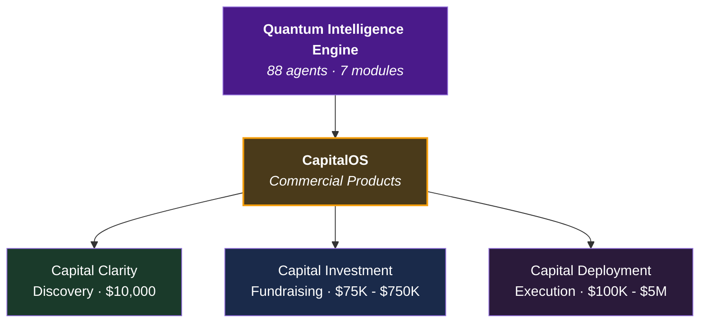
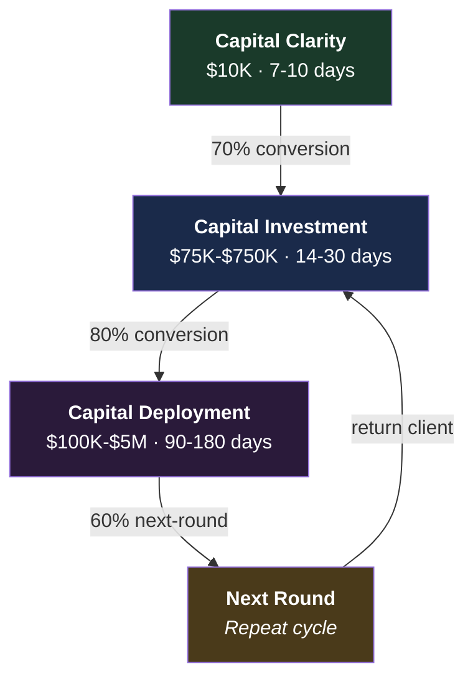
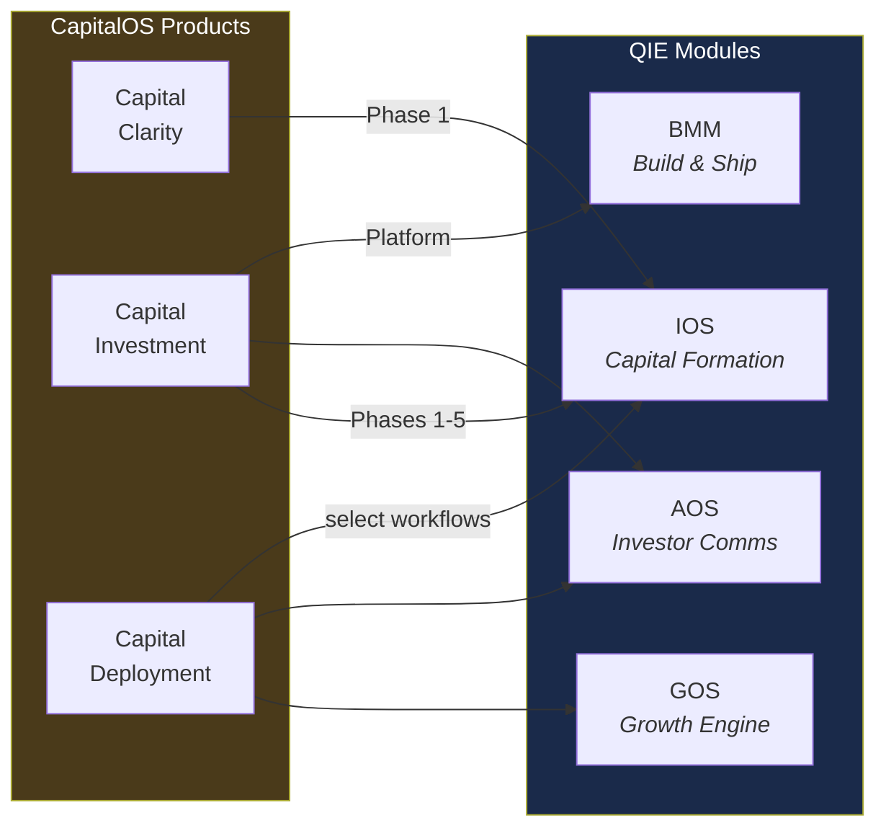

# CapitalOS — The Operating System for Capital Formation

**From clarity to close to deployment: one operating system, three products, the complete capital journey.**

---

## Context Within QIE

CapitalOS is the **commercial product umbrella** for the Quantum Intelligence Engine's capital formation capabilities. It packages the QIE's IOS, AOS, and GOS modules into three distinct products that serve the complete capital journey.

---

## Documents

| Document | Description |
|----------|-------------|
| [CAPITALOS_MASTER_OVERVIEW.md](./CAPITALOS_MASTER_OVERVIEW.md) | **The comprehensive strategic document.** Covers all three products, the investment journey, client progression models, pricing economics, go-to-market strategy, sales frameworks, and implementation roadmap. |

---

## The Three Products

### Capital Clarity ($10,000 | 7-10 days)

The strategic diagnostic. Answers: Should we raise? Are we ready? What's the strategy?

**Delivers:** Investment readiness assessment, market positioning, capital roadmap, preliminary financials, investor narrative framework, readiness score.

**Conversion to Capital Investment:** 70%+

### Capital Investment ($75K - $750K | 14-30 days)

The complete fundraising infrastructure. Replaces 8+ vendors at 75-85% cost reduction.

**Delivers:** Strategic foundation, 12-tab financial model, IPEV valuation, data room with 20+ documents, market research, operational blueprint, investor platform (Professional+), tax/legal architecture (Enterprise).

**Three tiers:** Essentials ($75K-$150K), Professional ($150K-$300K), Enterprise ($350K-$750K)

### Capital Deployment ($100K - $5M | 90-180 days)

Post-raise execution. Turns raised capital into operational growth.

**Delivers:** Deployment strategy, operational infrastructure, growth operating system, market expansion, financial governance, tax/legal execution, scale oversight.

---

## The Capital Journey

**Average client LTV:** $800K (base case) to $5.7M (enterprise multi-round)

---

## How QIE Powers CapitalOS

| CapitalOS Product | QIE Module(s) Used | Key Agents |
|------------------|-------------------|------------|
| Capital Clarity | IOS Phase 1 (Discovery) | Alexander, Cassandra, Diana |
| Capital Investment | IOS Phases 1-5, AOS, BMM | Alexander, Marcus, Victoria, Helena, Nikolai |
| Capital Deployment | GOS, IOS (select), AOS | Theo, Soren, Vivienne, Raymond |

---

## Related Resources

- **InvestOS (product detail docs):** [InvestOS/](../InvestOS)
- **Pricing structures:** [Pricing/](../Pricing)
- **IOS module (capital formation engine):** [_bmad/ios/](../_bmad/ios/)
- **AOS module (investor communications):** [_bmad/aos/](../_bmad/aos/)
- **GOS module (growth operations):** [_bmad/gos/](../_bmad/gos/)
- **Regulatory compliance:** [Compliance/](../Compliance)

---

**Classification:** Internal / Strategic
**Parent document:** [README.md](../README.md)
