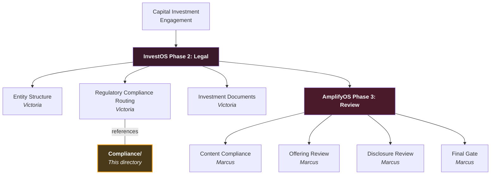

# Compliance — Regulatory & Legal Frameworks

**Regulatory compliance documentation for InvestOS capital formation activities.**

---

## Context Within QIE

This directory contains regulatory compliance pathways and legal routing frameworks that govern how [InvestOS](../InvestOS) products operate across jurisdictions. The InvestOS module's Securities Counsel agent (Victoria) and the AmplifyOS module's Compliance agents use these frameworks during workflow execution.

---

## Documents

| Document | Description | Audience |
|----------|-------------|------------|
| [REGULATORY_COMPLIANCE_ROUTES.md](./REGULATORY_COMPLIANCE_ROUTES.md) | Regulatory compliance pathways, legal requirements, and jurisdiction-specific considerations for fundraising platforms. | Legal, Compliance, Internal |

---

## How Compliance Fits the System

---

## Related Resources

- **InvestOS legal workflows:** [_bmad/ios/](../_bmad/ios/) — Phase 2
- **AmplifyOS compliance workflows:** [_bmad/aos/](../_bmad/aos/) — Phase 3
- **Product context:** [InvestOS/](../InvestOS)

---

**Parent document:** [README.md](../README.md)
