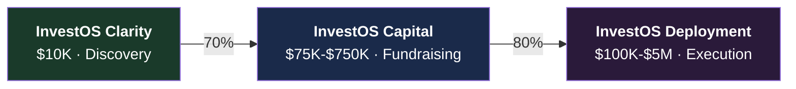
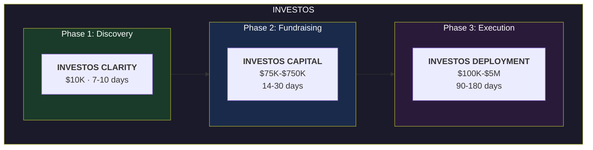
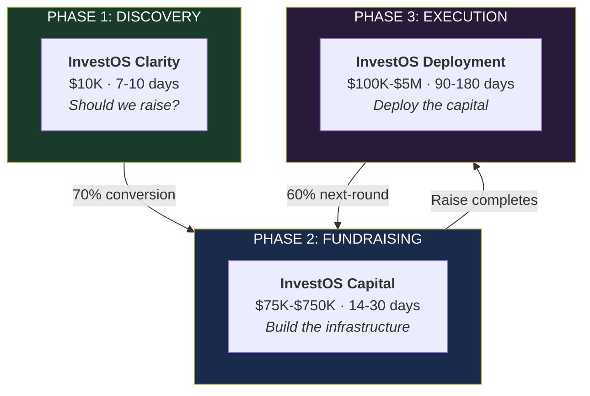
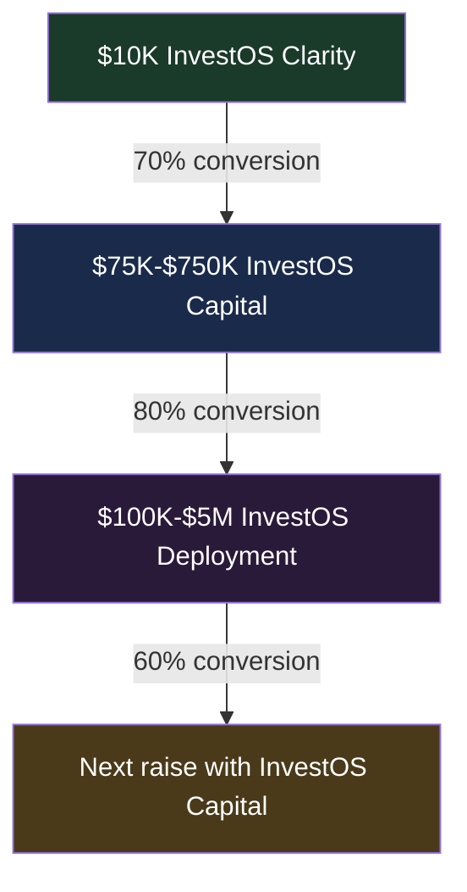
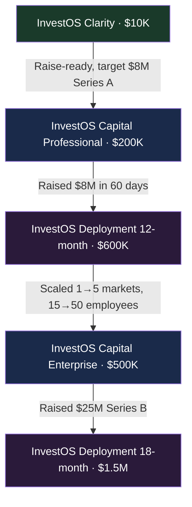
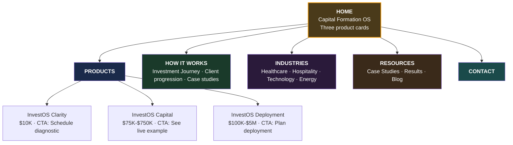

# InvestOS — The Operating System for Capital Formation

**From clarity to close to deployment: One operating system. Three products. The complete capital journey.**

---

## Document Purpose

This document provides the master strategic overview for **InvestOS** — the complete operating system for capital formation that follows the entire investment journey from discovery through fundraising to deployment.

**Audience:** Internal team, leadership, strategic partners
**Classification:** Internal / Strategic
**Date:** February 2026

---

## Table of Contents

1. [Executive Summary](#executive-summary)
2. [The Strategic Vision](#the-strategic-vision)
3. [What Is InvestOS?](#what-is-investos)
4. [The Three Products](#the-three-products)
5. [The Investment Journey](#the-investment-journey)
6. [Why This Structure Works](#why-this-structure-works)
7. [Product Positioning Matrix](#product-positioning-matrix)
8. [Client Progression Models](#client-progression-models)
9. [Pricing & Economics](#pricing--economics)
10. [Go-to-Market Strategy](#go-to-market-strategy)
11. [Implementation Roadmap](#implementation-roadmap)

---

## Executive Summary

### The Vision

**InvestOS is the operating system for capital formation** — a unified platform that takes organizations from strategic clarity through fundraising to capital deployment and scaling.

### The Three Products

| Product | Phase | What It Does |
|---------|-------|-------------|
| **InvestOS Clarity** | Discovery | Strategic clarity, investment readiness, positioning, and diagnostic |
| **InvestOS Capital** | Fundraising | Complete fundraising infrastructure, investor platform, financial models, data room |
| **InvestOS Deployment** | Execution | Post-raise deployment, operational scaling, capital allocation, growth execution |

### Why This Matters

1. **Complete Journey Coverage** — We serve clients from "Should I raise?" to "We closed the round" to "Now deploy and scale"
2. **Clear Product Differentiation** — Three distinct products with clear price points and outcomes
3. **Natural Progression** — Clients move through the system as their capital journey evolves
4. **Platform Economics** — Multi-year relationships with high lifetime value
5. **Category Creation** — We own "capital formation operating system" as a new category

### The Market Opportunity

| Product | Annual Market | Our Entry Point | Revenue Potential (100 clients/year) |
|---------|---------------|-----------------|-------------------------------------|
| **InvestOS Clarity** | 10,000+ exploring capital | $10,000 | $1M |
| **InvestOS Capital** | 5,000+ raising $2M-$100M+ | $75K-$750K (avg $200K) | $20M |
| **InvestOS Deployment** | 3,000+ deploying $2M-$100M+ | $100K-$5M (avg $500K) | $50M |

**Total addressable opportunity: $71M+ annual revenue at 100 clients per product**

---

## The Strategic Vision

### The Capital Formation Problem

Companies raising and deploying capital face three distinct challenges at three different phases:

**Phase 1: Discovery**
- "Should we even raise capital?"
- "Are we investment-ready?"
- "What should our strategy be?"

**Traditional solution:** Pay $50K-$150K for a strategy consultant, wait 6-8 weeks, get a deck nobody uses.

**Phase 2: Fundraising**
- "We need to raise capital NOW"
- "Our materials aren't institutional-grade"
- "This requires 8+ vendors and costs $1.5M-$3M+"

**Traditional solution:** Assemble a piecemeal stack across law firms, tax advisors, investment banks, web agencies, and consultants over 6-12 months.

**Phase 3: Deployment**
- "We raised the money, now what?"
- "How do we deploy this capital efficiently?"
- "Our operations can't scale fast enough"

**Traditional solution:** Hire Big 4 consultants for $2M-$5M over 12-24 months, or wing it and burn cash inefficiently.

### The InvestOS Solution

**One operating system. Three products. Complete journey.**

Instead of three separate vendor relationships across three phases:

**InvestOS provides unified infrastructure from clarity to raise to deployment.**

---

## What Is InvestOS?

**InvestOS is the complete operating system for capital formation** — the unified platform that handles strategic clarity, fundraising infrastructure, and capital deployment in one integrated system.

### Core Principles

**1. Operating System, Not Software**
- InvestOS isn't a SaaS tool you subscribe to
- It's infrastructure you own — customized to your business
- Platform-grade capabilities delivered as a service

**2. Journey-Based, Not Transaction-Based**
- Traditional vendors serve one phase, then leave
- InvestOS follows the complete journey from clarity to deployment
- Multi-year relationships, not one-time transactions

**3. Integrated, Not Fragmented**
- Every product shares the same underlying data and narrative
- No disconnected vendors with conflicting recommendations
- One team, one platform, one source of truth

**4. Speed as a Feature**
- Traditional models take 6-12+ months across phases
- InvestOS compresses timelines by 10x through AI-augmented production
- Capital windows don't wait — we move at market speed

### What InvestOS Replaces

Instead of managing:

| Traditional Stack | InvestOS Replacement |
|------------------|----------------------|
| Strategy consultancy ($150K-$300K) | InvestOS Clarity → InvestOS Capital |
| Investment bank ($200K-$500K + success fees) | InvestOS Capital |
| Law firm for structuring ($75K-$200K) | InvestOS Capital (Tax & Legal Architecture) |
| Financial modelers ($50K-$150K) | InvestOS Capital (Financial Models) |
| Market research firms ($100K-$400K) | InvestOS Capital (Market Intelligence) |
| Web agency for investor site ($200K-$500K) | InvestOS Capital (Investor Platform) |
| Operational consultants ($150K-$350K) | InvestOS Deployment |
| Expansion advisors ($500K-$1.2M) | InvestOS Deployment (Growth Infrastructure) |

**Total traditional cost: $1.425M - $3.6M+**
**InvestOS cost: $185K - $5.76M (complete 3-product journey)**
**Savings: 75-90% with 10x faster delivery**

---

## The Three Products

### Product 1: InvestOS Clarity ($10,000)

**Tagline:** *Discover your capital strategy before you raise a dollar.*

**Phase:** Discovery
**Timeline:** 7-10 days
**Investment:** $10,000

#### What It Is

The strategic diagnostic and investment readiness assessment that answers three critical questions:

1. **Should we raise capital?** (vs. bootstrap, vs. debt, vs. alternative structures)
2. **Are we investment-ready?** (what gaps exist, what needs to be fixed)
3. **What's the strategy?** (how much, from whom, at what valuation, with what narrative)

#### What Gets Delivered

| Deliverable Category | What's Included |
|---------------------|-----------------|
| **Strategic Diagnostic** | Investment readiness assessment Strategic positioning analysis Capital structure recommendations Competitive landscape overview |
| **Market Positioning** | Competitive differentiation framework Go-to-market narrative Investor value proposition Target investor profile and thesis alignment |
| **Investment Roadmap** | Phased capital plan (seed → Series A → Series B) Timeline and milestone framework Risk assessment and mitigation strategies Capital efficiency projections |
| **Preliminary Financials** | High-level 3-year financial model Unit economics analysis Capital requirements breakdown Burn rate and runway projections |
| **Investor Narrative** | Executive summary (investor-facing, 2-3 pages) Pitch narrative framework and story arc FAQ and objection handling guide Elevator pitch and one-liner positioning |
| **Readiness Report** | Investment readiness score (1-10 scale) Gap analysis with specific fix recommendations Go/no-go recommendation with timing guidance Clear path to InvestOS Capital if ready |

#### Success Outcomes

By the end of InvestOS Clarity, clients have:

- **Clarity** on whether raising capital is the right move
- **Confidence** in their investment readiness (or a clear gap-closure plan)
- **Strategy** for how much to raise, from whom, and at what valuation
- **Roadmap** to proceed to InvestOS Capital or fix gaps first

#### Who Buys InvestOS Clarity

| Buyer Type | Why They Buy | Likely Next Step |
|-----------|-------------|-----------------|
| **Exploratory Founder** | Considering capital but not committed yet | 60% proceed to InvestOS Capital |
| **Board-Mandated Assessment** | Board wants professional validation before $200K+ spend | 80% proceed if board approves |
| **First-Time Fundraiser** | Never raised institutional capital, needs guidance | 70% proceed after understanding path |
| **Gap-Aware CEO** | Knows they're not ready but wants professional diagnosis | 50% proceed after fixing gaps |
| **Advisory Firm Client** | Investment bank or advisor needs feasibility study | 90% proceed if study is positive |

**Average conversion to InvestOS Capital: 70%**

#### The Pain Points This Solves

| Pain Point | What They Say | InvestOS Clarity Answer |
|-----------|---------------|----------------------|
| Don't know if raising is right | "Should we even raise or bootstrap longer?" | Clear recommendation with financial modeling |
| Board wants validation | "Board needs to see a plan before $200K commitment" | Professional diagnostic they can present |
| Unsure of valuation | "What's realistic to raise at what valuation?" | Preliminary valuation range with comps |
| Investment readiness unclear | "Are we actually ready or will we embarrass ourselves?" | Readiness score + gap analysis |
| Can't commit full budget yet | "Need to understand the path before six-figure spend" | $10K validation before larger commitment |

#### Pricing Rationale

**Why $10,000:**
- Low enough to be an easy "yes" for exploration
- High enough to command serious engagement and professional output
- 10x cheaper than traditional strategy consultant diagnostic ($50K-$150K)
- Recoverable in InvestOS Capital pricing if client proceeds
- High-margin product with AI-augmented delivery

---

### Product 2: InvestOS Capital ($75K - $750K)

**Tagline:** *The complete fundraising operating system — delivered in 14-30 days.*

**Phase:** Fundraising
**Timeline:** 14-30 days (depending on tier)
**Investment:** $75,000 - $750,000

#### What It Is

The complete fundraising infrastructure — everything a company needs to raise institutional capital, delivered as a unified, investor-ready operating system.

**This replaces 8+ separate vendors** (strategy consultancy, law firm, tax advisors, financial modelers, market researchers, web agency, design firm, investment bank) **at 75-85% cost reduction** and delivered in weeks instead of months.

#### The Three Tiers

| Tier | Price Range | Timeline | Best For | Raise Target |
|------|-------------|----------|----------|--------------|
| **Essentials** | $75K - $150K | 14 days | First institutional round, lean approach | $2M - $5M |
| **Professional** | $150K - $300K | 21 days | Growth-stage raises, full infrastructure | $5M - $15M |
| **Enterprise** | $350K - $750K | 30 days | Global ambitions, complex structures | $10M - $100M+ |

#### What Gets Delivered (All Tiers)

**Core Infrastructure:**

| Component | What's Included |
|-----------|-----------------|
| **Strategic Foundation** | Master strategic plan with execution roadmap Vision document and market positioning Executive summary for institutional investors Go-to-market strategy and revenue model narrative Investor FAQ and objection-handling framework |
| **Financial Models** | 12-tab variable-driven Google Sheets model Revenue, expense, P&L, cash flow, cap table Investment returns with IRR/MOIC calculations Scenario analysis (conservative, base, aggressive) Sensitivity matrices and break-even analysis DCF valuation with multiple discount rates |
| **Enterprise Valuation** | 9-Point IPEV-compliant valuation report 9 independent methods weighted and cross-validated Valuation range (low-mid-high) with statistical basis 5-year financial projections 11 detailed appendices |
| **Data Room & Documents** | 20+ organized investor documents Private Placement Memorandum (PPM) Subscription agreement templates Risk factor documentation Due diligence checklist and index |
| **Market Research** | Competitive landscape (50+ competitor profiles) TAM/SAM/SOM breakdown with methodology Pricing analysis and competitive benchmarking CAGR projections with source attribution Geographic and regulatory intelligence |
| **Operational Blueprint** | Standard operating procedures (6-8 segments) Staffing models tied to financial projections Organizational structure and role definitions Service delivery protocols Capacity planning models |

**Tier-Specific Additions:**

| Feature | Essentials | Professional | Enterprise |
|---------|-----------|--------------|------------|
| **Interactive Investor Platform** | Not included | 30-page Next.js platform | Full platform + analytics |
| **Tax & Legal Architecture** | Not included | Not included | Multi-entity, multi-jurisdiction |
| **Expansion Research** | Not included | Not included | Global market analysis (30+ locations) |
| **Site Evaluation System** | Not included | Not included | Property scoring and due diligence |

#### Scale of Delivery

| Metric | Output |
|--------|--------|
| **Strategic documents** | 150+ files (~550,000+ words / ~1,100+ pages) |
| **Interactive platform** | 30+ pages, 25,000+ lines of code (Professional/Enterprise) |
| **Financial model** | 12-tab fully linked variable-driven model |
| **Data room** | 20+ documents, organized and gated |
| **Design system** | Brand guidelines, color tokens, typography, component library |

> Every deliverable is customized to the client's specific business, market, and capital raise strategy. Nothing is a template fill-in.

#### Who Buys InvestOS Capital

| Buyer Type | Typical Tier | Why They Buy |
|-----------|-------------|--------------|
| **First Institutional Round** | Essentials | Need credible materials, lean budget, raising $2M-$5M |
| **Growth-Stage CEO** | Professional | Has product-market fit, raising $5M-$15M Series A/B |
| **International Founder** | Professional/Enterprise | Raising cross-border, need full infrastructure |
| **Multi-Location Founder** | Professional | Scaling from 1 to 5-10 locations |
| **Searcher / Independent Sponsor** | Professional/Enterprise | Acquiring business, raising $5M-$50M |
| **Platform Roll-Up** | Enterprise | Consolidating industry, complex structure |
| **Capital-Intensive Project** | Enterprise | Physical project, $10M-$100M+ raise |
| **UHNW Principal** | Enterprise | Deploying personal capital, wants governance |
| **Sovereign/Government-Adjacent** | Enterprise | Institutional documentation standards |

#### The Pain Points This Solves

| Pain Point | What They Say | InvestOS Capital Answer |
|-----------|---------------|--------------------------|
| Not raise-ready | "If investor asked for data room tomorrow, we'd scramble" | Complete data room in 14-30 days |
| Amateur materials | "Our deck doesn't hold up vs. funded competitors" | Institutional-grade infrastructure |
| Too many vendors | "Hired 5 firms, nothing cross-references" | One team, unified output |
| Costs millions to raise | "Quoted $2M+ and 9 months to get ready" | $75K-$750K in 14-30 days |
| Burned investor relationships | "Went out too early with bad materials" | Professional rebuild |

#### Competitive Comparison

| Dimension | Traditional (8+ vendors) | InvestOS Capital |
|-----------|------------------------|-------------------------------|
| **Total cost** | $1.5M - $7.7M | **$75K - $750K** |
| **Timeline** | 6-12 months | **14-30 days** |
| **Vendors to manage** | 8+ separate firms | **1** |
| **Internal consistency** | Low (fragmented) | **Total cross-referencing** |
| **Interactive platform** | Not offered | **30-page custom platform** |
| **9-method valuation** | Single method or not included | **IPEV-compliant, 9 methods** |
| **Success fees** | 3-6% ($450K-$1M+) | **None** |

---

### Product 3: InvestOS Deployment ($100K - $5M)

**Tagline:** *You raised the capital. Now deploy it with precision.*

**Phase:** Execution
**Timeline:** 90-180 days (phased engagement)
**Investment:** $100,000 - $5,000,000

#### What It Is

Post-raise operational execution — the infrastructure, systems, and strategic guidance that turns raised capital into realized growth and scale.

**This is where capital gets deployed efficiently** instead of burned chaotically.

#### What Gets Delivered

| Deliverable Category | What's Included |
|---------------------|-----------------|
| **Deployment Strategy** | Capital allocation roadmap with phased milestones Investment thesis execution framework Quarterly deployment goals and KPIs Board-ready reporting structure |
| **Operational Infrastructure** | SOPs for all business segments (8-12 segments) Staffing models with hiring roadmaps Organizational design and reporting structure Service delivery protocols Capacity planning tied to capital deployment |
| **Growth Operating System** | AI-powered operational intelligence platform Customer/investor experience automation Internal dashboards and real-time reporting Data integration across systems Performance analytics and optimization |
| **Market Expansion Execution** | Site selection and property evaluation Market entry playbooks by geography Regulatory and compliance pathway execution Local partnership and vendor identification Launch coordination and go-live support |
| **Financial Governance** | Burn rate monitoring and cash management system KPI tracking dashboards (revenue, CAC, LTV, etc.) Scenario planning and capital efficiency modeling Variance analysis (actual vs. plan) Investor and board reporting automation |
| **Tax & Legal Execution** | Multi-entity structuring implementation Inter-entity transaction setup Compliance filing and regulatory support International tax optimization Corporate governance execution |
| **Scale Oversight** | Quarterly strategic reviews with leadership team Ongoing operational optimization Board-ready materials and presentations KPI audits and performance diagnostics Next-round preparation (when applicable) |

#### Engagement Models

| Capital Raised | Deployment Fee | Timeline | What's Included |
|---------------|----------------|----------|-----------------|
| **$2M - $5M** | $100K - $250K | 6 months | Deployment roadmap, basic ops infrastructure, quarterly reviews |
| **$5M - $15M** | $250K - $750K | 12 months | Full ops system, market expansion (1-3 locations), board governance |
| **$15M - $50M** | $750K - $2M | 18 months | Multi-market expansion, platform build, advanced analytics |
| **$50M - $100M+** | $2M - $5M | 24 months | Institutional scaling, international expansion, full governance |

#### Who Buys InvestOS Deployment

| Buyer Type | Why They Buy | Typical Investment |
|-----------|-------------|-------------------|
| **Just-Funded CEO** | Closed round, needs deployment execution plan | $250K - $750K |
| **Scaling Founder** | Growing from 1 to 5-10 locations | $500K - $1.5M |
| **Platform Roll-Up** | Acquiring and integrating multiple businesses | $1M - $3M |
| **International Expansion** | Entering 3-5+ new countries | $750K - $2M |
| **Capital-Intensive Project** | Deploying $10M-$100M+ into physical infrastructure | $2M - $5M |
| **Board-Mandated Oversight** | Board wants deployment accountability and reporting | $500K - $2M |

#### The Pain Points This Solves

| Pain Point | What They Say | InvestOS Deployment Answer |
|-----------|---------------|--------------------------|
| Capital without plan | "We have $10M in the bank and no execution plan" | Phased deployment roadmap |
| Operations can't scale | "Our systems will break if we grow this fast" | Growth operating system |
| Expansion is chaotic | "Opening 3 locations but it feels like guesswork" | Structured market entry playbooks |
| Board wants accountability | "Board wants quarterly proof we're deploying efficiently" | Board-ready reporting + KPI dashboards |
| Team lacks scaling experience | "We've never scaled past $5M — now need to hit $30M" | Operational infrastructure + oversight |
| Capital efficiency unclear | "Don't know if we're burning appropriately or wastefully" | Burn rate monitoring + variance analysis |

#### Success Metrics

By the end of InvestOS Deployment, clients have:

- **Deployed capital efficiently** according to plan
- **Scaled operations** from X to Y locations/revenue/headcount
- **Maintained board confidence** through transparent reporting
- **Built operational systems** that run without founder dependency
- **Prepared for next round** (if applicable) with strong metrics

---

## The Investment Journey

### How Clients Move Through InvestOS

### Conversion Rates & Retention

| Transition | Expected Conversion | Why It Works |
|-----------|-------------------|--------------|
| **Clarity → Capital** | 70%+ | If they're raise-ready, they need the full platform |
| **Capital → Deployment** | 80%+ | Just raised capital, need deployment support immediately |
| **Deployment → Next Round** | 60%+ | We know their business intimately, natural choice for next raise |

### Client Lifetime Value Examples

#### Example 1: Seed-Stage SaaS Company

| Phase | Product | Investment | Outcome |
|-------|---------|-----------|---------|
| Discovery | InvestOS Clarity | $10,000 | Validated $3M seed raise strategy |
| Fundraising | InvestOS Capital (Essentials) | $100,000 | Raised $3.5M in 45 days |
| Deployment | InvestOS Deployment (6-month) | $200,000 | Scaled from 1 to 3 markets |
| Next Round | InvestOS Capital (Professional) | $225,000 | Raised $10M Series A |
| Scale | InvestOS Deployment (12-month) | $600,000 | 5-market expansion |

**Total LTV: $1,135,000 over 2.5 years**

#### Example 2: Healthcare Platform (Enterprise)

| Phase | Product | Investment | Outcome |
|-------|---------|-----------|---------|
| Discovery | InvestOS Clarity | $10,000 | Validated $15M raise strategy |
| Fundraising | InvestOS Capital (Enterprise) | $550,000 | Raised $18M in 60 days |
| Deployment | InvestOS Deployment (18-month) | $1,500,000 | 10-location expansion across 3 countries |
| Next Round | InvestOS Capital (Enterprise) | $650,000 | Raised $50M Series B |
| Scale | InvestOS Deployment (24-month) | $3,000,000 | International scaling, 30 locations |

**Total LTV: $5,710,000 over 4 years**

---

## Why This Structure Works

### 1. Complete Journey Coverage

**The Old Problem:**
- Strategy consultants hand off to fundraising advisors
- Fundraising advisors hand off to... nobody
- Client is abandoned post-raise

**The InvestOS Solution:**
- We own the complete journey from clarity → raise → deployment
- No handoffs, no gaps, no abandoned clients
- Multi-year relationships instead of transactional engagements

### 2. Natural Progression & Upsell

**The Conversion Path:**

**Why conversions are high:**
1. Each product validates the next phase
2. Client already trusts us from prior engagement
3. Data and strategy carry forward (no rework)
4. Switching costs are high (starting over is painful)

### 3. Platform Economics

**Old Model (Transaction):**
- One engagement, client leaves
- Constant new customer acquisition
- No recurring revenue
- Low lifetime value

**InvestOS Model (Platform):**
- Multi-phase engagement spanning 2-4 years
- High retention through journey coverage
- Recurring deployment revenue
- 10-50x higher LTV per client

### 4. Market Differentiation

**What competitors offer:**

| Competitor Type | Products Offered | What's Missing |
|----------------|------------------|----------------|
| Strategy Consultancies | Clarity & strategy | Fundraising execution, deployment |
| Investment Banks | Fundraising support | Pre-raise clarity, post-raise deployment |
| Operational Firms | Post-raise scaling | Pre-raise clarity, fundraising infrastructure |
| **InvestOS** | **All three phases** | **Nothing — complete coverage** |

**Nobody else owns the complete journey.**

### 5. Entry Point Economics

**The $10K Entry Point:**

| Without InvestOS Clarity | With InvestOS Clarity |
|------------------------|---------------------|
| Entry at $75K minimum | Entry at $10K |
| 100 qualified leads → 20 clients | 100 qualified leads → 50 Clarity clients → 35 Capital clients |
| $1.5M revenue (20 x $75K avg) | $3.5M revenue (50 x $10K) + (35 x $100K avg) = $500K + $3.5M = $4M |

**The $10K product increases overall revenue by capturing clients who would never commit to $75K+ upfront.**

---

## Product Positioning Matrix

### How to Position Each Product

#### InvestOS Clarity Positioning

**When to Sell:**
- Client exploring capital options but not committed
- Board wants validation before larger spend
- Company unsure if they're raise-ready
- First-time fundraiser needs education
- Need professional gap analysis

**Opening Line:**
*"Before you spend six figures on a fundraise, invest $10K to know if you're ready, what you should raise, and how to position it."*

**Competitive Frame:**
- Strategy consultant diagnostic: $50K-$150K, 6-8 weeks
- Investment bank feasibility: $25K-$75K, 4-6 weeks
- **InvestOS Clarity: $10K, 7-10 days**

**Close:**
*"If you're raise-ready, we'll tell you exactly what to do next and you'll have 70% of InvestOS Capital already done. If you're not ready, we'll show you the gaps and save you from going out prematurely."*

---

#### InvestOS Capital Positioning

**When to Sell:**
- Client actively raising or committed to raise in 60-90 days
- Completed InvestOS Clarity (or has equivalent strategic clarity)
- Timeline-sensitive (competitive round, market window)
- Needs institutional-grade materials
- Traditional vendors quoted $1M+ and 9+ months

**Opening Line:**
*"Build institutional-grade fundraising infrastructure in 14-30 days for 75-85% less than traditional models. One team, one platform, one invoice."*

**Competitive Frame:**
- Traditional piecemeal: $1.5M-$7.7M, 6-12 months, 8+ vendors
- **InvestOS Capital: $75K-$750K, 14-30 days, 1 team**

**The Proof:**
*"We'll walk you through a live example — the actual platform, financial model, and data room we delivered in 21 days. You'll see exactly what 'institutional-grade' means."*

**Close:**
*"You can spend 12 months assembling this across 8 vendors and hope they align — or you can have it unified and investor-ready in 30 days."*

---

#### InvestOS Deployment Positioning

**When to Sell:**
- Client just closed a funding round
- Has capital but lacks deployment execution plan
- Scaling from 1 location to 5-10 locations
- Expanding internationally or into new markets
- Board demanding deployment accountability

**Opening Line:**
*"You raised the capital. Now deploy it with the same precision and infrastructure that got you funded."*

**Competitive Frame:**
- Big 4 operational consulting: $2M-$5M, 12-24 months
- Fractional COO/operators: $200K-$500K/year, limited scope
- **InvestOS Deployment: $100K-$5M, phased engagement, complete infrastructure**

**Value Prop:**
*"We built the strategy that raised your capital. Now we execute it — from ops to expansion to governance. Board-ready reporting, capital efficiency tracking, and scale oversight."*

**Close:**
*"You didn't raise $10M to figure out deployment on your own. Let the team that got you funded help you deploy it efficiently."*

---

## Client Progression Models

### Pathway A: Full Journey (Dream Client)

**Profile:** Growth-stage company, first institutional raise, strong fundamentals

**Total LTV: $2,810,000 over 3.5 years**
**Referrals generated: 4-6 companies**

### Pathway B: Clarity + Capital Only

**Profile:** First-time founder, lean budget, self-executes deployment

| Step | Product | Investment | Outcome |
|------|---------|-----------|---------|
| 1 | InvestOS Clarity | $10K | Raise-ready, target $3M seed |
| 2 | InvestOS Capital (Essentials) | $100K | Raised $3.5M in 45 days |
| 3 | Client self-executes deployment | — | — |

**Total LTV: $110,000** | Relationship: 3 months | Future: May return for Series A

### Pathway C: Capital + Deployment (Skip Clarity)

**Profile:** Mature company, already has strategic clarity, needs execution

| Step | Product | Investment | Outcome |
|------|---------|-----------|---------|
| 1 | InvestOS Capital (Professional) | $225K | Raised $12M |
| 2 | InvestOS Deployment (12-month) | $800K | Scaled operations |

**Total LTV: $1,025,000** | Relationship: 14 months

### Pathway D: Deployment Only

**Profile:** Company raised with another advisor, needs deployment support

| Step | Product | Investment | Outcome |
|------|---------|-----------|---------|
| 1 | InvestOS Deployment (12-month) | $750K | Deployed capital efficiently |
| 2 | Becomes trusted partner | — | — |
| 3 | Next raise with InvestOS Capital | $300K-$600K | — |

**Total LTV: $750K (first engagement)** | Future: $300K-$600K next raise

---

## Pricing & Economics

### Revenue Model

| Product | Price Range | Expected Volume (Year 1) | Revenue Potential |
|---------|-------------|--------------------------|-------------------|
| **InvestOS Clarity** | $10,000 | 100 clients | $1,000,000 |
| **InvestOS Capital** | $75K - $750K (avg $200K) | 70 clients (70% of Clarity) | $14,000,000 |
| **InvestOS Deployment** | $100K - $5M (avg $500K) | 56 clients (80% of Capital) | $28,000,000 |

**Year 1 Total Revenue Potential: $43,000,000**

### Margin Analysis

| Product | Delivery Cost (AI-augmented) | Gross Margin |
|---------|----------------------------|--------------|
| **InvestOS Clarity** | $2,000 (20% of price) | 80% |
| **InvestOS Capital** | $30K-$150K (40% of price) | 60% |
| **InvestOS Deployment** | $40K-$2M (40% of price) | 60% |

**Blended Gross Margin: ~65%**

### Client Lifetime Value (LTV)

**Conservative Case (Clarity + Capital only):**
- LTV: $110,000
- Relationship: 3 months

**Base Case (Clarity + Capital + Deployment):**
- LTV: $810,000
- Relationship: 18 months

**Best Case (Multiple rounds):**
- LTV: $2M-$5M+
- Relationship: 3-4 years

### Pricing Philosophy

**InvestOS Clarity:**
- Low commitment entry point
- Easy "yes" for exploration
- High conversion to InvestOS Capital
- Margin-rich (80% gross margin)

**InvestOS Capital:**
- Priced at 75-85% discount to traditional alternatives
- Value-based pricing (raise size drives tier selection)
- No success fees or hidden costs
- All-inclusive fixed price

**InvestOS Deployment:**
- Priced as % of capital raised (typically 5-10%)
- Phased payments tied to milestones
- Recurring revenue model (quarterly/annual)
- High retention and LTV

---

## Go-to-Market Strategy

### Website Structure

**Primary Domain: InvestOS.com**

### Sales Conversation Framework

**Discovery Questions:**

1. **"Where are you in your capital journey?"**
   - Exploring → InvestOS Clarity
   - Actively raising → InvestOS Capital
   - Just raised → InvestOS Deployment

2. **"What's driving the conversation right now?"**
   - Board pressure → InvestOS Clarity or Capital
   - Market window → InvestOS Capital
   - Deployment chaos → InvestOS Deployment

3. **"What have you tried so far?"**
   - Strategy consultants → We replace them
   - Multiple vendors → We unify them
   - DIY approach → We professionalize it

**Positioning by Entry Point:**

| Entry Point | Opening | Product Match |
|------------|---------|---------------|
| **"Thinking about raising"** | "Let's start with InvestOS Clarity to validate the strategy" | InvestOS Clarity |
| **"Need to raise capital now"** | "Let's build your fundraising infrastructure" | InvestOS Capital |
| **"Just closed a round"** | "Congratulations. What's the deployment plan?" | InvestOS Deployment |

### Objection Handling

| Objection | Response |
|-----------|----------|
| **"We just need a pitch deck"** | "We can build one. But in our experience, a deck without institutional infrastructure underneath doesn't survive scrutiny. InvestOS Capital includes the deck plus everything investors will ask for during diligence." |
| **"$10K seems expensive for a diagnostic"** | "Traditional strategy consultants charge $50K-$150K for the same diagnostic over 6-8 weeks. We deliver in 7-10 days for $10K. And if you proceed to InvestOS Capital, we credit the $10K." |
| **"We already have some materials"** | "Perfect. We'll audit what you have and fill the gaps. Most clients have 30-40% of what they need — we complete the other 60-70% and unify everything." |
| **"Can we just buy the financial model?"** | "We don't sell piecemeal components — it defeats the purpose of unified infrastructure. But we have InvestOS Clarity for $10K if you want to start small and validate the full approach." |
| **"How can you deliver this so fast?"** | "AI-augmented production. We've built reusable frameworks that let us deliver institutional-grade work in days instead of months. Happy to show you live examples." |

---

## Implementation Roadmap

### Phase 1: Product Definition & Validation (Weeks 1-4)

**InvestOS Clarity:**
- [ ] Define exact deliverables and templates
- [ ] Build 7-10 day delivery framework
- [ ] Create pricing and packaging materials
- [ ] Pilot with 3-5 clients to validate

**InvestOS Capital:**
- [ ] Audit existing capabilities (already built)
- [ ] Update all collateral and pricing
- [ ] Refresh case studies and examples

**InvestOS Deployment:**
- [ ] Define service offerings and engagement models
- [ ] Build deployment playbooks and frameworks
- [ ] Create pricing matrix (% of capital raised model)
- [ ] Identify pilot deployment clients

### Phase 2: Brand & Marketing (Weeks 5-12)

- [ ] InvestOS brand identity (logo, design system, guidelines)
- [ ] Website design and development (InvestOS.com)
- [ ] Product one-pagers for each offering
- [ ] Case studies showing full journey (Clarity → Capital → Deployment)
- [ ] Sales enablement: scripts, decks, objection handling
- [ ] Content strategy: blog posts, LinkedIn, thought leadership

### Phase 3: Technology & Operations (Weeks 8-16)

- [ ] Refactor production systems to serve all three products
- [ ] Build InvestOS Clarity delivery templates
- [ ] Build InvestOS Deployment frameworks and tools
- [ ] Create client portal for multi-product management
- [ ] Set up CRM to track journey progression
- [ ] Build analytics to measure conversion rates

### Phase 4: Launch & Scale (Weeks 17+)

- [ ] Soft launch to existing client base
- [ ] Public announcement of InvestOS
- [ ] Outbound campaigns targeting each product segment
- [ ] Partnership development (accelerators, VCs, advisors)
- [ ] Referral program for multi-product clients
- [ ] Thought leadership (podcasts, articles, speaking)

---

## Success Metrics

### Product-Level KPIs

**InvestOS Clarity:**
- Volume: 100+ clients in Year 1
- Conversion to InvestOS Capital: 70%+
- Delivery timeline: 7-10 days (100% on-time)
- Net Promoter Score: 9+

**InvestOS Capital:**
- Volume: 70+ clients in Year 1 (from Clarity + direct)
- Average deal size: $200K
- Delivery timeline: 14-30 days per tier (95%+ on-time)
- Client raise success rate: 85%+ (close their round)
- Conversion to InvestOS Deployment: 80%+

**InvestOS Deployment:**
- Volume: 56+ clients in Year 1
- Average deal size: $500K
- Retention rate: 90%+ (complete engagement)
- Conversion to next raise: 60%+

### Business-Level KPIs

- **Year 1 Revenue:** $40M+ (100 Clarity + 70 Capital + 56 Deployment)
- **Gross Margin:** 65%+
- **Client LTV:** $800K average
- **Client Retention:** 80%+ across journey
- **Referral Rate:** 40%+ of clients refer others

---

## Conclusion

### The Big Picture

**InvestOS is the operating system for capital formation.**

We don't just help companies raise capital. We guide them through the complete journey:

1. **InvestOS Clarity** — Should they raise? Are they ready?
2. **InvestOS Capital** — Build the fundraising infrastructure
3. **InvestOS Deployment** — Execute on the capital they raised

**Nobody else owns this complete journey.**

### The Opportunity

- **$71M+ annual revenue potential** at 100 clients per product
- **Platform economics** with 2-4 year client relationships
- **Category creation** — we define "capital formation operating system"
- **Defensible moat** — unified infrastructure nobody else can replicate
- **Scalable delivery** — AI-augmented production enables fast growth

### Next Steps

This document provides the strategic foundation. The next phase is execution:

1. **Validate pricing and packaging** with pilot clients
2. **Build InvestOS Clarity** and **InvestOS Deployment** frameworks
3. **Launch** the three-product platform

**InvestOS is the future of capital formation. Now we build it.**

---

**Document Version:** 3.0 (InvestOS Consolidation)
**Date:** February 2026
**Classification:** Internal / Strategic
**Next Review:** Post-pilot validation

---

*From clarity to close to deployment. One operating system. Three products. The complete capital journey.*
