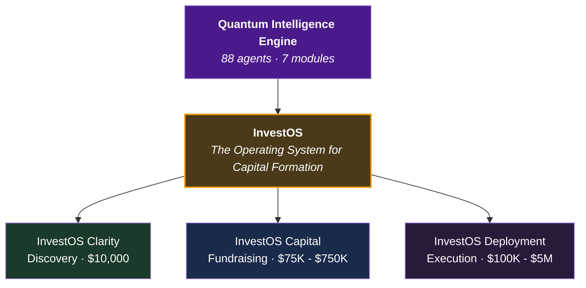
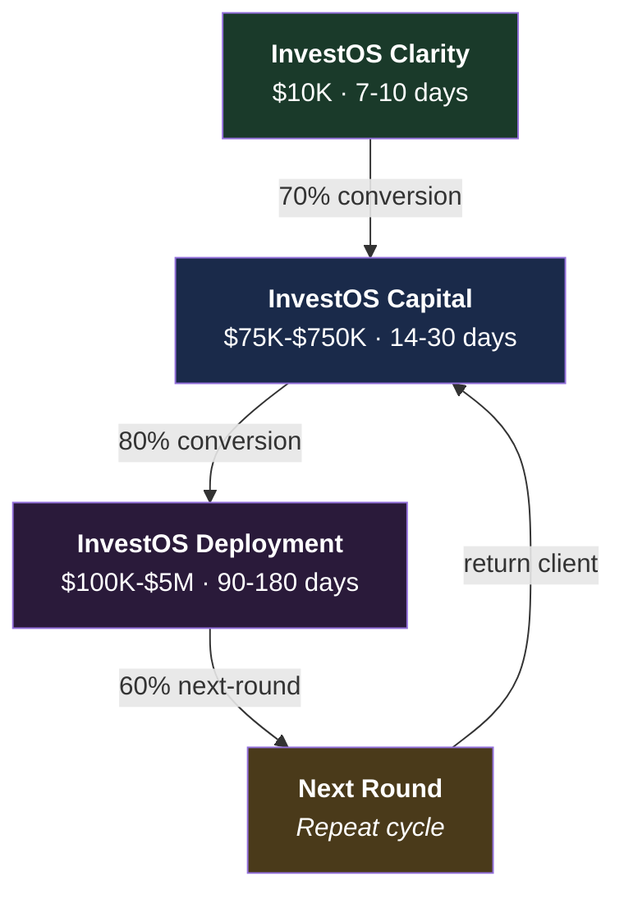
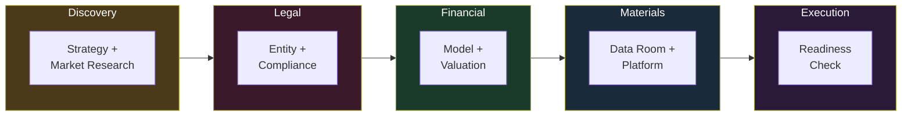
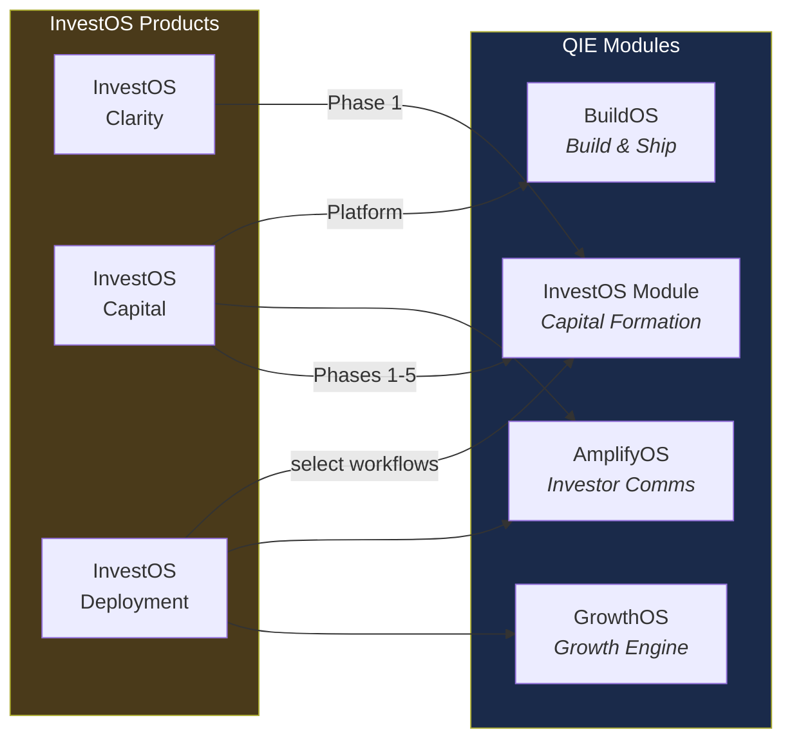

# InvestOS — The Operating System for Capital Formation

**From clarity to close to deployment: one operating system, three products, the complete capital journey.**

---

## Context Within QIE

InvestOS is QIE's **sole commercial offering** — a complete operating system for capital formation that covers the entire investment journey from discovery through fundraising to deployment. It packages the QIE's InvestOS, AmplifyOS, GrowthOS, and BuildOS modules into three distinct products.

---

## Documents

| Document | Description | Audience |
|----------|-------------|----------|
| [INVESTOS_MASTER_OVERVIEW.md](./INVESTOS_MASTER_OVERVIEW.md) | **The comprehensive strategic document.** Covers all three products, the investment journey, client progression models, pricing economics, go-to-market strategy, and implementation roadmap. | Internal, Strategic Partners |
| [INVESTOS_COMPLETE_OFFERING.md](./INVESTOS_COMPLETE_OFFERING.md) | **Master reference for InvestOS Capital.** Complete offering overview: why it exists, the problem it solves, what gets delivered, service categories, package tiers, buyer landscape, and engagement model. | Client-facing, Sales, Internal |
| [INVESTOS_STRATEGIC_ARCHITECTURE.md](./INVESTOS_STRATEGIC_ARCHITECTURE.md) | Strategic architecture and technical implementation details for the InvestOS platform. | Internal, Technical |
| [INVESTOS_BRAND_GUIDELINES.md](./INVESTOS_BRAND_GUIDELINES.md) | Brand voice, messaging, visual identity, and communication standards for investor-facing materials. | Marketing, Design, Internal |
| [InvestOS_Project_Plan.md](./InvestOS_Project_Plan.md) | Project timeline, milestones, deliverables, and implementation roadmap for an InvestOS Capital engagement. | Project Management, Internal |
| [INVESTOS_WEBSITE_PLAN.md](./INVESTOS_WEBSITE_PLAN.md) | Website structure, content strategy, user flows, and page architecture for the investor platform. | Marketing, Web Development |

---

## The Three Products

### InvestOS Clarity ($10,000 | 7-10 days)

The strategic diagnostic. Answers: Should we raise? Are we ready? What's the strategy?

**Delivers:** Investment readiness assessment, market positioning, capital roadmap, preliminary financials, investor narrative framework, readiness score.

**Conversion to InvestOS Capital:** 70%+

### InvestOS Capital ($75K - $750K | 14-30 days)

The complete fundraising infrastructure. Replaces 8+ vendors at 75-85% cost reduction.

**Delivers:** Strategic foundation, 12-tab financial model, IPEV valuation, data room with 20+ documents, market research, operational blueprint, investor platform (Professional+), tax/legal architecture (Enterprise).

**Three tiers:** Essentials ($75K-$150K), Professional ($150K-$300K), Enterprise ($350K-$750K)

### InvestOS Deployment ($100K - $5M | 90-180 days)

Post-raise execution. Turns raised capital into operational growth.

**Delivers:** Deployment strategy, operational infrastructure, growth operating system, market expansion, financial governance, tax/legal execution, scale oversight.

---

## The Capital Journey

**Average client LTV:** $800K (base case) to $5.7M (enterprise multi-round)

---

## What InvestOS Capital Delivers

InvestOS Capital replaces 8+ separate vendors at 75-85% cost reduction:

| Component | What's Included |
|-----------|----------------|
| **Strategic Foundation** | Master plan, vision document, executive summary, go-to-market |
| **Financial Models** | 12-tab variable-driven model, P&L, cash flow, cap table |
| **Enterprise Valuation** | 9-point IPEV-compliant valuation report |
| **Data Room** | 20+ organized investor documents, PPM, subscription agreements |
| **Market Research** | 50+ competitor profiles, TAM/SAM/SOM, pricing analysis |
| **Operational Blueprint** | SOPs, staffing models, capacity planning |
| **Investor Platform** | 30-page Next.js interactive platform (Professional/Enterprise tiers) |
| **Tax & Legal** | Multi-entity, multi-jurisdiction structuring (Enterprise tier) |

### InvestOS Delivery Pipeline

### Package Tiers

| Tier | Price | Timeline | Raise Target |
|------|-------|----------|-------------|
| **Essentials** | $75K - $150K | 14 days | $2M - $5M |
| **Professional** | $150K - $300K | 21 days | $5M - $15M |
| **Enterprise** | $350K - $750K | 30 days | $10M - $100M+ |

---

## How QIE Powers InvestOS

| InvestOS Product | QIE Module(s) Used | Key Agents |
|-----------------|-------------------|------------|
| InvestOS Clarity | InvestOS Phase 1 (Discovery) | Alexander, Cassandra, Diana |
| InvestOS Capital | InvestOS Phases 1-5, AmplifyOS, BuildOS | Alexander, Marcus, Victoria, Helena, Nikolai |
| InvestOS Deployment | GrowthOS, InvestOS (select), AmplifyOS | Theo, Soren, Vivienne, Raymond |

---

## Related Resources

- **Pricing structures:** [Pricing/](../Pricing)
- **InvestOS module (agent engine):** [_bmad/ios/](../_bmad/ios/)
- **AmplifyOS module (investor comms):** [_bmad/aos/](../_bmad/aos/)
- **GrowthOS module (growth operations):** [_bmad/gos/](../_bmad/gos/)
- **BMAD Framework reference:** [_bmad/BMAD-FRAMEWORK.md](../_bmad/BMAD-FRAMEWORK.md)
- **Regulatory compliance:** [Compliance/](../Compliance)

---

**Classification:** Internal / Strategic
**Parent document:** [README.md](../README.md)
