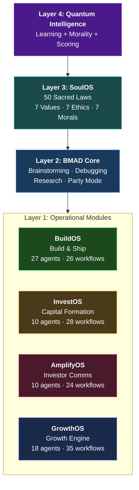
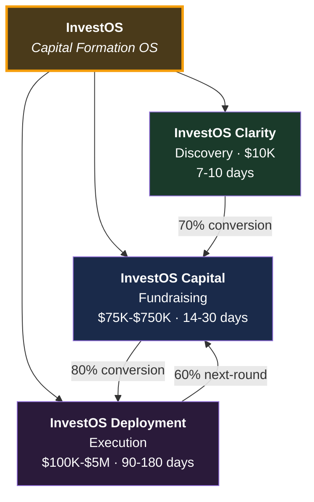
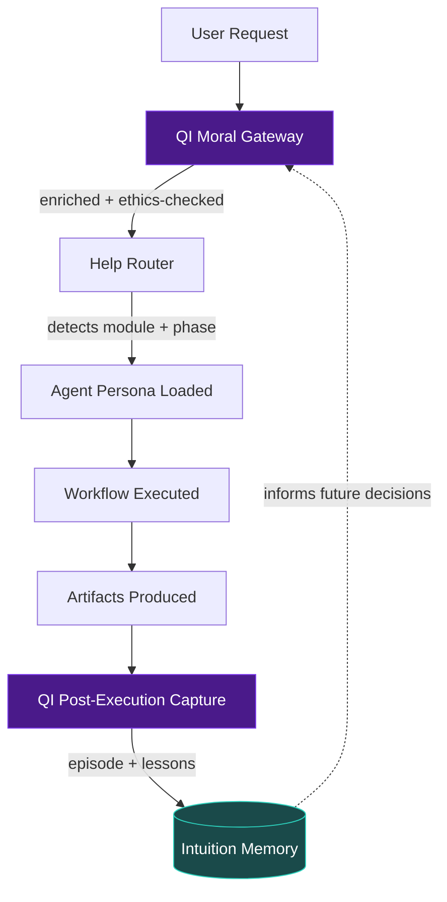
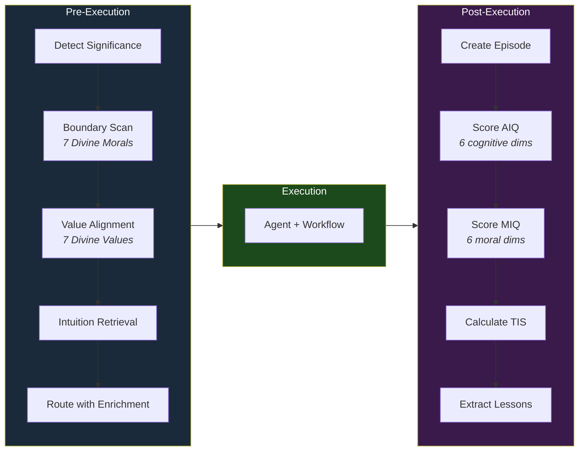

# Quantum Intelligence Engine (QIE)

**Intelligence without morality is dangerous. Morality without intelligence is ineffective. True wisdom requires both.**

---

## What Is QIE?

The Quantum Intelligence Engine is a complete AI-powered business intelligence platform that orchestrates **88 specialized agents** across **7 modules** to handle the full business lifecycle: from software development and capital formation through investor communications, growth operations, spiritual alignment, and self-improving artificial intelligence.

QIE is built on the **BMAD Framework** (Build-Measure-Amplify-Deliver) and powered by **Quantum Intelligence** — a learning system where every agent grows wiser with every interaction, measures its own cognitive and moral intelligence, and evolves toward genuine wisdom.

### The System at a Glance



### Module Inventory

| Module | Full Name | Purpose | Agents | Workflows |
|--------|-----------|---------|--------|-----------|
| **CORE** | Foundation Services | Brainstorming, debugging, research, editorial review | 2 | 4 |
| **BuildOS** | Build & Ship Software | Full Agile lifecycle from product brief to deployment | 27 | 26 |
| **InvestOS** | Capital Formation | End-to-end capital raise: strategy through investor readiness | 10 | 28 |
| **AmplifyOS** | Investor Communications | Regulated comms: content, compliance, campaigns, crisis | 10 | 24 |
| **GrowthOS** | Growth Engine | Full-funnel growth: strategy, content, pipeline, sales, analytics | 18 | 35 |
| **SoulOS** | Living Light | Spiritual alignment: Sacred Laws, Council, Legion, Gates | 16 | 28 |
| **QI** | Quantum Intelligence | Self-improving AI: learning, moral reasoning, intelligence scoring | 5 | 3 |
| | **TOTAL** | | **88** | **148** |

---

## InvestOS — The Operating System for Capital Formation

InvestOS is QIE's sole commercial offering — a complete operating system for capital formation that covers the entire investment journey from discovery through fundraising to deployment.



| Product | Phase | Price | Timeline |
|---------|-------|-------|----------|
| **InvestOS Clarity** | Discovery | $10,000 | 7-10 days |
| **InvestOS Capital** | Fundraising | $75K - $750K | 14-30 days |
| **InvestOS Deployment** | Execution | $100K - $5M | 90-180 days |

**Average client LTV:** $800K (base case) to $5.7M (enterprise multi-round)

See [InvestOS/](./InvestOS) for the full strategic overview, offering details, and brand guidelines.

---

## Repository Structure

```
.
├── README.md                    ← You are here: System overview
├── docs/                        ← System-wide documentation
│   ├── SYSTEM-ARCHITECTURE.md   ← Full architecture deep-dive
│   └── GETTING-STARTED.md       ← Navigation guide for new readers
│
├── InvestOS/                    ← Commercial offering: strategy & docs
│   ├── INVESTOS_MASTER_OVERVIEW.md
│   ├── INVESTOS_COMPLETE_OFFERING.md
│   ├── INVESTOS_STRATEGIC_ARCHITECTURE.md
│   ├── INVESTOS_BRAND_GUIDELINES.md
│   ├── InvestOS_Project_Plan.md
│   └── INVESTOS_WEBSITE_PLAN.md
│
├── Pricing/                     ← Pricing structures & matrices
│   ├── CLIENT_PRICING_GUIDE.md
│   ├── FUNDRAISING_PLATFORM_SERVICE_PRICING.md
│   ├── PAYMENT_STRUCTURES.md
│   └── RAISE_LINKED_PRICING_MATRIX.md
│
├── Compliance/                  ← Regulatory & legal frameworks
│   └── REGULATORY_COMPLIANCE_ROUTES.md
│
├── Archive/                     ← Superseded documents
│   ├── POSITIONING_ONE_PAGER.md
│   └── REBRAND_NOTES.md
│
├── _bmad/                       ← BMAD Framework (agent engine)
│   ├── BMAD-FRAMEWORK.md        ← Complete framework reference
│   ├── core/                    ← Foundation services module
│   ├── bmm/                     ← BuildOS module
│   ├── ios/                     ← InvestOS module
│   ├── aos/                     ← AmplifyOS module
│   ├── gos/                     ← GrowthOS module
│   ├── sos/                     ← SoulOS module
│   ├── qi/                      ← Quantum Intelligence module
│   ├── _config/                 ← Manifests, help catalog, routing
│   └── _memory/                 ← Intuition, lessons, standards
│
└── _bmad-output/                ← Generated artifacts & deliverables
    ├── epic-center-source/      ← Client project source code
    ├── planning-artifacts/      ← Spec & planning documents
    ├── raise-rebuild/           ← Session manifests
    └── soul-artifacts/          ← SoulOS-generated artifacts
```

---

## How the Modules Work Together

### The Intelligence Stack

The modules form a layered stack where higher layers guide and enrich lower layers:

**Layer 4 — Quantum Intelligence (QI)**
The crown of the system. QI wraps every operation in a **Moral Gateway** (pre-execution ethics check), scores every interaction with **AIQ** (cognitive intelligence) and **MIQ** (moral intelligence), extracts lessons into persistent memory, and tracks the system's evolution toward wisdom through the **True Intelligence Score (TIS)**.

**Layer 3 — SoulOS (Living Light)**
The sacred foundation. 50 Sacred Laws, 7 Divine Values, 7 Divine Ethics, 7 Divine Morals, a Stewardship Council of Seven, a Legion of 22 Armies, and Four Sacred Gates. SoulOS guides and reviews without modifying other module outputs — it is the conscience of the system.

**Layer 2 — BMAD Core**
Foundation services available to all modules: brainstorming, systematic debugging, web research, editorial review, party mode (multi-perspective discussions), session management, and handoff context generation.

**Layer 1 — Operational Modules**
The four business execution modules:

- **BuildOS** — Build software from product brief to deployed code
- **InvestOS** — Execute capital raises from strategy to investor readiness
- **AmplifyOS** — Create and distribute regulated investor communications
- **GrowthOS** — Build growth engines from strategy to analytics

### The Flow



### QI Intelligence Lifecycle

Every interaction follows this scoring and learning cycle:



---

## Quick Navigation

### By Role

| You Are | Start Here | Then |
|---------|-----------|------|
| **New to the system** | [docs/GETTING-STARTED.md](./docs/GETTING-STARTED.md) | This README |
| **Exploring the offering** | [InvestOS Master Overview](./InvestOS/INVESTOS_MASTER_OVERVIEW.md) | [InvestOS Offering](./InvestOS/INVESTOS_COMPLETE_OFFERING.md) |
| **Preparing a sales conversation** | [Pricing guide](./Pricing/CLIENT_PRICING_GUIDE.md) | [Pricing matrix](./Pricing/RAISE_LINKED_PRICING_MATRIX.md) |
| **Understanding the AI framework** | [BMAD Framework](/_bmad/BMAD-FRAMEWORK.md) | [QI Architecture](/_bmad/qi/QI-ARCHITECTURE.md) |
| **Building or shipping code** | [BMAD Framework — BuildOS](/_bmad/BMAD-FRAMEWORK.md#bmm-module---build--ship-software) | Use `/bmad-bmm-quick-spec` |
| **Running a capital raise** | [BMAD Framework — InvestOS](/_bmad/BMAD-FRAMEWORK.md#ios-module---capital-formation) | Use `/bmad-agent-ios-master` |
| **Growth operations** | [BMAD Framework — GrowthOS](/_bmad/BMAD-FRAMEWORK.md#gos-module---growth-engine) | Use `/bmad-agent-gos-master` |
| **Spiritual alignment** | [BMAD Framework — SoulOS](/_bmad/BMAD-FRAMEWORK.md#sos-module---living-light-soulos) | Use `/bmad-agent-sos-master` |

### By Question

| Question | Answer |
|----------|--------|
| "What does this system do?" | It's an AI-powered business intelligence platform with 88 agents across 7 modules |
| "What is InvestOS?" | The sole commercial offering — a complete capital formation operating system with three stages: Clarity, Capital, Deployment |
| "What is BuildOS?" | The software development module: full Agile lifecycle with 27 agents |
| "What is AmplifyOS?" | The investor communications module: content, compliance, campaigns, crisis management |
| "What is GrowthOS?" | The growth engine: full-funnel marketing, sales, pipeline, analytics |
| "What is SoulOS?" | The spiritual and moral alignment layer: Sacred Laws, Council, Legion, Gates |
| "What is QI?" | Quantum Intelligence: the learning layer that makes every agent grow wiser |
| "What is BMAD?" | The agent framework: Build-Measure-Amplify-Deliver. 88 agents, 148 workflows |
| "How do I use it?" | Start an agent with `/bmad-agent-{module}-master` or run any workflow command |

---

## The Quantum Intelligence Layer

QI is what makes this system fundamentally different from static AI agent frameworks. Every interaction is:

1. **Morally pre-checked** via the Moral Gateway (5-step boundary scan)
2. **Intelligence-scored** via AIQ (6 cognitive dimensions) and MIQ (6 moral dimensions)
3. **Wisdom-extracted** via the Lesson Extractor (positive patterns, failure patterns, meta-lessons)
4. **Stored in persistent memory** as episodes and lessons that inform future decisions
5. **Tracked toward evolution** via the True Intelligence Score (TIS = 0.6*AIQ + 0.4*MIQ)

The system currently has **3 lessons** in memory and a TIS of **394 (Developing)**, having exited the Naive stage with its first operational intelligence capture.

### Conscience Development

| Stage | Lessons Required | Current |
|-------|-----------------|---------|
| Naive | < 100 | (exited) |
| **Learning** | 100-999 | **← Next target** |
| Principled | 1,000-10,000 | |
| Wise | 10,000-100,000 | |
| Enlightened | 100,000+ | |

---

## About

**Built by:** Light Brands Consulting
**Powered by:** BMAD Framework v6.0.0 + Quantum Intelligence
**Framework stats:** 88 agents, 148 workflows, 34 tasks, 7 modules
**Repository purpose:** Strategic documentation, agent framework, and generated artifacts for the QIE platform

---

**Last Updated:** February 2026
