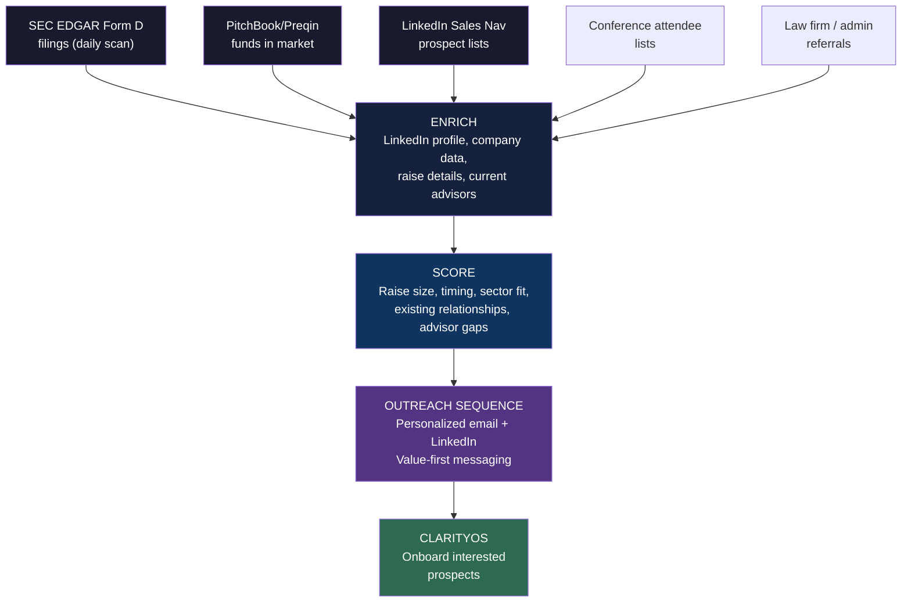

# InvestOS: Client Acquisition Deep Dive

**Every Channel, Platform, and Tactic for Finding Founders and Fund Managers Raising $10M+**

---

## The Core Question

There are 15,000-25,000 organizations in the United States actively raising $10M or more at any given time. They are the market. The question is: how do we find them, reach them, and earn their attention before they hire a placement agent, burn through their network, or give up?

This document maps every viable channel for client acquisition — from the obvious to the overlooked. Each channel is evaluated on three dimensions:

1. **Signal strength** — How clearly does this channel identify someone actively raising?
2. **Cost to activate** — What does it take in dollars and time to work this channel?
3. **Scalability** — Can this channel grow from 1 lead/month to 20+?

---

## Part 1: The Investor Ecosystem — Where Capital Raisers Live

### Understanding the Landscape

Before we talk channels, we need to understand the ecosystem. People raising capital don't wear a sign. But they do leave signals — and those signals cluster in specific places.

**Who we're looking for:**

| Segment | Profile | Raise Size | Where They Show Up |
|---------|---------|------------|-------------------|
| Emerging PE managers | Fund I-III, building track record | $50M-$300M | Industry conferences, LinkedIn, PE associations, law firm events |
| Independent sponsors | Deal-by-deal operators, no permanent fund | $10M-$75M per deal | Deal sourcing platforms, LinkedIn, sponsor conferences |
| Real estate sponsors | Syndicators, developers, operators | $10M-$500M | RE conferences, crowdfunding platforms, local RE associations |
| Family offices (raising) | Co-investment or fund structures | $10M-$500M | Family office networks, wealth conferences, private events |
| Growth companies | Series B+ or alternative capital | $10M-$100M | Startup ecosystems, accelerator alumni, VC/PE crossover events |
| First-time fund managers | Launching Fund I | $50M-$200M | Accelerator programs for fund managers, LinkedIn thought leadership |
| RIAs allocating to alts | Building alternative investment products | $10M-$100M | RIA conferences, custodian platforms, compliance forums |

**The key insight:** Most of these people are not looking for a "placement agent." They're looking for help. They're searching for "how to raise a fund," "investor deck template," "Reg D compliance," "LP database," "fund formation attorney." **We meet them at the point of need, not the point of sale.**

---

## Part 2: Data-Driven Channels — Finding Them Before They Find Us

### 2.1 SEC EDGAR Filings (Free — Highest Signal)

**What it is:** Every Regulation D offering (506(b) and 506(c)) must file a Form D with the SEC. This is a public record. It tells you exactly who is raising, how much, what type of offering, and when they filed.

**Why it matters:** This is the single highest-signal source for identifying active capital raisers. A Form D filing means they are legally in the market *right now*.

**How to use it:**

| Action | Detail |
|--------|--------|
| **EDGAR Full-Text Search** | Search SEC EDGAR (efts.sec.gov) for Form D filings by date, state, industry, amount |
| **Filter criteria** | Offering amount $10M-$500M, filed within last 90 days, industry codes matching our sectors |
| **Data extracted** | Company name, principals, offering amount, date of first sale, exemption type, industry |
| **Outreach** | Personalized message referencing their filing — "I noticed you're raising $X under 506(c)..." |

**Volume:** ~3,000-5,000 new Form D filings per month. After filtering to our target size and sectors: 200-500 qualified leads/month.

**Signal strength:** 10/10 — They are literally filing paperwork to raise capital.
**Cost:** Free (public data). Time to build scraping/monitoring system.
**Scalability:** Extremely high. Can be fully automated.

### 2.2 PitchBook / Preqin / Crunchbase (Paid — High Signal)

**What they are:** Professional databases that track fundraising activity, fund launches, deal flow, and investor relationships across private markets.

**How to use them:**

| Platform | Best For | Cost | Key Filters |
|----------|----------|------|-------------|
| **PitchBook** | PE/VC fund tracking, deal flow, LP data | $20K-$50K/yr | Fund size, vintage, strategy, geography, status (raising) |
| **Preqin** | Alternative assets — PE, RE, hedge, infrastructure | $15K-$40K/yr | Fund in market, target size, strategy, placement agent status |
| **Crunchbase** | Growth companies, startup fundraising | $5K-$30K/yr | Funding stage, amount, industry, recent activity |

**The play:** Filter for funds currently in market (Preqin's "Funds in Market" database literally lists every fund actively raising). Cross-reference with Form D filings. Identify those without a placement agent — these are our highest-probability targets.

**Signal strength:** 9/10 — Curated, verified data on active fundraises.
**Cost:** $20K-$50K/yr for full access. Worth it at scale.
**Scalability:** High. Export lists, build outreach sequences.

### 2.3 State Securities Filings (Free — High Signal)

**What it is:** Beyond federal Form D, many states require notice filings for securities offerings. State regulators (typically Secretary of State or Securities Division) maintain these records.

**How to use it:** Monitor blue sky filings in key states (California, New York, Texas, Florida, Illinois) for new offerings. These sometimes surface raises that haven't yet appeared on EDGAR.

**Signal strength:** 8/10
**Cost:** Free. Manual monitoring unless automated.
**Scalability:** Medium — varies by state accessibility.

### 2.4 FINRA BrokerCheck & SEC Investment Adviser Search (Free)

**What it is:** Public databases of registered broker-dealers and investment advisers. Useful for identifying RIAs launching alternative investment products and fund managers who are newly registered.

**How to use it:** Track new Form ADV filings (investment advisers) and new BD registrations. A new registration often signals a fund launch or product offering.

**Signal strength:** 6/10 — Indirect signal, but catches early-stage intent.
**Cost:** Free.
**Scalability:** Medium.

---

## Part 3: Platform Channels — Where They Gather Online

### 3.1 LinkedIn (Low Cost — Highest Volume)

LinkedIn is where fund managers, sponsors, and founders live professionally. It is the single most important platform for B2B outreach in this space.

**Tactics:**

| Tactic | Detail | Expected Result |
|--------|--------|-----------------|
| **LinkedIn Sales Navigator** | Filter by title (Managing Partner, GP, Fund Manager, Sponsor), company size, industry, geography | Build targeted prospect lists of 1,000+ |
| **Content marketing** | Post thought leadership on capital formation, raise strategy, market intelligence | Inbound inquiries from people who resonate |
| **Direct outreach** | Personalized connection requests + follow-up messages | 15-25% acceptance rate, 5-10% response rate |
| **LinkedIn Ads** | Sponsored content and InMail targeting fund managers, PE professionals, RE sponsors | $50-$150 per qualified lead |
| **Group engagement** | Active participation in PE, fund formation, and capital markets groups | Build authority, surface conversations |
| **Event promotion** | Promote webinars, workshops, and thought leadership events | Lead generation + credibility |

**Content that works in this space:**

- "What I learned helping X raise $Y in Z days"
- Market intelligence posts (LP allocation trends, fundraising timelines, sector heat maps)
- "The 5 mistakes emerging managers make in their first raise"
- Breakdowns of deal structures and terms (redacted/anonymized)
- Commentary on SEC regulatory changes affecting capital formation

**Signal strength:** 6/10 — Mixed intent, but high volume.
**Cost:** $100-$500/mo (Sales Navigator + minimal ad spend). Scales to $2K-$5K/mo.
**Scalability:** Very high. Content compounds. Ad spend scales linearly.

### 3.2 Fund Formation Platforms & Communities

**Where fund managers go when they're figuring out how to raise:**

| Platform | What It Is | How to Engage |
|----------|-----------|---------------|
| **Allocator One** | LP-GP matching platform | List InvestOS as a service provider. Engage with GPs seeking support. |
| **Fundrise / CrowdStreet / RealtyMogul** | Real estate crowdfunding platforms | Identify sponsors who outgrow these platforms and need institutional capital |
| **AngelList / Republic / Wefunder** | Startup fundraising platforms | Founders graduating from Reg CF to Reg D — natural transition clients |
| **Visible.vc** | Investor update and fundraising CRM | Active community of founders raising capital |
| **Carta** | Cap table and fund admin | Founders and fund managers using Carta are actively managing raises |
| **Juniper Square** | Real estate fund management | RE sponsors managing LP relationships — often raising next fund |

**The play:** Many of these platforms have communities, forums, or marketplaces where capital raisers actively seek help. Be present. Be helpful. Be the answer when they ask "who can help me raise?"

**Signal strength:** 7/10
**Cost:** Varies — $0 (community engagement) to $5K-$20K/yr (platform listings).
**Scalability:** Medium. Relationship-driven.

### 3.3 Twitter/X (Free — Growing Signal)

**What it is:** An increasingly important platform for alternative investment professionals, especially in crypto, venture, and emerging PE.

**Tactics:**
- Follow and engage with fund managers, LPs, and capital markets professionals
- Share market intelligence and raise insights
- Build "FinTwit" presence in the capital formation niche
- Monitor conversations around fundraising pain points

**Signal strength:** 5/10 — Noisy, but growing for this audience.
**Cost:** Free (organic). $500-$2K/mo (promoted).
**Scalability:** High if content resonates.

### 3.4 YouTube & Podcasting (Low Cost — Long Tail)

**What it is:** Educational content that positions InvestOS as the authority on capital formation.

**Content formats:**
- "How to Raise Your First Fund" series
- LP interview series (what LPs actually look for)
- Deal structure breakdowns
- Market intelligence briefings
- "Behind the Raise" case studies (with client permission)

**Why it works:** A founder Googling "how to raise a Reg D fund" at 2am will find your video. When they're ready to act, you're already trusted.

**Signal strength:** 4/10 — Long-tail, but compounds over time.
**Cost:** $500-$2K/mo (production). Free distribution.
**Scalability:** Very high. Content is a permanent asset.

---

## Part 4: Event Channels — Where They Show Up in Person

### 4.1 Industry Conferences (High Signal — Relationship Building)

**The highest-value conferences for finding capital raisers:**

| Conference | Focus | Audience | Timing |
|-----------|-------|----------|--------|
| **SALT** | Alternative investments | GPs, LPs, allocators, family offices | Annual (May/Sept) |
| **SuperReturn** | Private equity | PE fund managers, LPs, placement agents | Annual (June) |
| **ILPA Summit** | LP perspective | Institutional LPs, GPs | Annual (multiple) |
| **PERE** | Private real estate | RE fund managers, institutional RE investors | Annual (multiple) |
| **IMN (various)** | Alternative investments, RE | Fund managers, sponsors, service providers | Multiple per year |
| **Context Summits** | Emerging managers | Emerging and diverse managers, LPs, allocators | Annual (Jan/Sept) |
| **Opal Group Events** | PE, RE, alternatives | Fund managers, family offices, RIAs | Multiple per year |
| **Family Office Club** | Family offices | Family office principals, co-investors | Multiple per year |
| **ICSC** | Commercial real estate | RE sponsors, developers, investors | Annual |
| **NIC** | Senior housing/healthcare RE | Healthcare RE sponsors, operators | Annual |
| **NMHC** | Multifamily RE | Multifamily sponsors, developers, investors | Annual |

**How to work conferences:**
1. **Attend as a participant** — Not a booth. Walk the floor. Meet people. Have conversations.
2. **Host a side event** — Dinner or drinks for 10-15 targeted GPs. Intimate. High-value.
3. **Speak on panels** — Position InvestOS leadership as capital formation experts.
4. **Sponsor strategically** — Only if the attendee list is deeply qualified. Otherwise, just attend.

**Signal strength:** 8/10 — People at these events are in the capital markets.
**Cost:** $2K-$10K per event (registration + travel). Sponsorship: $10K-$50K.
**Scalability:** Medium. Relationship quality is high but volume is limited per event.

### 4.2 Fund Manager Accelerators & Programs

**Programs specifically designed for emerging fund managers:**

| Program | What It Does | Why It Matters |
|---------|-------------|----------------|
| **FirstMark Fund Accelerator** | Helps first-time managers launch funds | Every participant is actively raising Fund I |
| **Emerging Manager Alliance** | Community and resources for emerging managers | Members are in fundraising mode |
| **All Raise** | Supports women and non-binary fund managers | Underserved segment with strong allocation tailwinds |
| **Blck VC** | Black venture capital community | Emerging managers seeking LP access |
| **AAIM (American Assoc. of Individual Investors)** | Investor education | Some members are transitioning to fund management |
| **Kauffman Fellows** | Venture capital fellowship | Alumni launching their own funds |
| **ILPA Diversity in Action** | LP initiative for diverse managers | Connects diverse GPs with institutional LPs |

**The play:** Partner with these programs. Offer ClarityOS as a free tool for their members. Become the go-to resource for their cohorts.

**Signal strength:** 9/10 — Every member is raising or about to raise.
**Cost:** Partnership/sponsorship: $5K-$25K. Time: significant relationship building.
**Scalability:** Medium. But extremely high conversion.

### 4.3 Local and Regional Events

**Don't overlook the local:**

| Event Type | Where to Find | Why It Matters |
|-----------|--------------|----------------|
| **Local PE/VC meetups** | Meetup.com, Eventbrite, LinkedIn Events | Emerging managers before they hit the conference circuit |
| **Chamber of Commerce events** | Local chambers | Business owners considering raising capital |
| **Real estate investor clubs** | Local REIA chapters | Syndicators graduating to institutional raises |
| **University entrepreneurship events** | Business school alumni networks | Founders with institutional ambitions |
| **Coworking space events** | WeWork, Industrious, local spaces | Founders in growth mode |
| **Bar association CLE events** | State and local bar associations | Fund formation attorneys who refer clients |

**Signal strength:** 5/10 — Varied, but low cost and high trust.
**Cost:** $0-$500 per event.
**Scalability:** Low per event, but builds local pipeline.

---

## Part 5: Referral & Partnership Channels — Leveraging Other People's Networks

### 5.1 Fund Formation Attorneys

**The single highest-value referral source in this business.**

Every fund manager hires a fund formation attorney. These attorneys see every raise before it starts. They are the first professional a GP engages. And most of them do not offer placement or advisory services — they want a partner to refer clients to.

| Firm Tier | Examples | How to Approach |
|-----------|---------|-----------------|
| **Elite** | Proskauer Rose, Kirkland & Ellis, Ropes & Gray, Seward & Kissel, Sidley Austin | Long-term relationship building. Attend their events. Co-author content. |
| **Mid-market** | Lowenstein Sandler, Schulte Roth & Zabel, Haynes Boone, Sadis & Goldberg | More accessible. Offer ClarityOS as a client resource. Co-host webinars. |
| **Boutique** | Local fund formation specialists in major markets | Highest conversion. Personal relationships. Regular referral flow. |

**Why they refer:**
- Their clients ask them for help raising capital. They can't provide it.
- A successful raise means a happy client who comes back for Fund II.
- InvestOS makes their clients more organized and professional — which makes the attorney's job easier.

**How to build these relationships:**
1. Identify the top 50 fund formation attorneys in the US
2. Reach out with value — share market intelligence, offer ClarityOS as a resource for their clients
3. Co-host a webinar: "What Emerging Managers Need to Know Before Raising Fund I"
4. Build a formal referral arrangement — they introduce, we serve, they get credit

**Signal strength:** 10/10 — Direct pipeline into active raises.
**Cost:** Time. Relationship building.
**Scalability:** Extremely high once relationships are established.

### 5.2 Fund Administrators

**The operational backbone of every fund:**

| Administrator | Focus |
|--------------|-------|
| **Citco** | Large fund admin, PE/hedge |
| **SS&C (Eze, Advent)** | Technology + admin |
| **Apex Group** | Mid-market fund admin |
| **NAV Consulting** | Boutique PE/RE fund admin |
| **Standish Management** | Emerging manager focused |

Fund admins see which funds are launching, which are raising, and which need help. They're a natural referral partner because a successful raise means more AUM to administer — more fees for them.

**Signal strength:** 8/10
**Cost:** Time. Partnership development.
**Scalability:** High.

### 5.3 Prime Brokers & Custodians

For hedge fund and liquid alts managers, prime brokers (Goldman Sachs, Morgan Stanley, Interactive Brokers) and custodians are the first infrastructure they set up. These firms have capital introduction teams, but they focus on large funds. Emerging managers fall through the cracks — right into our lap.

**Signal strength:** 7/10
**Cost:** Relationship building.
**Scalability:** Medium-high.

### 5.4 Accounting Firms (Fund Audit)

Every fund needs an auditor. The Big 4 (Deloitte, PwC, EY, KPMG) handle the large funds, but mid-market and boutique firms (Marcum, EisnerAmper, WithumSmith+Brown, Citrin Cooperman) serve emerging managers. They know who's raising.

**Signal strength:** 7/10
**Cost:** Time.
**Scalability:** Medium.

### 5.5 Placement Agent Networks

**Counterintuitive but powerful:** Some placement agents are overwhelmed or only take mandates above a certain size. We can position as a partner for mandates they decline — they refer down, we serve, everyone wins.

**Signal strength:** 8/10
**Cost:** Relationship building.
**Scalability:** Medium.

### 5.6 Industry Associations

| Association | Members | Value |
|------------|---------|-------|
| **AIMA** | Alternative investment managers | Global reach, events, content |
| **ILPA** | Institutional LPs | Understanding LP side; GP connections |
| **NAIOP** | Commercial RE developers | RE sponsors raising capital |
| **ULI** | Urban Land Institute | RE developers, investors |
| **ACG** | Association for Corporate Growth | Middle market PE, deal sourcing |
| **NVCA** | National Venture Capital Association | VC fund managers |
| **REISA** | Real Estate Investment Securities Association | Alternative RE investment managers |
| **ADISA** | Alternative & Direct Investment Securities Association | Sponsors raising through broker-dealers |

**The play:** Join as a member. Attend events. Sponsor selectively. Get on panels. Write for their publications.

**Signal strength:** 6/10
**Cost:** $1K-$10K/yr membership. Events additional.
**Scalability:** Medium.

---

## Part 6: Paid Acquisition — Scaling with Ads

### 6.1 LinkedIn Ads (Highest ROI for B2B)

| Ad Type | Best For | Expected CPL |
|---------|----------|-------------|
| **Sponsored Content** | Thought leadership, case studies, market reports | $75-$200 |
| **InMail** | Direct outreach to targeted prospects | $30-$80 per send |
| **Lead Gen Forms** | Capturing interest with gated content (guides, reports) | $50-$150 |
| **Conversation Ads** | Interactive, choose-your-path messaging | $40-$100 |

**Targeting options:**
- Job title: Managing Partner, General Partner, Fund Manager, Sponsor, CEO (at PE/RE firms)
- Company size: 2-50 employees (emerging managers)
- Industry: Financial Services, Real Estate, Investment Management
- Groups: PE/VC groups, fund manager communities
- Interests: Fundraising, capital markets, private equity

**Budget allocation:**
- Phase 1 (Months 1-3): $2K/mo — Test creatives, audiences, offers
- Phase 2 (Months 4-6): $5K/mo — Scale what works
- Phase 3 (Months 7+): $5K-$15K/mo — Full scale based on ROI

### 6.2 Google Ads (Intent-Based — High Conversion)

**Target people actively searching for help raising capital:**

| Keyword Cluster | Monthly Search Volume (est.) | Competition | CPC Range |
|----------------|---------------------------|------------|-----------|
| "how to raise a fund" | 1,000-5,000 | Medium | $5-$15 |
| "placement agent" | 500-2,000 | Medium | $10-$25 |
| "fund formation" | 1,000-3,000 | High | $15-$30 |
| "reg d offering" | 500-2,000 | Medium | $8-$20 |
| "raise capital for real estate" | 1,000-5,000 | Medium | $10-$25 |
| "investor deck template" | 2,000-8,000 | Low | $3-$10 |
| "LP database" | 200-500 | Low | $5-$15 |
| "fund marketing" | 500-2,000 | Medium | $8-$20 |
| "capital formation" | 500-1,500 | Low | $5-$15 |
| "emerging manager fundraising" | 200-500 | Low | $5-$15 |

**The play:** Capture intent with educational content (guides, tools, templates) gated behind ClarityOS signup. They get free value. We get a qualified lead in our system.

**Budget:** $2K-$5K/mo initially. Scale based on cost per qualified lead.

### 6.3 Meta Ads (Facebook/Instagram — Awareness + Retargeting)

Less targeted for B2B, but useful for:
- **Retargeting** website visitors and LinkedIn engagers
- **Lookalike audiences** based on existing client profiles
- **Content distribution** — push case studies and thought leadership to warm audiences

**Budget:** $500-$2K/mo.

### 6.4 Podcast Sponsorships

**Targeted podcasts where fund managers and capital raisers listen:**

| Podcast | Audience | Sponsorship Cost (est.) |
|---------|----------|----------------------|
| **Capital Allocators** (Ted Seides) | LPs, GPs, allocators | $5K-$15K/episode |
| **The Emerging Manager Podcast** | First-time fund managers | $1K-$3K/episode |
| **Private Equity Funcast** | PE professionals | $2K-$5K/episode |
| **The Real Estate Syndication Show** | RE syndicators and investors | $1K-$3K/episode |
| **Alt Goes Mainstream** (iCapital) | Alternative investment professionals | $3K-$8K/episode |
| **Fundless with Barak Laks** | Independent sponsors | $1K-$3K/episode |

**Alternative:** Launch our own podcast. Interview GPs, LPs, and service providers. Lower cost, higher long-term value, and every guest is a potential client or referral source.

---

## Part 7: Content & SEO — The Inbound Engine

### 7.1 The Content Strategy

**Goal:** Own the search results for every question a capital raiser asks before, during, and after their raise.

**Content pillars:**

| Pillar | Example Topics | Target Audience |
|--------|---------------|-----------------|
| **How to Raise** | Fund formation guide, Reg D vs Reg A, LP targeting, timeline planning | First-time fund managers |
| **Market Intelligence** | LP allocation trends, fundraising benchmarks, sector analysis | Active GPs |
| **Deal Structure** | Waterfall design, preferred returns, management fees, GP commit | Emerging managers |
| **Compliance** | SEC requirements, Form D filing, blue sky, marketing rules | All capital raisers |
| **Case Studies** | Real raises (anonymized), what worked, timelines, outcomes | Prospects evaluating us |
| **Tools & Templates** | Financial model templates, investor deck frameworks, data room checklists | Lead magnets |

### 7.2 SEO Priority Keywords

| Keyword | Intent | Difficulty | Priority |
|---------|--------|-----------|----------|
| "how to raise a private equity fund" | Informational → Commercial | Medium | High |
| "reg d 506c offering" | Commercial | Medium | High |
| "placement agent for emerging managers" | Commercial | Low | Very High |
| "fund formation cost" | Informational | Low | High |
| "investor data room checklist" | Informational (lead magnet) | Low | High |
| "LP database for fund managers" | Commercial | Medium | Very High |
| "real estate syndication raise" | Commercial | Medium | High |
| "fund marketing compliance" | Informational | Low | Medium |
| "how long does it take to raise a fund" | Informational | Low | High |
| "emerging manager placement agent" | Commercial | Low | Very High |

### 7.3 Lead Magnets

| Asset | Format | Gate |
|-------|--------|------|
| "The Emerging Manager's Fundraising Playbook" | PDF guide (30-50 pages) | Email + name + raise size |
| "2026 LP Allocation Trends Report" | PDF report | Email + name + fund type |
| "Investor Deck Template" | Editable template | Email + ClarityOS signup |
| "Fund Formation Checklist" | Interactive checklist | Email |
| "Data Room Builder" | Online tool | ClarityOS signup |
| "Raise Readiness Assessment" | Self-assessment quiz | ClarityOS signup |

**The funnel:** Content attracts → Lead magnet captures → ClarityOS onboards → StrategyOS converts → InvestOS + AmplifyOS closes.

---

## Part 8: Outbound — Direct Prospecting at Scale

### 8.1 The Outbound System

**Combining data sources with personalized outreach:**

### 8.2 Outreach Messaging Framework

**The principle:** Never sell. Always help. Lead with value. Let the work speak.

**Email Sequence (5-touch over 21 days):**

| Touch | Day | Subject/Approach | Purpose |
|-------|-----|-----------------|---------|
| 1 | Day 0 | "Saw your [Form D / fund launch / LinkedIn post] — quick thought" | Open with specific observation. Offer one insight relevant to their raise. |
| 2 | Day 3 | Share a relevant market data point or article | Add value. No ask. |
| 3 | Day 7 | "Quick question about your raise timeline" | Engage with curiosity. Light CTA to chat. |
| 4 | Day 14 | Share a case study (anonymized) relevant to their sector/size | Social proof. Show what's possible. |
| 5 | Day 21 | "Last note — here if timing is ever right" | Graceful close. Leave the door open. |

**Key rules:**
- Personalization is non-negotiable. Reference their specific raise, sector, or situation.
- Never use "placement agent" language. We are strategic partners, not salespeople.
- If they don't respond after 5 touches, stop. They go into a nurture list for quarterly market updates.

### 8.3 Volume Targets

| Channel | Monthly Prospects | Response Rate | Qualified Conversations |
|---------|------------------|---------------|----------------------|
| SEC EDGAR outreach | 100-200 | 5-10% | 5-20 |
| LinkedIn outreach | 200-400 | 10-15% | 20-60 |
| Conference follow-ups | 20-50 | 20-30% | 4-15 |
| Referral introductions | 10-20 | 50-70% | 5-14 |
| Inbound (content + ads) | 20-50 | 30-50% | 6-25 |
| **Total monthly** | **350-720** | | **40-134** |

At 30-40% conversion from qualified conversation to ClarityOS, and 70-80% from ClarityOS to engagement: **8-40 new engagements per month** from the full system at scale.

---

## Part 9: The Channel Priority Matrix

### Phase 1 — Now (Months 1-3): Foundation

**Focus on free/low-cost, high-signal channels.**

| Channel | Action | Investment | Expected Leads/Mo |
|---------|--------|-----------|-------------------|
| **Personal networks** (partners + contractors) | Activate all 6 networks with outreach | $0 | 10-15 warm intros |
| **SEC EDGAR monitoring** | Set up daily Form D scan + outreach system | $0 (time investment) | 5-10 qualified |
| **LinkedIn organic** | Content 3x/week, Sales Navigator prospecting | $100/mo | 5-15 |
| **Fund formation attorney relationships** | Identify top 20, begin outreach | $0 (time) | 1-3 referrals |
| **ClarityOS as lead magnet** | Offer free to all qualified prospects | $0 | Conversion tool |

**Monthly investment:** ~$100
**Expected leads:** 20-40 qualified conversations

### Phase 2 — Growth (Months 4-6): Amplify What Works

| Channel | Action | Investment | Expected Leads/Mo |
|---------|--------|-----------|-------------------|
| **LinkedIn Ads** | Launch targeted campaigns | $2K-$5K/mo | 15-30 |
| **Google Ads** | Capture search intent | $2K-$3K/mo | 10-20 |
| **Content/SEO** | Publish 2-4 pillar articles/month | $500-$1K/mo (tools) | 5-10 (growing) |
| **Conference attendance** | 1-2 events per quarter | $5K-$10K/quarter | 5-15 per event |
| **Referral partnerships** | Expand to fund admins + accountants | $0 (time) | 5-10 |
| **PitchBook/Preqin** | Evaluate ROI of paid data | $20K-$50K/yr (if justified) | 20-40 |

**Monthly investment:** $5K-$10K
**Expected leads:** 40-100 qualified conversations

### Phase 3 — Scale (Months 7+): Full Engine

All channels running. Content compounding. Referral partnerships producing. Paid acquisition optimized. Inbound growing.

**Monthly investment:** $10K-$20K
**Expected leads:** 80-150+ qualified conversations
**Target:** 8-15 new engagements/month

---

## Part 10: Tools & Infrastructure

### The Acquisition Stack

| Tool | Purpose | Cost |
|------|---------|------|
| **LinkedIn Sales Navigator** | Prospect identification + outreach | $100/mo |
| **Apollo.io or Instantly** | Email finding + outbound sequences | $100-$300/mo |
| **SEC EDGAR API** | Form D monitoring | Free |
| **Google Search Console + Analytics** | SEO tracking | Free |
| **Webflow or WordPress** | Content publishing + landing pages | $30-$100/mo |
| **HubSpot CRM (free tier)** | Pipeline management | Free |
| **Canva** | Content creation | $13/mo |
| **ClarityOS (our own)** | Lead qualification + onboarding | Internal |

**Total infrastructure cost:** $250-$550/mo — well within our AI/tools budget.

---

## The Bottom Line

We don't need to find all 15,000-25,000 capital raisers. We need to find 4 per month who are the right fit.

The channels above — even just the free ones (SEC EDGAR, LinkedIn organic, personal networks, attorney relationships) — can produce 20-40 qualified conversations per month. At 10-20% conversion to engagement, that's 2-8 new clients monthly.

Add paid channels and content infrastructure, and the system produces more leads than we can serve. The constraint becomes capacity, not pipeline. That's exactly where we want to be.

---

*Companion document to: InvestOS Strategic Model, Revenue Channels Playbook, Operations Manual*
*Prepared by Quinn (QIE) for Light Brands Consulting strategic planning.*
