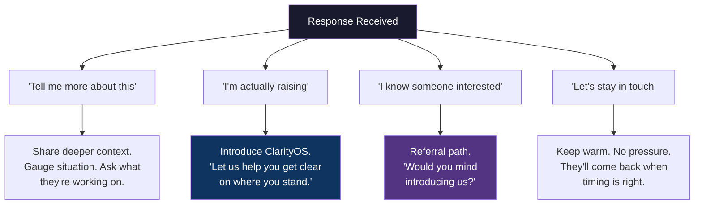
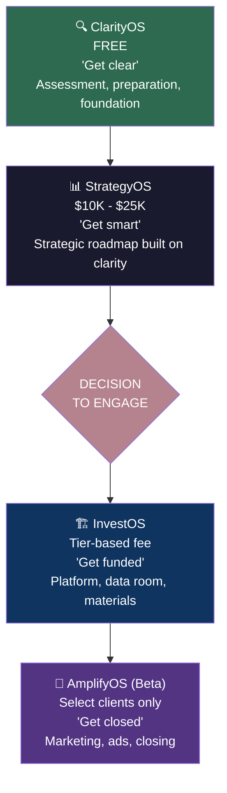
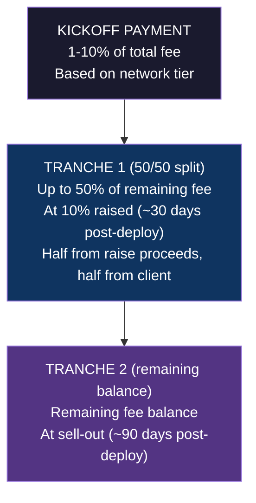
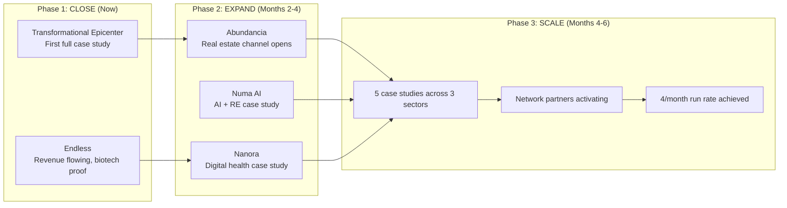
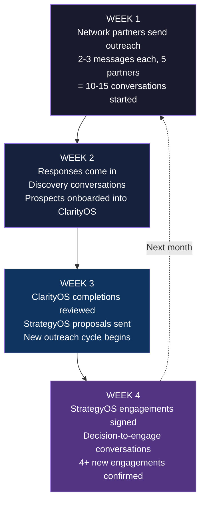
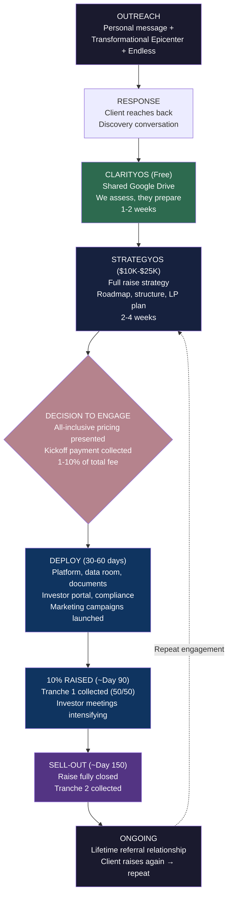

# InvestOS: Revenue Channels & Engagement Playbook

**The Operating System for Closing 4 Engagements Per Month**

---

## Overview

This document is the companion to the InvestOS Strategic Model. That document covers the *what* and *why* — market size, fee structure, 10-year projections. This document covers the *how* — the exact channels, engagement process, product stack, compensation, and payment terms that make 4 engagements per month real.

---

## Part 1: Revenue Channels

### Active Channels

| # | Channel | Type | Status |
|---|---------|------|--------|
| 1 | **Transformational Epicenter** | Direct — closing soon | Active deal, health optimization space |
| 2 | **Endless** | Direct — revenue on raise | Active deal, biotech |
| 3 | **Nicholas's Network** | Referral network (Partner) | Personal connections in $20M+ space |
| 4 | **Jason's Network** | Referral network (Partner) | Personal connections in $20M+ space |
| 5 | **Travis's Network** | Referral network (Partner) | Personal connections in $20M+ space |
| 6 | **Eyob's Network** | Referral network (Partner) | Personal connections in $20M+ space |
| 7 | **Will's Network** | Referral network (Contractor) | Personal connections in $20M+ space |
| 8 | **Inbound Ads** | Paid acquisition | Targeted digital ads driving qualified inbound leads |

### Channel Strategy

**Channels 1-2 (Direct deals)** are the proof points. Transformational Epicenter and Endless demonstrate the full InvestOS model in action. Every close becomes a case study that unlocks the referral networks.

**Channels 3-7 (Personal networks)** are the growth engine. Partners and contractors activate their top 2-3 connections — investors and founders seeking $20M+ in health and wellness optimization, biotech, and regenerative real estate. That's 10-15 warm introductions across 5 networks. Note: Channels 3-6 are partners; Channel 7 (Will) is an independent contractor earning referral and account management fees on closed business (see Operations Manual, Part 3B).

**Channel 8 (Inbound Ads)** is the scale layer. Targeted digital advertising — LinkedIn, Meta, Google — driving qualified inbound leads from founders and fund managers actively raising capital. This channel supplements the network-driven pipeline and becomes increasingly important as case studies and brand credibility build. Low spend initially ($2K-$5K/mo), scaling with proven ROI.

**The math:**
- 5 network partners/contractors × 2-3 top connections = 10-15 warm introductions
- At 30-40% conversion from warm intro to engagement = 3-6 engagements
- Inbound ads contributing 1-2 qualified leads/month as the channel matures
- Combined with direct deals = 4+ engagements/month target

---

## Part 2: How to Engage

### The Philosophy

Keep it simple. Keep it personal. The investors who take initiative are the ones who reach back out. We don't chase — we share and let the work speak.

### The Engagement Process

**Step 1: Personal Connection Reach-Out**

Each network partner identifies their top 2-3 connections — people they have real relationships with who are raising or considering raising $20M+ in health and wellness optimization, biotech, or regenerative real estate.

**Step 2: The Message**

Simple. Human. No pitch deck. No sales language. Just a genuine ask for feedback.

---

> Hey [Name], how are you doing? Imagine things are well for you.
>
> I'm part of this group working on a project and I was curious to get your feedback.
>
> [Attach: Transformational Epicenter overview]
> [Attach: Endless overview]
>
> Any feedback is appreciated. Chat soon.

---

**Why this works:**

| Element | Purpose |
|---------|---------|
| "How are you doing?" | Personal, not transactional |
| "I'm part of this group" | Positions as collaborative, not salesy |
| "Curious to get your feedback" | Low pressure — asking for their opinion, not their money |
| Send both projects | Shows range and credibility without explaining everything |
| "Any feedback is appreciated" | Keeps the door open without demanding response |
| "Chat soon" | Warm close — assumes ongoing relationship |

**Step 3: Let Them Come to You**

The investors who take initiative are the right investors. If they respond with questions, interest, or want to learn more — that's a qualified lead. If they don't respond, that's fine. No follow-up needed beyond one gentle check-in after 7-10 days.

**Step 4: The Conversation**

When they respond, the conversation follows a natural path:

**Step 5: ClarityOS Onboarding**

Once they express interest, onboard them into ClarityOS (free). This is where the relationship deepens and the real engagement begins.

---

## Part 3: The Product Stack

### The Four Products

InvestOS operates as a progressive product stack. Each product builds on the previous one, moving the client from clarity → strategy → execution → amplification.

---

### Product 1: ClarityOS (Free)

**Purpose:** Empower the client to get us everything we need to assess their business and prepare them for every part of the raise stage.

**What we deliver:**
- Shared Google Drive folder with structured templates
- Business assessment framework
- Raise readiness checklist
- Financial data collection
- Market positioning questionnaire
- Team and track record documentation

**What the client does:**
- Fills in all the details — financials, deck, team bios, market analysis, legal structure
- This is their homework. It shows who is serious and who isn't.

**Why it's free:**
- Filters for commitment — clients who complete ClarityOS are serious
- Gives us everything we need to build a smart strategy
- Creates trust and demonstrates our platform's capability
- Costs us nothing to deliver (AI-powered, templated)

**Transition to StrategyOS:** When ClarityOS is complete and the client has a viable raise, we present the StrategyOS engagement.

---

### Product 2: StrategyOS ($10K - $25K)

**Purpose:** Build a comprehensive raise strategy built on everything gathered in ClarityOS.

**What we deliver:**
- Full capital formation strategy
- Target raise structure and terms recommendations
- LP targeting strategy — who to approach, in what order, with what narrative
- Financial model review and optimization
- Valuation analysis
- Competitive positioning
- Go-to-market timeline for the raise
- Regulatory pathway recommendation (Reg D 506(b), 506(c), Reg A+, etc.)

**Pricing:**
- $10K for straightforward raises ($1M-$10M, clear structure)
- $15K-$20K for mid-complexity ($10M-$50M, multiple investor classes)
- $25K for complex raises ($50M+, institutional targets, multi-entity)

**Why it's paid:**
- Demonstrates value before the big commitment
- Covers real strategic work and human advisory time
- Qualifies the client — if they invest $10-25K, they're committed to raising
- Generates immediate cash flow for InvestOS operations

**Transition to InvestOS + AmplifyOS:** At the end of StrategyOS, we present the full engagement — the Decision to Engage.

---

### Product 3: InvestOS

**The Decision to Engage**

**Purpose:** Institutional-grade platform deployment and data room materials for the raise.

**What we deliver:**
- AI-powered investor portal
- Professional data room (financial models, legal docs, pitch materials)
- PPM / offering document generation
- Subscription document workflow
- LP CRM and pipeline management
- Compliance monitoring
- Investor reporting infrastructure
- KYC/AML workflow

**Fee:** Included in all-inclusive tier pricing (see below).

---

### Product 4: AmplifyOS (Beta)

**Status: Beta — Select Clients Only**

AmplifyOS is currently in beta. It is offered on a per-client basis to select engagements where the scope aligns with our current capabilities. Not every client will receive AmplifyOS services. As we validate what works and build confidence in delivery, AmplifyOS will expand to a standard offering. Until then, inclusion is at our discretion based on fit and capacity.

**Purpose:** Active marketing, outreach, and closing support to drive the raise to completion.

**What we deliver (when included):**
- Investor marketing campaigns (digital ads, email sequences, social)
- LP outreach and warm introductions
- Investor meeting preparation and follow-up
- Roadshow support
- Investor communications and updates throughout the raise
- Closing coordination
- Post-close investor onboarding

**Fee:** Included in all-inclusive tier pricing when offered (see below).

---

### Combined: InvestOS + AmplifyOS

When a client engages both (which is the standard path), the advisory fee is determined by the investment tier. Simple, fixed, transparent.

---

## Part 4: Payment Terms

### Investment Tier Pricing (ClarityOS + StrategyOS + InvestOS + AmplifyOS)

Advisory fees are determined by the investment tier the raise falls within. Fixed, transparent, no ambiguity.

| Investment Tier | Raise Range | Advisory Fee |
|----------------|-------------|-------------|
| **Tier 1** | Up to $1M | $100K |
| **Tier 2** | $1M - $5M | $500K |
| **Tier 3** | $5M - $10M | $1.0M |
| **Tier 4** | $10M - $25M | $2.5M |
| **Tier 5** | $25M - $50M | $5.0M |
| **Tier 6** | $50M - $75M | $7.5M |
| **Tier 7** | $75M+ | $15.0M |

*ClarityOS remains free. StrategyOS fee ($10K-$25K) is credited toward the consulting fee. All fees are 100% cash.*

### Kickoff Payment (Upfront)

Every engagement begins with a kickoff payment based on how the client was sourced:

| Source | Kickoff Fee | Rationale |
|--------|-----------|-----------|
| **Personal Network** (Channels 3-7) | 1% - 3% of advisory fee | Lower risk — we know them, they know us |
| **Warm Network** (referral from referral) | 4% - 6% of advisory fee | Medium risk — one degree removed |
| **Cold Network** (inbound, conference, content) | 7% - 10% of advisory fee | Higher risk — less relationship equity |

**Kickoff payment examples (Tier 4: $2.5M advisory fee):**

| Source | Kickoff Amount |
|--------|---------------|
| Personal network | $25K - $75K |
| Warm network | $100K - $150K |
| Cold network | $175K - $250K |

### Fee Payment Schedule

After the kickoff payment, the remaining fee is paid in two tranches:

### Payment Waterfall Example ($20M Raise, Personal Network)

| Step | Event | Amount | Running Total Paid |
|------|-------|--------|-------------------|
| Kickoff | Day 0 — Engagement signed (2% of $2.5M) | $50K | $50K |
| Deploy | Day 30-60 — Platform live, strategy deployed | $0 | $50K |
| Tranche 1 | ~Day 90 — 10% raised ($2M), 50/50 split | $1.225M | $1.275M |
| Tranche 2 | ~Day 150 — Sell-out ($20M closed) | $1.225M | **$2.5M** |

---

## Part 5: Compensation Packages

### Referral Commission

| Type | Rate | Structure |
|------|------|-----------|
| **Lifetime Referral** | 5% of advisory fees | Paid on every fee collected from the referred client, for life |

A single referral that leads to a Tier 4 engagement ($2.5M advisory fee) generates **$125K** for the referrer. If that client raises again, the referrer earns again. Lifetime.

### Account Management Commission

| Type | Rate | Structure |
|------|------|-----------|
| **Account Management** | 5% of advisory fees | Paid to the person actively managing the client relationship |

### Ideal Structure: Referral + AM (Same Person)

The ideal scenario is that the person who brings the connection also manages the relationship. In this case, they earn both:

| Role | Rate | On Tier 4 ($2.5M advisory fee) |
|------|------|-------------------------------|
| Referral | 5% | $125K |
| Account Management | 5% | $125K |
| **Total** | **10%** | **$250K** |

**Per network partner, if they bring 2-3 clients/year:**

| Clients/Year | Total Fees Generated | Partner Earnings (10%) |
|-------------|---------------------|----------------------|
| 2 | $5.0M | $500K |
| 3 | $7.5M | $750K |
| 5 | $12.5M | $1.25M |

This comp structure makes it worth every network partner's time to activate their best connections.

---

## Part 6: Project Roadmap

### Defining Projects

These five projects define the InvestOS channel and prove the model:

| # | Project | Sector | Purpose |
|---|---------|--------|---------|
| 1 | **Transformational Epicenter** | Health Optimization | First close. Proves full model. Active deal. |
| 2 | **Endless** | Biotech | Revenue on raise. Demonstrates biotech capability. |
| 3 | **Abundancia** | Regenerative Real Estate | Expands into RE. Shows cross-sector range. |
| 4 | **Numa AI** | Regenerative Real Estate | AI + RE intersection. Tech-forward positioning. |
| 5 | **Nanora** | Health Optimization App | Digital health. Demonstrates platform scalability. |

### How These Projects Build the Channel

### Sector Coverage

| Sector | Projects | Network Relevance |
|--------|----------|-------------------|
| Health & Wellness Optimization | Transformational Epicenter, Nanora | Primary focus for network outreach |
| Biotech | Endless | High-value, institutional investor appeal |
| Regenerative Real Estate | Abundancia, Numa AI | Growing sector, strong LP interest |

Three sectors. Five proof points. When network partners reach out with those two attachments, they're showing range and credibility across the exact spaces where $20M+ raises are happening.

---

## Part 7: Training

### The Standard

**Minimum requirement: Everyone on the team reaches Orange Belt AI Ninja within 60 days.**

No exceptions. No bottlenecks. The entire model depends on AI leverage — every team member must be proficient in using AI tools to execute at the level this business demands.

### Why This Matters

InvestOS runs 12-15 people doing the work of 100+. That only works if every person on the team can:

- Generate financial models, documents, and presentations using AI
- Build and deploy investor portals and data rooms
- Run compliance workflows
- Create marketing campaigns and investor communications
- Manage client engagements with AI-powered tooling

**If anyone on the team can't use these tools, they become the bottleneck.** And in a 12-15 person operation, one bottleneck slows everything.

### The 60-Day Path

| Week | Focus | Outcome |
|------|-------|---------|
| 1-2 | **Foundation** — Core AI tools, prompt engineering basics, QIE platform orientation | Can generate basic documents and use the platform |
| 3-4 | **Application** — Financial modeling with AI, document generation, data room setup | Can deploy ClarityOS and StrategyOS deliverables independently |
| 5-6 | **Execution** — End-to-end engagement management, investor communications, compliance workflows | Can manage a client engagement with minimal oversight |
| 7-8 | **Mastery** — Complex raises, multi-investor structures, troubleshooting, optimization | **Orange Belt certified.** Can handle any standard engagement independently. |

### The Rule

> *"I shouldn't be the bottleneck for anyone to create with these tools."*

Every team member must be self-sufficient. The training is not optional — it's the foundation that makes the entire 12-15 person model possible. AI proficiency is not a nice-to-have skill. It is the core competency of InvestOS.

---

## Part 8: Putting It All Together

### The Monthly Engine

Here's how 4 engagements/month happens:

### Pipeline Math

| Stage | Monthly Volume | Conversion | Output |
|-------|---------------|------------|--------|
| Network messages sent | 10-15 | — | — |
| Responses received | 5-8 | 50% response rate | Qualified conversations |
| ClarityOS onboarded | 4-6 | 60-75% of responses | Serious prospects |
| StrategyOS signed | 3-5 | 70-80% of ClarityOS completions | Paying clients |
| Full engagement (InvestOS + AmplifyOS) | 3-4 | 80-90% of StrategyOS | **Monthly target hit** |

### Revenue Per Month (at Steady State)

| Source | Monthly Revenue |
|--------|----------------|
| StrategyOS fees ($10-25K × 3-5 clients) | $30K-$125K |
| Kickoff payments ($25K-$250K × 3-4 engagements) | $75K-$1M |
| Payment 1 collections (from ~3 months prior engagements) | $500K-$2M |
| Payment 2 collections (from ~5-7 months prior engagements) | $500K-$3M |
| **Monthly revenue range** | **$1.1M-$6.1M** |

---

## Quick Reference: The Complete Client Journey

---

*Companion document to: InvestOS Strategic Model (investos-strategic-model-2026-03-05.md)*
*Prepared by Quinn (QIE) for Light-Brands operational planning.*
