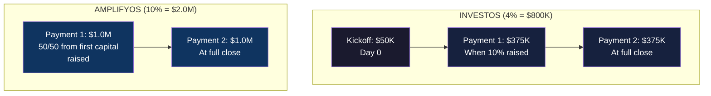
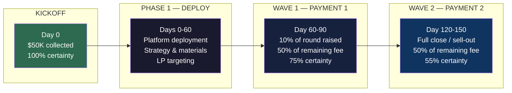
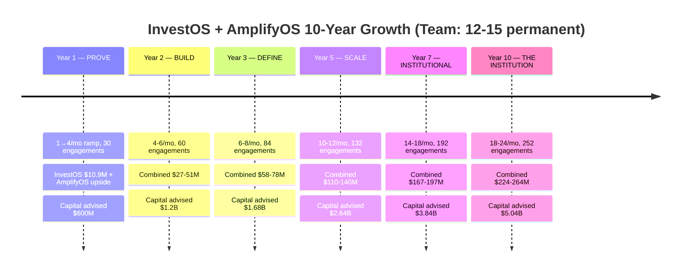
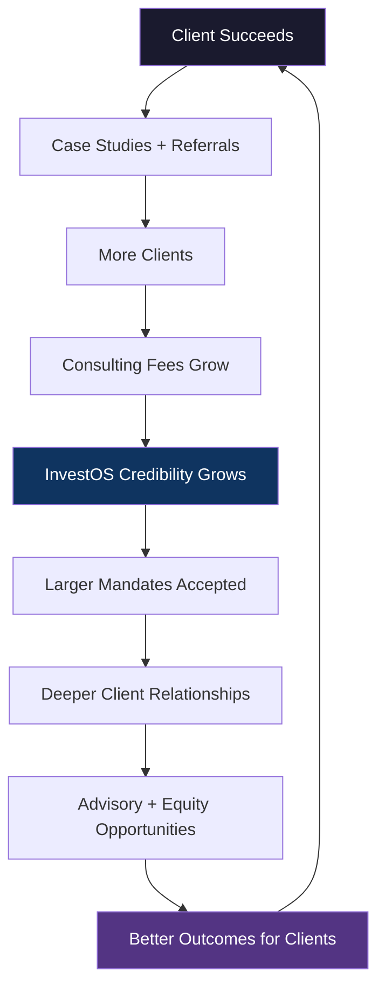

# InvestOS: The Strategic Capital Advisory Platform

**The AI-Native Capital Formation Firm That Builds Wealth While Building Raises**

---

## The Thesis

There are 15,000-25,000 organizations in the United States actively raising $10M or more at any given time — private equity firms, family offices, independent sponsors, real estate operators, and growth companies. They are raising between $530 billion and $1.4 trillion annually.

Most of them are failing.

Capital concentration has reached historic levels. In 2025, the top 10 private equity funds captured 45.7% of all U.S. fundraising — up from 34.5% just one year prior. Funds raising less than $500 million now account for only 13% of total capital raised, down from 17% five years ago. The average time to close a venture fund has stretched to a record 17.5 months. Emerging managers — the firms launching Fund I, Fund II, Fund III — captured just 12.4% of capital raised in 2025.

These firms are not failing because their strategies are bad. They are failing because they are bringing a spreadsheet to a gunfight.

The institutional capital formation ecosystem is fragmented across a half-dozen vendors and advisors, each taking their cut, none owning the outcome. A typical emerging manager raising $50M must assemble:

- A placement agent ($75K-$2.5M+, introductions only)
- A fund formation attorney ($150K-$500K)
- Fund administration software ($18K-$250K/year)
- A data room provider ($5K-$20K/year)
- A financial modeler (consultant, $50K-$150K)
- An investor relations platform ($10K-$50K/year)
- A compliance consultant ($50K-$200K/year)

Total cost: $500K-$1.5M before a single dollar is raised. And no one in that stack is accountable for whether the raise actually closes.

**InvestOS replaces the entire stack.** One team. One AI-powered platform. One fee. And we don't get paid in full until the capital flows.

---

## The Market

### The Capital Formation Universe

| Segment | Organizations | Annual Capital Activity | Avg. Raise Size |
|---------|--------------|----------------------|-----------------|
| Emerging PE managers (Fund I-III, sub-$500M) | 2,000-4,000 | $100B-$200B | $50M-$300M |
| Mid-market PE ($500M-$2B funds) | 500-1,000 | $250B-$500B | $500M-$2B |
| Independent / fundless sponsors | 1,200-1,600 | $15B-$50B | $10M-$75M per deal |
| Family offices (raising or co-investing) | 3,000-5,000 | $50B-$200B | $10M-$500M |
| Real estate sponsors & syndicators | 5,000-10,000 | $50B-$200B | $10M-$500M |
| RIAs allocating to alternatives | 5,000-8,000 | $50B-$200B | $10M-$100M |
| First-time fund managers (annual) | 250-500/yr | $15B-$40B | $50M-$200M |

**Total addressable universe: 15,000-25,000 organizations raising $530B-$1.4T annually.**

### The Fee Pool We're Entering

| Service | Annual Fees (Estimated) |
|---------|----------------------|
| Placement agent fees | $3.5B-$7B |
| Fund formation legal | $2B-$4B |
| Fund admin + technology | $1.5B-$3B |
| Capital markets consulting | $500M-$1B |
| **Total** | **$7.5B-$15B** |

InvestOS does not compete for a slice of this pool. InvestOS replaces the pool.

### Why Now

1. **Capital concentration is creating desperation.** When the top 10 funds eat half the capital, emerging managers will pay for a strategic partner who can help them win.
2. **Fundraising timelines at record 17.5 months.** A platform that compresses this to 90 days is worth multiples of its fee.
3. **AI changes the cost structure of advisory.** Traditional placement agents need 3-5 senior professionals per mandate. InvestOS's AI platform handles document generation, financial modeling, compliance, LP intelligence, and reporting — a team of 12-15 runs what would require 100+ at a traditional firm.
4. **The distribution drought is reshuffling LP relationships.** GPs must win new LP relationships. InvestOS's intelligence layer becomes a critical weapon.
5. **Regulatory burden increasing.** Smaller firms lack infrastructure. InvestOS builds compliance into the platform.
6. **Retail capital flooding alternatives.** $204B flowed from retail investors into alternative structures in 2025. New channels opening.

---

## The Business Model

### What InvestOS Delivers

| Capability | What It Replaces | How We Deliver |
|-----------|-----------------|----------------|
| **Raise Strategy** | Capital markets consultant ($200K-$500K) | AI-driven market intelligence + strategic advisory |
| **LP Targeting & Introductions** | Placement agent ($75K-$2.5M+) | Proprietary LP database + AI matching + advisor relationships |
| **Financial Modeling** | Financial consultant ($50K-$150K) | AI-powered modeling engine |
| **Legal Documents** | Fund formation attorney ($150K-$500K) | AI document generation (PPM, LPA, sub docs) |
| **Investor Portal & Data Room** | Software platform ($18K-$250K/yr) | Built into InvestOS platform |
| **Compliance & Regulatory** | Compliance consultant ($50K-$200K/yr) | Automated compliance workflows |
| **Investor Communications** | IR consultant ($100K-$200K/yr) | AI-powered updates, reports, campaigns |
| **Closing & Fund Operations** | Fund administrator ($50K-$200K/yr) | Integrated closing workflow |

**One team. Two independent products. Each sold separately. Each proving itself.**

InvestOS is a consulting-first firm. We earn fees for the work we do. Each product exists independently — clients can engage one or both depending on their needs. Equity relationships may evolve naturally with select clients post-raise, but they are not part of the standard engagement and are discussed privately on a case-by-case basis.

---

### Product 1: InvestOS — Platform, Strategy & Materials

**What it delivers:** Institutional-grade raise infrastructure — strategy, financial models, data room, investor portal, PPM/offering documents, compliance, LP targeting, and investor reporting.

**Fee: 3% - 5% of total raise**, depending on complexity and scope.

| Component | Detail |
|-----------|--------|
| **Kickoff fee** | $50K — paid at engagement signing. Always. Non-refundable. |
| **Minimum project** | $250K total fee (kickoff + remaining balance) |
| **Fee range** | 3% - 5% of raise, scaling with complexity |
| **Payment 1** | 50% of remaining fee (after kickoff) — paid when first 10% of round is closed |
| **Payment 2** | 50% of remaining fee — paid at full close / sell-out |

**InvestOS Fee by Raise Size:**

| Raise Size | Fee at 3% | Fee at 5% | Kickoff | Payment 1 | Payment 2 |
|-----------|-----------|-----------|---------|-----------|-----------|
| **$5M** | $250K (min) | $250K (min) | $50K | $100K | $100K |
| **$10M** | $300K | $500K | $50K | $125K-$225K | $125K-$225K |
| **$20M** | $600K | $1.0M | $50K | $275K-$475K | $275K-$475K |
| **$50M** | $1.5M | $2.5M | $50K | $725K-$1.225M | $725K-$1.225M |
| **$100M** | $3.0M | $5.0M | $50K | $1.475M-$2.475M | $1.475M-$2.475M |

---

### Product 2: AmplifyOS (Beta) — Marketing, Outreach & Closing

**What it delivers:** Active investor marketing — digital campaigns, LP outreach, roadshow support, investor communications, meeting coordination, and closing support.

**Status:** Beta — offered to select clients on a per-engagement basis.

**Fee: 8% - 12% of total raise**, strategically negotiated based on scope of marketing and outreach.

| Component | Detail |
|-----------|--------|
| **Fee range** | 8% - 12% of raise, negotiated per engagement |
| **Payment 1** | 50% of total marketing fee — paid 50/50 from first capital raised (half from raise proceeds, half from client) |
| **Payment 2** | Remaining 50% of marketing fee — paid at full close / sell-out |

**AmplifyOS Fee by Raise Size:**

| Raise Size | Fee at 8% | Fee at 12% | Payment 1 (50%) | Payment 2 (50%) |
|-----------|-----------|------------|-----------------|-----------------|
| **$5M** | $400K | $600K | $200K-$300K | $200K-$300K |
| **$10M** | $800K | $1.2M | $400K-$600K | $400K-$600K |
| **$20M** | $1.6M | $2.4M | $800K-$1.2M | $800K-$1.2M |
| **$50M** | $4.0M | $6.0M | $2.0M-$3.0M | $2.0M-$3.0M |
| **$100M** | $8.0M | $12.0M | $4.0M-$6.0M | $4.0M-$6.0M |

---

### Combined: InvestOS + AmplifyOS

When a client engages both products, total fees range from **11% - 17%** of the raise. Each product is contracted and invoiced independently.

| Raise Size | InvestOS (3-5%) | AmplifyOS (8-12%) | Combined | Effective Rate |
|-----------|----------------|-------------------|----------|---------------|
| **$10M** | $300K-$500K | $800K-$1.2M | $1.1M-$1.7M | 11-17% |
| **$20M** | $600K-$1.0M | $1.6M-$2.4M | $2.2M-$3.4M | 11-17% |
| **$50M** | $1.5M-$2.5M | $4.0M-$6.0M | $5.5M-$8.5M | 11-17% |

---

### The Math on a Single Engagement ($20M Raise, Both Products)

**Total collected on $20M raise (both products): $2.8M**

### Revenue Per Engagement — InvestOS Only ($20M Raise at 4%)

| Step | Event | Amount | Running Total |
|------|-------|--------|--------------|
| Kickoff | Day 0 — Engagement signed | $50K | $50K |
| Payment 1 | ~Day 90 — 10% raised ($2M) | $375K | $425K |
| Payment 2 | ~Day 150 — Sell-out ($20M) | $375K | **$800K** |

---

## How Revenue Flows: The Fee Waterfall

Revenue flows independently for each product. InvestOS has three collection points (kickoff + two milestone payments). AmplifyOS has two.

### InvestOS Revenue Waves

**The InvestOS speed advantage:** Traditional fundraising takes 17.5 months. We deploy in 30-60 days, hit 10% raised in 30 days, and target sell-out in 90 days. A complete engagement cycle — signing to close — in 120-150 days. This is the AI advantage.

### Revenue from a Single $20M Engagement — InvestOS Only (4% = $800K)

| Month | Event | Cash Collected |
|-------|-------|---------------|
| 0 | Engagement signed → **Kickoff** | **$50K** |
| 1-2 | Full deployment (platform, strategy, materials) | $0 |
| 3 | 10% raised ($2M) → **Payment 1** | **$375K** |
| 5 | Full close / sell-out ($20M) → **Payment 2** | **$375K** |
| **Total** | **Signing to full collection: ~5 months** | **$800K** |

### Revenue from a Single $20M Engagement — Both Products (InvestOS 4% + AmplifyOS 10%)

| Month | Event | InvestOS | AmplifyOS | Total |
|-------|-------|----------|-----------|-------|
| 0 | Kickoff | $50K | $0 | $50K |
| 1-2 | Deploy | $0 | $0 | $0 |
| 3 | 10% raised | $375K | $1.0M | $1.375M |
| 5 | Full close | $375K | $1.0M | $1.375M |
| **Total** | | **$800K** | **$2.0M** | **$2.8M** |

### Revenue from 30 Year 1 Engagements — Full Waterfall

Here is exactly how revenue flows from the 30 engagements signed in Year 1:

**Engagement signing schedule:**

| Month | New | Cumulative |
|-------|-----|-----------|
| 1 | 1 | 1 |
| 2 | 1 | 2 |
| 3 | 1 | 3 |
| 4 | 2 | 5 |
| 5 | 2 | 7 |
| 6 | 2 | 9 |
| 7 | 3 | 12 |
| 8 | 3 | 15 |
| 9 | 3 | 18 |
| 10 | 4 | 22 |
| 11 | 4 | 26 |
| 12 | 4 | 30 |

*All projections below use InvestOS at 4% average fee ($800K on a $20M raise). Kickoff = $50K, Payment 1 = $375K, Payment 2 = $375K. AmplifyOS revenue shown separately as upside.*

**Kickoff collections (100% of engagements, collected at signing):**

30 engagements × $50K = **$1.5M** (collected throughout Year 1 as engagements sign)

**Payment 1 collections (75% of engagements hit 10% raised, ~3 months after signing):**

| Engagement Month | # Signed | Payment 1 Arrives | # Collecting (75%) | Revenue |
|-----------------|----------|-------------------|--------------------|---------|
| Month 1 | 1 | Month 3 | 1 | $375K |
| Month 2 | 1 | Month 4 | 1 | $375K |
| Month 3 | 1 | Month 5 | 1 | $375K |
| Month 4 | 2 | Month 6 | 1-2 | $375K-$750K |
| Month 5 | 2 | Month 7 | 1-2 | $375K-$750K |
| Month 6 | 2 | Month 8 | 1-2 | $375K-$750K |
| Month 7 | 3 | Month 9 | 2-3 | $750K-$1.125M |
| Month 8 | 3 | Month 10 | 2-3 | $750K-$1.125M |
| Month 9 | 3 | Month 11 | 2-3 | $750K-$1.125M |
| Month 10 | 4 | Month 12 | 3-4 | $1.125M-$1.5M |
| Month 11-12 | 8 | Month 13-14 | — | Collected in Year 2 |
| **YEAR 1 PAYMENT 1 TOTAL** | | | **16-22** | **$6M-$8.25M** |

**Payment 2 collections (55% close rate, ~5 months after signing with 90-day sell-out):**

With the 90-day sell-out target, rounds close ~5 months after signing (60-day deploy + 90-day raise). This means Month 1-7 engagements can close within Year 1:

| Engagement Month | # Signed | Close Arrives | Closes (55%) | Revenue |
|-----------------|----------|---------------|-------------|---------|
| Month 1 | 1 | Month 6 | 1 | $375K |
| Month 2 | 1 | Month 7 | 1 | $375K |
| Month 3 | 1 | Month 8 | 0-1 | $0-$375K |
| Month 4 | 2 | Month 9 | 1 | $375K |
| Month 5 | 2 | Month 10 | 1 | $375K |
| Month 6 | 2 | Month 11 | 1 | $375K |
| Month 7 | 3 | Month 12 | 1-2 | $375K-$750K |
| **YEAR 1 PAYMENT 2 TOTAL** | | | **6-8** | **$2.25M-$3.0M** |

### Year 1 Revenue Summary — InvestOS Only

| Revenue Stream | Amount | Timing |
|---------------|--------|--------|
| Kickoff fees (30 engagements × $50K) | $1.5M | Throughout Year 1 |
| Payment 1 collections (16-22 engagements) | $6.0M-$8.25M | Months 3-12 |
| Payment 2 collections (6-8 closes) | $2.25M-$3.0M | Months 6-12 |
| **Total Year 1 InvestOS Revenue** | **$9.75M-$12.75M** |  |

### Year 1 Revenue Summary — With AmplifyOS Upside

If 30-50% of InvestOS clients also engage AmplifyOS (10% avg on $20M = $2.0M per engagement):

| Revenue Stream | Amount |
|---------------|--------|
| InvestOS revenue (above) | $9.75M-$12.75M |
| AmplifyOS revenue (9-15 engagements, partial collections in Year 1) | $5M-$10M |
| **Total Year 1 Combined Revenue** | **$14.75M-$22.75M** |

**The InvestOS model alone generates ~$10-13M in Year 1. AmplifyOS is pure upside.**

The 90-day sell-out target transforms the model. Speed is the multiplier.

---

## The AI-Powered Operating Model

### The Philosophy

Traditional advisory firms scale by hiring. InvestOS scales by building systems.

Every function that a traditional capital advisory firm staffs with 5-15 people, InvestOS automates with AI and runs with 1-2 people overseeing the systems.

### The Team: 12-15 People (Permanent)

This is not a "Year 1 team that grows to 300." This is the team. Period. AI and systems handle the rest.

| Role | Count | What They Do | What AI Does |
|------|-------|-------------|-------------|
| **Founders / Partners** | 2-3 | Client relationships, strategic advisory, closing | AI prepares all materials, models, and LP targeting. Humans provide judgment and trust. |
| **Capital Advisors** | 3-4 | Manage client engagements, LP outreach, raise execution | AI handles modeling, documents, compliance, communications, data rooms. Advisors focus on relationships and strategy. |
| **Platform Engineers** | 3-4 | Build and maintain the AI systems, platform, automation | The core investment. These people ARE the competitive moat. |
| **Operations / Compliance** | 2-3 | Fund ops, regulatory, admin | AI handles reporting, compliance checks, document tracking. Humans handle judgment calls and regulatory relationships. |
| **Marketing / Content** | 1-2 | Thought leadership, events, pipeline generation | AI generates content drafts, manages campaigns, handles SEO. Humans provide voice and presence. |

**Total: 12-15 people**

### What AI Automates

| Function | Traditional Firm (People Needed) | InvestOS (AI-Powered) |
|----------|------|------|
| Financial modeling | 2-3 analysts | AI generates models. Human reviews. |
| Document generation (PPM, LPA, sub docs) | 3-5 paralegals/associates | AI drafts all documents. Counsel reviews. |
| Investor portal & data room | 2-3 engineers + support | Automated deployment per engagement. |
| LP targeting & research | 2-4 research analysts | AI database + matching algorithm. |
| Investor communications | 2-3 IR professionals | AI drafts updates, reports, campaigns. |
| Compliance monitoring | 1-2 compliance officers | Automated compliance workflows. |
| Reporting & analytics | 2-3 analysts | Real-time dashboards, auto-generated reports. |
| **Total replaced** | **17-23 people** | **Systems + oversight by 2-3 people** |

### Capacity Model

With AI handling the operational load, each advisor can manage significantly more concurrent engagements than the traditional 3-5:

| Role | Concurrent Engagements | Annual Throughput |
|------|----------------------|-------------------|
| Partner / Founder | 10-15 active | 20-30/year |
| Capital Advisor | 8-12 active | 15-25/year |
| **Team of 5-7 advisors** | **40-75 active** | **80-150/year** |

This means the 12-15 person team can handle:
- **Year 1:** 30 engagements (well within capacity as team ramps)
- **Year 3:** 84 engagements (advisors at moderate utilization)
- **Year 5:** 132 engagements (advisors at high utilization, AI at full leverage)
- **Year 7+:** 192+ engagements (may add 2-3 advisors if needed, staying under 18 total)

### Operating Economics

| Category | Annual Cost | Notes |
|----------|-----------|-------|
| Team compensation (12-15 people) | $2.5M-$4.0M | Competitive salaries + performance bonuses |
| AI/Cloud infrastructure | $200K-$400K | Platform hosting, AI API costs, tooling |
| Legal / regulatory | $100K-$200K | Ongoing compliance, counsel |
| Marketing / events | $100K-$200K | Conferences, content, advertising |
| Office / operations / insurance | $100K-$200K | Lean operations |
| **Total annual operating cost** | **$3.0M-$5.0M** | **Fixed regardless of engagement volume** |

**The critical insight: operating costs are essentially fixed at $3-5M/year. Revenue scales with engagements. Margin expands dramatically as volume grows.**

---

## The Model: Years 1-10

### All Projections Based On:
- **$20M average raise size** (constant — we serve the same segment consistently)
- **12-15 person team** (permanent — AI scales, not headcount)
- **InvestOS at 4% average fee** ($800K per engagement, 100% cash)
- **$50K kickoff per engagement** (collected at signing)
- **55% close rate** across all engagements
- **75% of engagements reach Payment 1 milestone** (10% of raise closed)
- **AmplifyOS shown as upside** (beta, not included in base projections)

### Per-Engagement Economics — InvestOS Only ($20M Raise at 4%)

| Item | Value |
|------|-------|
| InvestOS fee (4%) | $800K |
| Kickoff (at signing) | $50K |
| Payment 1 (at 10% raised) | $375K |
| Payment 2 (at close) | $375K |
| **Expected cash per engagement** | **$535K** |

*Expected cash = $50K kickoff + (75% × $375K Payment 1) + (55% × $375K Payment 2) = $50K + $281K + $206K = $537K.*

### Per-Engagement Economics — Both Products ($20M Raise, InvestOS 4% + AmplifyOS 10%)

| Item | Value |
|------|-------|
| InvestOS fee | $800K |
| AmplifyOS fee | $2.0M |
| Combined fee | $2.8M |
| **Expected cash per engagement** | **$1.8M** |

*When both products are engaged, the economics are significantly stronger. AmplifyOS is the margin multiplier — but it must be earned, not assumed.*

---

### Year 1: Prove the Model

**Ramp: 1/month → 4/month. 30 engagements signed.**

| Month | New | Cumulative | Active Raises | Key Event |
|-------|-----|-----------|---------------|-----------|
| 1 | 1 | 1 | 1 | First engagement signed |
| 2 | 1 | 2 | 2 | First platform deployed (30-60 day cycle) |
| 3 | 1 | 3 | 3 | **First Payment 1 collected ($500K). Model validated.** |
| 4 | 2 | 5 | 5 | Content + LinkedIn outreach scaling |
| 5 | 2 | 7 | 7 | Multiple Payment 1s flowing |
| 6 | 2 | 9 | 8 | **First full close / sell-out. First case study.** |
| 7 | 3 | 12 | 10 | Referrals starting. Multiple Payment 2s flowing. |
| 8 | 3 | 15 | 12 | Multiple closes per month |
| 9 | 3 | 18 | 14 | Pipeline self-sustaining |
| 10 | 4 | 22 | 16 | **4/month run rate achieved** |
| 11 | 4 | 26 | 18 | Revenue compounding across both waves |
| 12 | 4 | 30 | 20 | Year 1 complete. Model proven at speed. |

| Metric | Value |
|--------|-------|
| Engagements signed | 30 |
| Capital under advisory | $600M |
| InvestOS fee committed (4% avg) | $24M |
| Kickoffs collected (30 × $50K) | **$1.5M** |
| Payment 1s collected (~18 × $375K) | **$6.75M** |
| Payment 2s collected (~7 closes × $375K) | **$2.625M** |
| **Year 1 InvestOS revenue** | **$10.9M** |
| AmplifyOS upside (if 30-50% also engage) | $5M-$10M |
| **Year 1 combined revenue** | **$10.9M-$20.9M** |
| Operating costs | $3.0M-$5.0M |
| **Year 1 operating profit (InvestOS only)** | **$5.9M-$7.9M** |
| **Operating margin** | **54-72%** |

---

### Year 2: Build the Engine

**Run rate: 4-6/month. 60 new engagements. Full flywheel spinning.**

With the 90-day sell-out cycle, Year 2 engagements close within the same year. Both revenue waves flow concurrently.

| Metric | Value |
|--------|-------|
| New engagements | 60 |
| Capital under advisory (Year 2 new) | $1.2B |
| InvestOS fee committed (Year 2) | $48M |
| Kickoffs (60 × $50K) | **$3.0M** |
| Payment 1s collected (Year 2 + remaining Year 1) | **$15.0M** |
| Payment 2s collected (~25 closes × $375K) | **$9.375M** |
| **Year 2 InvestOS revenue** | **$27.4M** |
| AmplifyOS upside | $12M-$24M |
| **Year 2 combined revenue** | **$27.4M-$51.4M** |
| Operating costs | $3.5M-$5.0M |
| **Year 2 operating profit (InvestOS only)** | **$22.4M-$23.9M** |
| **Operating margin** | **82-87%** |

**What happens in Year 2:** The 90-day sell-out cycle means Year 2 engagements close within Year 2. Both waves flow simultaneously. The model compounds because there's no 12-18 month lag. Plus, AmplifyOS beta graduates to a proven offering — more clients engage both products.

---

### Year 3: Category Definition

**Run rate: 6-8/month. 84 new engagements. Brand established.**

| Metric | Value |
|--------|-------|
| New engagements | 84 |
| Capital under advisory (Year 3 new) | $1.68B |
| Cumulative capital under advisory | $3.48B |
| **Year 3 InvestOS revenue** | **$38.0M** |
| AmplifyOS revenue (maturing, 40-60% attach) | $20M-$40M |
| **Year 3 combined revenue** | **$58.0M-$78.0M** |
| Operating costs | $4.0M-$5.0M |
| **Year 3 operating profit (combined)** | **$53.0M-$74.0M** |
| **Operating margin** | **91-95%** |

---

### Year 5: Scale

**Run rate: 10-12/month. 132 new engagements. Institutional mandates beginning.**

| Metric | Value |
|--------|-------|
| New engagements | 132 |
| Capital under advisory (Year 5 new) | $2.64B |
| Cumulative capital under advisory | $8.4B |
| **Year 5 InvestOS revenue** | **$60.0M** |
| AmplifyOS revenue (proven, 50-70% attach) | $50M-$80M |
| **Year 5 combined revenue** | **$110.0M-$140.0M** |
| Operating costs | $4.5M-$5.5M |
| **Year 5 operating profit (combined)** | **$104.5M-$135.5M** |
| **Operating margin** | **95-97%** |

---

### Year 7: Institutional

**Run rate: 14-18/month. 192 new engagements. International expansion.**

| Metric | Value |
|--------|-------|
| New engagements | 192 |
| Capital under advisory (Year 7 new) | $3.84B |
| Cumulative capital under advisory | $16.0B |
| **Year 7 InvestOS revenue** | **$87.0M** |
| AmplifyOS revenue (60-70% attach) | $80M-$110M |
| **Year 7 combined revenue** | **$167.0M-$197.0M** |
| Operating costs | $5.0M-$6.0M |
| **Year 7 operating profit (combined)** | **$161.0M-$192.0M** |
| **Operating margin** | **96-97%** |

---

### Year 10: The Institution

**Run rate: 18-24/month. 252 new engagements. Category leader.**

| Metric | Value |
|--------|-------|
| New engagements | 252 |
| Capital under advisory (Year 10 new) | $5.04B |
| Cumulative capital under advisory | $28B+ |
| **Year 10 InvestOS revenue** | **$114.0M** |
| AmplifyOS revenue (65-75% attach) | $110M-$150M |
| **Year 10 combined revenue** | **$224.0M-$264.0M** |
| Operating costs | $5.5M-$7.0M |
| **Year 10 operating profit (combined)** | **$217.0M-$259.0M** |
| **Operating margin** | **97-98%** |

---

## The 10-Year Summary

### Cumulative 10-Year Impact

| Metric | 10-Year Total |
|--------|--------------|
| Total engagements signed | ~1,200 |
| Total capital raised for clients | $28B+ |
| InvestOS revenue (base) | **$500M+** |
| AmplifyOS revenue (as it matures) | **$400M-$700M** |
| **Total combined revenue** | **$900M-$1.2B** |

---

## Market Share

### By Capital Flow

Annual capital raised by $10M-$500M managers: ~$80B-$250B.

| Year | Capital via InvestOS (at 55% close) | Market Share |
|------|-------------------------------------|-------------|
| Year 1 | $330M | 0.1-0.4% |
| Year 3 | $924M | 0.4-1.2% |
| Year 5 | $1.45B | 0.6-1.8% |
| Year 7 | $2.11B | 0.8-2.6% |
| Year 10 | $2.77B | 1.1-3.5% |

### By Fee Pool

Total capital formation fee pool: ~$3B-$6B annually.

| Year | Revenue (InvestOS + AmplifyOS) | Fee Pool Share |
|------|---------|---------------|
| Year 1 | $10.9M (base) — $20.9M (combined) | 0.2-0.7% |
| Year 3 | $58M-$78M | 1.0-2.6% |
| Year 5 | $110M-$140M | 1.8-4.7% |
| Year 7 | $167M-$197M | 2.8-6.6% |
| Year 10 | $224M-$264M | 3.7-8.8% |

### Capture Rate

| Year | Addressable Orgs | New Engagements | Capture Rate |
|------|-----------------|----------------|-------------|
| Year 1 | 15,000-25,000 | 30 | 0.12-0.20% |
| Year 3 | 15,000-25,000 | 84 | 0.34-0.56% |
| Year 5 | 15,000-25,000 | 132 | 0.53-0.88% |
| Year 7 | 18,000-28,000 | 192 | 0.69-1.07% |
| Year 10 | 20,000-30,000 | 252 | 0.84-1.26% |

**InvestOS never needs more than 1.3% annual capture rate to reach $178M in revenue.** The market is enormous and deeply underserved.

---

## Enterprise Value

| Year | Combined Revenue | Consulting Value (5-10x) | **Enterprise Value** |
|------|-------------|------------------------|---------------------|
| Year 1 | $10.9M (InvestOS base) | $55M-$109M | **$55M-$109M** |
| Year 3 | $68M (midpoint) | $340M-$680M | **$340M-$680M** |
| Year 5 | $125M (midpoint) | $625M-$1.25B | **$625M-$1.25B** |
| Year 7 | $182M (midpoint) | $910M-$1.82B | **$910M-$1.82B** |
| Year 10 | $244M (midpoint) | $1.22B-$2.44B | **$1.22B-$2.44B** |

---

## The Flywheel

Every closed raise creates:
- **2-3 referrals** from the satisfied GP
- **LP relationships** that can be leveraged for future clients
- **Market intelligence** that makes the next raise smarter
- **A case study** that builds brand credibility
- **A deeper relationship** that may evolve into advisory or equity partnerships

By Year 3, referrals should drive 40%+ of new engagements.

### The Data Moat

Over time, InvestOS accumulates the richest capital formation dataset in the market:

| Data Asset | Value |
|-----------|-------|
| LP allocation behavior | Predictive LP targeting |
| Terms and structures across hundreds of raises | Benchmarking for new clients |
| Close rates by strategy, size, geography | Engagement qualification |
| Time-to-close patterns | Process optimization |
| Investor communication effectiveness | AI-optimized messaging |

No placement agent, no software platform, and no consultant has this dataset. It grows with every engagement.

---

## Why This Works

1. **AI is the margin.** A 12-15 person team doing what requires 100+ at a traditional firm. Operating costs stay flat at $3-5M while combined revenue scales to $224-264M. By Year 3, margins exceed 91%.

2. **Zero upfront cost opens the entire market.** The #1 reason emerging managers don't hire advisors is cash. InvestOS removes this entirely. First payment only when capital flows.

3. **Pure consulting is clean and scalable.** No complex equity structures, no buyout negotiations, no portfolio management overhead. Cash in, value out. Every engagement is a clean transaction that builds toward deeper relationships.

4. **The data moat deepens with every deal.** LP behavior, terms, close rates, investor sentiment — every raise adds intelligence that makes the next raise better. No competitor can replicate this without doing the work.

5. **The flywheel is self-reinforcing.** Closes → referrals → more clients → more data → better outcomes → more closes. By Year 3: 40%+ organic acquisition.

6. **Consulting opens the door to advisory.** Successful engagements build trust. Trust opens conversations about deeper relationships — advisory roles, equity participation, co-investment. These evolve naturally with the right clients, not as a default term.

7. **The team is built.** Capital markets expertise + AI engineering + operational discipline. InvestOS has all three.

---

## Regulatory Note

The fee structure (success-based consulting fees) requires careful legal structuring. Specific areas requiring securities counsel before first engagement:

1. **Broker-dealer registration** — Success fees tied to capital raised may trigger BD requirements
2. **RIA considerations** — Strategic advisory component may require RIA registration
3. **Consulting agreement structure** — Ensure fee structure is properly documented as consulting, not placement

**Recommended firms:** Proskauer Rose, Kirkland & Ellis, Ropes & Gray, Seward & Kissel

All legal and regulatory decisions will be made with counsel.

---

## Next Steps

1. **Engage securities counsel** to structure the model properly
2. **Sign first 3-5 engagements** from warm network (pilot terms)
3. **Build the AI platform** — data rooms, modeling engine, document generation, investor portal
4. **Develop client pitch materials** — the zero-upfront-cost story
5. **Establish channel partnerships** — fund admins, PE law firms, industry associations

---

*Prepared by Quinn (QIE) for Light-Brands strategic planning. Market data sourced from McKinsey, Preqin, PitchBook, Bain, PwC, Deloitte, Cambridge Associates, SEC (2025-2026). Projections are modeled estimates based on market data and industry benchmarks. All legal and regulatory structures require counsel review before implementation.*
