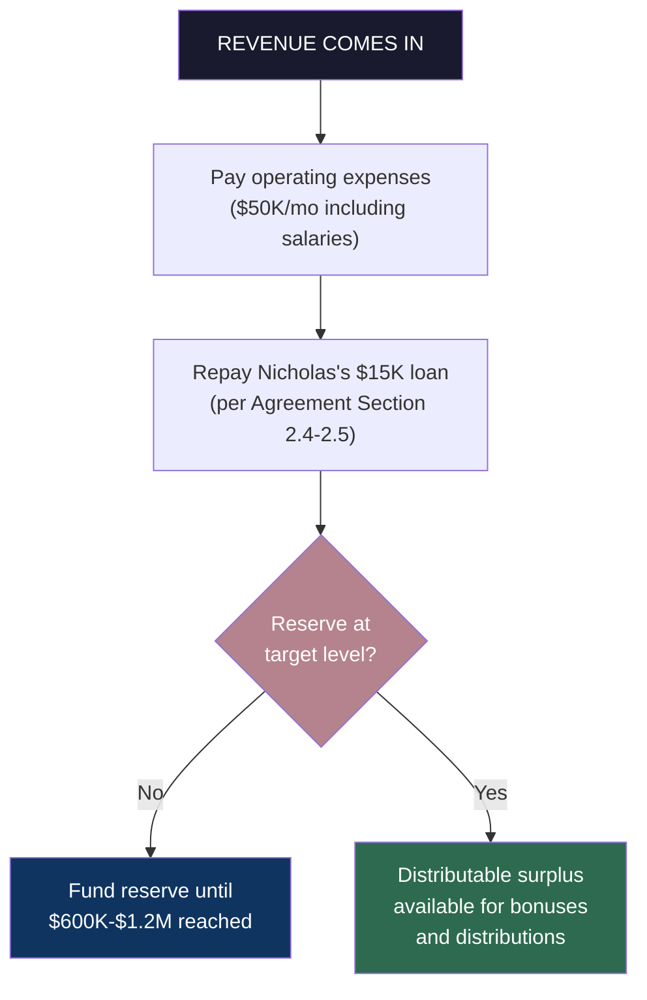
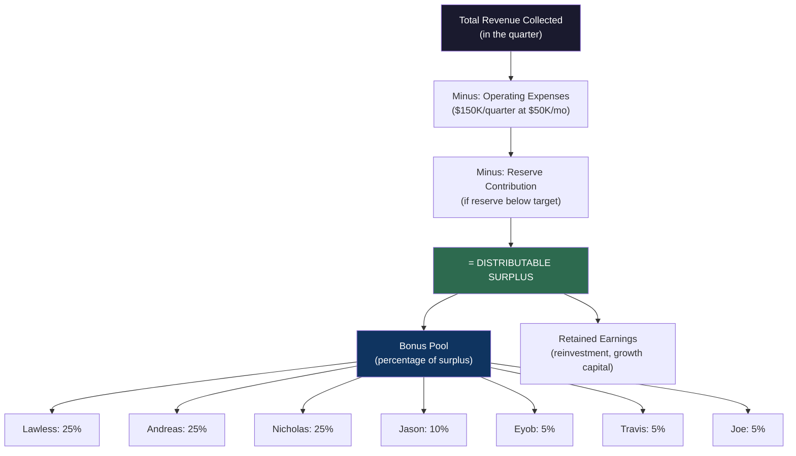
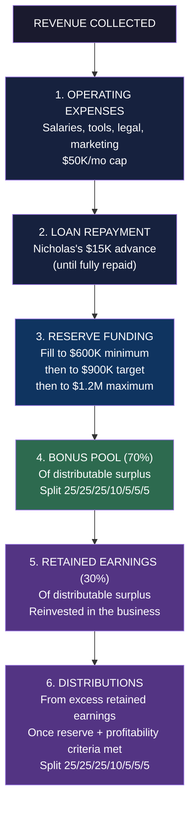

# Light Brands Consulting: Operations Manual

**How the Money Moves, How We Stay Protected, How Partners Get Paid**

---

## Purpose

This document governs the internal financial operations of Light Brands Consulting. It sits between the Executive Partner Agreement (LBC-EPA-2026-001), which establishes ownership and legal rights, and the InvestOS Strategic Model, which projects external revenue. This document answers the operational question: *when revenue comes in, what happens next?*

---

## Part 1: The Operating Philosophy

### AI-First, Lean-Always

Light Brands runs on a simple principle: **maximum leverage through AI, minimum overhead through discipline.**

We do not scale by hiring. We scale by building systems. Every dollar spent on headcount that AI can handle instead is a dollar wasted. Every tool that eliminates a manual process is an investment in the business.

This is not a temporary posture while we're small. This is the permanent operating model. The InvestOS strategic model projects a 12-15 person team doing the work of 100+. In the early phase, it's even leaner — the founding partners plus AI handle everything.

### The $50K/Month Discipline

Total monthly operating spend is capped at **$50,000**. This includes everything:

| Category | Monthly Budget | Notes |
|----------|---------------|-------|
| **Partner base salaries** | $28K-$46K | 7 partners at $4K-$8K each (see Part 3) |
| **AI tools & infrastructure** | $1K | Claude, APIs, hosting, platform costs |
| **Legal & compliance** | $2K-$5K | Ongoing counsel, filings, regulatory |
| **Marketing & content** | $2K-$5K | Ads, conferences, content production |
| **Operations & admin** | $2K-$5K | Banking, insurance, accounting, misc |
| **Buffer** | $2K-$5K | Unplanned expenses |
| **Total** | **$50,000/mo max** | |

This cap is reviewed quarterly. It can only be adjusted by partner consensus. The goal is to stay at or below this number for as long as possible — ideally through Year 1 and beyond.

---

## Part 2: The Reserve — Our Security Blanket

### The Non-Negotiable

Before any distributions, before any bonuses, before anything beyond base salaries and operating costs, the business banks a **cash reserve of $600,000 to $1,200,000**.

This is the security blanket. It means the business can survive **12 to 24 months** at $50K/month with zero revenue. No panic. No desperation. No taking bad deals because the lights need to stay on.

### Reserve Mechanics

### Reserve Targets

| Level | Amount | Runway | Status |
|-------|--------|--------|--------|
| **Minimum reserve** | $600,000 | 12 months at $50K/mo | Must be reached before ANY distributions |
| **Target reserve** | $900,000 | 18 months at $50K/mo | Comfortable operating zone |
| **Maximum reserve** | $1,200,000 | 24 months at $50K/mo | Full protection — surplus above this is distributable |

### Reserve Rules

1. **No distributions until minimum reserve ($600K) is funded.** No exceptions. No advances against future revenue.
2. **Revenue above operating costs flows to reserve first.** Until the minimum is hit, every excess dollar goes to the reserve account.
3. **If the reserve drops below $600K** (due to a bad quarter or unexpected expense), distributions pause until it's replenished.
4. **The reserve sits in a separate account.** Not commingled with operating funds. Visible to all partners at all times.
5. **Reserve funds are not investable.** This is cash. Not crypto. Not securities. Not "high-yield" anything. It sits in a federally insured account earning whatever the bank pays. Safety over return.

### How Fast Does the Reserve Fill?

Based on the InvestOS strategic model, the first Payment 1 ($500K) arrives around Month 3. Here's a realistic reserve funding timeline:

| Month | Revenue Event | Operating Cost | Net to Reserve | Cumulative Reserve |
|-------|--------------|----------------|----------------|-------------------|
| 1 | $0 (deployment phase) | $50K | -$50K | -$50K (from seed capital) |
| 2 | $0 (deployment phase) | $50K | -$50K | -$100K |
| 3 | $500K (first Payment 1) | $50K | +$450K | $350K |
| 4 | $500K (second Payment 1) | $50K | +$450K | $800K |
| 5 | $500K (third Payment 1) | $50K | +$450K | **$1,250K** |

**The reserve could be fully funded by Month 5** if engagements track to the model. Even at half pace, the minimum $600K reserve is hit within 6-8 months. The seed capital ($100K from ADMS + operating revenue) bridges the gap until revenue flows.

---

## Part 3: Partner Compensation

### Base Salary

Every active partner receives a base salary. This is modest by design — the base keeps the lights on personally. The real income comes from the bonus structure.

| Partner | Role | Equity | Monthly Base | Annual Base |
|---------|------|--------|-------------|-------------|
| Daniel Lawless | Founder / Strategic Lead | 25% | $6K-$8K | $72K-$96K |
| Andreas Demou (Manoracle Studio) | Founder / Technical Lead | 25% | $6K-$8K | $72K-$96K |
| Nicholas Courchesne | Founder / Operations & Partnerships | 25% | $6K-$8K | $72K-$96K |
| Jason Sparks (ADMS LLC) | Partner / Capital & Advisory | 10% | $4K-$6K | $48K-$72K |
| Eyob Mebrahtu | Partner | 5% | $4K-$6K | $48K-$72K |
| Travis Dahm | Partner | 5% | $4K-$6K | $48K-$72K |
| Joe McVeen | Partner | 5% | $4K-$6K | $48K-$72K |

*Exact salaries within these ranges to be set by partner consensus based on active contribution and role. Reviewed quarterly.*

### Salary Solidarity — We Rise and Fall Together

If business conditions require tighter operations, **all partner salaries come down together**. No one takes a cut alone. The tiers:

| Level | Per Partner | Total (7 partners) | When |
|-------|-----------|-------------------|------|
| **Standard** | $4K-$8K/mo | $28K-$46K/mo | Normal operations |
| **Lean** | $3K/mo | $21K/mo | Revenue delayed, reserve under pressure |
| **Survival** | $2K/mo | $14K/mo | Extended no-revenue period, protecting runway |

**Rules:**
- Salary reductions apply to **all partners equally** at the same tier. No exceptions, no individual cuts.
- The decision to move down a tier is made by partner consensus when the financial picture demands it.
- Moving back up happens as soon as the business can support it — also by consensus.
- This only happens when **absolutely necessary** for the health of the business. It is not the default.

### Base Salary Rules

1. **Base salaries are paid monthly**, regardless of revenue. They come from operating funds (seed capital initially, then revenue).
2. **Base salaries are part of the $50K/mo operating cap.** They are not in addition to it.
3. **Base salaries are not equity distributions.** They are compensation for active work. They do not reduce or replace a partner's right to pro rata distributions.
4. **If the business cannot cover base salaries** (extreme scenario — no revenue and seed capital exhausted), partners agree to move down salary tiers together. Deferred salary (the difference between standard and reduced tier) is tracked and repaid before distributions resume.
5. **Base salary adjustments** require partner consensus and must stay within the $50K/mo operating cap.

### The Bonus Structure — Where the Real Money Is

The bonus structure is designed so that the **majority of partner income comes from company-wide performance**, not base salary. When the business wins, everyone wins. Proportionally.

#### How the Bonus Pool Works

#### The Formula

**Distributable Surplus** = Revenue Collected - Operating Expenses - Reserve Contribution

**Bonus Pool** = 70% of Distributable Surplus

**Retained Earnings** = 30% of Distributable Surplus (reinvested in the business for growth, platform development, and opportunity capital)

**Individual Bonus** = Bonus Pool x Partner's Equity Percentage

| Partner | Equity % | Share of Bonus Pool |
|---------|----------|-------------------|
| Daniel Lawless | 25% | 25% of bonus pool |
| Andreas Demou | 25% | 25% of bonus pool |
| Nicholas Courchesne | 25% | 25% of bonus pool |
| Jason Sparks | 10% | 10% of bonus pool |
| Eyob Mebrahtu | 5% | 5% of bonus pool |
| Travis Dahm | 5% | 5% of bonus pool |
| Joe McVeen | 5% | 5% of bonus pool |

#### Bonus Example — First Full Quarter with Revenue

Assume: Quarter collects $1.5M in Payment 1s (3 engagements hitting the 10% milestone).

| Line Item | Amount |
|-----------|--------|
| Revenue collected | $1,500,000 |
| Operating expenses (3 months x $50K) | -$150,000 |
| Reserve contribution (filling to $600K) | -$600,000 |
| **Distributable surplus** | **$750,000** |
| Bonus pool (70%) | **$525,000** |
| Retained earnings (30%) | $225,000 |

| Partner | Share | Bonus |
|---------|-------|-------|
| Daniel Lawless | 25% | **$131,250** |
| Andreas Demou | 25% | **$131,250** |
| Nicholas Courchesne | 25% | **$131,250** |
| Jason Sparks | 10% | **$52,500** |
| Eyob Mebrahtu | 5% | **$26,250** |
| Travis Dahm | 5% | **$26,250** |
| Joe McVeen | 5% | **$26,250** |

*Plus their base salary for the quarter ($18K-$24K each for founding partners). Total quarterly compensation: ~$149K-$155K per founding partner in this scenario.*

#### Bonus Frequency

- **Quarterly.** Calculated after the quarter closes, paid within 30 days.
- **Based on cash collected**, not revenue recognized or fees committed. Real money in the bank.
- **No advances on future bonuses.** The money must be collected first.

---

## Part 3B: Independent Contractors

### The Contractor Model

Beyond the founding partners, Light Brands works with **independent contractors** who extend our network and business development reach. Contractors are unpaid — they earn exclusively through performance-based fees on business they bring in and manage.

This is not an employment relationship. Contractors operate independently within their own networks, connecting opportunities to Light Brands. They get paid when deals close. Period.

### Contractor Compensation

| Fee Type | Rate | Description |
|----------|------|-------------|
| **Referral Fee** | 5% of InvestOS fees | Paid on every fee collected from a client the contractor connected to us. Lifetime. |
| **Account Management Fee** | 5% of InvestOS fees | Paid if the contractor actively manages the client relationship through the engagement. |
| **Combined (if both)** | 10% of InvestOS fees | Contractor who both refers and manages earns the full 10%. |

### Key Terms

- **No base salary. No retainer. No draws.** This is a purely performance-based arrangement.
- **Paid on collected fees only.** When the client pays, the contractor earns their percentage. Not before.
- **Referral fees are lifetime.** If a contractor connects us to a client who raises multiple times, the contractor earns on every engagement.
- **Account management is per-engagement.** The contractor must be actively managing the relationship to earn the AM fee.
- **Contractor fees are paid from revenue before the bonus pool calculation.** They are an operating expense, not a distribution.

### Contractor Earnings Example ($20M Raise, $2.5M Fee)

| Role | Rate | Earnings |
|------|------|----------|
| Referral only | 5% | **$125K** |
| Account management only | 5% | **$125K** |
| Referral + AM (same person) | 10% | **$250K** |

### Active Contractors

| Contractor | Network Focus | Status |
|------------|--------------|--------|
| Will Yeung | Personal connections in $20M+ space | Active |

*Additional contractors may be added as the network grows. Each contractor relationship is governed by a separate contractor agreement.*

### How Contractors Fit the Model

Contractors are a zero-risk growth lever. They cost nothing until revenue flows. They extend our reach into networks we wouldn't otherwise access. And because they earn on performance, their incentives are perfectly aligned with ours — they only win when the business wins.

The contractor model mirrors the partner referral/AM structure (also 5%/5%) intentionally. Whether you're a partner or a contractor, the deal economics are the same. The difference is that partners also have equity, base salary, and bonus pool participation. Contractors trade those for independence and zero obligation.

---

## Part 4: Distributions

### Distributions vs. Bonuses

These are different mechanisms:

| | Bonuses | Distributions |
|---|---------|--------------|
| **What** | Compensation for work | Return on ownership |
| **When** | Quarterly, once reserve is funded | After sustained profitability |
| **Source** | 70% of distributable surplus | Retained earnings + excess reserves |
| **Split** | Pro rata (25/25/25/10/5/5/5) | Pro rata (25/25/25/10/5/5/5) |
| **Tax treatment** | Ordinary income / self-employment | Depends on entity structure |
| **Purpose** | Reward current performance | Reward ownership stake |

### When Distributions Begin

Distributions are the return on equity ownership as defined in the Executive Partner Agreement (Section 1.5). They begin when:

1. **The reserve is at target level ($900K+)**
2. **The business has sustained positive cash flow for 2+ consecutive quarters**
3. **All outstanding loans are repaid** (Nicholas's $15K advance per Section 2.4)
4. **Partners unanimously agree** to begin distributions

### Distribution Mechanics

Once distribution criteria are met:

- **Frequency:** Quarterly, following the bonus calculation
- **Calculation:** From retained earnings that exceed the reserve target
- **Split:** Strictly pro rata per equity — 25/25/25/10/5/5/5
- **Cap:** Partners may choose to retain earnings for growth rather than distribute. This is decided quarterly by consensus.

---

## Part 5: The Payment Waterfall — Complete Order of Priority

When revenue hits the business account, it flows in this exact order:

**Nothing moves to a lower priority until the higher priority is fully satisfied.** This is the discipline that keeps the business alive.

---

## Part 6: Scenario Modeling

### Scenario A — Strong Year 1 (Model Tracks)

30 engagements, $20M average raise, revenue per the InvestOS strategic model.

| Quarter | Revenue | OpEx | Reserve | Bonus Pool | Per Founding Partner |
|---------|---------|------|---------|------------|---------------------|
| Q1 | $0 | $150K | $0 | $0 | Base salary only ($18-24K) |
| Q2 | $1.0M | $150K | $600K (min hit) | $175K | ~$52K + base |
| Q3 | $3.5M | $150K | $300K (to target) | $2.135M | ~$640K + base |
| Q4 | $5.5M | $150K | $0 (at max) | $3.745M | ~$1.12M + base |
| **Year 1** | **$10.0M** | **$600K** | **$1.2M funded** | **$5.74M** | **~$1.8M+ total** |

*Conservative estimate — assumes slower ramp than the strategic model's $20M projection.*

### Scenario B — Slow Start (6 months to first revenue)

Only 10-15 engagements in Year 1. Revenue delayed.

| Quarter | Revenue | OpEx | Reserve | Bonus Pool | Per Founding Partner |
|---------|---------|------|---------|------------|---------------------|
| Q1 | $0 | $150K | $0 | $0 | Base salary only |
| Q2 | $0 | $150K | $0 | $0 | Base salary only |
| Q3 | $500K | $150K | $350K | $0 | Base salary only |
| Q4 | $1.5M | $150K | $600K (min hit) | $525K | ~$157K + base |
| **Year 1** | **$2.0M** | **$600K** | **$600K funded** | **$525K** | **~$230K total** |

*Even in the slow scenario, partners earn $200K+ in Year 1. The reserve still gets funded. The security blanket holds.*

### Scenario C — Worst Case (12 months, no revenue)

Nothing closes. Zero revenue for a full year.

| Quarter | Revenue | OpEx | Source | Reserve Impact |
|---------|---------|------|--------|----------------|
| Q1 | $0 | $150K | Seed capital ($100K) + deferred salary | -$150K |
| Q2 | $0 | $150K | Deferred salary, minimal operations | -$150K |
| Q3 | $0 | $150K | Partners assess: pivot, restructure, or continue | -$150K |
| Q4 | $0 | $150K | Decision point | -$150K |

**Total burn: $600K.** With the $100K seed from ADMS and reduced operations (deferred salaries), the business survives 12+ months. This is why the $50K/mo discipline matters — it extends the runway even when nothing is working.

**If this scenario materializes:** Partners convene quarterly to assess. Options include reducing base salaries, cutting non-essential spend, or pivoting the business model. No one panics because the framework is clear.

---

## Part 7: Financial Transparency & Governance

### Monthly Financial Report

Every month, the following is shared with all partners:

- Cash in operating account
- Cash in reserve account
- Revenue collected (by engagement)
- Operating expenses (itemized)
- Runway remaining at current burn
- Reserve status (% of target)

### Quarterly Operations Review

Per the Executive Partner Agreement (Section 4.4), quarterly reviews include:

- Full P&L
- Bonus pool calculation
- Distribution eligibility assessment
- Reserve adequacy review
- Budget vs. actual analysis
- Next quarter operating plan

### Decision Rights

| Decision | Authority |
|----------|-----------|
| Spending within $50K/mo budget | Operating partners (day-to-day) |
| Single expense > $10K from investment capital | Unanimous consent (per Agreement Section 5.2) |
| Adjusting the $50K/mo operating cap | Partner consensus |
| Setting individual base salaries within ranges | Partner consensus |
| Declaring bonus distributions | Automatic per formula (no vote needed) |
| Initiating equity distributions | Unanimous consent |
| Changing the 70/30 bonus/retain split | Partner consensus |
| Changing reserve targets | Partner consensus |

---

## Part 8: Key Principles — The Spirit of This Document

1. **Protect the business first.** The reserve exists so we never make decisions from fear. Fund it. Respect it. Don't touch it unless survival demands it.

2. **Run lean forever.** $50K/month is not a Phase 1 number. It's the operating philosophy. AI scales. Headcount doesn't. Every dollar we don't spend is a dollar that compounds.

3. **Win together.** The bonus structure is company-wide for a reason. No individual carve-outs. No "I closed this deal so I get extra." When the business earns, everyone earns — proportionally.

4. **Base salary is survival, not lifestyle.** The base keeps partners fed and housed. The bonus is where real wealth is built. This aligns everyone with the same goal: grow the business.

5. **Transparency is non-negotiable.** Every partner sees every dollar, every month. No surprises. No hidden accounts. No "I'll explain it later." Trust is built on visibility.

6. **Patience pays.** The reserve might take 3-6 months to fund. That's fine. The first few months are base salary only. That's fine. The model works because we're disciplined enough to let it build.

---

## Document Relationships

| Document | What It Governs |
|----------|----------------|
| **Executive Partner Agreement** (LBC-EPA-2026-001) | Equity ownership, legal rights, governance structure, fiduciary duties |
| **This Operations Manual** | Internal financial operations, compensation, reserves, distributions |
| **InvestOS Strategic Model** | External business model, fee structure, market analysis, 10-year projections |
| **Revenue Channels Playbook** | Engagement process, product stack, payment terms, pipeline math |

This document is subordinate to the Executive Partner Agreement. In any conflict, the Agreement governs. This document operationalizes what the Agreement establishes.

---

*Prepared by Quinn (QIE) for Light Brands Consulting internal operations. This is an internal governance document — not a legal agreement. It should be reviewed by counsel and formally adopted by all partners. The financial projections herein are modeled estimates based on the InvestOS Strategic Model and are subject to actual business performance.*

*Companion documents: Executive Partner Agreement (LBC-EPA-2026-001), InvestOS Strategic Model (investos-strategic-model-2026-03-05.md), Revenue Channels Playbook (investos-revenue-channels-playbook-2026-03-05.md)*
