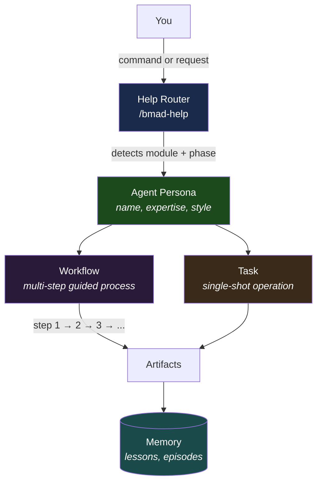
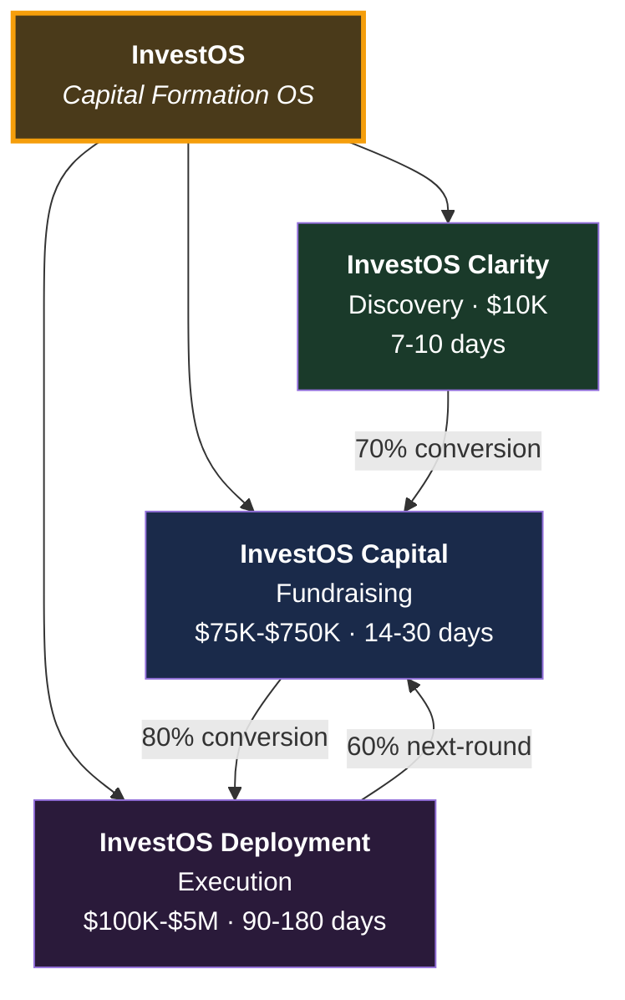
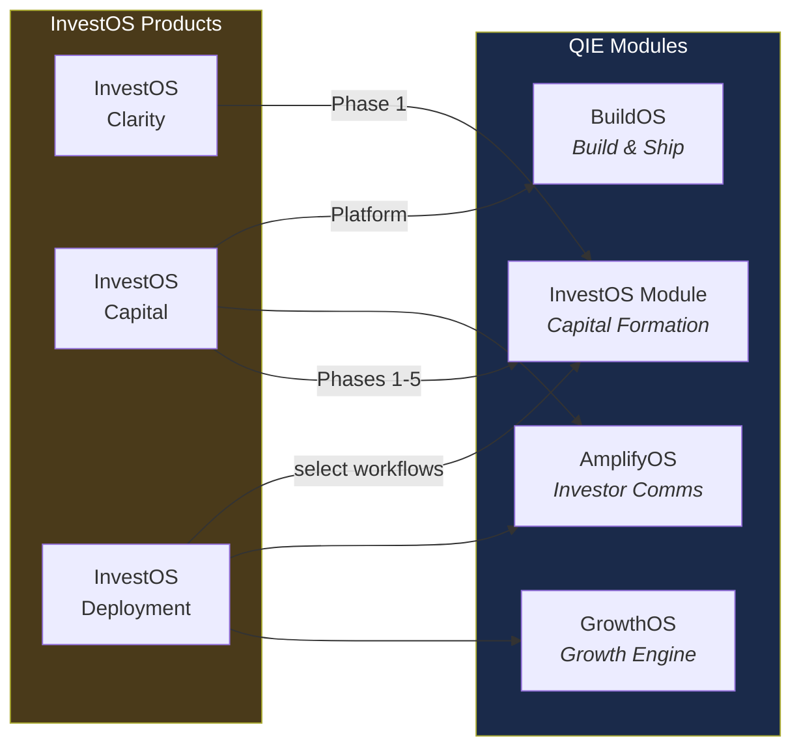

# Getting Started with the Quantum Intelligence Engine

**A guided tour through the system — read this first if you're new.**

---

## What You're Looking At

This repository contains the **Quantum Intelligence Engine (QIE)** — a multi-module AI platform that handles business operations from software development to capital formation to growth marketing, all unified by a self-improving intelligence layer and a spiritual alignment framework.

It's a lot. This guide helps you navigate it without getting lost.

---

## The 5-Minute Overview

### Three things to understand:

**1. The BMAD Framework is the engine.**
BMAD (Build-Measure-Amplify-Deliver) is an AI agent framework with 88 specialized agents organized into 7 modules. Each agent has a name, personality, and domain expertise. Agents execute workflows (multi-step guided processes) and tasks (single-shot operations).

**2. InvestOS is the sole commercial offering.**
InvestOS is **The Operating System for Capital Formation** — a three-stage product that covers the complete capital journey:
- **InvestOS Clarity** ($10K) — Discovery and strategic diagnostic
- **InvestOS Capital** ($75K-$750K) — Complete fundraising infrastructure
- **InvestOS Deployment** ($100K-$5M) — Post-raise capital deployment

Everything else (BuildOS, AmplifyOS, GrowthOS, SoulOS, QI) powers InvestOS behind the scenes.

**3. Quantum Intelligence makes it learn.**
QI is the layer that makes every agent interaction produce learning. It scores cognitive intelligence (AIQ), moral intelligence (MIQ), extracts lessons from experience, and evolves the system toward wisdom over time.

---

## Reading Order

### Path 1: Understanding the Business

If you want to understand what QIE does commercially:

| Step | Read | Time | What You'll Learn |
|------|------|------|-------------------|
| 1 | [Root README](../README.md) | 5 min | System overview, module inventory, navigation |
| 2 | [InvestOS Master Overview](../InvestOS/INVESTOS_MASTER_OVERVIEW.md) | 15 min | The three commercial products, pricing, journey |
| 3 | [InvestOS Offering](../InvestOS/INVESTOS_COMPLETE_OFFERING.md) | 10 min | What the fundraising product delivers |
| 4 | [Pricing Guide](../Pricing/CLIENT_PRICING_GUIDE.md) | 5 min | Package tiers and pricing |

### Path 2: Understanding the Technology

If you want to understand how QIE works under the hood:

| Step | Read | Time | What You'll Learn |
|------|------|------|-------------------|
| 1 | [Root README](../README.md) | 5 min | Layered architecture, module map |
| 2 | [System Architecture](./SYSTEM-ARCHITECTURE.md) | 15 min | Full architecture deep-dive |
| 3 | [BMAD Framework](../_bmad/BMAD-FRAMEWORK.md) | 20 min | All 88 agents, 148 workflows, every command |
| 4 | [QI Architecture](../_bmad/qi/QI-ARCHITECTURE.md) | 10 min | How the learning and morality systems work |

### Path 3: Using the System

If you want to start using agents and workflows:

| Step | Action | What Happens |
|------|--------|-------------|
| 1 | Run `/bmad-help` | Get context-aware guidance on next steps |
| 2 | Run `/bmad-agent-ios-master` | Start the InvestOS Master (capital formation orchestrator) |
| 3 | Or run `/bmad-bmm-quick-spec` | Fast-track a software spec |
| 4 | Or run `/bmad-agent-sos-master` | Start SoulOS Master (spiritual alignment) |

---

## Key Concepts

### Modules

A **module** is a self-contained domain with its own agents, workflows, tasks, and configuration.

| Module | Code | Domain |
|--------|------|--------|
| Core | CORE | Foundation services (brainstorming, debugging, research) |
| BuildOS | BMM | Software development lifecycle |
| InvestOS | IOS | Capital formation (also the sole commercial offering) |
| AmplifyOS | AOS | Regulated investor content |
| GrowthOS | GOS | Marketing, sales, analytics |
| SoulOS | SOS | Spiritual alignment and morality |
| Quantum Intelligence | QI | Learning, scoring, moral reasoning |

### Agents

An **agent** is a specialized AI persona with a name, personality, and domain expertise. When you activate an agent, the AI adopts that persona's communication style, knowledge base, and operating principles.

Examples:
- **Alexander** (InvestOS Investment Strategist) — Capital formation, deal structure
- **Winston** (BuildOS Architect) — Technical architecture and system design
- **Elior** (SoulOS Master) — Living Light steward, alignment orchestrator
- **Mary** (BuildOS Analyst) — Business analysis, market research

### Workflows

A **workflow** is a multi-step guided process. Each step has detailed instructions that the active agent follows. Workflows are the primary way work gets done.

Example: InvestOS "Create Raise Strategy" workflow:
1. Gather client information
2. Analyze market conditions
3. Determine optimal raise structure
4. Draft strategy document
5. Review and refine

### How agents, workflows, and tasks relate



### Tasks

A **task** is a single-shot operation — simpler than a workflow. Tasks handle focused operations like "check document completeness" or "validate financial model."

### The Help System

`/bmad-help` is your navigation compass. It reads the current project state and tells you what workflow to run next. You can also ask it specific questions:

```
/bmad-help where should I start with a capital raise?
/bmad-help I need to build a landing page
/bmad-help how do I run a code review?
```

---

## Directory Map

```
.
├── README.md              ← Start here: system overview
├── docs/
│   ├── GETTING-STARTED.md ← You are here
│   └── SYSTEM-ARCHITECTURE.md
│
├── InvestOS/              ← Commercial offering: strategy & product docs
├── Pricing/               ← Pricing structures
├── Compliance/            ← Regulatory documentation
├── Archive/               ← Superseded documents
│
├── _bmad/                 ← THE ENGINE (where the magic lives)
│   ├── BMAD-FRAMEWORK.md  ← Complete framework reference
│   ├── core/              ← Foundation services
│   ├── bmm/               ← BuildOS: Software development
│   ├── ios/               ← InvestOS: Capital formation
│   ├── aos/               ← AmplifyOS: Investor communications
│   ├── gos/               ← GrowthOS: Growth operations
│   ├── sos/               ← SoulOS: Spiritual alignment
│   ├── qi/                ← Quantum intelligence
│   ├── _config/           ← Manifests & routing
│   └── _memory/           ← Persistent memory & standards
│
└── _bmad-output/          ← Generated artifacts
```

### What lives where

| I want to... | Look in |
|-------------|---------|
| Understand the business offering | `InvestOS/`, `Pricing/` |
| Understand the AI framework | `_bmad/BMAD-FRAMEWORK.md` |
| See all available agents | `_bmad/_config/agent-manifest.csv` |
| See all available workflows | `_bmad/_config/workflow-manifest.csv` |
| Understand the intelligence system | `_bmad/qi/QI-ARCHITECTURE.md` |
| Read the spiritual doctrine | `_bmad/sos/doctrine/` |
| See coding standards | `_bmad/_memory/coding-standards/` |
| Find generated output | `_bmad-output/` |
| Check regulatory compliance | `Compliance/` |

---

## The Commercial Product in Context

### InvestOS is the sole commercial offering

InvestOS is **The Operating System for Capital Formation** — the only product QIE sells. It serves the complete capital journey through three stages:



### How QIE modules power InvestOS



### InvestOS document layer

The `InvestOS/` directory contains the specifications of what gets delivered. The AI agents that *execute* those deliverables live in `_bmad/ios/`.

| InvestOS Document | Maps To |
|------------------|---------|
| INVESTOS_MASTER_OVERVIEW.md | Complete strategic overview of the three products |
| INVESTOS_COMPLETE_OFFERING.md | What InvestOS Capital delivers |
| INVESTOS_STRATEGIC_ARCHITECTURE.md | How InvestOS technically works |
| INVESTOS_BRAND_GUIDELINES.md | Brand voice for investor-facing materials |
| InvestOS_Project_Plan.md | Delivery timeline and milestones |
| INVESTOS_WEBSITE_PLAN.md | Website plan for the investor platform |

---

## Next Steps

After reading this guide:

1. **Read the [Root README](../README.md)** if you haven't — it has the complete module inventory and navigation tables
2. **Pick your path** from the reading order above
3. **Use `/bmad-help`** to get context-aware guidance on what to do next
4. **Explore the [BMAD Framework reference](../_bmad/BMAD-FRAMEWORK.md)** for the full agent and workflow catalog

---

**Parent document:** [README.md](../README.md)
