# QIE System Architecture

**A comprehensive guide to the Quantum Intelligence Engine's layered architecture, module interactions, and design principles.**

---

## Table of Contents

1. [Architecture Overview](#architecture-overview)
2. [The Four Layers](#the-four-layers)
3. [Module Deep Dives](#module-deep-dives)
4. [Cross-Module Interactions](#cross-module-interactions)
5. [Data Architecture](#data-architecture)
6. [Agent Design Patterns](#agent-design-patterns)
7. [Intelligence & Learning System](#intelligence--learning-system)

---

## Architecture Overview

The QIE is organized as a **layered stack** of 7 modules, where higher layers provide intelligence, morality, and alignment services to lower operational layers.

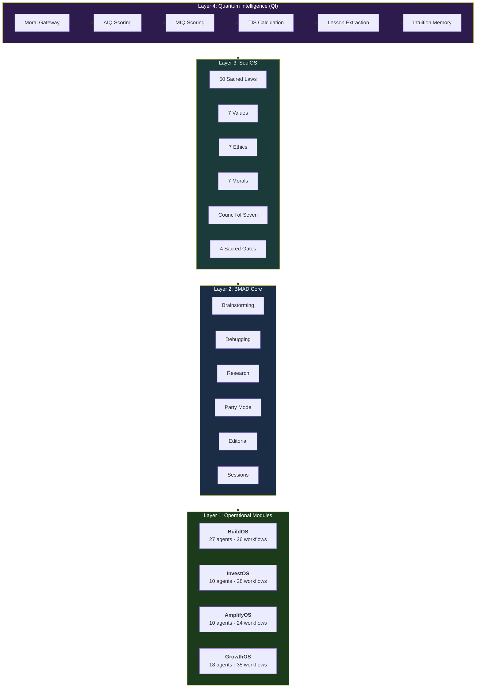

### Design Principles

1. **Layered Intelligence** — Higher layers enrich, not block. QI and SoulOS guide and score but never prevent operational modules from producing output.
2. **Module Independence** — Each module has its own agents, workflows, tasks, config, and data. Modules can operate independently.
3. **Shared Memory** — The `_memory/` directory provides cross-module persistent state: coding standards, communication styles, intuition lessons.
4. **Agent Personas** — Every agent has a name, personality, and specialized expertise. This creates consistent, reliable interactions.
5. **Workflow-Driven Execution** — All non-trivial operations follow multi-step workflows with guided instructions at each step.
6. **Runtime Resource Loading** — Agents and workflows are loaded at runtime, never pre-loaded. This keeps context windows clean.

---

## The Four Layers

### Layer 4: Quantum Intelligence (QI)

**Location:** `_bmad/qi/`

QI operates through three engines:

| Engine | Purpose | Key Metric |
|--------|---------|-----------|
| **Intuition Engine** | Transform experience into accumulated wisdom | Lesson count |
| **AIQ Engine** | Measure cognitive intelligence quality | AIQ score (0-1000) |
| **Morality Protocol** | Ensure ethical alignment on every decision | MIQ score (0-1000) |

**The crown metric:** True Intelligence Score (TIS)
```
TIS = (0.6 x AIQ) + (0.4 x MIQ) x balance_modifier
```

The balance modifier rewards systems where cognitive and moral intelligence develop together (within 100 points = 5% bonus) and penalizes extreme imbalance (300+ point gap = 5% penalty).

**Pre-execution flow (Moral Gateway):**

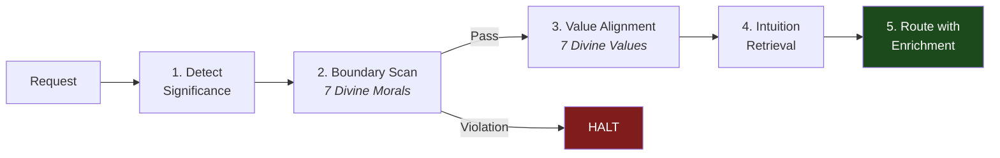

**Post-execution flow (Intelligence Capture):**

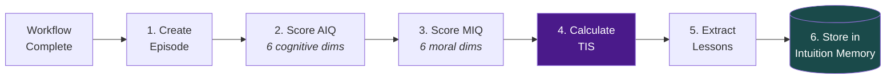

### Layer 3: Living Light (SoulOS)

**Location:** `_bmad/sos/`

SoulOS is the spiritual and moral doctrine layer. Unlike operational modules that produce artifacts, SoulOS **guides and reviews** without modifying other module outputs.

**Core doctrine components:**

| Component | Count | Description |
|-----------|-------|-------------|
| Sacred Laws | 50 | Inviolable principles governing all operations |
| Divine Values | 7 | Core values the system embodies |
| Divine Ethics | 7 | Ethical principles guiding decision-making |
| Divine Morals | 7 | Hard-stop moral boundaries (violation = halt) |
| Sacred Gates | 4 | Soul, Earth, Consent, Sovereignty |
| Stewardship Council | 7 | Named guardian agents with specific domains |
| Legion of Light | 22 | Armies organized under 7 Commanders |

**SoulOS Doctrine Structure:**

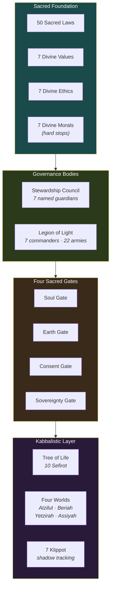

### Layer 2: BMAD Core

**Location:** `_bmad/core/`

Core provides cross-cutting services:

| Service | Command | What It Does |
|---------|---------|-------------|
| Brainstorming | `/bmad-brainstorming` | Multi-technique creative ideation |
| Debugging | `/bmad-debugging` | Systematic root-cause analysis before fixing |
| Research | `/bmad-research` | Quick-check or deep-dive web research |
| Party Mode | `/bmad-party-mode` | Multi-agent perspective discussion |
| Help Router | `/bmad-help` | Context-aware next-step guidance |
| Editorial Review | `/bmad-editorial-review-*` | Prose and structural editing |
| Session Management | `/bmad-session-save` | Save/restore session state |
| Handoff Context | `/bmad-handoff-context` | Generate context for new sessions |

### Layer 1: Operational Modules

Four modules handle specific business domains:

**BuildOS (Build & Ship Software)** — `_bmad/bmm/`
Full Agile lifecycle: product brief → PRD → architecture → epics/stories → sprint execution → code review → retrospective. Plus: autotask, multi-review, polish sweep, troubleshoot, dependency upgrades.

**InvestOS (Capital Formation)** — `_bmad/ios/`
End-to-end capital raise: raise strategy → entity structure → financial model → valuation → data room → investor narrative → platform → readiness check. Master orchestrator "Alexander" coordinates 28 workflows across 5 phases.

**AmplifyOS (Investor Communications)** — `_bmad/aos/`
Regulated communications: brand voice → compliance framework → content production (offering circulars, decks, emails, video, social) → compliance review → distribution campaigns → crisis management. Master orchestrator "Diana" coordinates 24 workflows.

**GrowthOS (Growth Engine)** — `_bmad/gos/`
Full-funnel growth: strategy → content engine → distribution → pipeline → sales → analytics. Master orchestrator "Theo" coordinates 35 workflows across 6 phases with 18 specialized agents.

---

## Module Deep Dives

### BuildOS Pipeline

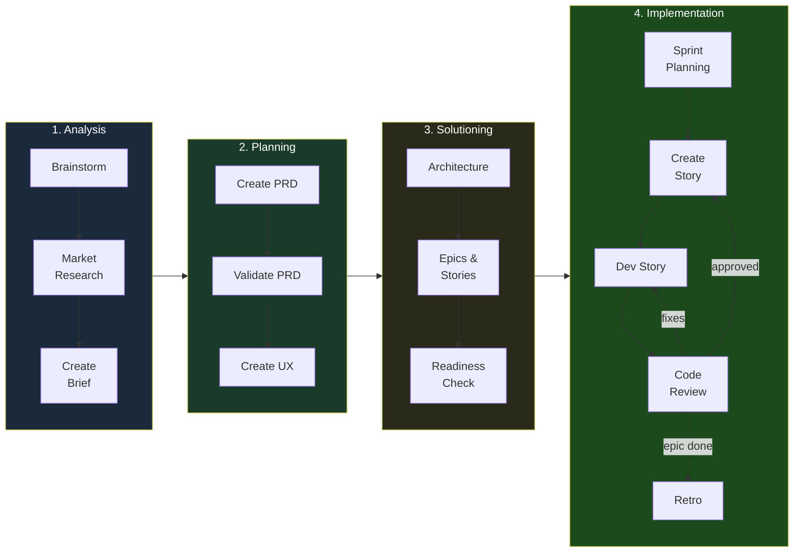

### BuildOS Agent Roster

BuildOS has the largest agent roster, reflecting the complexity of software development:

**Core Team (9 agents):**
Analyst (Mary), Architect (Winston), Developer (Amelia), Product Manager (John), QA Engineer (Quinn), Scrum Master (Bob), UX Designer (Sally), Tech Writer (Paige), Quick Flow (Barry)

**Review Team (17 agents):**
Architecture Auditor, Comment Analyzer, Debugger, Error Handling Reviewer, Git Writer, Library Advisor, Logic Reviewer, Observability Reviewer, Performance Reviewer, Recovery Reviewer, Robustness Reviewer, Security Reviewer, Simplifier, Style Reviewer, Test Analyzer, Test Engineer, Test Runner

The review team can run in parallel via `/bmad-bmm-multi-review`.

### InvestOS Pipeline

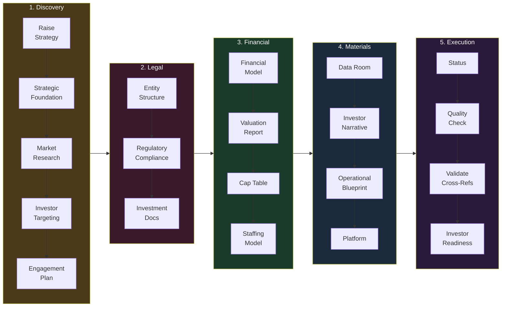

### InvestOS Workflow Phases

| Phase | Workflows | Key Agents | What Gets Produced |
|-------|-----------|------------|-------------------|
| 1. Discovery | 8 | Alexander, Cassandra, Diana, Priya | Raise strategy, market research, deal structure, engagement plan |
| 2. Legal | 3 | Victoria | Entity structure, regulatory routing, investment docs |
| 3. Financial | 5 | Marcus, Raymond | Financial model, valuation report, cap table, staffing model |
| 4. Materials | 6 | Helena, Cassandra, Raymond, Nikolai | Data room, narrative, blueprint, platform, brand |
| 5. Execution | 4 | Priya, Helena, Alexander | Status, quality check, cross-refs, readiness |

### AmplifyOS Pipeline

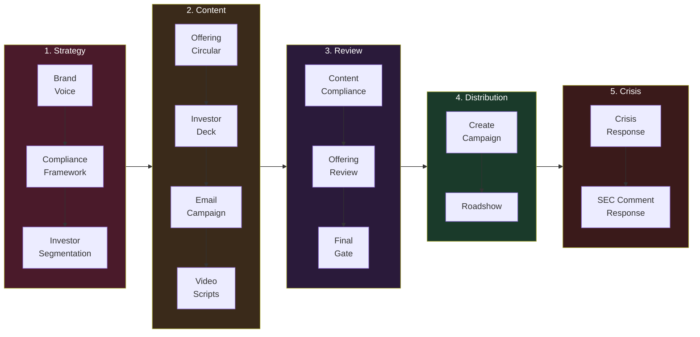

### AmplifyOS Workflow Phases

| Phase | Workflows | Key Agents | Focus |
|-------|-----------|------------|-------|
| 1. Strategy | 4 | Zoe, Sarah, Amanda, Jordan | Brand voice, compliance framework, segmentation |
| 2. Content | 7 | Emma, Michael | Offering circulars, decks, emails, video, social, landing pages |
| 3. Review | 4 | Marcus | Compliance gates: content, offering, disclosure, final |
| 4. Distribution | 4 | Diana, Amanda | Campaign creation, planning, execution, roadshows |
| 5. Crisis | 3 | Victoria, Diana | Crisis response, SEC comments, retrospective |

### GrowthOS Pipeline

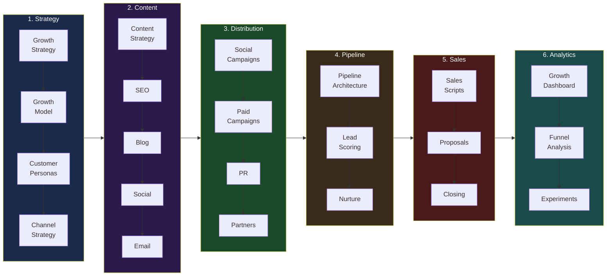

### GrowthOS Workflow Phases

| Phase | Workflows | Key Agents | Focus |
|-------|-----------|------------|-------|
| 1. Strategy | 6 | Theo, Jax | Growth strategy, model, personas, channels, positioning |
| 2. Content | 7 | Margot, Akira, Luna, Serena | Content strategy, SEO, blog, social, email, video, podcast |
| 3. Distribution | 6 | Luna, Declan, Piper | Social campaigns, paid ads, launch, PR, partners, events |
| 4. Pipeline | 5 | Roman, Serena, Vivienne | Architecture, lead scoring, nurture, onboarding, playbooks |
| 5. Sales | 4 | Vivienne | Scripts, proposals, closing workflows, upsell |
| 6. Analytics | 5 | Soren | Dashboard, campaign performance, funnel, experiments, retention |

---

## Cross-Module Interactions

### QI wraps every operation

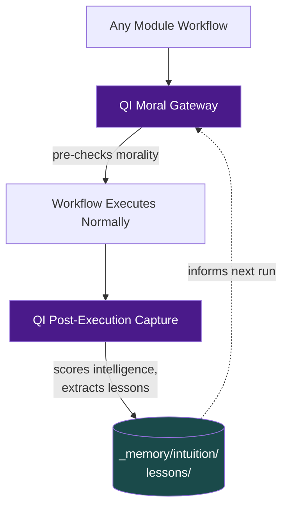

### SoulOS reviews but doesn't modify

SoulOS provides alignment checks that other modules can request:

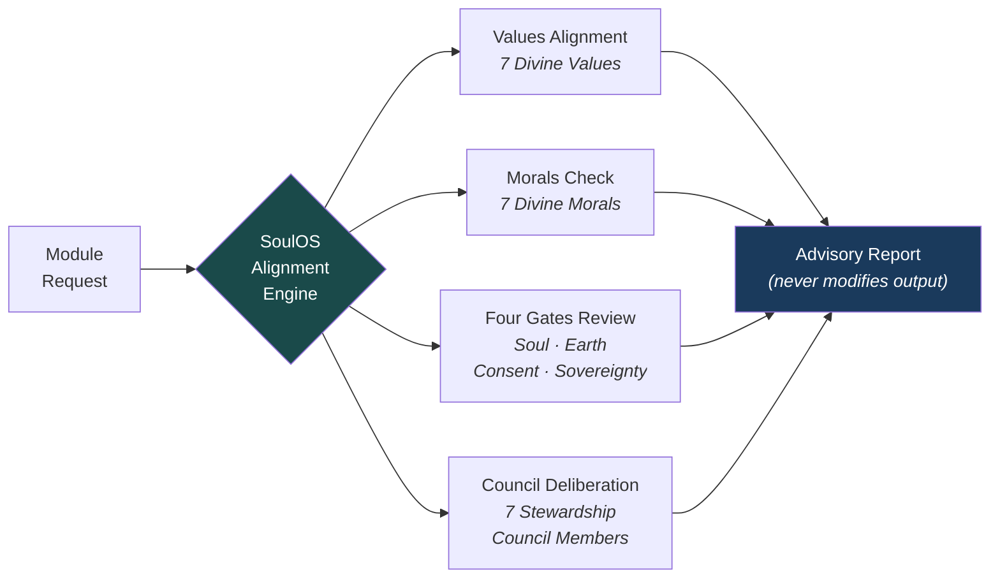

### Cross-module data flow


---

## Data Architecture

### Directory Structure

```
_bmad/
├── _config/
│   ├── agent-manifest.csv       ← All 88 agents indexed
│   ├── workflow-manifest.csv    ← All 148 workflows indexed
│   ├── task-manifest.csv        ← All 34 tasks indexed
│   ├── bmad-help.csv            ← Help routing table
│   └── manifest.yaml            ← Module versions, metadata
│
├── _memory/
│   ├── intuition/
│   │   ├── episodes/            ← Structured experience records
│   │   ├── lessons/             ← Accumulated wisdom by module
│   │   ├── moral-lessons/       ← Moral-specific wisdom
│   │   ├── meta-lessons/        ← Lessons about learning itself
│   │   └── schemas/             ← Episode and lesson schemas
│   ├── coding-standards/        ← 33 coding standards
│   ├── communication-styles/    ← 7 AI personality configs
│   └── prompt-engineering/      ← LLM-to-LLM best practices
│
├── {module}/
│   ├── agents/                  ← Agent persona definitions
│   ├── workflows/               ← Multi-step guided processes
│   ├── tasks/                   ← Single-shot operations
│   ├── data/                    ← Module-specific reference data
│   ├── config.yaml              ← Module configuration
│   └── module-help.csv          ← Module-specific help routing
```

### Artifact Output

All generated artifacts go to `_bmad-output/`:

| Subdirectory | Content |
|-------------|---------|
| `epic-center-source/` | Client project source code, platform builds |
| `planning-artifacts/` | Financial model specs, workflow plans |
| `raise-rebuild/` | Session manifests for capital raise rebuilds |
| `soul-artifacts/` | SoulOS-generated alignment artifacts |
| `implementation-artifacts/` | Implementation-phase outputs |

---

## Agent Design Patterns

### Agent Definition Structure

Every agent follows the same pattern:

```markdown
---
name: "agent-name"
description: "One-line role description"
---

<agent id="..." name="Name" title="Role" icon="emoji">
  <persona>
    <role>What they do</role>
    <identity>Who they are</identity>
    <communication_style>How they communicate</communication_style>
    <principles>Core operating principles</principles>
  </persona>

  <activation>Steps to activate the agent</activation>
  <menu>Available commands</menu>
</agent>
```

### Master Agent Pattern

Each operational module has a **Master Agent** that orchestrates the full module:

| Module | Master | Persona Name | Command |
|--------|--------|-------------|---------|
| InvestOS | ios-master | Alexander | `/bmad-agent-ios-master` |
| AmplifyOS | aos-master | Diana | `/bmad-agent-aos-master` |
| GrowthOS | gos-master | Theo | `/bmad-agent-gos-master` |
| SoulOS | sos-master | Elior | `/bmad-agent-sos-master` |

Master agents provide conversational intake, full orchestration, and cross-session resume:

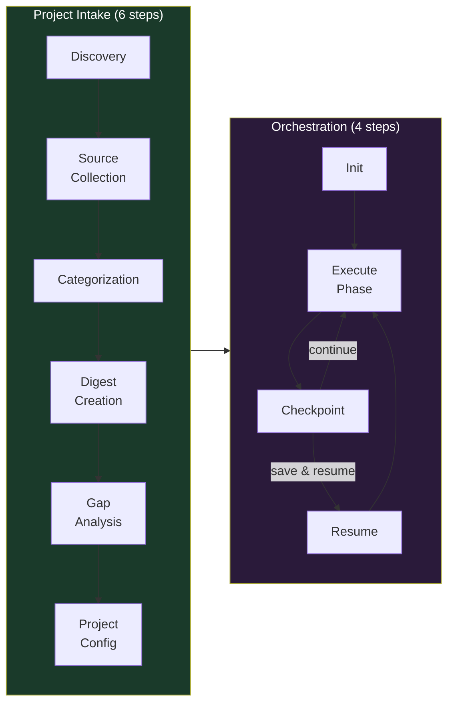

### Quick Flow Pattern

Several modules offer a **Quick Flow** agent for fast single-deliverable execution:

| Module | Agent | For |
|--------|-------|-----|
| BuildOS | Barry | Quick spec + dev for simple tasks |
| InvestOS | Kai | Fast single-deliverable capital formation |
| AmplifyOS | Carlos | Fast single-deliverable content |
| GrowthOS | Dash | Fast single-deliverable growth content |
| SoulOS | Shalev | Rapid alignment checks |

---

## Intelligence & Learning System

### Episode Structure

Every significant workflow execution produces an Episode:

```yaml
episode_id: ep-{module}-{agent}-{date}-{seq}
context:
  module: ios
  workflow: create-raise-strategy
  agent: investment-strategist
  trigger: user_request
scores:
  aiq: 692    # Cognitive intelligence
  miq: 0      # Moral intelligence (0 if no moral dimensions)
  tis: 394    # True Intelligence Score
lessons_extracted: 3
```

### Lesson Types

| Type | Purpose | Storage |
|------|---------|---------|
| **Positive lessons** | "This pattern worked well" | `_memory/intuition/lessons/{module}/` |
| **Negative lessons** | "This approach failed because..." | `_memory/intuition/lessons/{module}/` |
| **Meta-lessons** | "Lessons about how to learn" | `_memory/intuition/meta-lessons/` |
| **Moral lessons** | "This moral reasoning was sound/flawed" | `_memory/intuition/moral-lessons/` |

### TIS Evolution

Current state: **TIS 394 (Developing)**, 3 lessons, Naive stage exited.

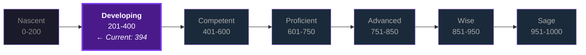

---

**Parent document:** [README.md](../README.md)
**Framework reference:** [BMAD-FRAMEWORK.md](../_bmad/BMAD-FRAMEWORK.md)
**QI deep-dive:** [QI-ARCHITECTURE.md](../_bmad/qi/QI-ARCHITECTURE.md)
