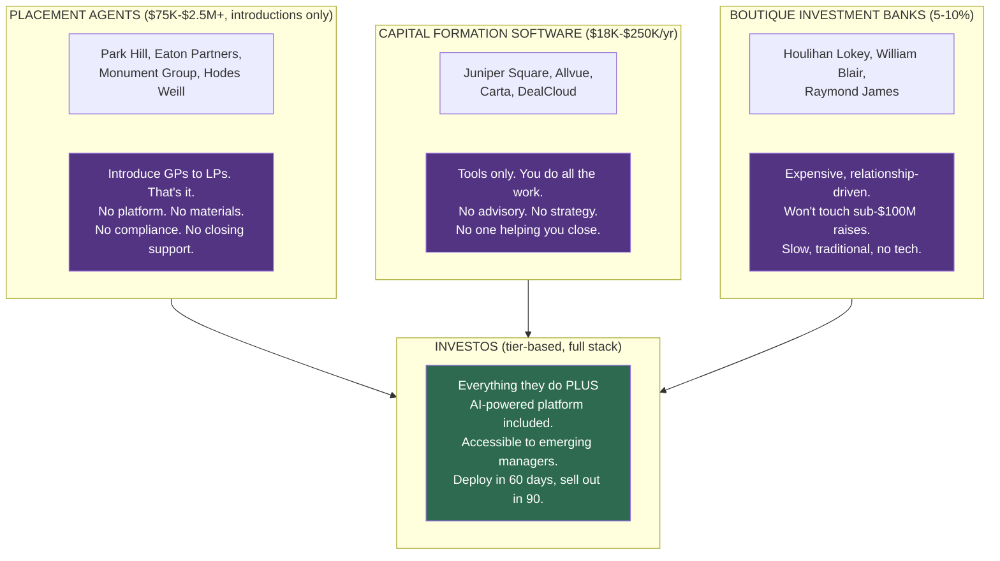
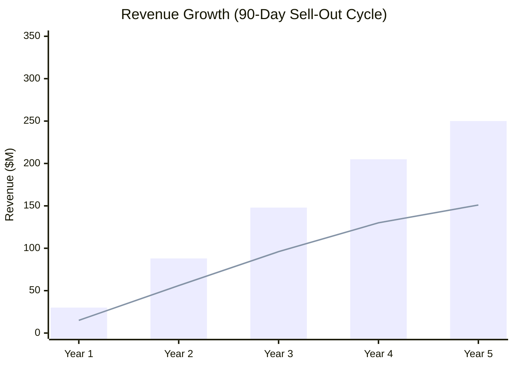
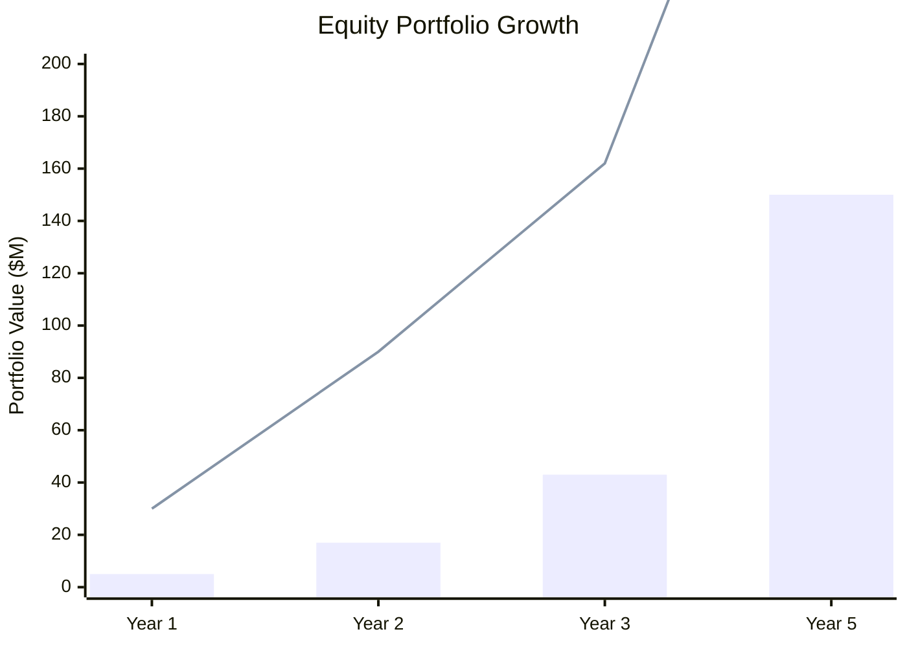

# InvestOS: PE / Family Office / Institutional Investment Market Deep Dive

**Date:** March 4, 2026
**Purpose:** Market sizing, sector mapping, acquisition modeling, and market share projections for InvestOS

---

## 1. The Global Institutional Capital Landscape

### Total Assets Under Management by Segment

| Segment | Global AUM | # of Organizations | Annual Capital Activity |
|---------|-----------|-------------------|----------------------|
| **Pension Funds** | $58.5-63T | Top 300 = $24.4T | Largest capital pool globally |
| **Sovereign Wealth Funds** | $13-15T | ~90-100 funds | Growing ~14% YoY |
| **RIAs** | $128T regulatory AUM | 15,000-21,669 | Consolidating rapidly |
| **Private Equity (all)** | $8.2-9.4T | 18,000+ funds / 5,000-8,000 firms | ~$600-700B raised/yr |
| **Family Offices** | $3.1-5.9T | 8,000-20,000 (SFO + MFO) | Growing 13%+ YoY |
| **U.S. Foundations** | ~$1.83T | 150,430 | ~$100B annual disbursements |
| **U.S. Endowments** | ~$874B | 658+ institutions | $30B+ annual spending |
| **Independent Sponsors** | N/A (deal-by-deal) | 1,200-1,600 | $10M-$75M per deal |

**Total private markets AUM: ~$14.3 trillion** (McKinsey 2026), projected to reach **$18T by 2028**.

### Annual Capital Raised (Private Markets)

| Year | Capital Raised | Trend |
|------|---------------|-------|
| 2022 | ~$1.7 trillion | Peak |
| 2024 | ~$724 billion | Declining |
| 2025 | ~$600-700 billion | Trough year |
| 2026+ | Recovery expected | Preqin forecasts rebound through 2030 |

**Key sub-strategies (2025):**
- Buyout/PE: ~$440B (down 32.3% YoY)
- Venture Capital: ~$140B (down 42.5% YoY)
- Secondaries: ~$105B (near-record — bright spot)
- Growth equity: Up 14% YoY
- Private credit: $2.4T AUM and growing fast

---

## 2. Sector Breakdown: Who Raises Capital and How

### Sector 1: Private Equity Firms (Buyout, Growth, Venture)

**Profile:** 5,000-8,000 distinct GP firms managing 18,000+ funds globally. PE represents 66% of all private markets AUM.

**Capital formation behavior:**
- Raise committed capital funds on 3-5 year cycles
- Fundraising takes 12-18 months traditionally (17.5 months average for VC in 2025) — InvestOS targets 90-day sell-out
- Produce PPMs, LPAs, pitch decks, data rooms
- Manage LP relationships across institutional allocators

**Key pain points:**
- Capital concentration: Top 10 funds took 45.7% of all U.S. PE capital in 2025
- Funds under $500M get only 13% of total capital raised
- Distribution drought limiting LP re-ups
- Manual processes for LP tracking and reporting

**Segment within PE most addressable for InvestOS:**
- Emerging managers (Fund I-III, sub-$500M): **2,000-4,000 firms**
- Mid-market PE ($500M-$2B): **500-1,000 firms**
- First-time funds launching annually: **250-500 new funds/year**

### Sector 2: Family Offices (Single & Multi-Family)

**Profile:** ~8,030 SFOs globally (up 31% since 2019), projected 10,720 by 2030. MFOs estimated 3,000-7,000. Total AUM: $3.1-5.9T.

**Regional breakdown (SFOs):**
- North America: 3,180
- Europe: 2,020
- Asia Pacific: 2,290
- Middle East: 290
- South America: 190
- Africa: 60

**Capital formation behavior:**
- SFOs increasingly co-investing directly alongside PE sponsors
- MFOs raise pooled vehicles from multiple families
- Growing interest in direct deals, especially real estate and private credit
- Many now launching their own funds (crossing into GP territory)

**Pain points:**
- Lack of institutional infrastructure for fund operations
- Need investor portals and reporting when raising from outside families
- Compliance requirements increasing as they become quasi-fund managers
- Most run on spreadsheets and private banker relationships

**Addressable for InvestOS:** 3,000-5,000 SFOs/MFOs actively deploying or raising $10M+

### Sector 3: Independent / Fundless Sponsors

**Profile:** 1,200-1,600 active firms in the U.S. Most transactions in $10M-$75M enterprise value range. Accounted for 31% of all platform-sourced closed deals in 2024.

**Capital formation behavior:**
- Raise capital deal-by-deal (no committed fund)
- Need to present professional materials to co-investors for each transaction
- Speed is critical — they compete on deal access, not AUM
- Increasingly transitioning to committed fund structures

**Pain points:**
- No fund infrastructure but need institutional-quality presentations
- Must build investor relationships one deal at a time
- Limited technology budget
- Need fast turnaround on deal materials

**Addressable for InvestOS:** ~1,200-1,600 (nearly all could benefit)

### Sector 4: Real Estate Sponsors & Syndicators

**Profile:** Thousands of real estate operators raising capital for individual deals and funds. Range from small syndicators ($5M deals) to institutional platforms ($500M+ funds).

**Capital formation behavior:**
- Mix of Reg D 506(b), 506(c), and increasingly Reg A+
- Heavy use of investor portals and automated subscription documents
- Quarterly reporting to investors
- Distribution waterfall management

**Pain points:**
- Existing tools (InvestNext, CrowdStreet) are syndication-focused, not full capital formation
- Need for integrated financial modeling and investor communications
- Compliance burden increasing

**Addressable for InvestOS (via RealEstateOS):** 5,000-10,000 active sponsors/syndicators

### Sector 5: Endowments & Foundations

**Profile:** 658+ university endowments ($874B), 150,430+ private foundations ($1.83T). Primarily LPs, not GPs.

**Relevance to InvestOS:** These are the **buyers** (LPs), not the customers. However, understanding their allocation behavior is critical for helping GPs target them effectively. InvestOS can provide market intelligence on which endowments/foundations are allocating to which strategies.

### Sector 6: Pension Funds & Sovereign Wealth Funds

**Profile:** $58.5-63T (pensions) + $13-15T (SWFs). Massive capital pools.

**Relevance to InvestOS:** Like endowments, these are **LP targets** for InvestOS customers. The intelligence layer (knowing who's allocating, to what, and how much) is the value-add here.

### Sector 7: RIAs Managing Alternative Investments

**Profile:** 15,000-21,669 registered investment advisors. The top 20 each manage $10B+. Many are increasingly allocating to alternatives.

**Capital formation behavior:**
- Aggregating client capital into alternative investment vehicles
- Creating feeder funds and fund-of-funds structures
- Need compliance infrastructure for alternative allocations

**Addressable for InvestOS:** 5,000-8,000 RIAs between $100M-$5B AUM that allocate to alternatives

---

## 3. The Addressable Market: Organizations Raising $10M+

### Summary: Who Is Actively Raising or Deploying $10M+ Annually?

| Segment | Estimated Count | Avg. Raise Size | Total Annual Capital |
|---------|----------------|-----------------|---------------------|
| Emerging PE managers (Fund I-III) | 2,000-4,000 | $50M-$300M | $100B-$200B |
| Mid-market PE ($500M-$2B funds) | 500-1,000 | $500M-$2B | $250B-$500B |
| Independent sponsors | 1,200-1,600 | $10M-$75M/deal | $15B-$50B |
| Family offices (raising/co-investing) | 3,000-5,000 | $10M-$500M | $50B-$200B |
| Real estate sponsors | 5,000-10,000 | $10M-$500M | $50B-$200B |
| RIAs (alt allocations) | 5,000-8,000 | $10M-$100M | $50B-$200B |
| First-time fund managers (annual) | 250-500/yr | $50M-$200M | $15B-$40B |
| **TOTAL ADDRESSABLE UNIVERSE** | **~15,000-25,000 orgs** | | **$530B-$1.4T annually** |

### The Sweet Spot for InvestOS

**Primary target: Organizations raising $10M-$500M** who are:
- Too small for enterprise platforms ($18K-$250K/year)
- Too sophisticated for spreadsheets
- Growing fast and need to professionalize
- Willing to spend $200-$1,000/month on technology

**This segment: ~10,000-15,000 organizations in the U.S. alone.**

---

## 4. InvestOS Business Model: Strategic Capital Advisory + Platform

### The Model

InvestOS is NOT a SaaS tool. It is an **AI-native strategic capital advisory firm** that delivers:
1. **Platform** — AI-powered capital formation technology (investor portal, data room, financial modeling, compliance, documents)
2. **Advisory** — Strategic guidance on raise structure, LP targeting, narrative, and closing
3. **Execution** — Hands-on support through the entire raise lifecycle to close

### Fee Structure: 10% of Raise Value

| Component | Detail |
|-----------|--------|
| **Total fee** | 10% of capital raised |
| **Payment 1** | 50% of cash portion — paid when first 10% of round is closed |
| **Payment 2** | 50% of cash portion — paid at full round close |

**Revenue per engagement by raise size:**

| Investment Tier | Raise Range | Advisory Fee | Payment 1 | Payment 2 |
|----------------|-------------|-------------|-----------|-----------|
| Tier 1 | Up to $1M | $100K | $25K | $25K |
| Tier 2 | $1M - $5M | $500K | $125K | $125K |
| Tier 3 | $5M - $10M | $1.0M | $250K | $250K |
| Tier 4 | $10M - $25M | $2.5M | $625K | $625K |
| Tier 5 | $25M - $50M | $5.0M | $1.25M | $1.25M |
| Tier 6 | $50M - $75M | $7.5M | $1.875M | $1.875M |
| Tier 7 | $75M+ | $15.0M | $3.75M | $3.75M |

### Competitive Positioning: A New Category

InvestOS competes in THREE markets simultaneously — and beats all of them:

### Why the Advisory Fee Is Justified

| Value Component | What Others Charge Separately | InvestOS Delivers |
|----------------|------------------------------|-------------------|
| LP introductions & targeting | $75K-$2.5M+ (placement agent) | Included |
| AI-powered platform (portal, data room, docs) | $18K-$250K/yr (software) | Included |
| Financial modeling & valuation | $50K-$150K (consultant) | Included |
| Legal document generation (PPM, LPA, sub docs) | $150K-$500K (law firm) | Included |
| Compliance & regulatory | $50K-$200K/yr (consultant) | Included |
| Strategic advisory through close | $200K-$500K (consultant) | Included |
| **Total cost if purchased separately** | | **$500K-$1.5M+** |
| **InvestOS Tier 4 advisory fee** | | **$2.5M** |

A Tier 4 advisory fee ($2.5M) looks significant in isolation. But compared to assembling the alternative — placement agent ($750K) + legal ($300K) + software ($50K) + consultants ($200K) + fund admin ($100K) = **$1.4M minimum** — AND you still have to project manage all those vendors yourself. InvestOS delivers the entire stack with a single fee, a single team, and a 90-day sell-out target.

**The pitch:** "We replace your placement agent, your fund admin software, your document lawyers, and your capital markets consultant. One fee. One team. One platform. And you only pay the full fee when we close."

### The Zero-Upfront Advantage

Unlike every competitor, InvestOS requires **no upfront payment**. The first payment triggers only when 10% of the raise is closed — meaning:
- The client has zero financial risk at engagement
- InvestOS is incentivized to move fast (first payment depends on early traction)
- The GP can tell LPs they have a strategic capital advisor at no cost until capital flows
- This eliminates the #1 objection from cash-strapped emerging managers

---

## 5. Revenue Model: 4-8 Engagements Per Month

### Unit Economics Per Engagement

**Conservative scenario: Average raise = $25M**

| Metric | Value |
|--------|-------|
| Total fee per engagement | $2.5M |
| Payment 1 (at 10% raised, ~month 3) | $1.25M |
| Payment 2 (at sell-out, ~month 5) | $1.25M |
| Engagement duration | 5-7 months (deploy in 30-60 days, sell out in 90 days) |
| Close rate (engagements that fully close) | 50-65% |
| Expected value per engagement | $1.56M-$1.88M |

**Why 50-65% close rate is realistic:**
- Traditional placement agents close 60-70% of mandated raises
- InvestOS provides more comprehensive support (should improve odds)
- The 10% raised threshold for Payment 1 filters for viable raises early
- Conservative estimate accounts for market conditions

### Pipeline & Revenue Model

**Assumptions:**
- Target: 4-8 new engagements/month at steady state (Year 1 ramps to this)
- Average raise: $25M (conservative — biased toward emerging managers)
- Close rate: 55% of engagements fully close
- Time to first payment (10% raised): ~3 months from engagement (deploy in 30-60 days, 10% raised in 30 days)
- Time to sell-out: ~5 months from engagement (90-day raise after deployment)

### Year 1 Revenue Projection (Ramp Year)

| Quarter | New Engagements | Cumulative Active | Payment 1 Collections | Payment 2 + Buyout Collections | Quarterly Revenue |
|---------|----------------|------------------|-----------------------|-------------------------------|-------------------|
| Q1 | 3-6 | 3-6 | $0 | $0 | $0 |
| Q2 | 6-12 | 9-18 | $1.25M-$3.75M | $0-$1.25M | $1.25M-$5.0M |
| Q3 | 9-18 | 18-36 | $2.5M-$7.5M | $2.5M-$7.5M | $5.0M-$15.0M |
| Q4 | 12-24 | 30-60 | $3.75M-$11.25M | $5.0M-$12.5M | $8.75M-$23.75M |
| **Year 1 Total** | **30-60** | | | | **$15M-$44M** |

*With the 90-day sell-out target, Payment 2s and equity buyouts begin flowing in Q2-Q3 of Year 1 — not Year 2.*

### Year 1-5 Revenue Projection

| Year | New Engagements | Avg Raise | Total Fee Committed | Expected Revenue (55% close) | Active Portfolio |
|------|----------------|-----------|--------------------|-----------------------------|-----------------|
| Year 1 | 30-60 | $25M | $75M-$150M | $7.5M-$24M | $750M-$1.5B in raises |
| Year 2 | 60-96 | $35M | $210M-$336M | $40M-$80M | $2.1B-$3.4B in raises |
| Year 3 | 72-120 | $50M | $360M-$600M | $90M-$180M | $3.6B-$6B in raises |
| Year 4 | 96-144 | $65M | $624M-$936M | $180M-$360M | $6.2B-$9.4B in raises |
| Year 5 | 120-180 | $80M | $960M-$1.44B | $350M-$700M | $9.6B-$14.4B in raises |

### Revenue Recognition Timeline

With the 90-day sell-out cycle, all three revenue waves (Payment 1, Payment 2, buyouts) compound within each year:

*Bar = upper range, Line = conservative estimate. All 3 revenue waves flow within each year.*

### Capacity Planning

Each engagement requires dedicated advisory support. Key question: **how many active engagements can one advisor manage?**

| Role | Active Engagements | Needed by Year |
|------|-------------------|----------------|
| Capital Advisor (senior) | 5-8 concurrent | Year 1: 2-3, Year 2: 5-8, Year 3: 10-15 |
| Platform Specialist | 10-15 concurrent | Year 1: 1-2, Year 2: 3-5, Year 3: 6-10 |
| Operations/Compliance | 15-20 concurrent | Year 1: 1, Year 2: 2-3, Year 3: 4-6 |

**Year 1 team size:** 4-6 people (2 advisors, 1 platform specialist, 1 ops, 1-2 founders)
**Year 3 team size:** 25-40 people

---

## 6. Market Share Model: Path to 1-5%

### Defining the Market

InvestOS operates in the **capital formation advisory + technology** market. The right denominator is the total fee pool for capital formation services in our target segment.

**Total annual fee pool (estimated):**

| Fee Category | Estimated Annual Fees | Our Target Segment ($10M-$500M raises) |
|-------------|----------------------|---------------------------------------|
| Placement agent fees | $3.5B-$7B | ~$1.5B-$3B |
| Fund formation legal | $2B-$4B | ~$800M-$1.5B |
| Fund admin + technology | $1.5B-$3B | ~$500M-$1B |
| Capital markets consulting | $500M-$1B | ~$200M-$500M |
| **Total fee pool** | **$7.5B-$15B** | **$3B-$6B** |

### Market Share by Capital Managed

An alternative (and more compelling) way to measure market share: **how much capital raised flows through InvestOS advisory?**

- Total capital raised annually by $10M-$500M managers: **~$80B-$250B**
- This is the capital denominator for market share

| Year | Capital Raised via InvestOS | % of Target Segment | Revenue |
|------|---------------------------|--------------------|---------|
| Year 1 | $400M-$825M | 0.2-0.3% | $7.5M-$24M |
| Year 2 | $1.2B-$1.8B | 0.5-0.7% | $40M-$80M |
| Year 3 | $2B-$3.3B | 0.8-1.3% | $90M-$180M |
| Year 4 | $3.5B-$5B | 1.4-2.0% | $180M-$360M |
| Year 5 | $5B-$9B | 2.0-3.6% | $350M-$700M |

### Path to 1% of Target Capital Flow ($800M-$2.5B/year through platform)

- **Need:** 30-50 active raises averaging $25M-$50M
- **Timeline:** Year 2-3
- **This represents:** $80M-$250M in annual fee revenue
- **Achievable with:** 6-8 new engagements/month, 55% close rate

### Path to 5% of Target Capital Flow ($4B-$12.5B/year through platform)

- **Need:** 100-250 active raises averaging $40M-$50M
- **Timeline:** Year 4-6
- **This represents:** $400M-$1.25B in annual fee revenue
- **Requirements:** National brand, 30+ advisors, enterprise clients, possibly international

### How Many Organizations Raising $10M+ Could We Realistically Capture?

| Timeframe | Target Segment | Addressable Orgs | Engagements Signed | Cumulative Clients |
|-----------|---------------|-----------------|-------------------|-------------------|
| Year 1 | Emerging PE, indie sponsors | 3,000-5,000 | 30-60 | 30-60 |
| Year 2 | + Family offices, RE sponsors | 8,000-12,000 | 60-96 | 90-156 |
| Year 3 | + Mid-market PE, RIAs | 12,000-18,000 | 72-120 | 162-276 |
| Year 5 | Full addressable market | 15,000-25,000 | 120-180 | 384-636 |

**At steady state (Year 5):** Capturing 120-180 new engagements/year out of 15,000-25,000 addressable organizations = **0.5-1.2% annual capture rate**. This is conservative and realistic.

**Key insight:** You don't need massive market share to build a massive business. 120 engagements at $80M average raise = $960M in fees committed. Even at 55% close rate, that's **$528M in realized revenue**.

### Comparison to Established Players

| Firm | Annual Placements | Capital Raised | Estimated Fees |
|------|------------------|----------------|---------------|
| Park Hill (PJT Partners) | ~50-80 mandates | $30B-$50B | $450M-$750M |
| Evercore (PE advisory) | ~30-50 mandates | $20B-$40B | $300M-$600M |
| Monument Group | ~40-60 mandates | $15B-$30B | $225M-$450M |
| **InvestOS Year 3 (projected)** | **72-120 mandates** | **$2B-$3.3B** | **$90M-$180M** |
| **InvestOS Year 5 (projected)** | **120-180 mandates** | **$5B-$9B** | **$350M-$700M** |

By Year 5, InvestOS would be **comparable in fee revenue to a mid-tier placement agent**, but with fundamentally better economics (AI platform scales, humans don't).

---

## 7. Key Strategic Insights

### Why Now

1. **Capital concentration is creating desperation** among emerging managers — they NEED strategic partners, not just tools
2. **Fundraising timelines at record 17.5 months** — a partner who compresses this to 90 days is worth the advisory fee
3. **AI is the moat** — 88% of PE firms investing in generative AI, but no one has built an AI-native advisory firm. InvestOS is first.
4. **The distribution drought** means LPs are more selective — GPs need institutional-quality everything to win allocations
5. **Zero upfront cost eliminates the #1 objection** — emerging managers are cash-poor but capital-rich once they close
6. **Placement agents are ripe for disruption** — relationship-driven, no technology, charging 3-5% for introductions alone

### InvestOS Competitive Advantages

1. **Zero upfront cost** — No other advisory firm or software platform offers this. First payment only when capital flows.
2. **AI-Native Platform** — Not AI bolted onto legacy software. Materials, compliance, modeling, and intelligence built from the ground up.
3. **Full lifecycle ownership** — From raise strategy through closing. One partner replaces placement agent + lawyer + fund admin + software vendor + consultant.
4. **Speed** — Deploy in 30-60 days, 10% raised in 30 days, sell-out in 90 days. What takes 17.5 months traditionally, InvestOS delivers in 5 months total.
5. **Aligned incentives** — 50% of fee tied to close means InvestOS is motivated to finish the job, unlike placement agents who collect retainers regardless.
6. **Scalable economics** — The AI platform scales horizontally. Each new advisor can manage more engagements than traditional placement agents because the platform handles the heavy lifting.

### Risks and Mitigations

| Risk | Likelihood | Mitigation |
|------|-----------|------------|
| **Fee resistance** — GPs push back on advisory fee | High | Show total cost comparison: single advisory fee vs. placement agent + legal + admin + software purchased separately = comparable cost AND you manage it all yourself |
| **Cash flow lag** — Revenue doesn't flow until raises close | Medium | 90-day sell-out target compresses lag dramatically. Payment 1 at ~3 months, close at ~5 months, buyout at ~7 months from signing |
| **Close rate risk** — Some raises fail | Medium | Rigorous intake qualification. Only accept raises with viable thesis, team, and LP pathway. Target 55%+ close rate |
| **Regulatory scrutiny** — Acting as placement agent may require broker-dealer registration | High | **Critical: consult securities counsel immediately.** If InvestOS is introducing investors to offerings, SEC may require BD registration or RIA status. Structure matters. |
| **Talent bottleneck** — Need experienced capital markets advisors | Medium | Hire from placement agent firms and PE fund operations. The AI platform makes each advisor 3-5x more productive. |
| **Market downturn reduces fundraising** | Medium | Harder markets = more desperate managers = more willing to pay 10% for help closing. Counter-cyclical demand for advisory. |
| **Established placement agents compete** | Low-Medium | They can't build the tech platform. Their model is lunch meetings and Rolodexes. By the time they respond, InvestOS has the AI moat. |

---

## 4B. Hybrid Fee Structure: Cash + Equity + Buyout

### The Structure

| Component | Detail |
|-----------|--------|
| **Advisory fee** | Fixed by investment tier (see tier schedule) |
| **Cash portion** | 50% of advisory fee, paid per payment schedule |
| **Equity portion** | 50% of advisory fee, converted to equity at pre-money valuation |
| **Buyout clause** | Client can repurchase InvestOS's equity at 50% premium after the raise closes |

### How It Works: Tier 5 ($50M Raise), $100M Pre-Money Valuation

| Step | Detail | Value |
|------|--------|-------|
| Advisory fee (Tier 5) | $25M-$50M raise range | $5.0M |
| **Cash portion** (50% of fee) | | $2.5M |
| → Payment 1 (at 10% raised) | 50% of cash portion | $1.25M |
| → Payment 2 (at close) | 50% of cash portion | $1.25M |
| **Equity portion** (50% of fee) | $2.5M at pre-money valuation | 2.5% ownership |
| Post-raise dilution | $100M pre + $50M raise = $150M post | ~1.67% post-money |
| Equity value at post-money | 1.67% × $150M | $2.5M |
| **Buyout price** (50% premium) | $2.5M × 1.5 | $3.75M |

### Three Outcome Scenarios

**Scenario A: Client Exercises Buyout (Most Likely — 60-70% of cases)**

The client repurchases InvestOS's equity at 50% premium after close.

| Component | Amount |
|-----------|--------|
| Cash fee collected | $2.5M |
| Buyout payment received | $3.75M |
| **Total revenue per engagement** | **$6.25M** |
| vs. all-cash fee ($5M) | **+25% premium** |
| Total collected vs. advisory fee | **+25% via buyout premium** |

**Scenario B: Client Does NOT Exercise Buyout — Equity Appreciates**

InvestOS holds the equity. The fund/company performs well.

| If portfolio company reaches... | InvestOS equity value | + Cash fee | Total value |
|--------------------------------|----------------------|------------|-------------|
| 2x post-money ($300M) | $5.0M | $2.5M | $7.5M |
| 3x post-money ($450M) | $7.5M | $2.5M | $10.0M |
| 5x post-money ($750M) | $12.5M | $2.5M | $15.0M |
| 10x post-money ($1.5B) | $25.0M | $2.5M | $27.5M |

**Scenario C: Fund/Company Underperforms — Equity Worth Less**

| If portfolio company drops to... | InvestOS equity value | + Cash fee | Total value |
|---------------------------------|----------------------|------------|-------------|
| 0.5x post-money ($75M) | $1.25M | $2.5M | $3.75M |
| 0.25x ($37.5M) | $625K | $2.5M | $3.125M |
| Zero (total loss) | $0 | $2.5M | $2.5M |

**Floor:** Even if every equity position goes to zero, InvestOS still collects 50% of the advisory fee in cash. The equity is pure upside.

### Revenue Model With Hybrid Structure

**Year 1-5 projections (blended: 65% buyout, 25% hold/appreciate, 10% loss)**

| Year | Engagements | Avg Raise | Cash Fees | Buyout Revenue | Equity Portfolio Value | Total Realized + Unrealized |
|------|------------|-----------|-----------|---------------|----------------------|---------------------------|
| Year 1 | 30-60 | $25M | $3.75M-$7.5M | $4.9M-$9.75M | $3.1M-$6.25M | **$11.75M-$23.5M** |
| Year 2 | 60-96 | $35M | $10.5M-$16.8M | $13.7M-$21.8M | $12M-$22M | **$36M-$60.6M** |
| Year 3 | 72-120 | $50M | $18M-$30M | $23.4M-$39M | $30M-$55M | **$71.4M-$124M** |
| Year 5 | 120-180 | $80M | $30M-$45M | $39M-$58.5M | $100M-$200M+ | **$169M-$303M+** |

### The Portfolio Effect: This Is the Real Play

By Year 3, InvestOS holds equity in **~160-275 companies/funds**. This portfolio has compounding properties:

*Bar = portfolio value ($M), Line = cumulative positions. By Year 5, equity portfolio alone could exceed cumulative cash fees.*

**By Year 5, the equity portfolio alone could be worth more than the cumulative cash fees collected.** This is the venture fund inside the advisory firm.

### Buyout Mechanics: Why Clients Will Exercise

Most clients will exercise the buyout (paying 50% premium) because:

1. **Dilution control** — GPs/founders don't want a capital advisor on their cap table permanently
2. **Clean cap table for next raise** — LPs and future investors prefer clean structures
3. **The math works** — Paying $3.75M to remove a 1.67% equity holder is cheap if the company is growing
4. **Forced timeline** — The buyout window can be structured as 90-180 days post-close, creating urgency

**The beauty:** If they DON'T exercise, it's because the equity is worth MORE than the buyout price — meaning InvestOS wins either way.

### Economic Comparison: Three Fee Models

On a Tier 5 engagement ($50M raise, $100M pre-money):

| Model | Cash Received | Equity Held | Buyout Value | Total Potential |
|-------|-------------|-------------|--------------|----------------|
| **All-cash** | $5.0M | — | — | $5.0M |
| **Hybrid (50% cash + 50% equity)** | $2.5M | 1.67% post-money | $3.75M buyout | $6.25M (buyout) or $2.5M + equity upside |
| **Hybrid w/ no buyout exercise** | $2.5M | 1.67% post-money | — | $2.5M + unlimited upside |

### What This Means for Client Acquisition

The hybrid structure is an **even easier sell** than all-cash:

**Old pitch:** "Here's our advisory fee."
**New pitch:** "Half the fee in cash. Half in equity — we invest alongside you. If you want the equity back after closing, buy us out at a 50% premium. If you don't, we stay aligned with your success."

**Client psychology:**
- "I only pay half in cash" ← reduces the cash outlay significantly
- "They're investing in my success" ← creates alignment narrative
- "I can buy them out after closing when I have the cash" ← reduces present-moment pain
- "If I don't buy them out, they're a strategic equity partner" ← feels like winning

### Structural Considerations for the Equity

**Type of equity matters:**

| If the client is... | Equity type | Notes |
|--------------------|-------------|-------|
| PE fund (LP structure) | GP co-invest or carried interest participation | InvestOS gets a slice of carry or co-invest rights |
| Operating company raising equity | Common or preferred shares | Standard equity terms |
| Real estate sponsor | LP interest in the deal/fund | InvestOS becomes an LP |
| Independent sponsor | Deal-level equity co-invest | Per-deal equity position |

**Key terms to negotiate:**
- Anti-dilution protection (at minimum, standard weighted-average)
- Information rights (quarterly financial reporting)
- Drag-along / tag-along provisions
- Buyout window: 30-60 days post-close
- Buyout price: 50% premium on the original equity grant value (NOT post-money value)
- If buyout not exercised: equity converts to passive with standard minority protections

### Critical Legal/Regulatory Question (ELEVATED — MUST ADDRESS BEFORE FIRST ENGAGEMENT)

The hybrid cash + equity model adds significant regulatory complexity on top of the success-fee structure:

**Three regulatory triggers:**
1. **Success fees tied to capital raised** → potential broker-dealer activity
2. **Taking equity in client entities** → potential investment advisor or fund activity
3. **Buyout agreements on equity** → derivative-like instruments requiring careful structuring

**Structuring options:**

| Option | Pros | Cons | Cost | Timeline |
|--------|------|------|------|----------|
| **Register as broker-dealer** | Full flexibility to place capital and take fees | Expensive, heavy compliance (FINRA, net capital requirements) | $500K-$1M setup + $200K+/yr compliance | 6-12 months |
| **Register as RIA + BD** | Covers both advisory and placement | Double regulatory burden | $700K-$1.5M setup | 8-15 months |
| **Partner with registered BD** | Fast to market, lower cost | Revenue share with BD partner, less control | $50K-$100K setup + 10-20% rev share | 1-3 months |
| **Structure as consulting + technology** | Avoids BD registration if structured carefully | Gray area — risk of SEC enforcement if not done right | $100K-$200K legal structuring | 2-4 months |
| **Create a fund vehicle** | Equity holdings sit in a fund structure (quasi-VC) | Requires fund formation, LP disclosures, fund admin | $300K-$500K setup | 4-8 months |

**Recommended approach:** Start with **Option 3 (BD partner)** for speed to market while pursuing **Option 1 or 5** in parallel for long-term infrastructure. The equity portfolio should sit in a dedicated vehicle (SPV or fund) with proper governance from day one.

**Counsel to engage:**
- **Proskauer Rose** — Leading PE fund formation and placement agent practice
- **Kirkland & Ellis** — Dominant in PE fund structuring
- **Ropes & Gray** — Strong in BD/RIA regulatory matters
- **Seward & Kissel** — Specialist in BD registration and compliance

**Budget for legal structuring:** $150K-$300K in Year 1. This is non-negotiable — the cost of getting this wrong (SEC enforcement, rescission of advisory agreements, disgorgement of fees) dwarfs the legal spend.

---

## 8. Client Acquisition Model: 4-8 Engagements Per Month

### Channel Strategy for Advisory Engagements

Unlike SaaS, advisory clients come from trust-based channels. The funnel is narrower but the value per conversion is 100-1000x higher.

| Channel | Expected Engagements/Mo | Acquisition Cost | Notes |
|---------|------------------------|-----------------|-------|
| **Referrals (clients + partners)** | 1-3 | $0-$5K | Highest quality. Every successful close generates 2-3 referrals. |
| **Content + Thought Leadership** | 1-2 | $2K-$10K | Webinars, whitepapers, podcast appearances on PE/VC topics |
| **Conference Presence** | 0-2 | $5K-$15K/event | ILPA, SuperReturn, Emerging Manager Alliance, ACG events |
| **LinkedIn / Direct Outreach** | 1-2 | $1K-$3K | Targeted ABM to GPs currently in market |
| **Channel Partners** | 0-1 | Revenue share | Fund admins, PE-focused law firms, consultants |
| **TOTAL** | **4-8** | **Blended $3K-$8K** | |

**CAC vs. LTV:**
- Average CAC: ~$5K per engagement
- Average fee per engagement: $2.5M (at $25M raise)
- Expected revenue per engagement (55% close rate): ~$1.6M
- **LTV/CAC ratio: ~320:1** — Extraordinarily capital-efficient

### Sales Funnel (Monthly at Steady State)

| Stage | Count | Conversion Rate |
|-------|-------|----------------|
| **Qualified inbound inquiries** | 30-50 | — |
| **Discovery calls** | 20-30 | 50-60% of inquiries |
| **Deep-dive / proposal** | 12-18 | 60% of discovery |
| **Signed engagement** | 6-8 | 50% of proposals |

### Ramp Timeline

| Quarter | New Engagements | Cumulative Active | Key Milestone |
|---------|----------------|-------------------|---------------|
| Q1 | 3-6 | 3-6 | First engagements signed. Platforms deploying. |
| Q2 | 6-12 | 9-18 | First Payment 1s + first sell-outs. Case studies building. |
| Q3 | 9-18 | 18-36 | First buyouts. Referral engine starting. All 3 revenue waves flowing. |
| Q4 | 12-24 | 30-60 | Steady state of 4-8/month. Revenue compounding across waves. |

---

## 9. Action Plan: Month 1-6

### Month 1-2: Legal Structure + First Clients
- [ ] **Engage securities counsel** to determine BD/RIA requirements and structure the advisory model
- [ ] Define ICP: independent sponsors and emerging PE managers raising $10M-$100M
- [ ] Build landing page: "Strategic Capital Advisory, Powered by AI. Zero upfront cost."
- [ ] Identify and approach 20 warm contacts (from network) as first engagement targets
- [ ] Create pitch deck for InvestOS advisory services
- [ ] Develop 2-3 pillar content pieces (e.g., "The True Cost of Fundraising for Emerging Managers")
- [ ] Sign first 2-3 engagements (reduced fee or pilot terms)

### Month 3-4: Prove the Model
- [ ] Deliver first platform deployments (data rooms, investor portals, financial models)
- [ ] Collect first Payment 1s (validates the model)
- [ ] Attend 1-2 conferences (ILPA Emerging Manager Summit, ACG regional)
- [ ] Launch LinkedIn thought leadership campaign
- [ ] Establish 2-3 channel partnerships (fund admin firm + PE-focused law firm)
- [ ] Begin weekly content cadence

### Month 5-6: Scale to Steady State
- [ ] Target 4-8 new engagements/month
- [ ] Hire second capital advisor
- [ ] Build case studies from early engagements
- [ ] Launch referral program (fee discount for referrals)
- [ ] Develop LP database / intelligence layer as differentiator
- [ ] Track: close rate, time to Payment 1, pipeline health, advisor capacity

---

## Sources

### Market Data
- McKinsey Global Private Markets Report 2026
- Preqin State of Private Capital Fundraising 2025
- Bain Global Private Equity Report 2025
- PitchBook 2025 Annual US PE Breakdown
- EY Private Equity Pulse Q4 2025
- PwC Global M&A Trends PE 2026
- Deloitte Family Office Insights 2025
- Thinking Ahead Institute Global Pension Assets Study 2025
- NACUBO-Commonfund Study of Endowments 2024
- Cambridge Associates 2025 Outlook
- With Intelligence Emerging Managers Report 2025

### Competitive & Pricing Data
- Juniper Square (Tracxn, Sacra, Agora Real comparison)
- Carta Plans & Pricing
- Allvue Systems (Vendr pricing)
- InvestNext Pricing Page
- Altvia (Capterra)
- DealMaker.tech
- Callan 2024 PE Fees Study

### Acquisition & Benchmarks
- First Page Sage B2B SaaS CAC Report
- SaaS Hero 2026 CAC Benchmarks
- Digital Bloom Pipeline Performance Benchmarks 2025
- Martal Fintech Marketing Strategies 2025
- 5Capital Placement Agent Fees Guide
