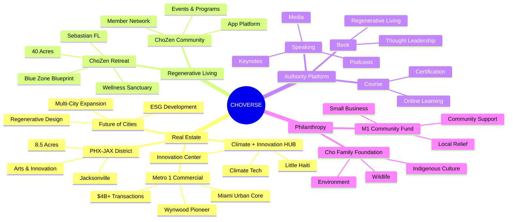

# THE FACE OF REGENERATIVE DEVELOPMENT
## 5-Slide Version

---

## SLIDE 1: THE PROBLEM

**You have 15 entities. Nobody sees the category.**

15+ projects across real estate, climate, arts, philanthropy.

All of it real. None of it connected.

Right now, people see: **"Interesting projects"**

What they should see: **"Tony Cho = Regenerative Development"**

---

**The gap is not the work.**

**The gap is: nobody sees you as the category owner.**

---

**SPEAKER NOTES:**
- Don't explain the problem. He knows it.
- Just name it clearly: "15 entities. Nobody sees the category."
- Pause. "The gap is not the work. The gap is: nobody sees you as the category owner."
- Move on.

---

## SLIDE 2: THE SOLUTION

**ChoVerse is the Mindvalley for Regenerative Development.**

---

**What is ChoVerse?**

Your AI-native central hub.

Where you place all your projects. Designed to keep coherence across your entire ecosystem and streamline communication between all entities.

The start of the larger ecosystem that follows.

---

**The Ecosystem Network:**

**All your projects in one place. Coherence across everything.**

Not 15 disconnected sites with no communication. One AI-native hub that keeps everything aligned.

---

**SPEAKER NOTES:**
- "ChoVerse is the Mindvalley for Regenerative Development."
- Pause.
- "What is ChoVerse? Your AI-native central hub."
- "Where you place all your projects. Designed to keep coherence across your entire ecosystem."
- "Streamlines communication between all entities."
- Point to diagram. "Here's how it works."
- "All 15 projects flowing through one hub. Everything stays aligned."
- "This is what makes you the face of Regenerative Development."
- Move on.

---

## SLIDE 3: WHAT IT LOOKS LIKE

**Vishen owns Personal Transformation.**

**You own Regenerative Development.**

---

**When you own the category:**

✓ **Conference organizers call you first** — keynotes, not panels

✓ **Publications reference you as the authority** — the category definer

✓ **Investors know your name before your projects** — capital starts with you

✓ **Every initiative amplified** — book, development, speaking = ecosystem distributes it

✓ **$12M raise flows naturally** — infrastructure shows the complete picture

---

**From:** "Developer with projects"

**To:** "The face of Regenerative Development"

---

**SPEAKER NOTES:**
- "Vishen owns Personal Transformation. You own Regenerative Development."
- Pause. Let that land.
- "Here's what that looks like."
- Read each bullet. Don't elaborate.
- Pause at the transformation line.
- "That's what we build."

---

## SLIDE 4: HOW WE BUILD IT

**60 days. 4 stages. Done.**

| Stage | Days | What Happens |
|-------|------|--------------|
| **1. Foundation** | 1-20 | ChoVerse + Tony Brand + Future of Cities |
| **2. Integration** | 21-40 | Connect all 15 entities |
| **3. Capital Ready** | 41-60 | Deploy InvestOS |
| **4. Activate** | 61+ | Fire AmplifyOS, raise begins |

**Day 60:** Category ownership infrastructure live.

**Week 12:** $12M raise-ready.

---

**SPEAKER NOTES:**
- "60 days. 4 stages. Done."
- Walk through the table quickly. Don't linger.
- "Day 60: infrastructure live. Week 12: raise-ready."
- Move to the deal.

---

## SLIDE 5: THE DEAL

**Why this deal is structured this way:**

Typically, we charge 30% upfront. This engagement is different.

We believe in you being the authority for regenerative development. The movement needs a leader who can take it where it needs to go. We want to help you get there.

This is more mission than transaction for us.

**Let us help you become institutional-ready.**

---

**$40K starts the build. 90% deferred.**

| | What You Pay |
|---|---|
| **Upfront** | $40,000 (10% vs. typical 30%) |
| **When $1.2M raised** | $180,000 |
| **When $3.6M raised** | $180,000 |
| **Total Cash** | $400,000 (3.3% of $12M raise) |
| **Our Equity** | $400,000 (vests when raise closes) |
| **Future Work** | At cost (no margin) |

**What you get:**
- ChoVerse ecosystem (all 15 entities)
- Category ownership positioning
- $12M raise infrastructure
- Institutional-ready business and future
- Long-term partnership

---

**The question is not whether we can put you there.**

**The question is whether you're ready to sit there.**

---

**When you're ready, we're here.**

---

**SPEAKER NOTES:**
- "Typically we charge 30% upfront. This is structured differently."
- "We believe in you being the authority for regenerative development."
- "The movement needs a leader. We want to help you get there."
- "This is more mission than transaction for us."
- Pause.
- "Let us help you become institutional-ready."
- Show the table. "$40K starts — 10% instead of our typical 30%."
- "90% deferred. Equity vests when raise closes. Future work at cost."
- Pause.
- "The question is not whether we can put you there."
- Pause.
- "The question is whether you're ready to sit there."
- Silence. Wait for response.

---

## END

**Light Brands**
dan@lightbrands.ai

**We're ready when you are.**
