# FUTURE OF CITIES
# Master Project Plan: AI-Powered Regenerative Ecosystem

> **Date:** February 25, 2026
>
> **Prepared for:** Tony Cho
>
> **Prepared by:** Light Brands Strategic Advisory
>
> **Classification:** Confidential
>
> **Document Type:** Execution Blueprint

---

## About This Document

This is not a proposal. This is a complete project plan.

It contains everything required to build, deploy, and operate an AI-powered ecosystem centered on **Future of Cities** — the platform that unifies Tony Cho's portfolio of ventures, amplifies his authority in regenerative placemaking, and creates the infrastructure for institutional capital formation.

This document is designed to be handed to any qualified technology team and executed as-is. It includes:

- Full ecosystem architecture with entity relationships
- Technical specifications for every major system component
- AI integration maps across every entity and touchpoint
- Community platform design with features, data models, and membership tiers
- Authority platform strategy covering book launch, online course, speaking, and content amplification
- Implementation roadmap with phasing, dependencies, and success criteria
- Capital funding strategy for financing the build
- Operating model with team requirements and ongoing cost structures

Every recommendation is **tool-agnostic**. We specify what needs to be built and why. The technology team executing the build selects the specific platforms, frameworks, and vendors based on their expertise and Tony's preferences.

---

## Executive Summary

### The Opportunity

Tony Cho has built something nobody else in the world can claim: a portfolio of ventures spanning real estate, climate innovation, hospitality, wellness, arts, and philanthropy — all connected by a singular, authentic vision of regenerative living. The track record is proven. Wynwood. Magic City. PHX-JAX. Climate HUB. ChoZen. The Cho Family Foundation. Over $2B in completed transactions, $2B+ in development impact, and 40%+ IRR across district-level exits.

The substance is real. What is missing is the infrastructure that makes all of it visible as one unified movement.

Right now, 15+ entities operate across disconnected websites, fragmented contact databases, and manual processes that were never designed to talk to each other. The vision is extraordinary. The infrastructure is the gap.

### The Solution: Future of Cities as the Central Hub

**Future of Cities** becomes the nerve center of the entire Cho Ventures ecosystem — the single platform through which every entity connects, every contact flows, every piece of content is amplified, and every data point is captured.

This is not a website redesign. It is the construction of an AI-powered operating system for a regenerative empire.

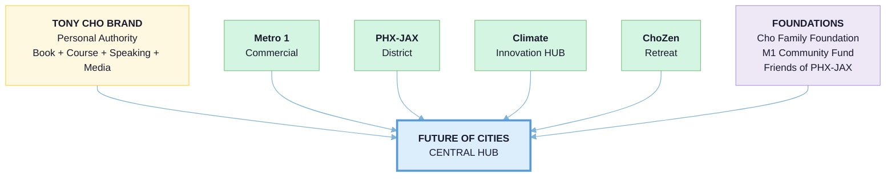
```mermaid
%%{init: {'theme': 'base', 'themeVariables': {'primaryColor': '#DCEEFB', 'primaryTextColor': '#1a1a2e', 'primaryBorderColor': '#5B9BD5', 'lineColor': '#7FB3D8', 'fontSize': '14px'}}}%%
flowchart TB
    classDef hub fill:#DCEEFB,stroke:#5B9BD5,color:#1a1a2e,stroke-width:3px
    classDef entity fill:#D5F5E3,stroke:#82C785,color:#1a1a2e
    classDef brand fill:#FFF8E1,stroke:#FFD54F,color:#1a1a2e
    classDef foundation fill:#EDE7F6,stroke:#B39DDB,color:#1a1a2e

    TONY["<b>TONY CHO BRAND</b><br/>Personal Authority<br/>Book + Course + Speaking + Media"]:::brand

    M1["<b>Metro 1</b><br/>Commercial"]:::entity
    PHX["<b>PHX-JAX</b><br/>District"]:::entity
    FOC["<b>FUTURE OF CITIES</b><br/>CENTRAL HUB"]:::hub
    CLIMATE["<b>Climate</b><br/>Innovation HUB"]:::entity
    CHOZEN["<b>ChoZen</b><br/>Retreat"]:::entity

    FOUND["<b>FOUNDATIONS</b><br/>Cho Family Foundation<br/>M1 Community Fund<br/>Friends of PHX-JAX"]:::foundation

    TONY --> FOC
    M1 --> FOC
    PHX --> FOC
    CLIMATE --> FOC
    CHOZEN --> FOC
    FOUND --> FOC
```

### What Gets Built

| Layer | Description | Impact |
|-------|-------------|--------|
| **Central Hub** | Unified CRM, contact database, automation engine, analytics dashboard — all running through Future of Cities | Every relationship across every entity in one system |
| **Entity Integrations** | Each venture connected to the hub with bidirectional data flow | Cross-entity intelligence, automated referrals, zero duplication |
| **AI Layer** | Intelligence services across every touchpoint — scoring, matching, content generation, personalization, automation | 100+ hours/month saved, 25%+ conversion lift, 5x content velocity |
| **Community Platform** | ChoZen member app with content, events, messaging, retreat integration, gamification | 10,000+ active community members within 12 months |
| **Authority Platform** | Book launch engine, online course, speaking pipeline, content amplification system | Category ownership in regenerative placemaking |

### The Strategic Recommendation

Based on our analysis of the PHX-JAX capital structure and the broader Cho Ventures portfolio, we believe the optimal path to funding this ecosystem is through a **raise-to-build strategy** — aligning the platform development with an institutional capital raise where the technology infrastructure is positioned as a critical component of the venture's value creation and investor reporting capability.

The existing $670K Sponsor & Platform allocation within the FoC QOF capital structure provides a natural budget window for the core platform build. Extended ecosystem components (community platform, authority engine) can be funded from operating cash flow as stabilization targets are met.

This approach means the ecosystem builds itself through the capital it helps attract.

### The Scale

| Dimension | Scope |
|-----------|-------|
| **Entities** | 8 ventures + 3 foundations + Tony Cho personal brand |
| **Platforms** | 14 interconnected digital platforms |
| **AI Touchpoints** | 40+ distinct AI integrations |
| **Phases** | 3 phases across 12-18 months |
| **Estimated Build Investment** | $400,000 - $650,000 (core) + $200,000 - $350,000 (extended) |
| **Estimated Monthly Operations** | $15,000 - $35,000 |

---

## How to Use This Document

This document is organized into ten sections, each designed to be actionable:

| Section | Purpose | Primary Audience |
|---------|---------|-----------------|
| **1. Executive Summary** | Vision and strategic context | Tony, leadership |
| **2. Ecosystem Architecture** | How everything connects through Future of Cities | Tony, tech leads, architects |
| **3. Central Hub** | The Future of Cities platform specification | Engineering team |
| **4. Entity Integrations** | How each venture connects to the hub | Engineering team, entity managers |
| **5. AI Integration Layer** | Every AI touchpoint and implementation approach | AI/ML team, engineering |
| **6. Community Platform** | ChoZen app specification | Product team, engineering |
| **7. Authority Platform** | Book, course, speaking, content systems | Marketing team, content team |
| **8. Implementation Roadmap** | Phasing, timelines, dependencies | Project management, leadership |
| **9. Capital & Funding Strategy** | How to finance the build | Tony, CFO, advisors |
| **10. Operating Model** | Ongoing team, costs, and maintenance | Operations, leadership |

The tech team should start with Sections 2-5 to understand what they are building. Tony and leadership should focus on Sections 1, 8, 9, and 10 for the strategic picture.

Every section is designed to stand alone. A team assigned to build the community platform can work from Section 6 without reading the rest.

---

# 2. Ecosystem Architecture

> *How everything connects through Future of Cities.*

---

## The Cho Ventures Portfolio

### Entity Overview

| Entity | Type | Location | Core Function | Status |
|--------|------|----------|---------------|--------|
| **Cho Ventures** | Holding Company | Miami | Portfolio management, strategic direction | Active |
| **Future of Cities** | Development Consortium / Central Hub | Multi-City | ESG real estate development, regenerative design, ecosystem orchestration | Active |
| **Metro 1 Commercial** | Real Estate Brokerage | Miami | Commercial property sales, leasing, tenant representation | Active |
| **PHX-JAX District** | Mixed-Use Development | Jacksonville, FL | 8.3-acre arts, innovation, creative workspace campus | Phase 2: Stabilization |
| **Climate + Innovation HUB** | Innovation Center | Miami (Little Haiti) | Climate tech incubation, programming, startups | Active |
| **ChoZen Retreat** | Wellness Retreat | Sebastian, FL | Retreats, eco-tourism, regenerative living | Active |
| **ChoZen Community** | Digital Platform | Digital | Member network, app, events, programs | To Be Built |
| **Cho Family Foundation** | 501(c)(3) | Miami | Environmental and cultural philanthropy | Active |
| **M1 Community Fund** | Donor-Advised Fund | Miami | Community relief and small business support | Active |
| **Friends of PHX-JAX** | Foundation | Jacksonville, FL | Arts and community support for PHX-JAX | Active |
| **Tony Cho Brand** | Personal Brand | Digital | Thought leadership, book, course, speaking, media | Active / Expanding |

### The Unified Mission

Every entity serves the same mission: **demonstrating that regenerative development creates superior returns for people, planet, and profit.**

- **Metro 1** proves it in commercial real estate transactions
- **Future of Cities** builds it into new developments and orchestrates the ecosystem
- **PHX-JAX** creates community through it
- **Climate HUB** incubates innovation for it
- **ChoZen** embodies it as a living laboratory
- **Foundations** extend its benefits to underserved communities
- **Tony Cho Brand** tells the story and builds the movement

---

## Future of Cities: The Central Hub

Future of Cities is the gravitational center of the entire ecosystem. Every entity connects through it. Every contact flows through it. Every data point is captured in it.

### Why Future of Cities (Not a New Entity)

Future of Cities is the natural center because:

1. **It already carries institutional credibility.** Future of Cities is the development consortium with a track record. Investors, partners, and media recognize it.
2. **It is the mission incarnate.** "Future of Cities" is not just a company — it is the idea. Regenerative placemaking, community-driven development, climate-conscious urbanism. The brand IS the mission.
3. **It is the investment vehicle.** The FoC QOF is the capital formation entity. The platform that supports investor relations, reporting, and asset management must live here.
4. **It connects every vertical.** Real estate (Metro 1, PHX-JAX), climate (HUB), wellness (ChoZen), philanthropy (foundations), authority (Tony's brand) — Future of Cities is the only entity that touches all of these naturally.

### Hub Architecture

```mermaid
%%{init: {'theme': 'base', 'themeVariables': {'primaryColor': '#DCEEFB', 'primaryTextColor': '#1a1a2e', 'lineColor': '#7FB3D8', 'fontSize': '13px'}}}%%
flowchart TB
    classDef core fill:#DCEEFB,stroke:#5B9BD5,color:#1a1a2e
    classDef support fill:#E0F2F1,stroke:#80CBC4,color:#1a1a2e
    classDef entity fill:#D5F5E3,stroke:#82C785,color:#1a1a2e
    classDef audience fill:#FFF8E1,stroke:#FFD54F,color:#1a1a2e

    subgraph HUB["FUTURE OF CITIES — CENTRAL HUB"]
        direction TB
        subgraph CORE["Core Systems"]
            CRM["<b>CRM CORE</b><br/>All Contacts · Pipelines<br/>Segments · Relationships"]:::core
            AI["<b>AI ENGINE</b><br/>Lead Scoring · Matching<br/>Generation · Prediction"]:::core
            AUTO["<b>AUTOMATION ENGINE</b><br/>Workflow Triggers · Email/SMS<br/>Cross-Entity Routing"]:::core
        end
        subgraph SUPPORT["Support Systems"]
            CONTENT["<b>CONTENT HUB</b><br/>Asset Library · Templates<br/>Publishing · Brand Assets"]:::support
            ANALYTICS["<b>ANALYTICS</b><br/>Unified Dashboard · Entity Reports<br/>Impact Metrics · AI Performance"]:::support
            ADMIN["<b>ADMIN PORTAL</b><br/>User Management · Permissions<br/>System Health · Configuration"]:::support
        end
    end

    subgraph INTEGRATION["INTEGRATION LAYER"]
        direction LR
        M1["Metro 1"]:::entity
        PHX["PHX-JAX"]:::entity
        CLIMATE["Climate HUB"]:::entity
        CHOZEN["ChoZen Retreat"]:::entity
        FOUND["Foundations"]:::entity
        TONY["Tony Cho Brand"]:::entity
    end

    subgraph AUDIENCE["AUDIENCE LAYER"]
        direction LR
        WEB["Websites"]:::audience
        SOCIAL["Social Media"]:::audience
        EVENTS["Events"]:::audience
        BOOKING["Booking"]:::audience
        EMAIL["Email/SMS"]:::audience
        APP["Community App"]:::audience
    end

    CORE --> SUPPORT
    HUB --> INTEGRATION
    INTEGRATION --> AUDIENCE
```

---

## Data Flow Architecture

### Contact Journey (Cross-Entity)

Every person who touches any Cho entity enters the unified system and is intelligently routed:

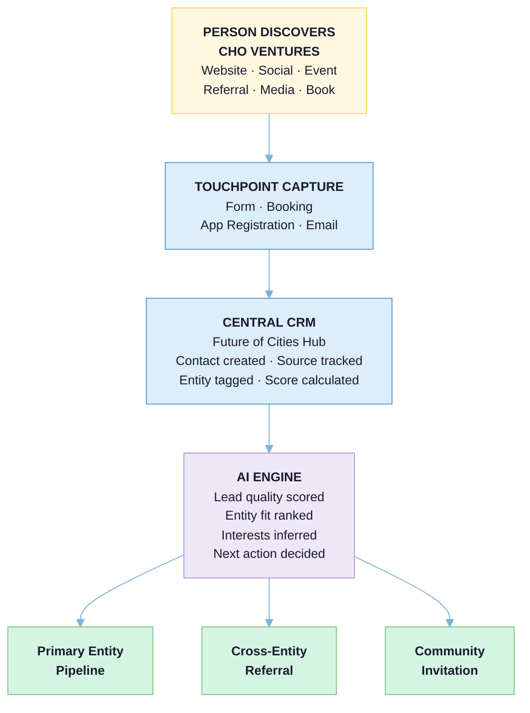
```mermaid
%%{init: {'theme': 'base', 'themeVariables': {'primaryColor': '#DCEEFB', 'primaryTextColor': '#1a1a2e', 'lineColor': '#7FB3D8', 'fontSize': '13px'}}}%%
flowchart TB
    classDef trigger fill:#FFF8E1,stroke:#FFD54F,color:#1a1a2e
    classDef process fill:#DCEEFB,stroke:#5B9BD5,color:#1a1a2e
    classDef ai fill:#EDE7F6,stroke:#B39DDB,color:#1a1a2e
    classDef route fill:#D5F5E3,stroke:#82C785,color:#1a1a2e

    DISCOVER["<b>PERSON DISCOVERS</b><br/><b>CHO VENTURES</b><br/>Website · Social · Event<br/>Referral · Media · Book"]:::trigger
    CAPTURE["<b>TOUCHPOINT CAPTURE</b><br/>Form · Booking<br/>App Registration · Email"]:::process
    CRM["<b>CENTRAL CRM</b><br/>Future of Cities Hub<br/>Contact created · Source tracked<br/>Entity tagged · Score calculated"]:::process
    ENGINE["<b>AI ENGINE</b><br/>Lead quality scored<br/>Entity fit ranked<br/>Interests inferred<br/>Next action decided"]:::ai

    PIPELINE["<b>Primary Entity<br/>Pipeline</b>"]:::route
    REFERRAL["<b>Cross-Entity<br/>Referral</b>"]:::route
    COMMUNITY["<b>Community<br/>Invitation</b>"]:::route

    DISCOVER --> CAPTURE --> CRM --> ENGINE
    ENGINE --> PIPELINE
    ENGINE --> REFERRAL
    ENGINE --> COMMUNITY
```

**Example:** A person attends a Climate HUB event. They enter the central CRM tagged as a Climate HUB contact. The AI engine scores them: high interest in sustainability, based in Miami, professional background in real estate. The system routes them into the Climate HUB nurture sequence AND flags them as a potential Metro 1 lead for ESG-focused commercial properties AND invites them to the ChoZen community app. One person, three entity touchpoints, zero manual work.

### The Cross-Entity Referral Engine

This is the highest-leverage capability in the entire ecosystem. Every person who interacts with any Cho entity is a potential:

| If they enter through... | They may also be... |
|--------------------------|---------------------|
| **Metro 1** (looking for space) | ChoZen retreat guest, Climate HUB sponsor, book reader |
| **PHX-JAX** (attending event) | Metro 1 tenant lead, community app member, course student |
| **Climate HUB** (startup/participant) | PHX-JAX tenant, FoC investor, foundation donor |
| **ChoZen Retreat** (wellness guest) | Community member, course student, foundation donor |
| **Book/Course** (reader/student) | ChoZen guest, community member, Climate HUB participant |
| **Foundations** (donor/volunteer) | ChoZen guest, book reader, FoC investor |

Currently, these connections are made manually, if at all. The AI-powered hub makes them automatic.

---

## Entity Relationship Model

### Unified Contact Schema

Every contact in the system has relationships to multiple entities:

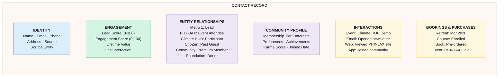
```mermaid
%%{init: {'theme': 'base', 'themeVariables': {'primaryColor': '#DCEEFB', 'primaryTextColor': '#1a1a2e', 'lineColor': '#7FB3D8', 'fontSize': '12px'}}}%%
flowchart TB
    classDef blue fill:#DCEEFB,stroke:#5B9BD5,color:#1a1a2e
    classDef green fill:#D5F5E3,stroke:#82C785,color:#1a1a2e
    classDef lavender fill:#EDE7F6,stroke:#B39DDB,color:#1a1a2e
    classDef gold fill:#FFF8E1,stroke:#FFD54F,color:#1a1a2e

    subgraph RECORD["CONTACT RECORD"]
        direction TB
        IDENTITY["<b>IDENTITY</b><br/>Name · Email · Phone<br/>Address · Source<br/>Source Entity"]:::blue
        ENGAGEMENT["<b>ENGAGEMENT</b><br/>Lead Score (0-100)<br/>Engagement Score (0-100)<br/>Lifetime Value<br/>Last Interaction"]:::green
        RELATIONSHIPS["<b>ENTITY RELATIONSHIPS</b><br/>Metro 1: Lead<br/>PHX-JAX: Event Attendee<br/>Climate HUB: Participant<br/>ChoZen: Past Guest<br/>Community: Premium Member<br/>Foundation: Donor"]:::lavender
        PROFILE["<b>COMMUNITY PROFILE</b><br/>Membership Tier · Interests<br/>Preferences · Achievements<br/>Karma Score · Joined Date"]:::lavender
        INTERACTIONS["<b>INTERACTIONS</b><br/>Event: Climate HUB Demo<br/>Email: Opened newsletter<br/>Web: Viewed PHX-JAX site<br/>App: Joined community"]:::gold
        COMMERCE["<b>BOOKINGS & PURCHASES</b><br/>Retreat: Mar 2026<br/>Course: Enrolled<br/>Book: Pre-ordered<br/>Event: PHX-JAX Gala"]:::gold
    end
```

### Entity Relationship Types

| Entity | Relationship Types |
|--------|-------------------|
| **Metro 1** | Lead, Client, Seller, Buyer, Tenant, Landlord |
| **Future of Cities** | Investor, Stakeholder, Partner, Board Member |
| **PHX-JAX** | Tenant, Visitor, Event Attendee, Vendor, JV Partner |
| **Climate HUB** | Startup Founder, Mentor, Sponsor, Participant, Alumni |
| **ChoZen Retreat** | Guest, Repeat Guest, Member, Volunteer, Staff |
| **Foundations** | Donor, Grantee, Volunteer, Beneficiary, Board Member |
| **Book** | Reader, Pre-Order, Reviewer, Bulk Buyer |
| **Course** | Student (Active), Alumni, Dropout, Certified |
| **Community** | Free Member, Essentials, Premium, Founder Circle |

A single contact can hold relationships across all entities simultaneously. The system tracks each independently and uses the combined profile for AI-powered personalization and routing.

---

## Technology Architecture Principles

The following principles govern all technology decisions:

### 1. Tool-Agnostic, Category-Specific

This plan specifies **what** needs to be built, not **which product** to use. For each component, we define the functional requirements. The tech team selects the specific platform.

| Component | Category | Requirements |
|-----------|----------|-------------|
| **CRM** | Customer Relationship Management Platform | Multi-entity support, automation, API access, custom fields, pipeline management |
| **Database** | Relational Database | JSON support, read replicas, full-text search, scalable |
| **API Layer** | Backend Framework | REST or GraphQL, WebSocket support, authentication middleware |
| **AI Services** | Large Language Model APIs | Content generation, embeddings, classification, function calling |
| **Email/SMS** | Communication Platform | Transactional + marketing, templates, analytics, deliverability |
| **Hosting** | Cloud Infrastructure | Auto-scaling, CDN, managed databases, monitoring |
| **Analytics** | Business Intelligence | Custom dashboards, event tracking, cross-entity reporting |
| **Mobile** | Mobile Application Framework | iOS + Android, push notifications, offline capability |
| **Authentication** | Identity Management | SSO, MFA, role-based access, social login |
| **Search** | Search Engine | Full-text, semantic, faceted, real-time indexing |
| **Storage** | Object Storage + CDN | Media hosting, scalable, global delivery |
| **Payments** | Payment Processing | Subscriptions, one-time, invoicing, multi-currency |

### 2. API-First Architecture

Every component communicates through well-defined APIs. No direct database access between services. This ensures:

- Any component can be replaced without rebuilding the system
- Third-party integrations connect through standard APIs
- Mobile, web, and automation clients share the same backend
- The system scales horizontally by adding capacity to individual services

### 3. Event-Driven Integration

Entity systems communicate through events, not direct calls:

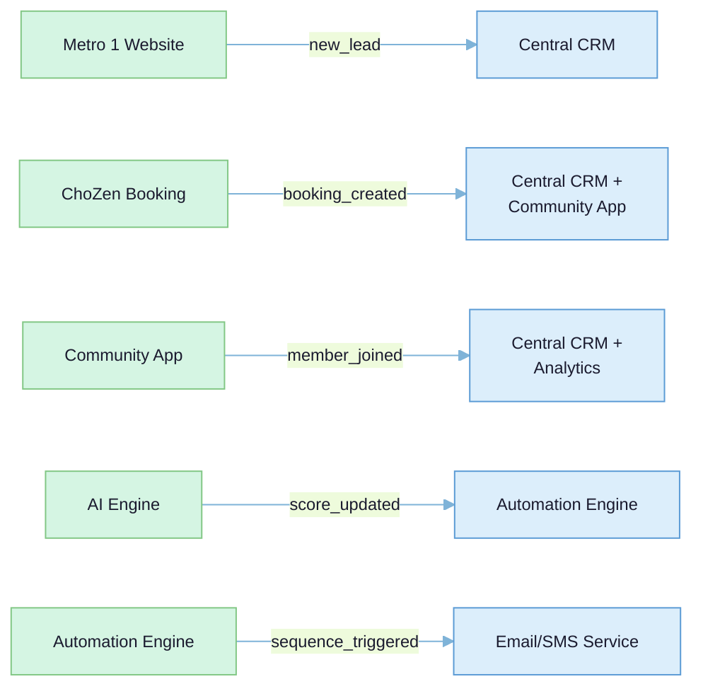
```mermaid
%%{init: {'theme': 'base', 'themeVariables': {'primaryColor': '#DCEEFB', 'primaryTextColor': '#1a1a2e', 'lineColor': '#7FB3D8', 'fontSize': '12px'}}}%%
flowchart LR
    classDef source fill:#D5F5E3,stroke:#82C785,color:#1a1a2e
    classDef event fill:#FFF8E1,stroke:#FFD54F,color:#1a1a2e
    classDef dest fill:#DCEEFB,stroke:#5B9BD5,color:#1a1a2e

    M1["Metro 1 Website"]:::source -->|new_lead| CRM1["Central CRM"]:::dest
    CZ["ChoZen Booking"]:::source -->|booking_created| CRM2["Central CRM +<br/>Community App"]:::dest
    APP["Community App"]:::source -->|member_joined| CRM3["Central CRM +<br/>Analytics"]:::dest
    AI["AI Engine"]:::source -->|score_updated| AE["Automation Engine"]:::dest
    AE2["Automation Engine"]:::source -->|sequence_triggered| SMS["Email/SMS Service"]:::dest
```

This decouples systems, improves reliability, and enables real-time cross-entity intelligence.

### 4. Security by Default

| Layer | Requirements |
|-------|-------------|
| **Authentication** | SSO across all platforms, MFA for admin, session management |
| **Authorization** | Role-based access, entity-level permissions, audit logging |
| **Data Protection** | Encryption at rest (AES-256), encryption in transit (TLS 1.3), PII masking |
| **Compliance** | GDPR consent management, CCPA compliance, data portability, right to deletion |
| **Monitoring** | Audit logs for all data access, anomaly detection, security alerts |
| **Payments** | PCI-DSS compliance for all payment processing |

### 5. Performance Targets

| Metric | Target |
|--------|--------|
| API Response Time | < 200ms (p95) |
| Webhook Processing | < 5 seconds |
| Email Delivery | < 30 seconds |
| Dashboard Load | < 3 seconds |
| AI Response | < 2 seconds |
| App Load Time | < 1.5 seconds |
| System Uptime | 99.5%+ |

---

# 3. Central Hub — Future of Cities Platform

> *The command center that unifies every entity, every contact, and every data point.*

---

## Overview

The Central Hub is the operational core of the entire ecosystem. It runs through Future of Cities and provides:

- **Unified CRM** — Every contact across every entity in one system
- **Automation Engine** — Intelligent workflows that route, nurture, and convert
- **Content Hub** — Centralized asset management and multi-channel publishing
- **Analytics Dashboard** — Real-time visibility across the entire portfolio
- **Admin Portal** — System management, permissions, and configuration

Everything else in this plan connects to the Central Hub. It must be built first.

---

## CRM Core

### Unified Contact Management

The CRM is the single source of truth for all relationships across the Cho Ventures ecosystem.

**Requirements:**

| Requirement | Description |
|-------------|-------------|
| **Multi-Entity Support** | A single contact can have relationships with multiple entities simultaneously. The CRM must support entity-level tagging, not siloed databases. |
| **Custom Properties** | Entity-specific fields (Metro 1 needs property preferences; ChoZen needs dietary restrictions; PHX-JAX needs lease terms) without cluttering the shared schema. |
| **Pipeline Management** | Entity-specific pipelines (Metro 1 deals, PHX-JAX leases, ChoZen bookings, Foundation donations) operating from the same contact base. |
| **Smart Segmentation** | Dynamic segments based on entity relationships, engagement scores, interests, behaviors, and AI-derived attributes. |
| **Lifecycle Tracking** | Track a contact's journey across entities over time — from first touch to every subsequent interaction. |
| **Merge & Deduplication** | Automatic detection and merging of duplicate contacts that enter through different entities. |
| **API Access** | Full REST or GraphQL API for bidirectional sync with entity systems, the community app, and the AI layer. |

### Contact Data Model

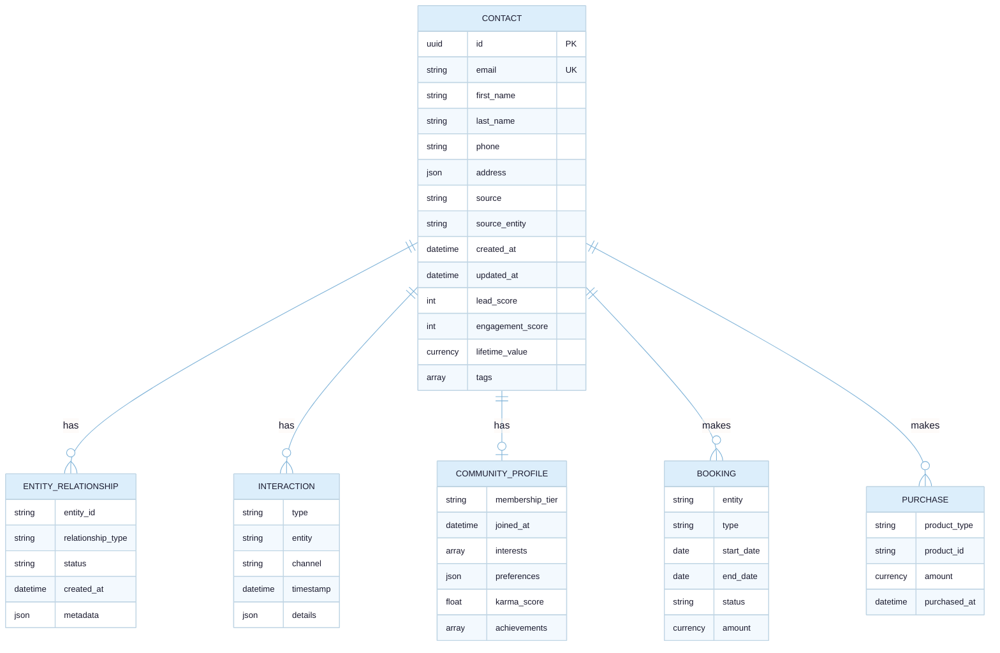
```mermaid
%%{init: {'theme': 'base', 'themeVariables': {'primaryColor': '#DCEEFB', 'primaryTextColor': '#1a1a2e', 'lineColor': '#7FB3D8', 'fontSize': '12px'}}}%%
erDiagram
    CONTACT {
        uuid id PK
        string email UK
        string first_name
        string last_name
        string phone
        json address
        string source
        string source_entity
        datetime created_at
        datetime updated_at
        int lead_score
        int engagement_score
        currency lifetime_value
        array tags
    }

    ENTITY_RELATIONSHIP {
        string entity_id
        string relationship_type
        string status
        datetime created_at
        json metadata
    }

    INTERACTION {
        string type
        string entity
        string channel
        datetime timestamp
        json details
    }

    COMMUNITY_PROFILE {
        string membership_tier
        datetime joined_at
        array interests
        json preferences
        float karma_score
        array achievements
    }

    BOOKING {
        string entity
        string type
        date start_date
        date end_date
        string status
        currency amount
    }

    PURCHASE {
        string product_type
        string product_id
        currency amount
        datetime purchased_at
    }

    CONTACT ||--o{ ENTITY_RELATIONSHIP : "has"
    CONTACT ||--o{ INTERACTION : "has"
    CONTACT ||--o| COMMUNITY_PROFILE : "has"
    CONTACT ||--o{ BOOKING : "makes"
    CONTACT ||--o{ PURCHASE : "makes"
```

### Pipeline Configuration

| Entity | Pipeline Name | Stages |
|--------|-------------|--------|
| **Metro 1** | Deal Pipeline | New Lead → Qualified → Showing → Offer → Negotiation → Under Contract → Closed |
| **Metro 1** | Leasing Pipeline | Inquiry → Tour Scheduled → Tour Complete → Application → Approved → Signed |
| **PHX-JAX** | Tenant Pipeline | Prospect → Tour → Application → Negotiation → Signed → Occupied |
| **PHX-JAX** | JV Pipeline | Introduction → Due Diligence → Term Sheet → Legal → Closed |
| **Climate HUB** | Startup Pipeline | Application → Screening → Interview → Accepted → Active → Graduated |
| **ChoZen** | Booking Pipeline | Inquiry → Quote Sent → Deposit → Confirmed → Pre-Arrival → Completed |
| **Foundation** | Donor Pipeline | Prospect → Cultivated → Solicited → Pledged → Received → Stewarded |
| **FoC** | Investor Pipeline | Prospect → Intro Meeting → Due Diligence → Commitment → Funded → Active |

---

## Automation Engine

### Core Workflow Categories

The automation engine handles intelligent, event-driven workflows across the entire ecosystem.

#### 1. New Lead Workflows

| Trigger | Workflow | Actions |
|---------|----------|---------|
| Form submitted on any entity website | New Lead Processing | Create/update contact → Tag source entity → Calculate lead score → Route to entity pipeline → Start nurture sequence |
| Event registration | Event Lead Capture | Create/update contact → Tag event → Send confirmation → Add to entity pipeline → Cross-entity flag if relevant |
| Booking inquiry | Booking Lead Processing | Create/update contact → Start booking pipeline → Send availability → Schedule follow-up |

#### 2. Cross-Entity Referral Workflows

| Trigger | Workflow | Actions |
|---------|----------|---------|
| AI entity match score > threshold | Cross-Entity Referral | Internal notification to target entity → Personalized outreach to contact → Track referral outcome |
| Metro 1 client interested in sustainability | Metro 1 → Climate HUB/ChoZen | Flag interest → Send ChoZen retreat info → Invite to Climate HUB event |
| Climate HUB participant seeking space | Climate HUB → Metro 1/PHX-JAX | Flag need → Introduce to Metro 1 broker → Share PHX-JAX availability |
| Course student in target geography | Course → PHX-JAX/ChoZen | Flag location → Invite to local events → Offer retreat discount |

#### 3. Engagement & Nurture Workflows

| Trigger | Workflow | Actions |
|---------|----------|---------|
| Engagement score drops below threshold | Re-engagement Sequence | AI selects personalized content → 3-email sequence → If no response, direct outreach |
| Contact inactive 60+ days | Win-Back Campaign | Value reminder → Exclusive offer → Personal note |
| Retreat guest post-stay | Post-Retreat Nurture | Thank you → Review request → Community app invitation → Return visit offer |
| Book purchase | Reader Journey | Welcome → Discussion guide → Course offer → Community invitation |

#### 4. Operational Workflows

| Trigger | Workflow | Actions |
|---------|----------|---------|
| Quarterly date trigger | Investor Reporting | Gather data from entities → Generate report draft → Route for review → Distribute to investors |
| Monthly date trigger | Foundation Reporting | Aggregate impact data → Generate narrative → Route for approval → Send to stakeholders |
| Weekly date trigger | Content Publishing | Queue content → AI optimization → Multi-channel publish → Track performance |

### Workflow Architecture

```mermaid
%%{init: {'theme': 'base', 'themeVariables': {'primaryColor': '#DCEEFB', 'primaryTextColor': '#1a1a2e', 'lineColor': '#7FB3D8', 'fontSize': '12px'}}}%%
flowchart TB
    classDef trigger fill:#FDECEA,stroke:#E8A09A,color:#1a1a2e
    classDef process fill:#EDE7F6,stroke:#B39DDB,color:#1a1a2e
    classDef action fill:#D5F5E3,stroke:#82C785,color:#1a1a2e

    subgraph TRIGGERS["TRIGGER LAYER"]
        direction LR
        T1["Form Submissions"]:::trigger
        T2["Booking Events"]:::trigger
        T3["Purchase Events"]:::trigger
        T4["Behavior Events"]:::trigger
        T5["Date/Time Triggers"]:::trigger
        T6["Score Changes"]:::trigger
        T7["Manual Triggers"]:::trigger
    end

    subgraph PROCESSING["PROCESSING LAYER"]
        direction LR
        P1["Condition Check"]:::process
        P2["Branch Logic"]:::process
        P3["Delay/Wait"]:::process
        P4["A/B Split"]:::process
        P5["AI Decision"]:::process
    end

    subgraph ACTIONS["ACTION LAYER"]
        direction LR
        A1["Send Email"]:::action
        A2["Send SMS"]:::action
        A3["Internal Notification"]:::action
        A4["CRM Update"]:::action
        A5["Segment Update"]:::action
        A6["Webhook"]:::action
        A7["Task Creation"]:::action
    end

    TRIGGERS --> PROCESSING --> ACTIONS
```

---

## Content Hub

### Centralized Content Management

All content across the ecosystem is managed through a unified content hub connected to the central CRM.

| Component | Description |
|-----------|-------------|
| **Asset Library** | All brand assets (logos, images, videos, documents) organized by entity with permission controls |
| **Template Library** | Email templates, social post templates, report templates — entity-branded but centrally managed |
| **Content Calendar** | Unified view of all content publishing across all entities and channels |
| **Multi-Channel Publishing** | Publish content to websites, email, social, community app, and newsletter from one interface |
| **Brand Guidelines** | Centralized brand rules ensuring visual and voice consistency across all entities |

### Content Types by Entity

| Entity | Content Types | Publishing Channels |
|--------|-------------|-------------------|
| **Future of Cities** | Thought leadership, project updates, industry insights | Website, LinkedIn, newsletter |
| **Metro 1** | Property listings, market reports, deal announcements | Website, email, LinkedIn |
| **PHX-JAX** | Event promotions, tenant spotlights, district updates | Website, Instagram, email |
| **Climate HUB** | Startup features, program updates, impact reports | Website, LinkedIn, email |
| **ChoZen** | Retreat experiences, wellness content, nature stories | Website, Instagram, YouTube, email |
| **Foundations** | Impact stories, donor recognition, program updates | Website, email |
| **Tony Cho Brand** | Book excerpts, speaking clips, personal essays | All channels |

---

## Analytics Dashboard

### The Command Center

A unified dashboard provides real-time visibility across the entire ecosystem.

#### Executive View

| Widget | Data Source | Metric |
|--------|-----------|--------|
| **Total Contacts** | CRM | Total + net new this month |
| **Active Pipeline Value** | CRM Pipelines | Sum across all entity pipelines |
| **Community Members** | Community App | Total + active rate |
| **Revenue Pipeline** | CRM + Booking | Projected revenue across entities |
| **Cross-Entity Referrals** | Automation Engine | Referrals generated + converted |
| **Content Performance** | Content Hub + Analytics | Reach, engagement, conversion |
| **AI Performance** | AI Engine | Automation ROI, accuracy, volume |

#### Entity Dashboards

Each entity gets its own dashboard view showing entity-specific KPIs:

| Entity | Key Dashboard Metrics |
|--------|---------------------|
| **Metro 1** | Leads, pipeline value, close rate, average deal size, response time |
| **PHX-JAX** | Occupancy rate, tenant pipeline, event attendance, NOI, rent roll |
| **Climate HUB** | Startups in program, funding raised, mentor engagement, impact metrics |
| **ChoZen** | Bookings, occupancy, NPS, repeat rate, revenue per guest |
| **Foundations** | Donations received, grants deployed, donor retention, impact reach |
| **FoC Investors** | Capital committed, distributions, NAV, reporting compliance |
| **Community** | Members, active rate, tier distribution, retention, MRR |
| **Authority** | Book sales, course enrollments, speaking engagements, content reach |

#### Impact View

| Metric | Description |
|--------|-------------|
| **Regenerative Projects** | Number of developments using regenerative principles |
| **Community Impact** | People directly served by foundations |
| **Climate Innovation** | Startups launched from Climate HUB, funding raised |
| **Wellness Reach** | Lives touched through ChoZen programs |
| **Affordable Housing** | Units delivered toward 20% commitment |
| **Philosophy Spread** | People exposed to regenerative placemaking principles (book + course + speaking) |

---

## Admin Portal

### System Administration

| Feature | Description |
|---------|-------------|
| **User Management** | Create, manage, and deactivate staff accounts across all entities |
| **Role-Based Access** | Define roles (admin, entity manager, sales, marketing, community manager) with granular permissions |
| **Entity Permissions** | Control which users can access which entity data |
| **Integration Health** | Monitor all system integrations, API status, sync status |
| **Audit Logging** | Track all data access and changes for compliance |
| **System Configuration** | Scoring model parameters, automation rules, content publishing settings |
| **AI Model Management** | Monitor AI performance, adjust thresholds, review flagged decisions |

### Role Definitions

| Role | Access | Entities |
|------|--------|----------|
| **Super Admin** | Full system access, configuration, user management | All |
| **Entity Admin** | Full access to specific entity, CRM, automation | Assigned entities |
| **Sales/Broker** | CRM read/write, pipeline management, contact management | Assigned entities |
| **Marketing** | Content hub, email campaigns, social publishing, analytics | All (read), assigned (write) |
| **Community Manager** | Community app admin, member management, event management | Community + ChoZen |
| **Finance/Reporting** | Analytics dashboards, financial reports, investor portal | FoC + assigned entities |
| **Foundation Manager** | Donor management, grant tracking, impact reporting | Foundations |
| **Read Only** | Dashboard viewing, report access | Assigned entities |

---

## Integration Requirements

### Website Integration

Every entity website must connect to the central hub:

| Integration Point | Method | Data Flow |
|-------------------|--------|-----------|
| **Lead Forms** | Webhook on form submission | Website → CRM (create contact, trigger workflow) |
| **Booking Forms** | Webhook on booking | Website → CRM + Booking System |
| **Analytics** | JavaScript tracking snippet | Website → Analytics (page views, behavior) |
| **Content** | API pull or headless CMS | Content Hub → Website (articles, listings) |
| **Chat/Support** | Embedded widget | Website ↔ CRM (conversation history) |

### Email/SMS Integration

| Feature | Requirement |
|---------|-------------|
| **Transactional Email** | Booking confirmations, password resets, receipts |
| **Marketing Email** | Newsletters, campaigns, nurture sequences |
| **SMS** | Booking reminders, event alerts, urgent communications |
| **Deliverability** | Authenticated sending domains, reputation management |
| **Personalization** | Dynamic content blocks based on CRM data |
| **Analytics** | Open rates, click rates, conversion tracking per entity |

### Payment Integration

| Use Case | Requirements |
|----------|-------------|
| **Retreat Bookings** | Deposits, full payments, cancellation refunds |
| **Course Purchases** | One-time payment, payment plans |
| **Community Memberships** | Monthly/annual subscriptions, tier upgrades/downgrades |
| **Event Tickets** | Free RSVP, paid tickets, discount codes |
| **Donations** | One-time, recurring, acknowledgment letters |
| **Merchandise** | Product catalog, inventory, shipping |

---

# 4. Entity Integration Specifications

> *How each venture connects to the Future of Cities central hub.*

---

## Integration Principles

Every entity integration follows the same pattern:

1. **Bidirectional sync** — Data flows from entity systems to the central hub AND from the hub back to entity systems
2. **Real-time events** — Critical actions (new leads, bookings, purchases) trigger immediately via webhooks
3. **Batch sync** — Historical data and bulk updates sync on schedule (hourly or daily)
4. **Entity autonomy** — Each entity retains its own operational tools. The hub adds intelligence on top, it does not replace entity-level systems.
5. **Graceful degradation** — If the hub is temporarily unavailable, entity systems continue operating independently

---

## Metro 1 Commercial

### Current State (Assumed)

Metro 1 operates as a commercial real estate brokerage with its own website, lead capture, property database, and deal tracking.

### Integration Architecture

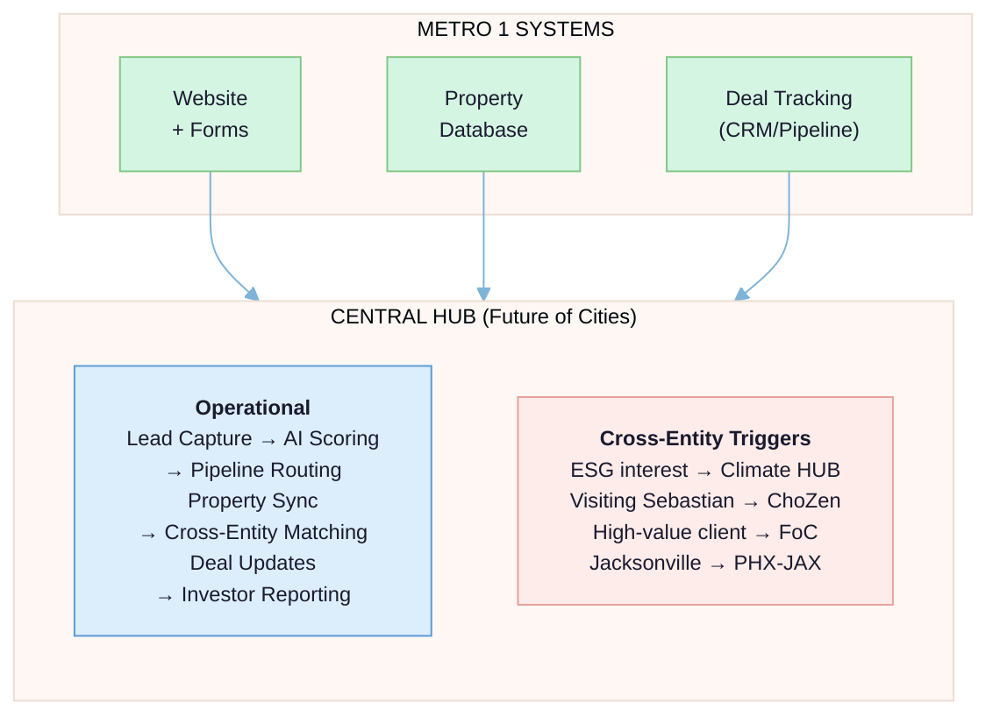
```mermaid
%%{init: {'theme': 'base', 'themeVariables': {'primaryColor': '#DCEEFB', 'primaryTextColor': '#1a1a2e', 'lineColor': '#7FB3D8', 'fontSize': '12px'}}}%%
flowchart TB
    classDef entity fill:#D5F5E3,stroke:#82C785,color:#1a1a2e
    classDef hub fill:#DCEEFB,stroke:#5B9BD5,color:#1a1a2e
    classDef trigger fill:#FDECEA,stroke:#E8A09A,color:#1a1a2e

    subgraph M1["METRO 1 SYSTEMS"]
        direction LR
        WEB["Website<br/>+ Forms"]:::entity
        PROP["Property<br/>Database"]:::entity
        DEAL["Deal Tracking<br/>(CRM/Pipeline)"]:::entity
    end

    subgraph HUB["CENTRAL HUB (Future of Cities)"]
        direction TB
        FLOW["<b>Operational</b><br/>Lead Capture → AI Scoring<br/>→ Pipeline Routing<br/>Property Sync<br/>→ Cross-Entity Matching<br/>Deal Updates<br/>→ Investor Reporting"]:::hub
        CROSS["<b>Cross-Entity Triggers</b><br/>ESG interest → Climate HUB<br/>Visiting Sebastian → ChoZen<br/>High-value client → FoC<br/>Jacksonville → PHX-JAX"]:::trigger
    end

    WEB --> HUB
    PROP --> HUB
    DEAL --> HUB
```

### Integration Points

| Integration | Direction | Method | Frequency |
|-------------|-----------|--------|-----------|
| Website lead forms | Metro 1 → Hub | Webhook | Real-time |
| Lead score & entity match | Hub → Metro 1 | API | Real-time |
| Property listings sync | Metro 1 → Hub | API | Hourly |
| Deal pipeline updates | Metro 1 ↔ Hub | Bidirectional API | Real-time |
| Client communications | Hub → Metro 1 | CRM automation | As triggered |
| Transaction history | Metro 1 → Hub | Batch sync | Daily |
| Cross-entity referrals | Hub → Metro 1 | Internal notification | As triggered |

### AI Enhancements for Metro 1

| AI Application | Input | Output | Value |
|----------------|-------|--------|-------|
| **Lead Qualification** | Form data, behavior, source | Quality score (0-100) | Prioritize broker time on highest-value leads |
| **Property Matching** | Client requirements, preferences, budget | Ranked property list | Faster, more accurate matches |
| **Market Intelligence** | Listings data, transaction trends, news | Market insights and alerts | Competitive advantage, timely opportunities |
| **Response Generation** | Inquiry context, property data, client profile | Draft email response | < 5 minute response time on all inquiries |
| **Listing Descriptions** | Property data, photos, comparables | Compelling listing copy | Consistent quality, faster turnaround |
| **Cross-Entity Identification** | Client profile, interests, behavior | Other entity opportunities | Revenue from cross-referrals |

---

## PHX-JAX Arts & Innovation District

### Current State

8.3-acre mixed-use development in Jacksonville's urban core. Phase 2 (Stabilization) in progress with ~116K SF of adaptive reuse buildings, active tenants, and event programming.

### Integration Architecture

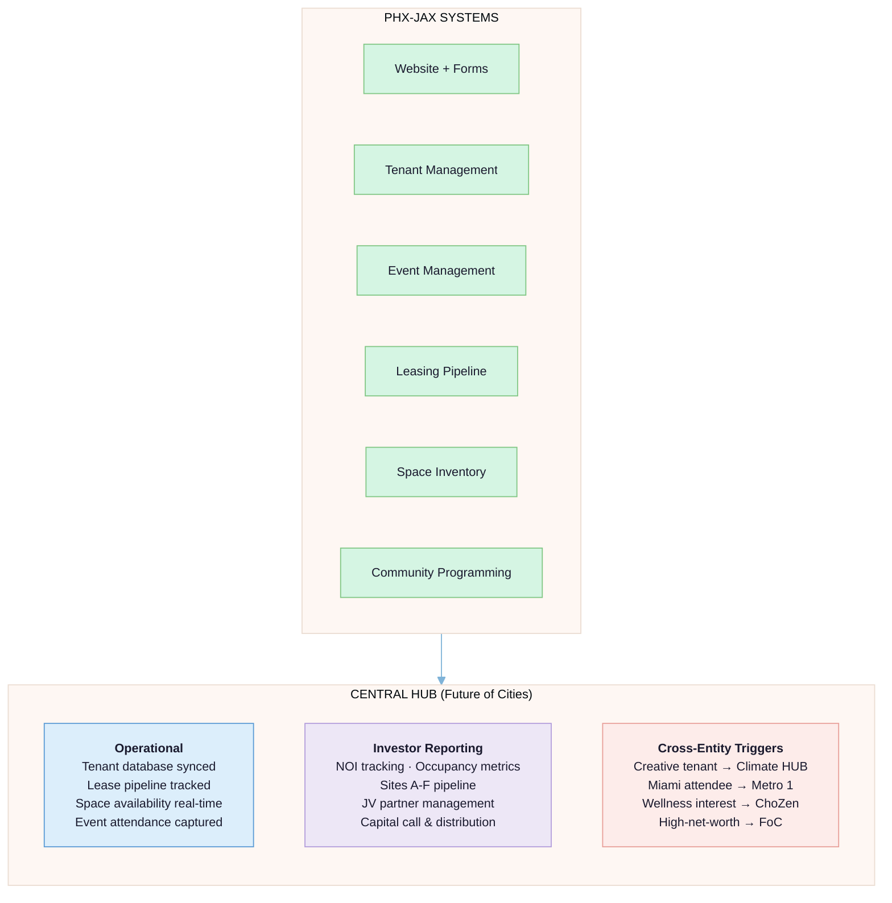
```mermaid
%%{init: {'theme': 'base', 'themeVariables': {'primaryColor': '#DCEEFB', 'primaryTextColor': '#1a1a2e', 'lineColor': '#7FB3D8', 'fontSize': '12px'}}}%%
flowchart TB
    classDef entity fill:#D5F5E3,stroke:#82C785,color:#1a1a2e
    classDef hub fill:#DCEEFB,stroke:#5B9BD5,color:#1a1a2e
    classDef investor fill:#EDE7F6,stroke:#B39DDB,color:#1a1a2e
    classDef trigger fill:#FDECEA,stroke:#E8A09A,color:#1a1a2e

    subgraph PHX["PHX-JAX SYSTEMS"]
        direction LR
        WEB["Website + Forms"]:::entity
        TENANT["Tenant Management"]:::entity
        EVENT["Event Management"]:::entity
        LEASE["Leasing Pipeline"]:::entity
        SPACE["Space Inventory"]:::entity
        PROG["Community Programming"]:::entity
    end

    subgraph HUB["CENTRAL HUB (Future of Cities)"]
        direction TB
        OPS["<b>Operational</b><br/>Tenant database synced<br/>Lease pipeline tracked<br/>Space availability real-time<br/>Event attendance captured"]:::hub
        INV["<b>Investor Reporting</b><br/>NOI tracking · Occupancy metrics<br/>Sites A-F pipeline<br/>JV partner management<br/>Capital call & distribution"]:::investor
        CROSS["<b>Cross-Entity Triggers</b><br/>Creative tenant → Climate HUB<br/>Miami attendee → Metro 1<br/>Wellness interest → ChoZen<br/>High-net-worth → FoC"]:::trigger
    end

    PHX --> HUB
```

### Integration Points

| Integration | Direction | Method | Frequency |
|-------------|-----------|--------|-----------|
| Website leads and inquiries | PHX-JAX → Hub | Webhook | Real-time |
| Tenant database | PHX-JAX ↔ Hub | Bidirectional API | Real-time |
| Event registrations | PHX-JAX → Hub | Webhook | Real-time |
| Event attendance tracking | PHX-JAX → Hub | Batch | Daily |
| Space availability | PHX-JAX → Hub | API | Hourly |
| Lease pipeline | PHX-JAX ↔ Hub | Bidirectional API | Real-time |
| NOI and financial metrics | PHX-JAX → Hub | Batch | Monthly |
| Development site status | PHX-JAX → Hub | Manual + API | As updated |

### Investor Reporting Module (PHX-JAX Specific)

Given the FoC QOF capital structure, the PHX-JAX integration must support institutional investor reporting:

| Report | Frequency | Data Sources | Output |
|--------|-----------|-------------|--------|
| **Portfolio Performance** | Quarterly | NOI, occupancy, rent roll | Formatted investor letter + data tables |
| **Development Pipeline** | Quarterly | Site status, JV progress, entitlements | Visual dashboard + written update |
| **Capital Account** | Quarterly | Contributions, distributions, fees | Per-investor capital account statement |
| **K-1 Documentation** | Annual | Tax data | Tax package for each investor |
| **Impact Report** | Annual | Affordable housing %, community metrics | ESG/impact report |
| **NAV Calculation** | Quarterly | Asset valuations, debt, working capital | Net Asset Value per unit |

### AI Enhancements for PHX-JAX

| AI Application | Input | Output | Value |
|----------------|-------|--------|-------|
| **Tenant Matching** | Prospect profile, space requirements | Best-fit space recommendations | Faster lease-up |
| **Rent Optimization** | Market data, comparables, demand signals | Optimal asking rent by space | Maximize NOI |
| **Event Recommendations** | Attendee profile, past behavior | Personalized event suggestions | Higher attendance |
| **Tenant Connections** | Tenant profiles, complementary interests | Collaboration suggestions | Community building |
| **Predictive Maintenance** | Maintenance history, building age, usage | Anticipated maintenance needs | Prevent costly surprises |
| **Sentiment Tracking** | Tenant feedback, survey responses, reviews | Satisfaction trends | Early warning on tenant risk |

---

## Climate + Innovation HUB

### Current State

Innovation center in Miami's Little Haiti focused on climate tech incubation, programming, and community.

### Integration Architecture

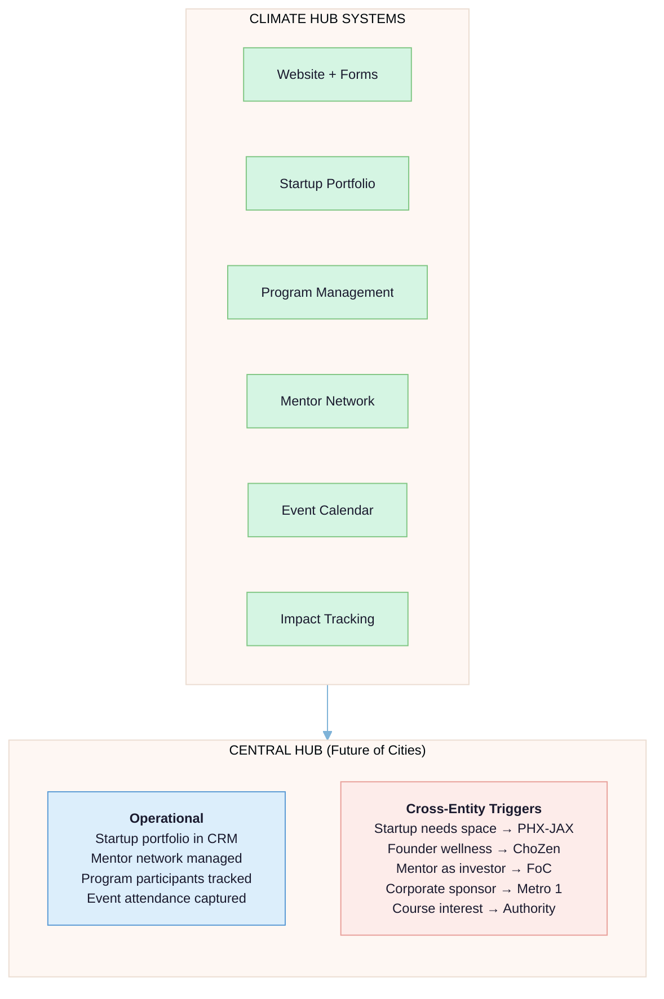
```mermaid
%%{init: {'theme': 'base', 'themeVariables': {'primaryColor': '#DCEEFB', 'primaryTextColor': '#1a1a2e', 'lineColor': '#7FB3D8', 'fontSize': '12px'}}}%%
flowchart TB
    classDef entity fill:#D5F5E3,stroke:#82C785,color:#1a1a2e
    classDef hub fill:#DCEEFB,stroke:#5B9BD5,color:#1a1a2e
    classDef trigger fill:#FDECEA,stroke:#E8A09A,color:#1a1a2e

    subgraph CLIMATE["CLIMATE HUB SYSTEMS"]
        direction LR
        WEB["Website + Forms"]:::entity
        STARTUP["Startup Portfolio"]:::entity
        PROGRAM["Program Management"]:::entity
        MENTOR["Mentor Network"]:::entity
        EVENTS["Event Calendar"]:::entity
        IMPACT["Impact Tracking"]:::entity
    end

    subgraph HUB["CENTRAL HUB (Future of Cities)"]
        direction TB
        OPS["<b>Operational</b><br/>Startup portfolio in CRM<br/>Mentor network managed<br/>Program participants tracked<br/>Event attendance captured"]:::hub
        CROSS["<b>Cross-Entity Triggers</b><br/>Startup needs space → PHX-JAX<br/>Founder wellness → ChoZen<br/>Mentor as investor → FoC<br/>Corporate sponsor → Metro 1<br/>Course interest → Authority"]:::trigger
    end

    CLIMATE --> HUB
```

### Integration Points

| Integration | Direction | Method | Frequency |
|-------------|-----------|--------|-----------|
| Website applications | Climate HUB → Hub | Webhook | Real-time |
| Startup portfolio data | Climate HUB ↔ Hub | Bidirectional API | Weekly |
| Mentor profiles | Climate HUB ↔ Hub | Bidirectional API | As updated |
| Program enrollment | Climate HUB → Hub | Webhook | Real-time |
| Event registrations | Climate HUB → Hub | Webhook | Real-time |
| Impact metrics | Climate HUB → Hub | Batch | Monthly |
| Funding and partnership data | Climate HUB → Hub | Batch | Quarterly |

### AI Enhancements for Climate HUB

| AI Application | Input | Output | Value |
|----------------|-------|--------|-------|
| **Startup Screening** | Application data, market analysis | Quality score + fit assessment | Faster, more consistent admissions |
| **Mentor Matching** | Startup needs, mentor expertise | Best-fit mentor recommendations | Higher quality mentorship |
| **Investor Matching** | Startup stage/sector, investor thesis | Aligned investor introductions | Higher funding success rate |
| **Curriculum Personalization** | Startup stage, gaps, goals | Tailored program path | Better outcomes |
| **Impact Measurement** | Activity data, outcomes, benchmarks | Automated impact scoring | Credible reporting |
| **Network Intelligence** | Participant profiles, interaction data | Collaboration opportunities | Denser, more valuable network |

---

## ChoZen Retreat

### Current State

40-acre wellness retreat in Sebastian, Florida. Retreats, eco-tourism, and regenerative living programming.

### Integration Architecture

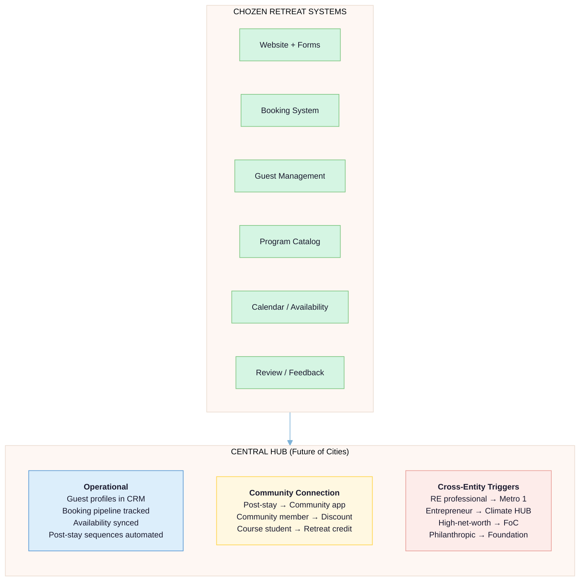
```mermaid
%%{init: {'theme': 'base', 'themeVariables': {'primaryColor': '#DCEEFB', 'primaryTextColor': '#1a1a2e', 'lineColor': '#7FB3D8', 'fontSize': '12px'}}}%%
flowchart TB
    classDef entity fill:#D5F5E3,stroke:#82C785,color:#1a1a2e
    classDef hub fill:#DCEEFB,stroke:#5B9BD5,color:#1a1a2e
    classDef community fill:#FFF8E1,stroke:#FFD54F,color:#1a1a2e
    classDef trigger fill:#FDECEA,stroke:#E8A09A,color:#1a1a2e

    subgraph CHOZEN["CHOZEN RETREAT SYSTEMS"]
        direction LR
        WEB["Website + Forms"]:::entity
        BOOK["Booking System"]:::entity
        GUEST["Guest Management"]:::entity
        PROG["Program Catalog"]:::entity
        CAL["Calendar / Availability"]:::entity
        REV["Review / Feedback"]:::entity
    end

    subgraph HUB["CENTRAL HUB (Future of Cities)"]
        direction TB
        OPS["<b>Operational</b><br/>Guest profiles in CRM<br/>Booking pipeline tracked<br/>Availability synced<br/>Post-stay sequences automated"]:::hub
        COMM["<b>Community Connection</b><br/>Post-stay → Community app<br/>Community member → Discount<br/>Course student → Retreat credit"]:::community
        CROSS["<b>Cross-Entity Triggers</b><br/>RE professional → Metro 1<br/>Entrepreneur → Climate HUB<br/>High-net-worth → FoC<br/>Philanthropic → Foundation"]:::trigger
    end

    CHOZEN --> HUB
```

### Integration Points

| Integration | Direction | Method | Frequency |
|-------------|-----------|--------|-----------|
| Website inquiries | ChoZen → Hub | Webhook | Real-time |
| Booking creation/update | ChoZen ↔ Hub | Bidirectional API | Real-time |
| Guest profiles | ChoZen → Hub | API | On booking creation |
| Availability calendar | ChoZen → Hub | API | Hourly |
| Post-stay feedback | ChoZen → Hub | Webhook | On submission |
| Program catalog | ChoZen → Hub | API | As updated |
| Community member status | Hub → ChoZen | API | Real-time |

### AI Enhancements for ChoZen

| AI Application | Input | Output | Value |
|----------------|-------|--------|-------|
| **Demand Prediction** | Historical bookings, seasonality, events | Forecasted demand by period | Optimize staffing and pricing |
| **Dynamic Pricing** | Demand forecast, occupancy, competitor data | Optimal price per night/program | Maximize revenue per available unit |
| **Booking Assistant** | Guest inquiry, availability, preferences | Conversational booking support | 24/7 booking capability |
| **Guest Personalization** | Profile, dietary needs, interests, history | Customized experience recommendations | Higher NPS, more repeat visits |
| **AI Concierge** | Guest questions, local knowledge, retreat data | Instant answers and suggestions | Enhanced guest experience |
| **Return Prediction** | Stay data, feedback, engagement | Repeat visit probability | Target re-engagement to likely returners |

---

## Foundations (Cho Family Foundation, M1 Community Fund, Friends of PHX-JAX)

### Integration Architecture

All three foundations share the same integration pattern:

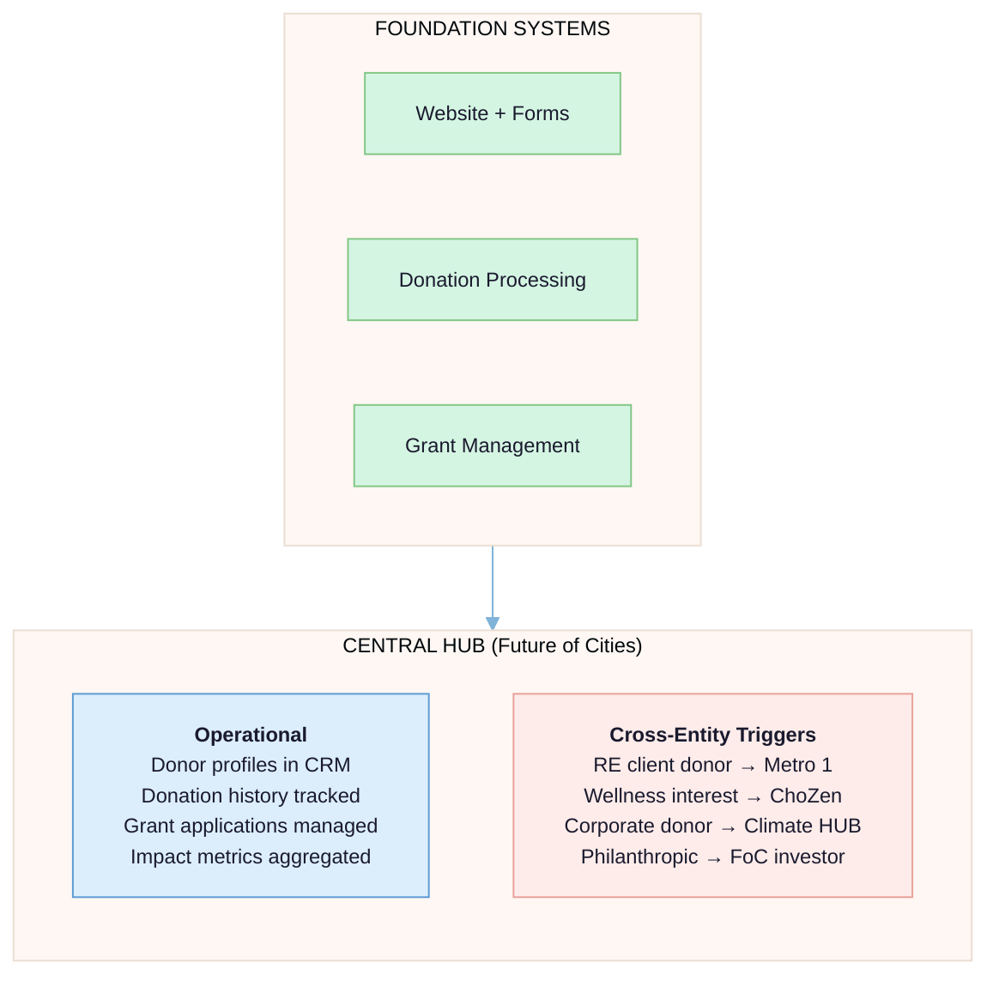
```mermaid
%%{init: {'theme': 'base', 'themeVariables': {'primaryColor': '#DCEEFB', 'primaryTextColor': '#1a1a2e', 'lineColor': '#7FB3D8', 'fontSize': '12px'}}}%%
flowchart TB
    classDef entity fill:#D5F5E3,stroke:#82C785,color:#1a1a2e
    classDef hub fill:#DCEEFB,stroke:#5B9BD5,color:#1a1a2e
    classDef trigger fill:#FDECEA,stroke:#E8A09A,color:#1a1a2e

    subgraph FOUND["FOUNDATION SYSTEMS"]
        direction LR
        WEB["Website + Forms"]:::entity
        DONATE["Donation Processing"]:::entity
        GRANT["Grant Management"]:::entity
    end

    subgraph HUB["CENTRAL HUB (Future of Cities)"]
        direction TB
        OPS["<b>Operational</b><br/>Donor profiles in CRM<br/>Donation history tracked<br/>Grant applications managed<br/>Impact metrics aggregated"]:::hub
        CROSS["<b>Cross-Entity Triggers</b><br/>RE client donor → Metro 1<br/>Wellness interest → ChoZen<br/>Corporate donor → Climate HUB<br/>Philanthropic → FoC investor"]:::trigger
    end

    FOUND --> HUB
```

### AI Enhancements for Foundations

| AI Application | Input | Output | Value |
|----------------|-------|--------|-------|
| **Donor Scoring** | Giving history, capacity indicators, engagement | Potential score + ask amount | Optimized fundraising |
| **Ask Optimization** | Donor history, timing, channel preference | Optimal ask timing and amount | Higher conversion rates |
| **Grant Screening** | Application data, criteria, past outcomes | Initial screening score | Faster, more consistent evaluation |
| **Impact Story Generation** | Impact data, beneficiary stories, metrics | Compelling narrative content | Stronger donor communications |
| **Thank You Generation** | Donation context, donor history, relationship | Personalized acknowledgment | Better donor stewardship |
| **Stewardship Automation** | Donor lifecycle, communication history | Next-best-action recommendations | Higher donor retention |

---

## Tony Cho Brand

### Integration Architecture

Tony's personal brand is the gravity that pulls the entire ecosystem together. It is not a separate entity — it is the connective tissue.

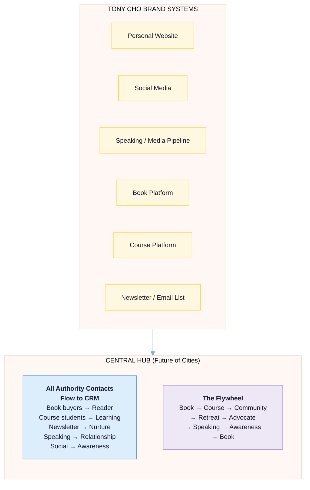
```mermaid
%%{init: {'theme': 'base', 'themeVariables': {'primaryColor': '#DCEEFB', 'primaryTextColor': '#1a1a2e', 'lineColor': '#7FB3D8', 'fontSize': '12px'}}}%%
flowchart TB
    classDef brand fill:#FFF8E1,stroke:#FFD54F,color:#1a1a2e
    classDef hub fill:#DCEEFB,stroke:#5B9BD5,color:#1a1a2e
    classDef flywheel fill:#EDE7F6,stroke:#B39DDB,color:#1a1a2e

    subgraph TONY["TONY CHO BRAND SYSTEMS"]
        direction LR
        WEB["Personal Website"]:::brand
        SOCIAL["Social Media"]:::brand
        SPEAK["Speaking / Media Pipeline"]:::brand
        BOOK_P["Book Platform"]:::brand
        COURSE_P["Course Platform"]:::brand
        NEWS["Newsletter / Email List"]:::brand
    end

    subgraph HUB["CENTRAL HUB (Future of Cities)"]
        direction TB
        CRM_FLOW["<b>All Authority Contacts</b><br/><b>Flow to CRM</b><br/>Book buyers → Reader<br/>Course students → Learning<br/>Newsletter → Nurture<br/>Speaking → Relationship<br/>Social → Awareness"]:::hub
        FLYWHEEL["<b>The Flywheel</b><br/>Book → Course → Community<br/>→ Retreat → Advocate<br/>→ Speaking → Awareness<br/>→ Book"]:::flywheel
    end

    TONY --> HUB
```

The Tony Cho Brand integration is covered in detail in Section 7 (Authority Platform).

---

# 5. AI Integration Layer

> *Intelligence at every touchpoint — the system that makes everything smarter.*

---

## Overview

The AI layer is not a standalone product. It is an intelligence fabric woven through every component of the ecosystem — scoring leads, matching contacts to entities, generating personalized content, automating workflows, and surfacing insights that no manual process could achieve.

This section maps every AI touchpoint across the ecosystem and specifies what each one does, what data it needs, and how it fits into the architecture.

---

## AI Architecture

The AI layer operates across three tiers:

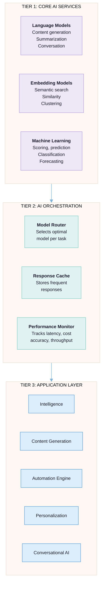
```mermaid
%%{init: {'theme': 'base', 'themeVariables': {'primaryColor': '#DCEEFB', 'primaryTextColor': '#1a1a2e', 'lineColor': '#7FB3D8', 'fontSize': '12px'}}}%%
flowchart TB
    classDef tier1 fill:#EDE7F6,stroke:#B39DDB,color:#1a1a2e
    classDef tier2 fill:#E0F2F1,stroke:#80CBC4,color:#1a1a2e
    classDef tier3 fill:#DCEEFB,stroke:#5B9BD5,color:#1a1a2e

    subgraph T1["TIER 1: CORE AI SERVICES"]
        direction LR
        LLM["<b>Language Models</b><br/>Content generation<br/>Summarization<br/>Conversation"]:::tier1
        EMBED["<b>Embedding Models</b><br/>Semantic search<br/>Similarity<br/>Clustering"]:::tier1
        ML["<b>Machine Learning</b><br/>Scoring, prediction<br/>Classification<br/>Forecasting"]:::tier1
    end

    subgraph T2["TIER 2: AI ORCHESTRATION"]
        direction LR
        ROUTER["<b>Model Router</b><br/>Selects optimal<br/>model per task"]:::tier2
        CACHE["<b>Response Cache</b><br/>Stores frequent<br/>responses"]:::tier2
        MONITOR["<b>Performance Monitor</b><br/>Tracks latency, cost<br/>accuracy, throughput"]:::tier2
    end

    subgraph T3["TIER 3: APPLICATION LAYER"]
        direction LR
        INTEL["Intelligence"]:::tier3
        CONTENT["Content Generation"]:::tier3
        AUTO["Automation Engine"]:::tier3
        PERSONAL["Personalization"]:::tier3
        CONVO["Conversational AI"]:::tier3
    end

    T1 --> T2 --> T3
```

---

## AI Applications by Function

### 1. Intelligence Services

These are the scoring, prediction, and analysis engines that power decision-making across the ecosystem.

| Application | Description | Input | Output | Model Type |
|-------------|-------------|-------|--------|------------|
| **Lead Scoring** | Score incoming leads by quality and fit | Demographics, behavior, source, engagement | Score 0-100 | Custom ML (gradient boosting or equivalent) |
| **Engagement Scoring** | Track contact engagement across entities | Activity recency, frequency, depth | Score 0-100 | Weighted scoring + ML refinement |
| **Entity Matching** | Determine which entities a contact should be routed to | Profile, interests, behavior, geography | Ranked entity list with confidence | Embedding similarity + rules engine |
| **Churn Prediction** | Identify community members likely to disengage | Engagement history, login frequency, content consumption | Probability 0-1 | Classification model |
| **Lifetime Value Prediction** | Estimate total value of a contact across the ecosystem | Transaction history, engagement, entity relationships | Currency value | Regression model |
| **Conversion Prediction** | Predict likelihood of pipeline advancement | Pipeline stage, engagement, demographics | Probability 0-1 | Classification model |

#### Lead Scoring Model Specification

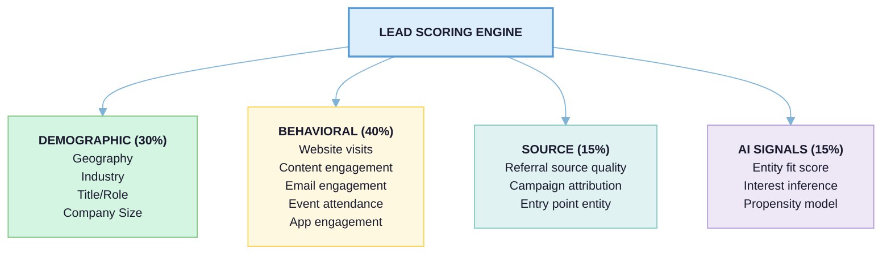
```mermaid
%%{init: {'theme': 'base', 'themeVariables': {'primaryColor': '#DCEEFB', 'primaryTextColor': '#1a1a2e', 'lineColor': '#7FB3D8', 'fontSize': '12px'}}}%%
flowchart TB
    classDef header fill:#DCEEFB,stroke:#5B9BD5,color:#1a1a2e,stroke-width:2px
    classDef demo fill:#D5F5E3,stroke:#82C785,color:#1a1a2e
    classDef behavior fill:#FFF8E1,stroke:#FFD54F,color:#1a1a2e
    classDef source fill:#E0F2F1,stroke:#80CBC4,color:#1a1a2e
    classDef ai fill:#EDE7F6,stroke:#B39DDB,color:#1a1a2e

    ENGINE["<b>LEAD SCORING ENGINE</b>"]:::header

    DEMO["<b>DEMOGRAPHIC (30%)</b><br/>Geography<br/>Industry<br/>Title/Role<br/>Company Size"]:::demo

    BEHAV["<b>BEHAVIORAL (40%)</b><br/>Website visits<br/>Content engagement<br/>Email engagement<br/>Event attendance<br/>App engagement"]:::behavior

    SRC["<b>SOURCE (15%)</b><br/>Referral source quality<br/>Campaign attribution<br/>Entry point entity"]:::source

    AISIG["<b>AI SIGNALS (15%)</b><br/>Entity fit score<br/>Interest inference<br/>Propensity model"]:::ai

    ENGINE --> DEMO
    ENGINE --> BEHAV
    ENGINE --> SRC
    ENGINE --> AISIG
```

### 2. Content Generation

AI generates personalized content across every communication channel.

| Application | Description | AI Approach |
|-------------|-------------|-------------|
| **Email Generation** | Draft personalized emails for nurture sequences, follow-ups, and campaigns | Language model with brand voice training, personalized with CRM data |
| **Subject Line Optimization** | Generate and A/B test email subject lines | Language model generates variants, ML selects based on historical performance |
| **Social Content Creation** | Transform long-form content into social posts | Language model with platform-specific formatting and brand voice |
| **Report Narrative** | Generate written narratives for investor and impact reports | Language model with structured data input, entity-specific templates |
| **Listing Descriptions** | Generate property listing descriptions for Metro 1 | Language model with property data, market context, and brand voice |
| **Impact Stories** | Create compelling narratives from foundation impact data | Language model with impact metrics, beneficiary stories, donor context |
| **Newsletter Curation** | Select and summarize content for weekly newsletter | Language model with engagement data and content library |

#### Content Generation Workflow

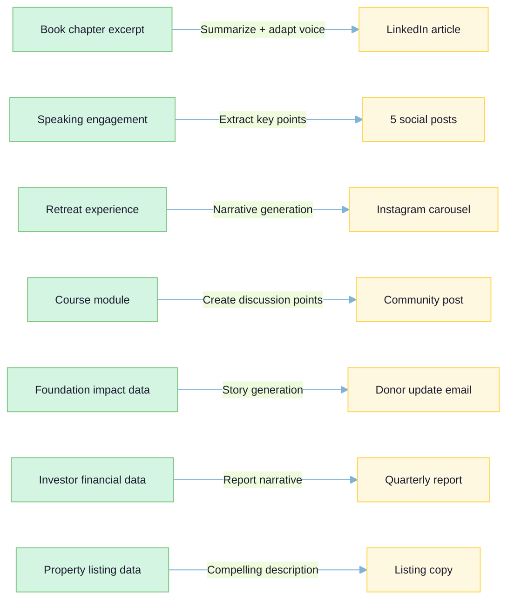
```mermaid
%%{init: {'theme': 'base', 'themeVariables': {'primaryColor': '#DCEEFB', 'primaryTextColor': '#1a1a2e', 'lineColor': '#7FB3D8', 'fontSize': '12px'}}}%%
flowchart LR
    classDef source fill:#D5F5E3,stroke:#82C785,color:#1a1a2e
    classDef transform fill:#EDE7F6,stroke:#B39DDB,color:#1a1a2e
    classDef output fill:#FFF8E1,stroke:#FFD54F,color:#1a1a2e

    S1["Book chapter excerpt"]:::source -->|Summarize + adapt voice| O1["LinkedIn article"]:::output
    S2["Speaking engagement"]:::source -->|Extract key points| O2["5 social posts"]:::output
    S3["Retreat experience"]:::source -->|Narrative generation| O3["Instagram carousel"]:::output
    S4["Course module"]:::source -->|Create discussion points| O4["Community post"]:::output
    S5["Foundation impact data"]:::source -->|Story generation| O5["Donor update email"]:::output
    S6["Investor financial data"]:::source -->|Report narrative| O6["Quarterly report"]:::output
    S7["Property listing data"]:::source -->|Compelling description| O7["Listing copy"]:::output
```

### 3. Automation Intelligence

AI powers the decision-making within the automation engine.

| Application | Description | AI Role |
|-------------|-------------|---------|
| **Smart Routing** | Route new contacts to the right entity and pipeline | AI analyzes profile and determines best-fit entity |
| **Sequence Selection** | Choose the right nurture sequence for each contact | AI selects based on segment, behavior, and entity fit |
| **Send Time Optimization** | Determine optimal email/SMS send times | ML analyzes historical engagement patterns per contact |
| **A/B Decision Engine** | Automatically select winning variants | Statistical model with AI-powered variant generation |
| **Escalation Intelligence** | Determine when automation should hand off to human | AI monitors engagement signals and flags high-value opportunities |

### 4. Personalization Engine

Every touchpoint is personalized based on the unified contact profile.

| Touchpoint | Personalization | Data Used |
|------------|----------------|-----------|
| **Community App Feed** | Content recommendations based on interests and behavior | Interests, consumption history, engagement patterns |
| **Email Content** | Dynamic content blocks personalized to recipient | Entity relationships, pipeline stage, preferences |
| **Event Recommendations** | Suggest relevant events across all entities | Location, interests, past attendance, entity relationships |
| **Retreat Recommendations** | Personalized retreat program suggestions | Wellness interests, past stays, community activity |
| **Course Learning Path** | Adaptive learning based on progress and goals | Course progress, quiz results, stated goals |
| **Member Connections** | Suggest connections with aligned members | Interest overlap, complementary profiles, geography |

### 5. Conversational AI

AI-powered chat and assistant capabilities across the ecosystem.

| Application | Context | Knowledge Base |
|-------------|---------|----------------|
| **Website Chat** | Entity websites — answer questions, capture leads | Entity-specific FAQs, services, team info |
| **Booking Assistant** | ChoZen Retreat — help with reservations | Availability, programs, pricing, retreat details |
| **Book Companion** | Authority platform — discuss book concepts | Full book content, discussion guides, related resources |
| **Course Tutor** | Course platform — support student learning | Course curriculum, exercises, supplementary materials |
| **Community Guide** | Community app — help members navigate | Community features, content library, event calendar |
| **Investor Portal** | FoC — answer investor questions | Quarterly reports, distributions, NAV data, compliance info |

#### Conversational AI Architecture

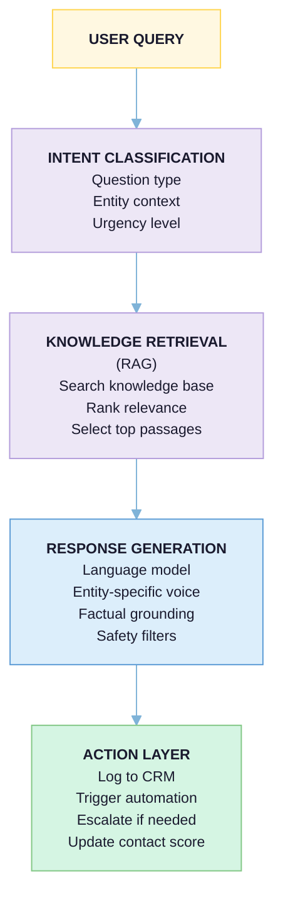
```mermaid
%%{init: {'theme': 'base', 'themeVariables': {'primaryColor': '#DCEEFB', 'primaryTextColor': '#1a1a2e', 'lineColor': '#7FB3D8', 'fontSize': '12px'}}}%%
flowchart TB
    classDef input fill:#FFF8E1,stroke:#FFD54F,color:#1a1a2e
    classDef process fill:#EDE7F6,stroke:#B39DDB,color:#1a1a2e
    classDef generate fill:#DCEEFB,stroke:#5B9BD5,color:#1a1a2e
    classDef action fill:#D5F5E3,stroke:#82C785,color:#1a1a2e

    QUERY["<b>USER QUERY</b>"]:::input
    INTENT["<b>INTENT CLASSIFICATION</b><br/>Question type<br/>Entity context<br/>Urgency level"]:::process
    KNOWLEDGE["<b>KNOWLEDGE RETRIEVAL</b><br/>(RAG)<br/>Search knowledge base<br/>Rank relevance<br/>Select top passages"]:::process
    RESPONSE["<b>RESPONSE GENERATION</b><br/>Language model<br/>Entity-specific voice<br/>Factual grounding<br/>Safety filters"]:::generate
    ACTION["<b>ACTION LAYER</b><br/>Log to CRM<br/>Trigger automation<br/>Escalate if needed<br/>Update contact score"]:::action

    QUERY --> INTENT --> KNOWLEDGE --> RESPONSE --> ACTION
```

---

## AI by Entity

### Central Hub AI

| Application | Priority | Impact |
|-------------|----------|--------|
| Lead Scoring | Phase 1 | High — improves routing accuracy across all entities |
| Entity Matching | Phase 1 | High — powers the cross-entity referral engine |
| Email Generation | Phase 1 | High — scales personalized outreach |
| Engagement Scoring | Phase 1 | Medium — enables re-engagement automation |
| Churn Prediction | Phase 2 | Medium — reduces community and pipeline churn |
| Content Recommendations | Phase 2 | High — drives community engagement |

### Metro 1 Commercial AI

| Application | Priority | Impact |
|-------------|----------|--------|
| Lead Qualification | Phase 1 | High — filters noise, surfaces quality leads |
| Property-Client Matching | Phase 2 | High — accelerates deal velocity |
| Market Intelligence | Phase 2 | Medium — informs strategy and client advisory |
| Listing Descriptions | Phase 1 | Medium — saves time, improves quality |
| Response Generation | Phase 1 | Medium — faster follow-up on inquiries |
| Comparable Analysis | Phase 3 | Medium — data-driven pricing support |

### Future of Cities AI

| Application | Priority | Impact |
|-------------|----------|--------|
| Impact Report Generation | Phase 1 | High — streamlines investor and stakeholder reporting |
| Stakeholder Communication | Phase 1 | Medium — personalized updates at scale |
| ESG Scoring | Phase 2 | Medium — quantifies regenerative impact |
| Trend Analysis | Phase 2 | Medium — informs development strategy |
| Policy Monitoring | Phase 3 | Low — long-term intelligence capability |

### PHX-JAX District AI

| Application | Priority | Impact |
|-------------|----------|--------|
| Tenant Matching | Phase 1 | High — accelerates leasing |
| Event Recommendations | Phase 2 | Medium — increases district engagement |
| Rent Optimization | Phase 2 | High — maximizes NOI |
| Predictive Maintenance | Phase 3 | Medium — reduces operating costs |
| Sentiment Tracking | Phase 2 | Low — monitors tenant satisfaction |

### Climate + Innovation HUB AI

| Application | Priority | Impact |
|-------------|----------|--------|
| Startup Screening | Phase 1 | High — improves program quality |
| Mentor Matching | Phase 2 | High — accelerates startup success |
| Investor Matching | Phase 2 | High — enables funding connections |
| Program Personalization | Phase 3 | Medium — tailors curriculum |
| Outcome Prediction | Phase 3 | Medium — informs program design |

### ChoZen Retreat AI

| Application | Priority | Impact |
|-------------|----------|--------|
| Booking Assistant | Phase 1 | High — converts inquiries, reduces manual booking work |
| Guest Personalization | Phase 2 | High — elevates the guest experience |
| Demand Prediction | Phase 2 | Medium — informs pricing and staffing |
| Dynamic Pricing | Phase 3 | Medium — optimizes revenue per available room |
| Return Visit Prediction | Phase 2 | Medium — enables targeted re-engagement |

### Foundation AI

| Application | Priority | Impact |
|-------------|----------|--------|
| Impact Story Generation | Phase 1 | High — compelling donor communication |
| Donor Potential Scoring | Phase 2 | High — prioritizes cultivation efforts |
| Grant Application Screening | Phase 2 | Medium — scales review process |
| Ask Optimization | Phase 3 | Medium — improves solicitation effectiveness |
| Thank You Generation | Phase 1 | Low — personalized stewardship at scale |

### Authority Platform AI

| Application | Priority | Impact |
|-------------|----------|--------|
| Book Companion | Phase 3 | High — extends book value, drives community |
| Course AI Tutor | Phase 3 | High — improves completion rates |
| Content Repurposing | Phase 2 | High — 5x content velocity |
| Social Content Generation | Phase 2 | Medium — consistent social presence |
| Newsletter Curation | Phase 2 | Medium — engaged subscriber base |

---

## Implementation Priority Matrix

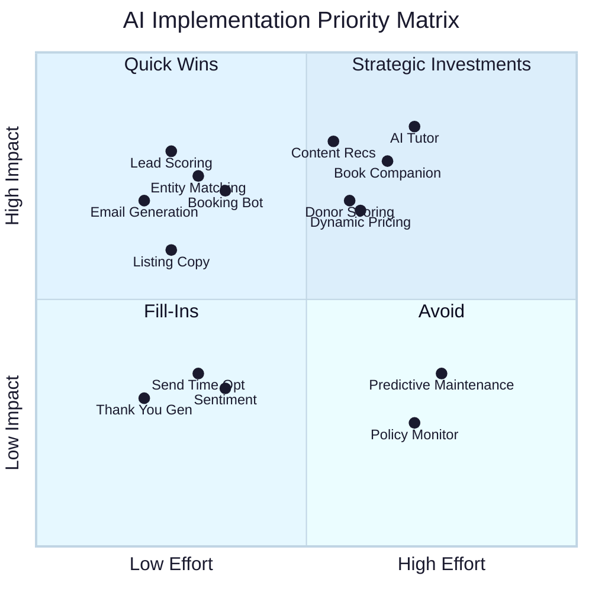
```mermaid
%%{init: {'theme': 'base', 'themeVariables': {'primaryColor': '#DCEEFB', 'primaryTextColor': '#1a1a2e', 'lineColor': '#7FB3D8', 'fontSize': '13px'}}}%%
quadrantChart
    title AI Implementation Priority Matrix
    x-axis Low Effort --> High Effort
    y-axis Low Impact --> High Impact
    quadrant-1 Strategic Investments
    quadrant-2 Quick Wins
    quadrant-3 Fill-Ins
    quadrant-4 Avoid
    Lead Scoring: [0.25, 0.80]
    Email Generation: [0.20, 0.70]
    Entity Matching: [0.30, 0.75]
    Booking Bot: [0.35, 0.72]
    Listing Copy: [0.25, 0.60]
    AI Tutor: [0.70, 0.85]
    Book Companion: [0.65, 0.78]
    Dynamic Pricing: [0.60, 0.68]
    Content Recs: [0.55, 0.82]
    Donor Scoring: [0.58, 0.70]
    Send Time Opt: [0.30, 0.35]
    Thank You Gen: [0.20, 0.30]
    Sentiment: [0.35, 0.32]
    Predictive Maintenance: [0.75, 0.35]
    Policy Monitor: [0.70, 0.25]
```

---

## Technical Specifications

### Model Selection Framework

The system should use the right model for each task. This is a framework for selection, not a vendor recommendation:

| Use Case | Model Category | Selection Criteria |
|----------|---------------|-------------------|
| **Long-Form Content** | Large Language Model (high capability) | Quality, safety, long context window |
| **Short-Form Content** | Language Model (fast, efficient) | Speed, cost efficiency, good enough quality |
| **Embeddings** | Embedding Model | Dimensionality, domain performance, integration ease |
| **Classification** | Custom ML or Fine-Tuned Model | Domain specificity, accuracy on your data |
| **Time Series** | Forecasting Model | Accuracy on sequential data, handling seasonality |
| **Scoring** | Gradient Boosting / Ensemble | Interpretability, performance on tabular data |

### AI Gateway Architecture

All AI requests should flow through a centralized gateway that handles routing, caching, rate limiting, and monitoring:

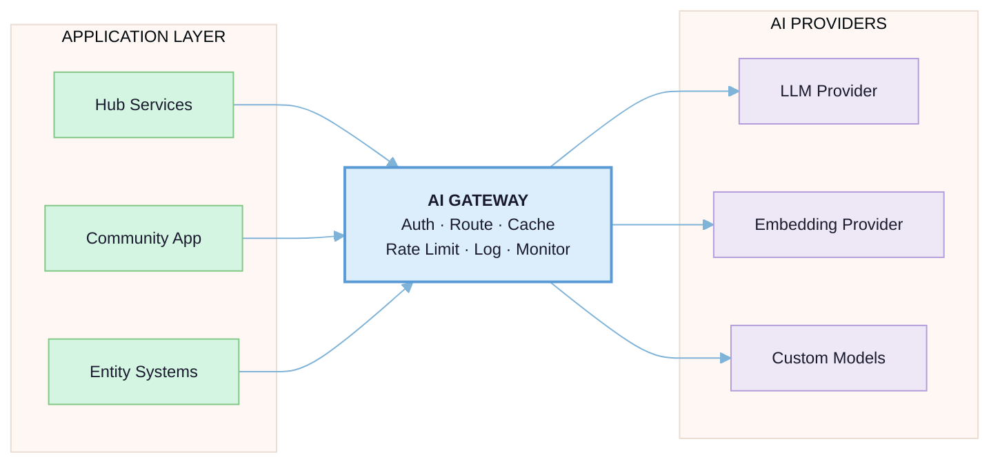
```mermaid
%%{init: {'theme': 'base', 'themeVariables': {'primaryColor': '#DCEEFB', 'primaryTextColor': '#1a1a2e', 'lineColor': '#7FB3D8', 'fontSize': '12px'}}}%%
flowchart LR
    classDef app fill:#D5F5E3,stroke:#82C785,color:#1a1a2e
    classDef gateway fill:#DCEEFB,stroke:#5B9BD5,color:#1a1a2e,stroke-width:2px
    classDef provider fill:#EDE7F6,stroke:#B39DDB,color:#1a1a2e

    subgraph APPS["APPLICATION LAYER"]
        HUB_SVC["Hub Services"]:::app
        COMM_APP["Community App"]:::app
        ENT_SYS["Entity Systems"]:::app
    end

    GW["<b>AI GATEWAY</b><br/>Auth · Route · Cache<br/>Rate Limit · Log · Monitor"]:::gateway

    subgraph PROVIDERS["AI PROVIDERS"]
        LLM["LLM Provider"]:::provider
        EMBED_P["Embedding Provider"]:::provider
        CUSTOM["Custom Models"]:::provider
    end

    HUB_SVC --> GW
    COMM_APP --> GW
    ENT_SYS --> GW
    GW --> LLM
    GW --> EMBED_P
    GW --> CUSTOM
```

**Key Gateway Requirements:**

| Requirement | Description |
|-------------|-------------|
| **Model Routing** | Automatically select the best model for each request type |
| **Response Caching** | Cache frequent identical requests to reduce cost and latency |
| **Rate Limiting** | Prevent runaway costs with per-service and per-model limits |
| **Fallback Logic** | If primary model is unavailable, route to backup |
| **Cost Tracking** | Track spend per application, per entity, per model |
| **Performance Monitoring** | Latency, error rates, token usage per endpoint |
| **Audit Logging** | Full request/response logging for debugging and compliance |

### Estimated AI Operating Costs

| Application | Monthly Volume (at scale) | Estimated Monthly Cost |
|-------------|--------------------------|----------------------|
| Email Generation | 50,000 emails | $500 - $1,000 |
| Content Recommendations | 1,000,000 requests | $200 - $500 |
| Conversational AI | 100,000 messages | $300 - $600 |
| Scoring Models | 500,000 scores | $100 - $200 |
| Content Generation | 10,000 pieces | $200 - $400 |
| Embeddings & Search | 2,000,000 queries | $100 - $300 |
| **Total Estimated** | | **$1,400 - $3,000/month** |

*Note: Costs are estimates based on current market rates. Actual costs depend on provider selection, negotiated rates, and optimization of caching and batching strategies.*

---

## Data Requirements

### Training Data Sources

| Model | Required Data | Source | Minimum Volume |
|-------|---------------|--------|----------------|
| Lead Scoring | Historical leads + outcomes | CRM | 1,000+ lead records with outcome data |
| Content Recommendations | User behavior + content metadata | Analytics + CMS | 10,000+ content interactions |
| Churn Prediction | Member activity history | Community platform | 6+ months of member data |
| Property Matching | Past transactions + client feedback | Metro 1 CRM | 500+ transaction records |
| Email Performance | Open/click rates by segment | Email platform | 50,000+ email sends with tracking |
| Donor Scoring | Giving history + engagement | Foundation CRM | 500+ donor records |

### Real-Time Data Feeds

| Data Stream | Source | Update Frequency | Consumers |
|-------------|--------|------------------|-----------|
| User Behavior | App/web analytics | Real-time | Personalization, scoring |
| Content Engagement | CMS + analytics | Real-time | Recommendations, reporting |
| Lead Activity | CRM webhooks | Real-time | Scoring, routing, automation |
| Member Status | Community platform | Real-time | Engagement, churn prediction |
| Booking Status | Reservation system | Real-time | Demand prediction, pricing |
| Transaction Events | Payment processor | Real-time | LTV calculation, reporting |

---

## AI Governance & Ethics

### Principles

| Principle | Implementation |
|-----------|----------------|
| **Transparency** | Clearly disclose AI use to users. Chatbots identify as AI. Generated content is labeled. |
| **User Control** | Users can opt out of AI-powered personalization. Members control their data sharing preferences. |
| **Privacy** | No personally identifiable information used in model training without explicit consent. Data anonymized for analytics. |
| **Fairness** | Regular bias audits on scoring models. Ensure lead and donor scoring does not discriminate on protected characteristics. |
| **Safety** | Content filters on all generation. Human review for high-stakes communications (investor reports, legal, financial). |
| **Accuracy** | Hallucination monitoring on all conversational AI. Factual grounding through retrieval-augmented generation. |

### Monitoring Requirements

| Metric | Threshold | Action |
|--------|-----------|--------|
| Hallucination Rate | < 1% | Increase retrieval grounding, add validation |
| Bias Indicators | Any flagged | Audit scoring model, retrain with balanced data |
| User Satisfaction | > 80% positive | Continuous improvement cycle |
| Cost per Action | Within budget | Optimize model selection, increase caching |
| Response Latency | < 2 seconds | Scale infrastructure, optimize prompts |
| Opt-Out Rate | < 10% | Review AI feature value, improve transparency |

---

## Success Metrics

| Category | Metric | Target |
|----------|--------|--------|
| **Efficiency** | Manual hours saved per month | 100+ hours |
| **Conversion** | AI-assisted conversion lift vs. baseline | +25% |
| **Engagement** | Personalized content engagement vs. generic | +40% |
| **Satisfaction** | AI feature NPS across users | > 50 |
| **Accuracy** | Scoring model accuracy (precision/recall) | > 85% |
| **Adoption** | Percentage of staff using AI features daily | > 70% |
| **Cost** | AI cost as percentage of revenue influenced | < 5% |
| **Speed** | Average AI response time | < 2 seconds |

---

# 6. Community Platform — ChoZen

> *Where the regenerative living movement comes together.*

---

## Overview

The ChoZen Community Platform is a mobile-first application that serves as the central gathering place for everyone touched by Tony Cho's vision of regenerative living. It connects book readers, course students, retreat guests, Climate HUB participants, and regenerative enthusiasts into a thriving, engaged community.

The platform serves three strategic purposes:

1. **Retention Engine** — Keeps every person who touches any entity engaged long-term
2. **Revenue Generator** — Membership subscriptions, retreat bookings, course sales, events
3. **Movement Builder** — Transforms individual interactions into a self-sustaining community

---

## User Personas

| Persona | Description | Primary Needs | Entry Point |
|---------|-------------|---------------|-------------|
| **The Seeker** | Discovered Tony through book or media | Education, inspiration, community | Book purchase, podcast |
| **The Practitioner** | Taking the course, applying principles | Structured learning, support, accountability | Course enrollment |
| **The Retreat Guest** | Visited ChoZen, wants to stay connected | Community, continued practice, return visits | Retreat booking |
| **The Developer** | Real estate/development professional | Professional network, methodology, projects | Metro 1, FoC, speaking event |
| **The Activist** | Climate and community focused | Action opportunities, like-minded network | Climate HUB, foundation |
| **The Entrepreneur** | Building a regenerative business | Resources, mentorship, partnerships | Climate HUB, course |

---

## Feature Specification

### Core Features (MVP)

| Category | Features | Description |
|----------|----------|-------------|
| **Onboarding** | Registration, profile setup, interest selection, guided tour | First-run experience that captures preferences and introduces the community |
| **Home Feed** | Personalized content feed, featured content, upcoming events, progress tracking | The daily destination — curated content and activity |
| **Content Library** | Articles, videos, guided practices, resource downloads | Tony's teachings and community knowledge, categorized and searchable |
| **Member Directory** | Search, basic profiles, direct messaging | Find and connect with other members |
| **Interest Groups** | Topic-based groups with discussion threads | Self-organizing communities within the community |
| **Events** | Event calendar, RSVP, virtual event access, retreat booking link | All ecosystem events in one place |
| **Notifications** | Push notifications, in-app alerts, email digests | Keep members engaged without being intrusive |

### Full Platform Features (Post-MVP)

| Category | Features |
|----------|----------|
| **Advanced Profiles** | Rich profiles with contributions, achievements, connections, entity relationships |
| **Discussion Forums** | Topic-based forums, threaded conversations, moderation tools |
| **Local Chapters** | Geography-based sub-communities for in-person meetups |
| **Mentorship** | AI-matched mentorship pairings between experienced and new members |
| **Live Sessions** | Streaming integration for live Q&As, workshops, meditation sessions |
| **Learning Paths** | AI-personalized educational journeys through content and courses |
| **In-App Purchases** | Retreat booking, merchandise, course enrollment, event tickets |
| **Gamification** | Full points, badges, levels, challenges, and leaderboards system |

---

## Membership Tiers

| Feature | Free ($0/mo) | Essentials ($29/mo) | Premium ($79/mo) | Founder ($199/mo) |
|---------|-------------|--------------------|-----------------|--------------------|
| Basic content library | 10 items | Full access | Full access | Full access |
| Community directory | View only | View + message | View + message | Priority placement |
| Events | View calendar | RSVP free events | All events | VIP access |
| Interest groups | 1 group | 3 groups | Unlimited | Create groups |
| Course access | Previews only | — | Full access | Full + bonus content |
| AI companion | Limited | Standard | Enhanced | Priority support |
| Retreat discount | — | 5% | 10% | 15% |
| Live sessions | — | Monthly | Weekly | Private sessions |
| Tony Cho access | — | — | Quarterly Q&A | Direct channel |
| Merchandise | — | — | Quarterly gift | Monthly gift |

### Revenue Projections (at scale)

| Tier | Members | Monthly Revenue |
|------|---------|----------------|
| Free | 15,000 | $0 |
| Essentials | 3,000 | $87,000 |
| Premium | 1,500 | $118,500 |
| Founder | 500 | $99,500 |
| **Total** | **20,000** | **$305,000/month** |

*These are target projections at 18-24 month maturity, not launch numbers.*

---

## Content Strategy

### Content Pillars

| Pillar | Topics | Source |
|--------|--------|--------|
| **Regenerative Philosophy** | Core principles, Tony's teachings, vision | Book, course, speaking |
| **Place & Design** | Architecture, urban design, development methodology | FoC projects, Metro 1, PHX-JAX |
| **Personal Practice** | Wellness, mindfulness, daily rituals, nature connection | ChoZen retreat programs |
| **Community Building** | Leadership, collaboration, movement building | Ecosystem experiences |
| **Climate & Impact** | Environment, sustainability, innovation, action | Climate HUB, foundations |
| **Retreat Life** | ChoZen experiences, nature, wildlife, seasonal content | ChoZen operations |

### Content Types & Frequency

| Type | Description | Frequency |
|------|-------------|-----------|
| **Articles** | Written thought leadership and educational content | 3-5 per week |
| **Videos** | Tony's teachings, retreat glimpses, interviews | 2-3 per week |
| **Guided Practices** | Meditation, breathwork, nature exercises | 2 per week |
| **Podcasts** | Audio conversations and interviews | 1 per week |
| **Courses** | Structured multi-module learning | Evergreen |
| **Live Sessions** | Real-time events with Tony and guests | Weekly |
| **Member Stories** | Community member features and projects | 2 per week |

---

## Technical Architecture

### System Architecture

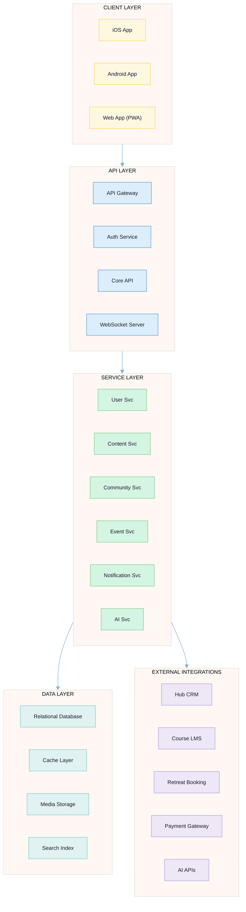
```mermaid
%%{init: {'theme': 'base', 'themeVariables': {'primaryColor': '#DCEEFB', 'primaryTextColor': '#1a1a2e', 'lineColor': '#7FB3D8', 'fontSize': '12px'}}}%%
flowchart TB
    classDef client fill:#FFF8E1,stroke:#FFD54F,color:#1a1a2e
    classDef api fill:#DCEEFB,stroke:#5B9BD5,color:#1a1a2e
    classDef service fill:#D5F5E3,stroke:#82C785,color:#1a1a2e
    classDef data fill:#E0F2F1,stroke:#80CBC4,color:#1a1a2e
    classDef external fill:#EDE7F6,stroke:#B39DDB,color:#1a1a2e

    subgraph CLIENT["CLIENT LAYER"]
        direction LR
        IOS["iOS App"]:::client
        ANDROID["Android App"]:::client
        PWA["Web App (PWA)"]:::client
    end

    subgraph API["API LAYER"]
        direction LR
        GW["API Gateway"]:::api
        AUTH["Auth Service"]:::api
        CORE["Core API"]:::api
        WS["WebSocket Server"]:::api
    end

    subgraph SERVICES["SERVICE LAYER"]
        direction LR
        USER["User Svc"]:::service
        CONT["Content Svc"]:::service
        COMM["Community Svc"]:::service
        EVT["Event Svc"]:::service
        NOTIF["Notification Svc"]:::service
        AISVC["AI Svc"]:::service
    end

    subgraph DATA["DATA LAYER"]
        direction LR
        DB["Relational Database"]:::data
        CACHE["Cache Layer"]:::data
        MEDIA["Media Storage"]:::data
        SEARCH["Search Index"]:::data
    end

    subgraph EXTERNAL["EXTERNAL INTEGRATIONS"]
        direction LR
        CRM["Hub CRM"]:::external
        LMS["Course LMS"]:::external
        BOOKING["Retreat Booking"]:::external
        PAY["Payment Gateway"]:::external
        AIAPI["AI APIs"]:::external
    end

    CLIENT --> API --> SERVICES --> DATA
    SERVICES --> EXTERNAL
```

### Technology Selection Criteria

| Layer | Category | Requirements |
|-------|----------|-------------|
| **Mobile** | Cross-platform or native mobile framework | iOS + Android from single codebase preferred, native performance, offline capability |
| **Web** | Progressive web framework | SEO capability, installable PWA, responsive design |
| **API** | Backend framework | RESTful or GraphQL, WebSocket support, authentication middleware, horizontal scaling |
| **Database** | Relational database | JSON support, read replicas, full-text search, reliable migrations |
| **Cache** | In-memory cache | Session management, real-time features, pub/sub capability |
| **Search** | Search engine | Full-text, faceted search, fast member and content discovery |
| **Storage** | Object storage + CDN | Scalable media hosting, global delivery, image optimization |
| **Auth** | Identity management | SSO integration with central hub, social login, MFA support |
| **Notifications** | Push notification service | iOS + Android push, scheduling, segmentation |

### Data Model

```mermaid
%%{init: {'theme': 'base', 'themeVariables': {'primaryColor': '#DCEEFB', 'primaryTextColor': '#1a1a2e', 'lineColor': '#7FB3D8', 'fontSize': '12px'}}}%%
erDiagram
    USER {
        uuid id PK
        string email UK
        string name
        string avatar_url
        string bio
        json preferences
        string timezone
        datetime created_at
        string crm_id FK
    }

    MEMBERSHIP {
        string tier
        datetime started_at
        datetime expires_at
        string status
    }

    INTEREST {
        string interest_name
    }

    ACHIEVEMENT {
        string badge_id
        datetime earned_at
        string category
    }

    GROUP {
        uuid id PK
        string name
        string description
        string type
        boolean is_private
        uuid created_by FK
    }

    POST {
        uuid author_id FK
        string body
        json attachments
        datetime created_at
    }

    EVENT {
        uuid id PK
        string title
        string description
        datetime start_time
        datetime end_time
        string type
        string location
        int capacity
        string status
        string entity
    }

    CONTENT {
        uuid id PK
        string title
        string type
        string body
        string media_url
        json metadata
        array tags
        string pillar
        string access_tier
        datetime published_at
        string entity_source
    }

    CONNECTION {
        uuid connected_user_id
        string status
        datetime connected_at
    }

    CONTENT_INTERACTION {
        uuid content_id FK
        string type
        datetime timestamp
    }

    ATTENDANCE {
        uuid user_id FK
        string status
        datetime registered_at
    }

    USER ||--o| MEMBERSHIP : "has"
    USER ||--o{ INTEREST : "selects"
    USER ||--o{ ACHIEVEMENT : "earns"
    USER }o--o{ GROUP : "joins"
    USER ||--o{ CONNECTION : "connects"
    USER ||--o{ CONTENT_INTERACTION : "interacts"
    GROUP ||--o{ POST : "contains"
    EVENT ||--o{ ATTENDANCE : "has"
    USER ||--o{ ATTENDANCE : "registers"
```

---

## AI-Powered Features

| Feature | Description | AI Approach |
|---------|-------------|-------------|
| **Personalized Feed** | Curate home feed based on interests and behavior | Collaborative filtering + content-based recommendations |
| **Connection Suggestions** | Recommend members with aligned interests | Profile embedding similarity + behavior clustering |
| **Learning Paths** | Personalized journeys through content and courses | Goal matching + progress analysis |
| **Q&A Companion** | Answer questions about book, course, and community | Retrieval-augmented generation over Tony's content |
| **Smart Search** | Semantic search across all content | Vector embeddings + keyword search |
| **Re-engagement** | Win back inactive members with personalized outreach | Churn prediction + targeted messaging |
| **Content Moderation** | Flag inappropriate content before publication | Classification model + language model review |
| **Onboarding Guide** | Help new members find their footing | Conversational AI with community context |

---

## Gamification System

### Engagement Mechanics

| Mechanic | Description |
|----------|-------------|
| **Experience Points (XP)** | Earned through content consumption, community participation, event attendance, course progress |
| **Member Levels** | Progressive levels unlocked by XP accumulation (Seedling → Sprout → Sapling → Tree → Canopy → Forest) |
| **Streaks** | Consecutive days of engagement, with escalating rewards |
| **Challenges** | Time-limited activities (30-day meditation challenge, community engagement week) |
| **Leaderboards** | Monthly and all-time rankings by XP, content creation, community contribution |

### Badge Categories

| Category | Examples |
|----------|---------|
| **Learning** | Book Reader, Course Completer, Practice Pro, Lifelong Learner |
| **Community** | Connector (10 connections), Discussion Leader (50 posts), Mentor, Welcome Committee |
| **Events** | Event Regular (5 events), Retreat Veteran, Summit Attendee, Global Citizen |
| **Contribution** | Content Creator, Volunteer, Ambassador, Chapter Leader |
| **Milestones** | 1 Year Member, 100 Day Streak, Top 10% Contributor, Founding Member |

---

## Integration with Ecosystem Hub

### Data Flows

| Direction | Data | Purpose |
|-----------|------|---------|
| **Community → Hub CRM** | New member registration, tier changes, activity events | Unified contact management, cross-entity scoring |
| **Hub CRM → Community** | Entity relationship data, pipeline updates | Personalization, cross-entity features |
| **Course Platform → Community** | Course progress, certificates | Profile enrichment, gamification |
| **Retreat Booking → Community** | Booking confirmations, past stays | Pre-arrival content, post-stay engagement |
| **Community → Automation Engine** | Engagement triggers, milestone events | Cross-entity nurture sequences |

### Event Types Published to Hub

| Event | Trigger | Hub Action |
|-------|---------|------------|
| `member.joined` | New registration | Create/update CRM contact, start welcome sequence |
| `member.upgraded` | Tier upgrade | Update CRM, trigger celebration sequence |
| `member.inactive` | 14+ days no activity | Trigger re-engagement automation |
| `content.consumed` | Article read, video watched | Update engagement score |
| `event.registered` | RSVP to event | Update CRM, send confirmation |
| `connection.made` | Two members connect | Log interaction, update social score |
| `retreat.booked` | Retreat reservation | Create booking in CRM, start pre-arrival sequence |

---

## Security & Privacy

| Measure | Implementation |
|---------|----------------|
| **Authentication** | OAuth 2.0, optional MFA, SSO with central hub |
| **Authorization** | Role-based access (member, moderator, admin, staff) |
| **Encryption** | TLS in transit, AES-256 at rest |
| **Privacy Compliance** | GDPR and CCPA compliant, consent management |
| **Content Moderation** | AI-assisted screening + human moderation team |
| **Data Controls** | Profile visibility settings (public, members-only, private) |
| **Message Controls** | Message permissions (anyone, connections only, none) |
| **Data Portability** | Export all personal data on request |
| **Account Deletion** | Full data deletion with right-to-be-forgotten compliance |

---

## Development Roadmap

### MVP (Months 1-3)

- Core authentication, profiles, and onboarding
- Basic content library with categories
- Member directory and direct messaging
- Event calendar and RSVP
- Push notifications
- Retreat booking integration
- 500+ founding members

### V1.0 (Months 4-6)

- Interest groups with discussion threads
- Enhanced content recommendations (AI-powered)
- Basic gamification (XP, levels, badges)
- Course platform integration
- AI Q&A companion
- Improved onboarding flow

### V2.0 (Months 7-12)

- Local chapters with geography-based features
- Full gamification system with challenges and leaderboards
- Live streaming integration
- Advanced AI features (personalized paths, mentor matching)
- In-app purchases and commerce
- Mentorship matching program

---

## Scaling Milestones

| Milestone | Members | Timeline | Revenue Target |
|-----------|---------|----------|----------------|
| Founding Members | 500 | MVP Launch | $0 (beta) |
| Early Adopters | 2,000 | Month 3 | $15,000/month |
| Growth Phase | 5,000 | Month 6 | $75,000/month |
| Scale Phase | 10,000 | Month 9 | $150,000/month |
| Maturity | 25,000+ | Month 18+ | $300,000+/month |

---

## Success Criteria

| Metric | Target |
|--------|--------|
| Monthly Active Users (MAU) | 80%+ of total members |
| Daily Active Users (DAU) | 30%+ of MAU |
| Average Session Length | 8+ minutes |
| Content Consumption | 5+ pieces per member per week |
| Retention (30-day) | 85%+ |
| Retention (90-day) | 70%+ |
| NPS Score | 60+ |
| Tier Conversion (Free → Paid) | 15%+ |
| Organic Referrals | 30%+ of new members from referrals |

---

# 7. Authority Platform — Tony Cho Brand

> *Positioning Tony Cho as the definitive voice in regenerative placemaking.*

---

## Overview

The Authority Platform transforms Tony Cho's lived experience, philosophy, and track record into a scalable, self-reinforcing engine of influence. It is built on four pillars:

1. **The Book** — *Generation Regeneration* — the definitive text on regenerative placemaking
2. **The Course** — A structured learning experience that deepens the book's principles
3. **The Speaking Engine** — A pipeline that generates, prepares, and amplifies speaking engagements
4. **The Content Amplification System** — A machine that turns every piece of source content into dozens of distribution-ready assets

Each pillar feeds the others. Together, they create a flywheel:

```mermaid
%%{init: {'theme': 'base', 'themeVariables': {'primaryColor': '#DCEEFB', 'primaryTextColor': '#1a1a2e', 'lineColor': '#7FB3D8', 'fontSize': '13px'}}}%%
flowchart LR
    classDef blue fill:#DCEEFB,stroke:#5B9BD5,color:#1a1a2e
    classDef green fill:#D5F5E3,stroke:#82C785,color:#1a1a2e
    classDef gold fill:#FFF8E1,stroke:#FFD54F,color:#1a1a2e
    classDef lavender fill:#EDE7F6,stroke:#B39DDB,color:#1a1a2e
    classDef coral fill:#FDECEA,stroke:#E8A09A,color:#1a1a2e

    BOOK["<b>Book</b>"]:::blue
    READERS["Readers"]:::green
    LIST["Email List"]:::green
    COURSE["Course Sales"]:::gold
    STUDENTS["Students"]:::gold
    COMMUNITY["Community"]:::lavender
    MEMBERS["Members"]:::lavender
    RETREATS["Retreats"]:::coral
    ADVOCATES["Advocates"]:::coral
    SPEAKING["Speaking"]:::blue
    AWARENESS["Awareness"]:::blue
    REACH["Mass Reach"]:::blue

    BOOK --> READERS --> LIST --> COURSE --> STUDENTS --> COMMUNITY --> MEMBERS --> RETREATS
    RETREATS --> ADVOCATES --> REACH --> BOOK
    STUDENTS --> SPEAKING --> AWARENESS --> REACH
```

---

## Pillar 1: Book Launch — *Generation Regeneration*

### Pre-Launch Campaign

**Timeline:** 12-16 weeks before publication

| Phase | Duration | Activities |
|-------|----------|------------|
| **List Building** | Weeks 1-8 | Cross-entity email promotion, content marketing from book themes, speaking engagements as book previews, partnership co-promotions, targeted paid media |
| **Influencer Outreach** | Weeks 3-7 | Advance copies to key voices in real estate, sustainability, urbanism, wellness |
| **Media Pitching** | Weeks 5-8 | Bylined articles, expert quotes, feature story pitches to business and industry press |
| **Pre-Order Campaign** | Weeks 7-10 | Landing page with bonuses, 7-email nurture sequence, social countdown, influencer push |
| **Launch Week** | Week 11 | Full email blast, podcast blitz, live events, testimonial push, review requests |

**Pre-Launch Target:** 25,000+ email subscribers before publication

### Pre-Order Campaign Components

| Component | Description |
|-----------|-------------|
| **Landing Page** | Book overview, Tony's credibility, testimonials, pre-order bonuses |
| **Bonus Package** | First chapter preview, exclusive video series, community app early access |
| **Email Sequence** | 7-email nurture from awareness to pre-order conversion |
| **Social Campaign** | Daily content countdown across all platforms |
| **Influencer Push** | Coordinated sharing from key voices |

### Launch Week Activation

| Day | Activity |
|-----|----------|
| Day 1 | Book available everywhere. Full email blast to entire list. Social media blitz across all entity accounts. |
| Day 2-3 | Podcast appearances (3-4 per day). Media interviews. Book excerpt publications. |
| Day 4-5 | Live virtual event with Tony. Community app celebration. Q&A session for pre-order buyers. |
| Day 6-7 | Testimonial push. Review request campaign. Sustained social promotion. Best-seller list tracking. |

### Launch Automation

```mermaid
%%{init: {'theme': 'base', 'themeVariables': {'primaryColor': '#DCEEFB', 'primaryTextColor': '#1a1a2e', 'lineColor': '#7FB3D8', 'fontSize': '12px'}}}%%
flowchart TB
    classDef trigger fill:#FFF8E1,stroke:#FFD54F,color:#1a1a2e,stroke-width:2px
    classDef action fill:#D5F5E3,stroke:#82C785,color:#1a1a2e
    classDef warn fill:#FDECEA,stroke:#E8A09A,color:#1a1a2e

    PRE["<b>PRE-ORDER TRIGGER</b>"]:::trigger
    PRE --> PA1["Confirmation email"]:::action
    PRE --> PA2["Bonus content delivery"]:::action
    PRE --> PA3["Pre-launch nurture (5 emails)"]:::action
    PRE --> PA4["Launch day alert"]:::action

    PURCHASE["<b>PURCHASE TRIGGER</b>"]:::trigger
    PURCHASE --> PB1["Welcome sequence (3 emails)"]:::action
    PURCHASE --> PB2["Review request (14 days)"]:::action
    PURCHASE --> PB3["Community app invitation"]:::action
    PURCHASE --> PB4["Course offer (21 days)"]:::action

    NONBUYER["<b>NON-BUYER SEGMENT</b>"]:::warn
    NONBUYER --> PC1["Reminder sequence (2 emails)"]:::action
    NONBUYER --> PC2["Testimonial push"]:::action
    NONBUYER --> PC3["Limited-time bonus offer"]:::action
```

### Book Companion AI

| Feature | Description |
|---------|-------------|
| **Concept Explainer** | AI chatbot that explains book concepts in conversational depth |
| **Discussion Guide** | AI-generated questions for book clubs and reading groups |
| **Implementation Support** | AI helps readers apply regenerative principles to their context |
| **Progress Companion** | AI tracks reading engagement and suggests next steps |

### Book Launch Success Criteria

| Metric | Target |
|--------|--------|
| Pre-launch email subscribers | 25,000+ |
| Pre-orders | 2,000+ |
| Launch week sales | 5,000+ |
| Podcast appearances (first 90 days) | 50+ |
| Online reviews | 100+ within 30 days |
| Evergreen sales funnel | Operational and converting |

---

## Pillar 2: Online Course

### Course Architecture

**Title:** *Regenerative Living* (or as determined by Tony)

The course translates the book's philosophy into a structured, actionable learning experience.

| Module | Title | Content |
|--------|-------|---------|
| **Module 1** | The Regenerative Philosophy | Tony's story, core principles, why regenerative matters now |
| **Module 2** | Regenerative Principles | Biomimicry, systems thinking, circularity, living systems design |
| **Module 3** | Regenerative Place | Site selection, design principles, case studies from Wynwood, PHX-JAX, Magic City |
| **Module 4** | Regenerative Practice | Daily integration, personal sustainability, nature connection |
| **Module 5** | Regenerative Community | Building movements, stakeholder engagement, community-driven development |
| **Module 6** | Integration & Impact | Putting it all together, measuring success, capstone project |

### Course Platform Features

| Feature | Description |
|---------|-------------|
| **Video Lessons** | High-quality filmed content with Tony teaching (8-15 minutes each) |
| **Worksheets** | Downloadable implementation guides for each module |
| **AI Companion** | 24/7 learning support — answers questions, coaches application, assesses understanding |
| **Live Sessions** | Monthly live Q&A with Tony for enrolled students |
| **Community Space** | Course-specific discussion area within the ChoZen community app |
| **Progress Tracking** | Module completion, quiz scores, badges, certificates |
| **Mobile Access** | Full course available through the ChoZen community app |

### AI Course Companion

| Capability | Description |
|------------|-------------|
| **Concept Q&A** | Answer questions about course material using the full curriculum as knowledge base |
| **Application Coaching** | Help students apply regenerative principles to their specific context |
| **Progress Assessment** | Evaluate understanding through open-ended conversation |
| **Personalized Paths** | Suggest focus areas based on student's goals and background |
| **Capstone Support** | Guide students through their final project |

### Certification Tiers

| Tier | Requirements | Benefits |
|------|--------------|----------|
| **Reader** | Complete the book | Community app access (free tier) |
| **Practitioner** | Complete the online course | Certificate, 10% retreat discount, community recognition |
| **Professional** | Course + capstone project | Alumni network, referral program, speaking consideration |
| **Ambassador** | Above + community contribution (100+ hours) | Co-creation opportunities, event speaking, chapter leadership |

### Course Integration with Ecosystem

| Integration | How It Works |
|-------------|-------------|
| **Community App** | Course content accessible through the app, progress synced to profile |
| **Retreat Credits** | Course completion earns a retreat discount |
| **Climate HUB** | Professional-tier graduates eligible to mentor Climate HUB startups |
| **Foundations** | Alumni invited to volunteer opportunities |
| **Speaking** | Top graduates featured at PHX-JAX and Climate HUB events |

### Course Pricing Options

| Package | Price | Includes |
|---------|-------|---------|
| **Self-Paced** | $497 | Full course, AI companion, worksheets, certificate |
| **Cohort** | $997 | Above + live sessions with Tony, cohort community, capstone feedback |
| **VIP** | $2,497 | Above + 1-on-1 session with Tony, retreat credit ($500), founding member status |

### Course Success Criteria

| Metric | Target |
|--------|--------|
| Students enrolled (Year 1) | 1,000+ |
| Completion rate | 80%+ |
| Student NPS | 70+ |
| Certification rate (Practitioner+) | 60%+ |
| Course-to-retreat conversion | 15%+ |
| Course-to-community conversion | 90%+ |

---

## Pillar 3: Speaking & Media Engine

### Speaking Strategy

The speaking engine is a systematized pipeline — not ad hoc. It generates opportunities, prepares Tony, captures content, and follows up.

#### Speaking Topics

| Topic | Audience | Core Message |
|-------|----------|--------------|
| **Regenerative Placemaking** | Real estate developers, investors, urban planners | Beyond sustainability — development that restores |
| **Blue Zone Development** | Health, wellness, architecture communities | Designing places for human flourishing |
| **Climate Innovation** | Tech, investors, entrepreneurs | The business case for climate solutions |
| **Community-Driven Development** | Civic leaders, nonprofits, urbanists | Building places that build people |
| **The Ashram to the Boardroom** | Entrepreneurs, executive audiences | Tony's personal journey and philosophy |

#### Speaking Pipeline

```mermaid
%%{init: {'theme': 'base', 'themeVariables': {'primaryColor': '#DCEEFB', 'primaryTextColor': '#1a1a2e', 'lineColor': '#7FB3D8', 'fontSize': '12px'}}}%%
flowchart TB
    classDef gen fill:#FFF8E1,stroke:#FFD54F,color:#1a1a2e
    classDef prep fill:#DCEEFB,stroke:#5B9BD5,color:#1a1a2e
    classDef exec fill:#D5F5E3,stroke:#82C785,color:#1a1a2e
    classDef follow fill:#EDE7F6,stroke:#B39DDB,color:#1a1a2e

    GEN["<b>OPPORTUNITY GENERATION</b><br/>Inbound inquiries<br/>Proactive outreach<br/>Speaker referrals"]:::gen
    PREP["<b>PREPARATION</b><br/>AI researches audience<br/>Customized talking points<br/>Q&A prediction<br/>Bio & materials adapted"]:::prep
    EXEC["<b>EXECUTION</b><br/>Keynote delivery<br/>Content capture<br/>Networking<br/>Media opportunities"]:::exec
    FOLLOW["<b>FOLLOW-UP</b><br/>Thank-you sequence<br/>Content repurposing<br/>Relationship nurture<br/>Referral request"]:::follow

    GEN --> PREP --> EXEC --> FOLLOW
    FOLLOW -.->|referrals| GEN
```

#### AI Speaking Support

| Function | AI Role |
|----------|---------|
| **Event Research** | Research host organization, audience demographics, recent topics, competitive speakers |
| **Talking Points** | Generate customized key messages based on audience context |
| **Q&A Preparation** | Predict likely questions based on topic and audience |
| **Bio Adaptation** | Customize Tony's bio and intro for each engagement context |
| **Follow-Up Drafts** | Generate personalized thank-you emails and nurture sequences |
| **Content Repurposing** | Transform talk recordings into articles, social posts, newsletter content |

### Media & PR Strategy

| Channel | Strategy | Frequency Target |
|---------|----------|-----------------|
| **Podcasts** | Guest appearances on aligned shows (sustainability, real estate, wellness, entrepreneurship) | 50+ per year |
| **Business Press** | Bylined articles in publications read by target audience | Monthly |
| **Industry Publications** | Expert quotes and features in real estate, sustainability, urban planning outlets | Bi-monthly |
| **Mainstream Media** | Feature stories, profile pieces, documentary opportunities | Quarterly |
| **Video Content** | YouTube channel, LinkedIn video, Instagram content | Weekly |

### Speaking & Media Success Criteria

| Metric | Target |
|--------|--------|
| Speaking engagements per year | 24+ |
| Podcast appearances per year | 50+ |
| Bylined articles per year | 12+ |
| Major media features per year | 4+ |
| Content pieces generated per engagement | 10+ (from repurposing) |
| Book/course sales attributed to speaking | 20%+ |

---

## Pillar 4: Content Amplification System

### The Content Machine

Every piece of source content is transformed into multiple distribution-ready assets through AI-powered repurposing.

```mermaid
%%{init: {'theme': 'base', 'themeVariables': {'primaryColor': '#DCEEFB', 'primaryTextColor': '#1a1a2e', 'lineColor': '#7FB3D8', 'fontSize': '11px'}}}%%
flowchart LR
    classDef source fill:#D5F5E3,stroke:#82C785,color:#1a1a2e
    classDef output fill:#FFF8E1,stroke:#FFD54F,color:#1a1a2e

    BOOK["<b>Book Chapter</b>"]:::source
    BOOK -->|Summarize + adapt| B1["LinkedIn article"]:::output
    BOOK -->|Extract quotes| B2["Instagram graphics"]:::output
    BOOK -->|Discussion questions| B3["Community post"]:::output

    SPEAK["<b>Speaking Engagement</b>"]:::source
    SPEAK -->|Transcribe + extract| S1["Blog article"]:::output
    SPEAK -->|Cut video clips| S2["YouTube + Instagram"]:::output
    SPEAK -->|Social carousel| S3["LinkedIn + Instagram"]:::output

    RETREAT["<b>Retreat Experience</b>"]:::source
    RETREAT -->|Photo essay + narrative| R1["Instagram feed"]:::output
    RETREAT -->|Guest story| R2["Newsletter feature"]:::output
    RETREAT -->|Wellness extract| R3["Community content"]:::output

    COURSE["<b>Course Module</b>"]:::source
    COURSE -->|Preview content| C1["Marketing funnel"]:::output
    COURSE -->|Discussion points| C2["Community engagement"]:::output

    IMPACT["<b>Foundation Impact</b>"]:::source
    IMPACT -->|Impact narrative| I1["Donor communication"]:::output
    IMPACT -->|Data visualization| I2["Annual report"]:::output
```

### Content Calendar

| Day | LinkedIn | Instagram | Newsletter | Blog |
|-----|----------|-----------|------------|------|
| **Monday** | Insight post (from book/course) | Quote graphic | — | — |
| **Tuesday** | — | Behind-the-scenes (retreat, project) | — | — |
| **Wednesday** | Long-form article | Carousel (educational) | Weekly send | Weekly article |
| **Thursday** | Engagement post (question/poll) | Video clip (speaking/retreat) | — | — |
| **Friday** | — | Community feature (member story) | — | — |

### AI Content Workflow

| Step | AI Role | Human Role |
|------|---------|------------|
| **Ideation** | Suggest topics based on source content library, trending themes, and engagement data | Approve or modify topic selection |
| **Drafting** | Create first draft in Tony's voice, formatted for target platform | Edit, refine, add personal touches |
| **Optimization** | Optimize for platform (hashtags, length, format, SEO) | Final review and approval |
| **Scheduling** | Suggest optimal posting times based on audience engagement patterns | Approve schedule |
| **Analysis** | Report on performance, recommend adjustments | Strategic decisions on content direction |

### Newsletter — *The Regenerative Report*

**Frequency:** Weekly
**Target List:** 50,000+ subscribers at maturity

| Section | Content |
|---------|---------|
| **Tony's Insight** | Short thought leadership piece (300-500 words) |
| **Featured Content** | Blog post or video highlight of the week |
| **Community Spotlight** | Member feature, project highlight, or success story |
| **Retreat Highlight** | ChoZen program, seasonal feature, or nature content |
| **Resource of the Week** | Book recommendation, article, tool, or practice |
| **Upcoming** | Events, appearances, community activities |

### Content Amplification Success Criteria

| Metric | Target |
|--------|--------|
| Content pieces per month | 30+ (across all channels) |
| Newsletter subscribers | 50,000+ (within 12 months) |
| LinkedIn followers | 100,000+ |
| Instagram followers | 50,000+ |
| YouTube subscribers | 25,000+ |
| Content engagement rate | 5%+ average |
| Content-to-conversion rate | 2%+ (content → book/course/retreat) |

---

## Authority Platform Investment Ranges

| Component | Estimated Investment |
|-----------|---------------------|
| Book Launch Campaign (marketing, automation, PR) | $30,000 - $50,000 |
| Course Platform Build (filming, platform, AI companion) | $50,000 - $75,000 |
| Community Scale-Up (see Section 6) | $30,000 - $50,000 |
| Speaking Engine (systems, materials, outreach) | $15,000 - $25,000 |
| Content Amplification System (AI tools, templates, workflow) | $20,000 - $35,000 |
| **Total Authority Platform** | **$145,000 - $235,000** |

### Ongoing Monthly Costs

| Component | Monthly Cost |
|-----------|-------------|
| Content Production (writers, video, design) | $5,000 - $10,000 |
| Community Management | $3,000 - $6,000 |
| PR & Media Relations | $5,000 - $10,000 |
| Platform Operations | $2,000 - $4,000 |
| AI Services | $1,000 - $3,000 |
| **Total Monthly** | **$16,000 - $33,000** |

---

# 8. Implementation Roadmap

> *How to build this — phased, sequenced, and realistic.*

---

## Overview

This roadmap organizes the entire ecosystem build into three phases with clear dependencies, deliverables, and success criteria. Each phase builds on the previous one. Nothing in Phase 2 should start until Phase 1 deliverables are confirmed. Nothing in Phase 3 should start until Phase 2 infrastructure is operational.

---

## Phase Summary

| Phase | Name | Duration | Focus | Investment Range |
|-------|------|----------|-------|-----------------|
| **Phase 1** | Discovery & Architecture | 2-3 weeks | Audit, plan, design | $15,000 - $25,000 |
| **Phase 2** | Infrastructure & Integration | 4-6 months | Build the core platform | $400,000 - $650,000 |
| **Phase 3** | Authority & Scale | 4-6 months (ongoing) | Launch authority platform, scale community | $145,000 - $235,000 |
| **Total** | | **12-18 months** | | **$560,000 - $910,000** |

---

## Phase 1: Discovery & Architecture

**Duration:** 2-3 weeks
**Goal:** Map the current state, design the unified architecture, produce a detailed implementation plan.

### Session Structure

| Session | Focus | Duration | Participants |
|---------|-------|----------|-------------|
| **Session 1** | Vision & Ecosystem Overview | 3-4 hours | Tony, core leadership, entity leads |
| **Session 2** | Entity Deep-Dives (Real Estate & Development) | 4-5 hours | Metro 1, FoC, PHX-JAX, Climate HUB teams |
| **Session 3** | ChoZen & Community Vision | 3-4 hours | ChoZen team, Tony & Ximena |
| **Session 4** | Authority Platform (Book, Course, Speaking) | 3-4 hours | Tony, content/marketing team |
| **Session 5** | Technology Audit & Integration | 3-4 hours | IT/operations leads from each entity |
| **Session 6** | Roadmap Presentation & Decision | 2-3 hours | Tony, all stakeholders |

### Pre-Discovery Work

- Ecosystem overview questionnaire (completed by Tony/leadership)
- Entity-specific questionnaires (completed by each entity lead)
- Technology audit forms (completed by IT/operations)
- Current system inventory and access provisioning

### Phase 1 Deliverables

| Deliverable | Format |
|-------------|--------|
| Ecosystem Audit Report | Entity profiles, relationship mapping, technology inventory, gap analysis |
| Unified Architecture Design | Hub architecture, entity integration map, data flow diagrams |
| AI Opportunity Matrix | Every AI touchpoint identified, prioritized, and sized |
| Community Platform Specification | User personas, features, data model, technical requirements |
| Authority Platform Plan | Book launch strategy, course spec, speaking/media engine |
| Implementation Roadmap | Phased plan with dependencies, resources, and timelines |
| Investment Framework | Detailed cost estimates for Phase 2 and Phase 3 |

### Phase 1 Success Criteria

- [ ] All six sessions completed
- [ ] Every entity's current state documented
- [ ] Unified architecture designed and approved
- [ ] AI opportunities identified and prioritized
- [ ] Phase 2 scope and budget confirmed
- [ ] Go/no-go decision made

---

## Phase 2: Infrastructure & Integration

**Duration:** 4-6 months
**Goal:** Build the central hub, connect all entities, deploy the community MVP, activate the AI layer.
**Prerequisite:** Phase 1 completed

### Phase 2 Timeline

```mermaid
gantt
    title Phase 2: Infrastructure & Integration (20 Weeks)
    dateFormat X
    axisFormat Week %s
    tickInterval 2

    section 2A: Foundation
    CRM, DB, Auth, Design System           :a1, 1, 4

    section 2B: Entity Integrations
    Metro 1, FoC, PHX-JAX, Climate HUB, ChoZen :a2, 5, 10

    section 2C: Community MVP
    App build, content, onboarding, events :a3, 8, 14

    section 2D: AI Layer
    Scoring, generation, automation, personalization :a4, 12, 16

    section 2E: Interface Layer
    Dashboard, sites, admin portal         :a5, 14, 18

    section 2F: Training & Launch
    Training & launch                      :a6, 18, 20
```

### Phase 2A: Foundation Layer (Weeks 1-4)

| Component | Deliverable | Success Criteria |
|-----------|-------------|-----------------|
| **Central CRM** | Multi-entity CRM configured with unified contact schema | All entities represented, pipelines configured, custom fields active |
| **Database** | Unified relational database with entity data model | Schema deployed, migration paths defined, read replicas configured |
| **Authentication** | SSO across all platforms | Single login works across hub, community app, admin portal |
| **Design System** | Unified visual identity and component library | Brand guidelines documented, email templates created, UI kit ready |

### Phase 2B: Entity Integrations (Weeks 5-10)

| Entity | Integration Points | Success Criteria |
|--------|-------------------|-----------------|
| **Metro 1** | Website lead capture, property sync, deal pipeline | Leads flow to CRM, properties visible, deals tracked |
| **Future of Cities** | Project pipeline, stakeholder database, investor communications | Projects tracked, stakeholders in CRM, comms automated |
| **PHX-JAX** | Tenant database, event system, space availability | Leasing pipeline active, events synced, occupancy tracked |
| **Climate HUB** | Startup portfolio, program management, mentor network | Startups in CRM, programs tracked, mentors connected |
| **ChoZen** | Booking system sync, guest profiles, program calendar | Bookings in CRM, guest history complete, events connected |

### Phase 2C: Community Platform MVP (Weeks 8-14)

| Component | Deliverable | Success Criteria |
|-----------|-------------|-----------------|
| **Core App** | iOS + Android (or PWA) with authentication | App installable, registration works, profile setup complete |
| **Content Library** | Article, video, and practice libraries | 50+ pieces of content loaded, categorized, searchable |
| **Member Features** | Directory, messaging, interest groups | Members find each other, can message, join 1+ group |
| **Events** | Calendar, RSVP, retreat booking link | Events visible, RSVP works, retreat booking flows through |
| **Notifications** | Push notification system | Notifications delivered on iOS and Android |

### Phase 2D: AI Layer (Weeks 12-16)

| Component | Deliverable | Success Criteria |
|-----------|-------------|-----------------|
| **Lead Scoring** | Scoring model trained and deployed | Scores calculated for all contacts, accuracy > 80% |
| **Entity Matching** | Cross-entity routing engine | New contacts automatically matched to relevant entities |
| **Email Generation** | AI-powered email content | Personalized emails generated for nurture sequences |
| **Content Recommendations** | Personalization engine in community app | Members see personalized feeds, engagement increases |
| **Automation Engine** | Cross-entity workflows active | Triggers fire, sequences run, handoffs work |

### Phase 2E: Interface Layer (Weeks 14-18)

| Component | Deliverable | Success Criteria |
|-----------|-------------|-----------------|
| **Command Center** | Unified dashboard for leadership | All KPIs visible, entity views working, real-time data |
| **Website Updates** | All entity websites connected to hub | Lead capture works, analytics tracking, content synced |
| **Admin Portal** | System management interface | Users managed, permissions enforced, integrations monitored |

### Phase 2F: Training & Launch (Weeks 18-20)

| Audience | Training Content | Duration |
|----------|-----------------|----------|
| **Leadership** | Dashboard, strategy, AI capabilities | 4 hours |
| **Entity Managers** | Entity-specific features, automation workflows | 8 hours |
| **Sales/Operations** | CRM workflows, lead management, pipeline tracking | 8 hours |
| **Community Team** | App administration, member engagement, moderation | 8 hours |
| **Content Team** | Content system, AI generation, publishing workflow | 6 hours |

### Phase 2 Success Criteria

- [ ] Central CRM operational with all contacts migrated
- [ ] All five entities integrated with bidirectional data flow
- [ ] Community app live with 500+ founding members
- [ ] AI layer active with measurable performance improvement
- [ ] Unified dashboard accessible to leadership
- [ ] All entity websites updated and connected
- [ ] Training completed for all staff
- [ ] Documentation delivered
- [ ] 30-day stability period passed without critical issues

---

## Phase 3: Authority & Scale

**Duration:** 4-6 months (with ongoing evolution)
**Goal:** Launch the authority platform, scale the community, activate the content machine.
**Prerequisite:** Phase 2 infrastructure operational

### Phase 3 Timeline

```mermaid
gantt
    title Phase 3: Authority & Scale (6 Months)
    dateFormat YYYY-MM-DD
    axisFormat %b

    section 3A: Book Launch
    Pre-launch, launch week, evergreen     :b1, 2026-07-01, 2026-09-30

    section 3B: Course Build & Launch
    Filming, platform, AI companion, first cohort :b2, 2026-08-01, 2026-11-30

    section 3C: Community Scale-Up
    Features, growth, engagement, events   :b3, 2026-07-01, 2026-12-31

    section 3D: Speaking & Media Engine
    Pipeline, prep, content capture        :b4, 2026-09-01, 2026-12-31

    section 3E: Content Amplification
    Repurposing, calendar, distribution    :b5, 2026-07-01, 2026-12-31
```

### Phase 3A: Book Launch (Months 1-3)

| Milestone | Timing | Deliverable |
|-----------|--------|-------------|
| Pre-launch campaign live | Month 1 | Landing page, lead magnets, nurture sequences |
| Influencer and media outreach | Month 1-2 | Advance copies sent, interviews scheduled |
| Pre-order campaign | Month 2 | Bonus package, social campaign, email push |
| Launch week | Month 3 | Full activation across all channels |
| Evergreen funnel | Month 3+ | Automated sales funnel operational |

### Phase 3B: Course Build & Launch (Months 2-5)

| Milestone | Timing | Deliverable |
|-----------|--------|-------------|
| Curriculum finalization | Month 2 | 6 modules, lesson plans, worksheets |
| Video production | Months 2-3 | All lessons filmed, edited, ready |
| Platform configuration | Month 3 | Course platform connected to community app |
| AI companion deployment | Month 4 | Trained on curriculum, tested, live |
| First cohort launch | Month 4-5 | Marketing, enrollment, first students active |

### Phase 3C: Community Scale-Up (Continuous)

| Milestone | Members | Timing |
|-----------|---------|--------|
| Founding members | 500 | Phase 2 launch |
| Early adopters | 2,000 | Month 1 |
| Growth phase | 5,000 | Month 3 |
| Scale phase | 10,000 | Month 6 |
| Maturity | 25,000+ | Month 12+ |

### Phase 3D: Speaking & Media Engine (Months 3-6)

| Milestone | Timing | Deliverable |
|-----------|--------|-------------|
| Speaker kit and materials | Month 3 | One-sheet, bio variants, topic descriptions |
| Pipeline activation | Month 3 | Proactive outreach + inbound system |
| First engagements | Month 4 | 2-3 speaking events, content captured |
| Media rhythm | Month 5+ | Monthly bylined articles, regular podcast appearances |

### Phase 3E: Content Amplification (Continuous)

| Milestone | Timing | Deliverable |
|-----------|--------|-------------|
| Content workflow operational | Month 1 | AI repurposing pipeline, calendar, templates |
| Newsletter launched | Month 1 | Weekly *Regenerative Report* sending |
| Social rhythm established | Month 2 | 5+ posts/week across platforms |
| Content velocity achieved | Month 3 | 30+ pieces/month across all channels |

### Phase 3 Success Criteria

- [ ] Book launched with 5,000+ copies sold in first quarter
- [ ] Course live with 1,000+ enrolled students
- [ ] Community at 10,000+ active members
- [ ] 24+ speaking engagements booked annually
- [ ] 50+ podcast appearances annually
- [ ] Content engine producing 30+ pieces monthly
- [ ] Newsletter at 50,000+ subscribers
- [ ] Self-sustaining authority flywheel demonstrated

---

## Dependency Map

```mermaid
%%{init: {'theme': 'base', 'themeVariables': {'primaryColor': '#DCEEFB', 'primaryTextColor': '#1a1a2e', 'lineColor': '#7FB3D8', 'fontSize': '12px'}}}%%
flowchart TB
    classDef phase1 fill:#EDE7F6,stroke:#B39DDB,color:#1a1a2e
    classDef phase2 fill:#DCEEFB,stroke:#5B9BD5,color:#1a1a2e
    classDef phase3 fill:#D5F5E3,stroke:#82C785,color:#1a1a2e

    P1["<b>Phase 1 Deliverables</b><br/>Architecture Design · Technology Selection<br/>Integration Requirements · Budget Approval"]:::phase1

    P2A["<b>Phase 2A: Foundation</b><br/>CRM · Database · Auth/SSO · Design System"]:::phase2

    P2B["<b>Phase 2B: Entity Integrations</b><br/>Metro 1 · FoC · PHX-JAX<br/>Climate HUB · ChoZen"]:::phase2
    P2C["<b>Phase 2C: Community MVP</b><br/>App · Content · Events"]:::phase2

    P2D["<b>Phase 2D: AI Layer</b><br/>Scoring · Generation · Automation"]:::phase2
    P2E["<b>Phase 2E: Interface Layer</b><br/>Dashboard · Sites · Admin"]:::phase2
    P2F["<b>Phase 2F: Training & Launch</b>"]:::phase2

    P3A["<b>Phase 3A: Book Launch</b>"]:::phase3
    P3B["<b>Phase 3B: Course Build & Launch</b>"]:::phase3
    P3C["<b>Phase 3C: Community Scale-Up</b>"]:::phase3
    P3D["<b>Phase 3D: Speaking & Media Engine</b>"]:::phase3
    P3E["<b>Phase 3E: Content Amplification</b>"]:::phase3

    P1 --> P2A
    P2A --> P2B
    P2A --> P2C
    P2B --> P2D
    P2C --> P2D
    P2D --> P2E
    P2E --> P2F
    P2F --> P3A
    P2F --> P3C
    P2F --> P3E
    P3A --> P3B
    P3E --> P3D
```

---

## Risk Factors

| Risk | Likelihood | Impact | Mitigation |
|------|-----------|--------|------------|
| **Data migration complexity** | Medium | High | Allocate extra time for data cleaning, validate early with sample migrations |
| **Entity adoption resistance** | Medium | Medium | Include entity leads in Phase 1 design, deliver quick wins early |
| **Scope creep** | High | High | Fixed-scope phases, formal change request process, prioritize ruthlessly |
| **AI model performance** | Low | Medium | Start with rule-based fallbacks, improve with data over time |
| **Community cold start** | Medium | Medium | Seed with existing contacts, soft launch with founding members, strong content at launch |
| **Book/course timeline delays** | Medium | Medium | Decouple Phase 3A (book) from Phase 3B (course), launch sequentially |
| **Integration failures** | Low | High | API-first architecture allows component replacement, thorough testing |
| **Budget overrun** | Medium | High | Milestone-based payments, phase gates, clear scope definition |

---

## Staffing Requirements

The technology team executing this build will need the following roles:

| Role | Phase 2 | Phase 3 | Responsibility |
|------|---------|---------|----------------|
| **Project Manager** | Full-time | Full-time | Coordination, timeline, stakeholder communication |
| **Solutions Architect** | Full-time | Part-time | System design, integration architecture, technical decisions |
| **Backend Developer(s)** | 2 full-time | 1 full-time | API development, database, integrations, AI gateway |
| **Frontend Developer(s)** | 2 full-time | 1 full-time | Community app, dashboard, websites, admin portal |
| **AI/ML Engineer** | 1 full-time | 1 full-time | Scoring models, AI gateway, conversational AI, recommendations |
| **Designer** | 1 full-time | Part-time | UI/UX design, brand system, marketing assets |
| **QA/Testing** | 1 full-time | Part-time | Testing, quality assurance, acceptance criteria validation |
| **DevOps** | Part-time | Part-time | Infrastructure, deployment, monitoring, security |
| **Content Lead** | Part-time | Full-time | Content strategy, editorial calendar, AI content workflow |
| **Community Manager** | Part-time | Full-time | Member engagement, moderation, event coordination |

---

# 9. Capital & Funding Strategy

> *How to finance the build — aligned with the capital you're already raising.*

---

## Overview

This section presents a strategic recommendation for funding the ecosystem build. Based on analysis of the FoC QOF capital structure and the broader Cho Ventures portfolio, the optimal path is a **raise-to-build strategy** — aligning platform development with institutional capital formation where the technology infrastructure is positioned as a critical component of value creation and investor reporting.

This is not the only way to fund the build. But it is the most capital-efficient approach given what is already in motion.

---

## The Raise-to-Build Strategy

### Core Concept

The FoC QOF $7M equity raise includes a **$670K Sponsor & Platform Costs** allocation within its capital structure. This creates a natural budget window for the core platform build — no additional fundraising required.

The proposition: build the platform infrastructure the fund already needs, within the budget it already allocated, on the timeline it already established.

```mermaid
%%{init: {'theme': 'base', 'themeVariables': {'primaryColor': '#DCEEFB', 'primaryTextColor': '#1a1a2e', 'lineColor': '#7FB3D8', 'fontSize': '14px'}}}%%
flowchart LR
    classDef source fill:#D5F5E3,stroke:#82C785,color:#1a1a2e
    classDef use fill:#DCEEFB,stroke:#5B9BD5,color:#1a1a2e
    classDef highlight fill:#FDECEA,stroke:#E8A09A,color:#1a1a2e,stroke-width:3px

    subgraph SOURCES["SOURCES"]
        DEBT["<b>Debt: $7.42M</b><br/>Construction: $3.19M<br/>Bridge: $4.23M"]:::source
        EQUITY["<b>Equity: $7.00M</b><br/>← THE RAISE"]:::source
    end

    subgraph USES["USES ($14.42M)"]
        CAPEX["Construction CapEx: $2.73M"]:::use
        TI["Tenant Improvements: $1.43M"]:::use
        FIN["Financing: $1.06M"]:::use
        PAYDOWN["Debt Paydowns: $7.39M"]:::use
        OPS["Operating Runway: $1.13M"]:::use
        PLATFORM["<b>Sponsor & Platform:</b><br/><b>$0.67M</b><br/>⬅ THE OPPORTUNITY"]:::highlight
    end

    DEBT --> CAPEX
    DEBT --> TI
    DEBT --> PAYDOWN
    EQUITY --> FIN
    EQUITY --> OPS
    EQUITY --> PLATFORM
```

### Why This Alignment Works

| Factor | Alignment |
|--------|-----------|
| **Budget Already Allocated** | $670K in the capital structure for sponsor and platform costs |
| **Scope Already Defined** | The FoC QOF investment memorandum identifies six platform modules needed for operations |
| **Timeline Already Set** | Equity raise targeting March 31, 2026 close — platform build begins immediately after |
| **Value is Immediate** | Platform supports Phase 2 (Stabilization) and enables Phase 3 (Monetization) |
| **Investor Expectations** | Institutional investors expect professional reporting infrastructure |

### The Six Platform Modules

The investment memorandum explicitly identifies these operational platform requirements:

| Module | Description | How It Maps to This Plan |
|--------|-------------|-------------------------|
| **A. Investment Dashboard** | Real-time portfolio tracking, NAV calculation, distribution waterfall | Central Hub Analytics (Section 3) |
| **B. Market Intelligence** | Market data feeds, competitive tracking, trend visualization | AI Integration Layer (Section 5) |
| **C. Asset Management** | Tenant management, lease tracking, NOI optimization | PHX-JAX Entity Integration (Section 4) |
| **D. Development Pipeline** | Site progress monitoring, JV partner management, permitting | FoC Entity Integration (Section 4) |
| **E. Investor Relations Portal** | Quarterly reporting, K-1 management, distribution processing | Central Hub Admin (Section 3) |
| **F. Impact Reporting** | Affordable housing compliance, QOZ benefits, community metrics | Foundation Integration (Section 4) |

---

## Funding Tiers

### Tier 1: Core Platform Build ($450,000 - $650,000)

**Funding Source:** FoC QOF equity raise — $670K Sponsor & Platform allocation
**Timeline:** Build begins upon raise close, operational within 6 months

This tier delivers all six platform modules plus the central hub infrastructure.

| Component | Investment Range |
|-----------|-----------------|
| Foundation (CRM, database, SSO, integrations framework) | $75,000 |
| Investment Dashboard Module | $85,000 |
| Market Intelligence System | $60,000 |
| Asset Management Platform | $90,000 |
| Development Pipeline Tracker | $75,000 |
| Investor Relations Portal | $95,000 |
| Impact Reporting Module | $70,000 |
| **Tier 1 Total (midpoint)** | **$550,000** |

This fits within the existing $670K allocation.

### Tier 2: Extended Ecosystem ($200,000 - $350,000)

**Funding Source:** Operating cash flow or future capital events
**Timeline:** Phased over 12-24 months following Tier 1 completion

This tier builds the community, authority, and advanced AI capabilities on top of the core platform.

| Component | Investment Range |
|-----------|-----------------|
| Community Platform (ChoZen App) | $100,000 - $150,000 |
| Authority Engine (book launch, course, speaking) | $100,000 - $125,000 |
| Advanced AI Layer (predictive analytics, NLP, automation) | $50,000 - $75,000 |
| **Tier 2 Total** | **$250,000 - $350,000** |

### Total Ecosystem Investment

| Tier | Investment | Funding Source |
|------|-----------|----------------|
| **Tier 1: Core Platform** | $450,000 - $650,000 | FoC QOF equity raise allocation |
| **Tier 2: Extended Ecosystem** | $200,000 - $350,000 | Operating cash flow or future capital |
| **Total** | **$650,000 - $1,000,000** |

---

## Value Alignment with Monetization Timeline

### How the Platform Supports Exit Strategy

The broader investment thesis projects significant proceeds from 2027-2030. The platform directly enables operational execution:

| Proceeds Source | Projected Amount | Platform Contribution |
|-----------------|-----------------|----------------------|
| **Land Monetization** | ~49% of total | Pipeline Tracker shows JV-ready sites, streamlines partner negotiations |
| **Building Sales** | ~36% of total | Asset Management proves NOI performance to buyers |
| **Operating Cash Flow** | ~7% of total | Tenant management optimizes collections and occupancy |
| **Joint Venture Proceeds** | ~4% of total | Partner portal streamlines JV execution and reporting |
| **Public Incentives** | ~4% of total | Impact reporting ensures compliance, maximizes incentive capture |

### Platform ROI Framework

| Year | Platform Contribution | Context |
|------|----------------------|---------|
| **2026** | Build year — infrastructure investment | Platform development aligned with raise close |
| **2027** | Automated investor reporting, first distributions supported | Portal eliminates manual reporting, builds investor confidence |
| **2028** | Asset management supports building sales | NOI data, tenant history, and compliance documentation ready for due diligence |
| **2029** | Pipeline tracker enables parcel monetization | JV partner interface accelerates deal execution |
| **2030** | Full automation for tail distributions | Platform continues to generate value with minimal ongoing cost |

---

## Alternative Funding Approaches

While the raise-to-build strategy is recommended, here are alternative approaches:

### Option A: Self-Funded Build

| Aspect | Details |
|--------|---------|
| **Source** | Operating cash flow from existing entities |
| **Advantages** | No alignment with external capital, full control over timeline |
| **Disadvantages** | Slower build, competes with operational needs, may delay platform benefits |
| **Best For** | If the equity raise timeline shifts or if a smaller initial scope is preferred |

### Option B: Phased Self-Fund + Raise Alignment

| Phase | Scope | Investment | Funding |
|-------|-------|-----------|---------|
| Phase A | Discovery + Foundation | $75,000 | Operating cash flow (pre-raise) |
| Phase B | Core Modules | $475,000 | Equity raise allocation |
| Phase C | Extended Ecosystem | $250,000 | 2027-2028 operating cash flow |

**Advantages:** Start discovery before raise close, de-risk timeline
**Best For:** If leadership wants to begin discovery immediately

### Option C: Revenue-Aligned Phasing

| Phase | Trigger | Scope | Investment |
|-------|---------|-------|-----------|
| Phase 1 | Immediate | Discovery + architecture | $25,000 |
| Phase 2 | Raise close | Core platform modules | $450,000 |
| Phase 3a | First distributions (2027) | Community platform | $150,000 |
| Phase 3b | Monetization (2028) | Authority engine | $125,000 |

**Advantages:** Each phase funded by the proceeds of the previous
**Best For:** Conservative cash management approach

---

## Community Platform Revenue Projections

The community platform (Tier 2) generates its own revenue stream once operational:

| Timeline | Members | Paid Members | Monthly Revenue | Annual Revenue |
|----------|---------|-------------|----------------|----------------|
| Month 6 | 5,000 | 750 | $37,500 | — |
| Month 12 | 10,000 | 2,000 | $100,000 | $750,000 |
| Month 18 | 15,000 | 3,500 | $175,000 | $1,800,000 |
| Month 24 | 25,000 | 5,000 | $305,000 | $3,660,000 |

*Assumes 15-20% free-to-paid conversion, blended ARPU of $50/month for paid members.*

At scale, the community platform alone generates more annual revenue than the total platform build cost.

### Course Revenue Projections

| Timeline | Students Enrolled | Revenue (at $497-$997 avg) |
|----------|-------------------|---------------------------|
| Year 1 | 1,000 | $500,000 - $1,000,000 |
| Year 2 | 3,000 | $1,500,000 - $3,000,000 |
| Year 3 | 5,000+ | $2,500,000 - $5,000,000 |

*These are projections, not guarantees. Actual results depend on execution, market response, and community growth.*

---

## Recommended Approach

Based on the analysis of the capital structure, operational timeline, and strategic priorities:

1. **Begin Phase 1 (Discovery) immediately** — funded from operating cash flow ($15,000 - $25,000). This produces the detailed architecture and implementation plan that any technology team needs to build.

2. **Execute Tier 1 (Core Platform) upon raise close** — funded from the $670K Sponsor & Platform allocation. This delivers all six platform modules within the existing budget window.

3. **Phase Tier 2 (Extended Ecosystem) into 2027-2028** — funded from operating cash flow as stabilization generates revenue. The community platform and authority engine are built on top of the operational infrastructure.

This approach means the ecosystem builds itself through the capital it helps attract.

---

## Key Questions for Decision

| Question | Impact |
|----------|--------|
| **When to begin discovery?** | Before raise close (proactive) or after (conservative)? |
| **Module prioritization?** | Which of the six platform modules are highest priority for immediate operations? |
| **Community timing?** | Build the ChoZen community app in parallel with core platform or sequentially? |
| **Authority timing?** | When does Tony want the book launch engine active? This determines Phase 3 start. |
| **Team selection?** | Internal team, agency, or hybrid? This plan is designed to work with any qualified technology partner. |

---

# 10. Operating Model & Team Requirements

> *What it takes to run this — ongoing costs, team structure, and continuous improvement.*

---

## Overview

Building the ecosystem is a one-time investment. Running it is ongoing. This section defines the team structure, technology costs, and operational rhythm required to maintain and grow the platform after the initial build.

---

## Team Structure

### Core Operations Team

The following roles are required to operate the ecosystem at full capacity. Some may be fractional or outsourced in early stages.

| Role | Phase 2 (Build) | Phase 3+ (Operations) | Responsibility |
|------|-----------------|----------------------|----------------|
| **Ecosystem Manager** | Part-time | Full-time | Overall platform oversight, KPI tracking, cross-entity coordination |
| **CRM Administrator** | Part-time | Full-time | CRM management, automation maintenance, data quality, reporting |
| **Community Manager** | Part-time | Full-time | Member engagement, moderation, events, community health |
| **Content Producer** | Part-time | Full-time | Content creation, AI-assisted generation, editorial calendar, publishing |
| **Digital Marketing Lead** | Part-time | Full-time | Email campaigns, social media, paid acquisition, conversion optimization |
| **Technical Support** | Part-time | Part-time | Platform maintenance, bug fixes, integration monitoring |
| **AI/Data Analyst** | Part-time | Part-time | Model performance, scoring accuracy, recommendation tuning |

### Extended Team (as needed)

| Role | When Needed | Responsibility |
|------|-------------|----------------|
| **Video Producer** | Course filming, retreat content, speaking capture | High-quality video production for course and content |
| **Graphic Designer** | Ongoing content, campaigns, materials | Visual assets for social, email, print |
| **PR/Media Specialist** | Book launch, speaking push, media relations | External communications, media placement |
| **Paid Media Manager** | Growth campaigns, book launch, event promotion | Ad buying, optimization, budget management |
| **Data Engineer** | Quarterly | Pipeline maintenance, data warehouse, reporting infrastructure |

### Team Cost Estimates

| Team Configuration | Monthly Cost | Annual Cost |
|-------------------|-------------|-------------|
| **Lean Operations** (fractional/contractor) | $15,000 - $25,000 | $180,000 - $300,000 |
| **Growth Operations** (mix of FTE + contractor) | $25,000 - $40,000 | $300,000 - $480,000 |
| **Full Operations** (dedicated team) | $40,000 - $60,000 | $480,000 - $720,000 |

*Lean operations is appropriate for Phase 2 and early Phase 3. Full operations makes sense once the community exceeds 10,000 members and all revenue streams are active.*

---

## Technology Operating Costs

### Monthly Platform Costs

| Component | Description | Monthly Cost |
|-----------|-------------|-------------|
| **CRM Platform** | Multi-entity CRM with automation, email, pipeline management | $500 - $2,000 |
| **Cloud Hosting** | Application servers, database, CDN, storage | $500 - $2,000 |
| **AI Services** | Language model APIs, embedding APIs, custom model hosting | $1,000 - $3,000 |
| **Community App** | Mobile app hosting, push notifications, real-time services | $500 - $1,500 |
| **Email/SMS** | Transactional and marketing email, SMS messaging | $500 - $1,500 |
| **Search & Analytics** | Search engine, business intelligence, event tracking | $300 - $800 |
| **Authentication** | Identity management, SSO, security services | $200 - $500 |
| **Media Storage** | Image/video hosting and CDN delivery | $200 - $600 |
| **Monitoring** | Application monitoring, error tracking, uptime alerts | $200 - $400 |
| **Domain & SSL** | Domain registrations, SSL certificates | $50 - $100 |
| **Total Technology** | | **$3,950 - $12,400/month** |

### Scaling Projections

Technology costs scale with usage. Here are projections based on ecosystem growth:

| Stage | Community Members | Total Contacts | Monthly Tech Cost |
|-------|-------------------|---------------|-------------------|
| **Launch** | 500 | 5,000 | $4,000 - $6,000 |
| **Growth** | 5,000 | 25,000 | $6,000 - $10,000 |
| **Scale** | 10,000 | 50,000 | $8,000 - $14,000 |
| **Maturity** | 25,000+ | 100,000+ | $12,000 - $20,000 |

---

## Total Monthly Operating Costs

### By Phase

| Cost Category | Phase 2 (Build) | Early Phase 3 | Full Operations |
|---------------|-----------------|---------------|-----------------|
| Team | $15,000 - $25,000 | $25,000 - $40,000 | $40,000 - $60,000 |
| Technology | $4,000 - $6,000 | $6,000 - $10,000 | $12,000 - $20,000 |
| Content Production | $2,000 - $5,000 | $5,000 - $10,000 | $8,000 - $15,000 |
| Marketing/Paid Media | $0 - $2,000 | $3,000 - $8,000 | $5,000 - $15,000 |
| PR/Media Relations | $0 | $5,000 - $10,000 | $5,000 - $10,000 |
| **Total Monthly** | **$21,000 - $38,000** | **$44,000 - $78,000** | **$70,000 - $120,000** |

### Revenue vs. Operating Cost

At maturity, the ecosystem generates revenue from multiple streams:

| Revenue Stream | Monthly Revenue (at scale) |
|---------------|---------------------------|
| Community Memberships | $150,000 - $305,000 |
| Course Sales | $40,000 - $80,000 |
| Retreat Bookings (attributed to platform) | $30,000 - $60,000 |
| Speaking Fees | $10,000 - $25,000 |
| Book Sales (attributed to platform) | $5,000 - $15,000 |
| **Total Monthly Revenue** | **$235,000 - $485,000** |

At full operations cost of $70,000 - $120,000/month, the ecosystem is significantly net positive once scaled.

---

## Operational Rhythm

### Daily Operations

| Activity | Owner | Description |
|----------|-------|-------------|
| Community moderation | Community Manager | Review flagged content, respond to member issues, engage in discussions |
| Content publishing | Content Producer | Publish scheduled content, manage social posts, monitor engagement |
| Lead monitoring | CRM Administrator | Review new leads, ensure automation firing, handle exceptions |
| System health check | Technical Support | Monitor uptime, integration status, error logs |

### Weekly Operations

| Activity | Owner | Description |
|----------|-------|-------------|
| Content planning | Content Producer + Marketing | Plan next week's content calendar, review AI drafts |
| Newsletter send | Marketing Lead | Finalize and send *The Regenerative Report* |
| Community event | Community Manager | Host or coordinate weekly virtual event |
| Performance review | Ecosystem Manager | Review dashboard KPIs, identify issues |
| Automation review | CRM Administrator | Check workflow performance, optimize sequences |

### Monthly Operations

| Activity | Owner | Description |
|----------|-------|-------------|
| KPI reporting | Ecosystem Manager | Comprehensive dashboard review with leadership |
| AI model review | AI/Data Analyst | Review scoring accuracy, recommendation performance, cost efficiency |
| Content audit | Content Producer | Assess content performance, plan adjustments |
| Community health review | Community Manager | Member growth, engagement, retention analysis |
| Entity coordination | Ecosystem Manager | Cross-entity sync meeting with entity leads |
| Financial review | Finance | Revenue, costs, unit economics by stream |

### Quarterly Operations

| Activity | Owner | Description |
|----------|-------|-------------|
| Strategic review | Leadership + Ecosystem Manager | Platform roadmap, feature prioritization, investment decisions |
| Security audit | Technical Support | Security review, access audit, compliance check |
| AI retraining | AI/Data Analyst | Retrain models with new data, recalibrate scores |
| Investor reporting | Finance + CRM Admin | Generate and distribute quarterly investor reports |
| Foundation reporting | Foundation Manager | Impact reports, compliance documentation |
| Community survey | Community Manager | NPS survey, feature requests, satisfaction tracking |

---

## Maintenance & Evolution

### Ongoing Technical Maintenance

| Activity | Frequency | Description |
|----------|-----------|-------------|
| **Security patches** | As released | Apply security updates to all systems |
| **Dependency updates** | Monthly | Update libraries, frameworks, and packages |
| **Database maintenance** | Weekly | Backup verification, query optimization, storage management |
| **Integration health** | Daily (automated) | Monitor all API connections, webhook delivery, data sync |
| **Performance optimization** | Monthly | Review response times, optimize queries, scale infrastructure |
| **Backup & disaster recovery** | Weekly (automated) | Verify backup integrity, test recovery procedures |

### Feature Evolution Roadmap

After the initial build, the platform should continue evolving:

| Quarter | Evolution Focus |
|---------|----------------|
| **Q1 post-launch** | Bug fixes, UX refinements based on user feedback, performance optimization |
| **Q2 post-launch** | Advanced community features (local chapters, mentorship), AI improvements |
| **Q3 post-launch** | Commerce expansion (in-app purchases, merchandise), advanced analytics |
| **Q4 post-launch** | International features (multi-language), advanced personalization, mobile enhancements |
| **Year 2+** | Marketplace features, franchise/licensing tools, API platform for partners |

### Continuous Improvement Cycle

```mermaid
%%{init: {'theme': 'base', 'themeVariables': {'primaryColor': '#DCEEFB', 'primaryTextColor': '#1a1a2e', 'lineColor': '#7FB3D8', 'fontSize': '14px'}}}%%
flowchart TB
    classDef blue fill:#DCEEFB,stroke:#5B9BD5,color:#1a1a2e
    classDef green fill:#D5F5E3,stroke:#82C785,color:#1a1a2e
    classDef lavender fill:#EDE7F6,stroke:#B39DDB,color:#1a1a2e
    classDef gold fill:#FFF8E1,stroke:#FFD54F,color:#1a1a2e

    M["<b>MEASURE</b><br/>Dashboard KPIs<br/>User feedback<br/>AI performance<br/>Revenue · Tech health"]:::blue
    A["<b>ANALYZE</b><br/>What's working?<br/>What's underperforming?<br/>What do users want?<br/>Highest ROI?"]:::green
    P["<b>PRIORITIZE</b><br/>Quick wins (&lt; 1 week)<br/>Medium (1-4 weeks)<br/>Major (1-3 months)<br/>Strategic (quarterly)"]:::lavender
    I["<b>IMPLEMENT</b><br/>Sprint planning<br/>Development<br/>Testing · Deploy<br/>Monitor"]:::gold

    M --> A --> P --> I --> M
```

---

## Success Metrics Dashboard

The following metrics should be tracked on the unified dashboard at all times:

### Ecosystem Health

| Metric | Description | Target |
|--------|-------------|--------|
| **Total Contacts** | All contacts across all entities | Growth: 15%+ MoM |
| **Active Pipeline Value** | Sum of all entity pipeline values | Increasing trend |
| **Cross-Entity Referrals** | Contacts referred between entities | 100+/month |
| **System Uptime** | Platform availability | 99.5%+ |

### Community Health

| Metric | Description | Target |
|--------|-------------|--------|
| **Total Members** | Community platform members | Per scaling milestones |
| **Monthly Active Rate** | MAU / Total members | 80%+ |
| **Paid Conversion Rate** | Paid / Total members | 15%+ |
| **NPS Score** | Net Promoter Score | 60+ |
| **Monthly Recurring Revenue** | Community subscription revenue | Per projections |

### Authority Platform

| Metric | Description | Target |
|--------|-------------|--------|
| **Book Sales** | Monthly and cumulative | Per launch targets |
| **Course Enrollments** | Active students | 1,000+ Year 1 |
| **Content Pieces Published** | Monthly across all channels | 30+/month |
| **Newsletter Subscribers** | Email list size | 50,000+ (12 months) |
| **Social Following** | Combined across platforms | Growing 10%+ MoM |
| **Speaking Engagements** | Booked per quarter | 6+/quarter |

### AI Performance

| Metric | Description | Target |
|--------|-------------|--------|
| **Scoring Accuracy** | Lead and engagement score precision | 85%+ |
| **Automation ROI** | Hours saved per month | 100+ hours |
| **Content Velocity** | AI-assisted vs. manual content rate | 5x improvement |
| **Personalization Lift** | Engagement with personalized vs. generic | +40% |
| **AI Cost Efficiency** | Cost per AI-assisted action | Decreasing trend |

### Impact Metrics

| Metric | Description | Target |
|--------|-------------|--------|
| **Regenerative Projects** | Active developments using regenerative principles | Tracking |
| **Community Impact** | People served by foundations | Growing annually |
| **Climate Innovation** | Startups launched from Climate HUB | Tracking |
| **Wellness Reach** | Lives touched through ChoZen programs | Growing annually |
| **Affordable Housing** | Units delivered toward commitments | Per compliance targets |

---

## Handoff & Documentation

### What the Technology Team Needs

This document set is designed to be handed to any qualified technology team. They should receive:

| Document | Purpose |
|----------|---------|
| **This Master Plan** | The complete specification — everything in this document |
| **Phase 1 Deliverables** | The output of discovery sessions — current state, architecture decisions, specific technology selections |
| **Access Credentials** | Login access to all current entity systems for integration |
| **Brand Assets** | Logos, color palettes, typography, photography for all entities |
| **Content Library** | All existing content to seed the community platform and content hub |
| **Contact Data** | Current contact databases from all entities for CRM migration |

### Documentation the Team Should Produce

| Document | Purpose | Audience |
|----------|---------|----------|
| System Architecture Document | Technical architecture decisions, component diagram, deployment topology | Engineering team, future maintainers |
| API Documentation | All endpoints, authentication, data models, rate limits | Integration partners, entity systems |
| Runbook | Operational procedures, incident response, escalation paths | Operations team |
| User Guides | Role-specific workflow documentation | Staff at each entity |
| Admin Guide | System administration, configuration, troubleshooting | CRM admin, technical support |
| AI Model Documentation | Model specifications, training data, performance benchmarks | AI/data team |

---

## Conclusion

This operating model supports an ecosystem that:

- Starts lean during the build phase ($21,000 - $38,000/month)
- Scales with the business during growth ($44,000 - $78,000/month)
- Becomes self-sustaining at maturity through community, course, and authority revenue ($235,000 - $485,000/month revenue vs. $70,000 - $120,000/month cost)

The infrastructure pays for itself. The investment creates a permanent operational advantage that compounds over time.

---

*This concludes the Master Project Plan. The ecosystem is fully specified. The next step is Phase 1: Discovery.*
