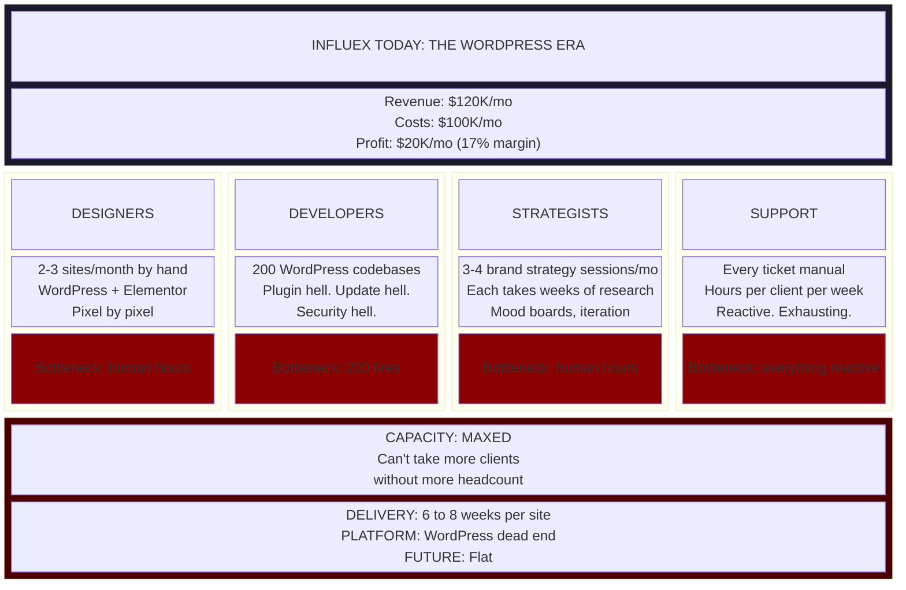
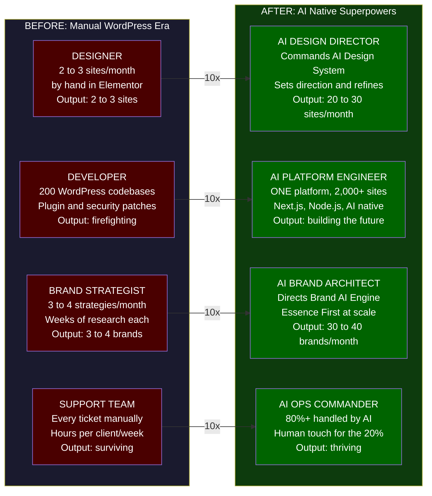
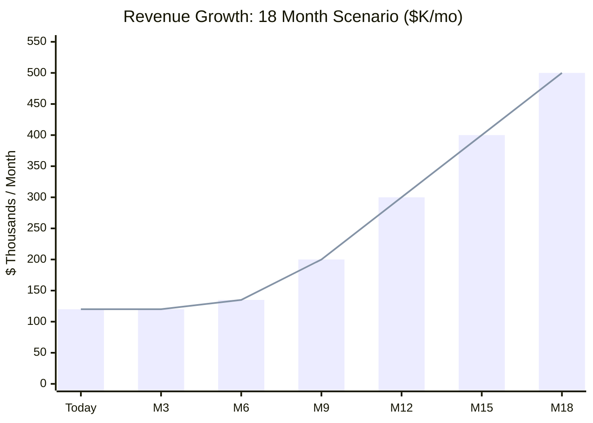
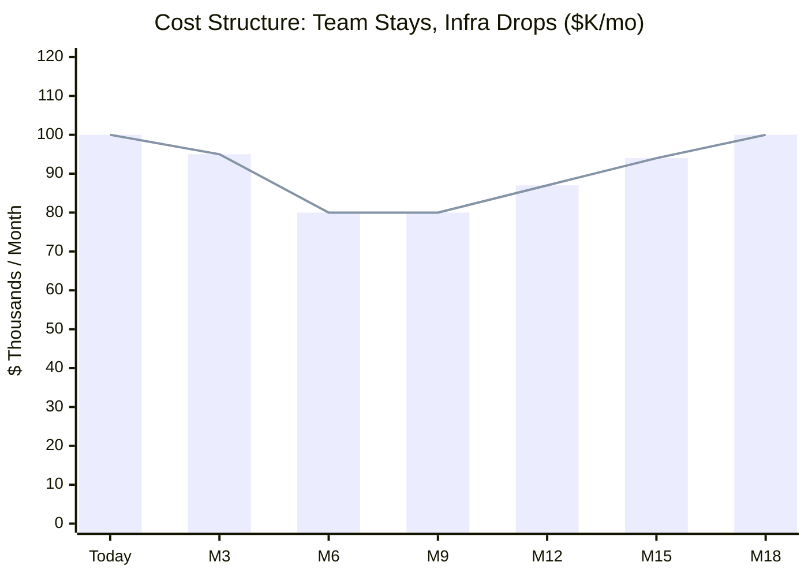
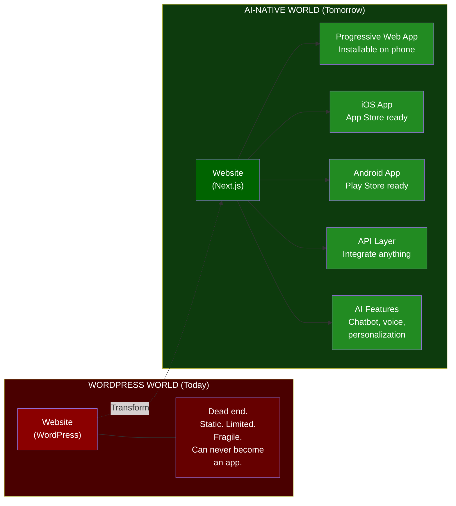
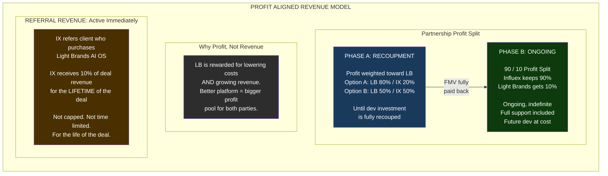
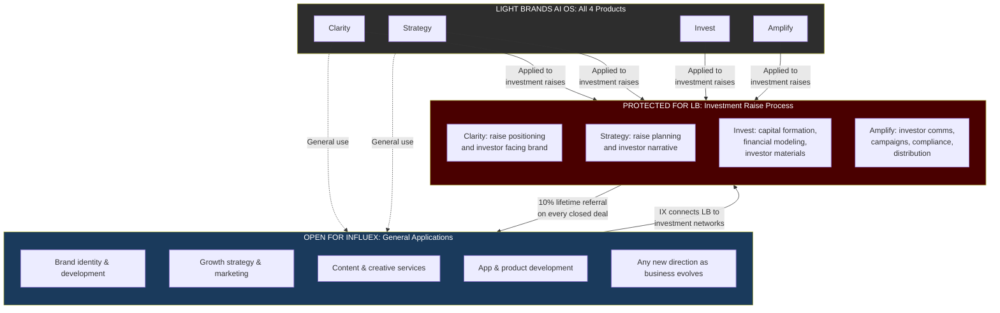

# Influex x Light Brands Partnership Vision

> **From**: Light Brands (Light Brand Consulting)
> **To**: Influex (Dmitriy Kozlov, CEO)
> **Date**: February 22, 2026
> **Type**: Strategic Technology Partnership
> **Status**: Partnership Vision, For Discussion

---

## The Vision

This is not a vendor engagement. This is a strategic partnership between two companies that believe in the same thing: **design-first, essence-driven brand experiences** delivered at a level the market has never seen.

Light Brands builds the most advanced AI-powered website and brand delivery platform in existence, purpose-built for Influex's methodology, clients, and growth. Influex gains a technology partner that follows every step of their process, from intake through delivery, and transforms a $100K/month WordPress burden into a high-margin, lightning-fast delivery engine.

In return, Influex promotes the Light Brands AI OS alongside their own services, opening a distribution channel into the most influential personal brands in the world.

**Both parties win when the other grows. That's the design.**

---

## Partnership Principles

| Principle | How It Shows Up |
|-----------|-----------------|
| **Reciprocity** | Both parties share in each other's success through profit alignment, never extractive |
| **Sovereignty** | Each company remains independent. No equity changes hands. No control transferred. |
| **Transparency** | Revenue figures shared quarterly. Development costs tracked openly. |
| **Evolution** | The platform grows with Influex's needs. Major development continues at cost. |
| **Long-Term Alignment** | This is designed to last years, not quarters. |

---

## What Light Brands Builds

### The Influex AI Brand Delivery Platform

A complete replacement of Influex's WordPress infrastructure with an AI-native platform that follows every step of their process:

#### 1. AI Intake System
- Conversational AI discovery interview (replaces 45 minute calls)
- Automatic lead qualification and scoring
- Auto generated proposals with electronic signature
- Seamless client onboarding into the platform

#### 2. Brand AI Engine
- Essence Extractor trained on Influex's 200+ brand portfolio
- Visual identity generation (colors, typography, logo direction, imagery)
- Brand Voice Profiler for authentic communication style
- Complete brand package generation (guidelines, assets, templates)

#### 3. Design System Engine
- 50+ premium components with brand enforcement
- Any component works perfectly for any brand, automatically
- Update once, all 200+ sites improve instantly
- Maintains Influex's design-first quality standard

#### 4. AI Page Builder
- Natural language prompt to complete, on brand page
- Content generation in the client's authentic voice
- Smart media curation and AI image generation
- Responsive variants generated automatically

#### 5. Content AI Engine
- Per-client voice training from existing content
- Website copy, blog posts, social content, email sequences
- Podcast show notes, video scripts, lead magnets, SEO content
- Near-zero marginal cost per content piece

#### 6. Auto-Deploy Pipeline
- One-click publish across all sites
- Automated testing (visual, functional, performance, accessibility, security, SEO)
- Preview deployments with stakeholder review
- Auto-rollback on failure

#### 7. Self-Healing Infrastructure
- 24/7 AI monitoring with sub-second issue detection
- 90% of issues auto-resolved without human intervention
- Intelligent alerting for the 10% that need humans
- SSL auto-renewal, DDoS protection, auto-scaling

#### 8. AI Support System
- 80%+ of client support requests handled by AI
- How-to tutorials, guided steps, auto-changes
- Smart handoff to humans with full context when needed
- Self-service client portal for content and asset management

#### 9. Analytics & Intelligence
- Unified dashboard across all 200+ client sites
- AI-powered insights, pattern detection, and predictions
- Cross-client benchmarking and optimization recommendations
- Churn prediction and proactive retention

---

## The Transformation: What Happens When We Plug In

### The Starting Point: Where Influex Is Today

### The Shift: Same Team. Same Seats. New Superpowers.

We don't fire anyone. We don't reduce headcount. **We upgrade every person in every seat into an AI-native strategist commanding their section of an intelligent army.**

The costs stay the same. The team stays the same. What changes is what each person can *do*.

> **KEY INSIGHT**: The team doesn't shrink. The team becomes DANGEROUS. Every person who was drowning in manual work now commands AI that does the manual work at 10x speed while they focus on what humans do best: taste, judgment, relationships, and creative direction.

### The Revenue Curve: What Happens When Capacity Unlocks

Today, Influex is capacity-capped. They literally cannot take more clients. The team is maxed out, every hour is spoken for, and every new project means someone works nights.

**When we plug in the AI-native platform, the capacity ceiling disappears.**

> **Platform goes live at M6 and capacity unlocks.** Team costs stay (same people, same seats). Infrastructure costs plummet as WordPress hosting, plugins, and maintenance are replaced by one platform at pennies per site. Revenue scales because the team can now serve 10x clients.

### The Numbers: Quarter by Quarter

| | **Today** | **Q1** | **Q2** | **Q3** | **Q4** | **Q5** | **Q6** |
|---|---|---|---|---|---|---|---|
| **Revenue** | $120K | $120K | $135K | $200K | $300K | $400K | $500K |
| **Team Costs** | $65K | $65K | $65K | $70K | $75K | $80K | $85K |
| **Infra Costs** | $35K | $30K | $15K | $10K | $12K | $14K | $15K |
| **Total Costs** | $100K | $95K | $80K | $80K | $87K | $94K | $100K |
| **Profit** | **$20K** | **$25K** | **$55K** | **$120K** | **$213K** | **$306K** | **$400K** |
| **Profit Margin** | 17% | 21% | 41% | 60% | 71% | 77% | 80% |
| **Sites Active** | 200 | 200 | 250 | 400 | 700 | 1,200 | 2,000 |
| **Delivery Speed** | 6 to 8 wks | 4 to 6 wks | 2 to 3 wks | 1 to 2 wks | 1 week | Days | Days |
| **Team Output** | 1x | 1.5x | 3x | 5x | 7x | 8x | 10x |

**What's happening in each quarter:**

**Q1: Foundation.** Platform is being built. Team starts learning AI-native workflows. WordPress still running. Revenue steady. Costs starting to drop as first efficiencies kick in.

**Q2: The Flip.** Platform goes live. First clients migrate. WordPress infrastructure starts shutting down. Team is now working in the new system, each person doing 3x what they did before. Revenue starts climbing as new capacity opens up. Profit doubles.

**Q3: Scale Begins.** Full migration complete. WordPress is gone. The team is fully AI-native with designers directing AI, developers building platform features, and strategists architecting brands at scale. New clients flowing in. Revenue hits $200K. Profit hits $120K/month.

**Q4: Acceleration.** Word spreads. Influex can now take on clients they used to turn away. Delivery in 1 to 2 weeks instead of 6 to 8. Premium pricing maintained because the quality is *better* and AI-native sites are faster, more accessible, and more optimized. Revenue hits $300K. Profit hits $213K.

**Q5 and Q6: The Empire.** Same core team. $400 to $500K/month in revenue. 80% margins. 1,200 to 2,000 sites on the platform. Every site built on Next.js/Node.js, meaning any client can evolve their website into a **full native app on the App Store** when they're ready. That's a whole new revenue tier Influex has never been able to offer.

### The App-Store Foundation

This is the part most people miss. We're not just replacing WordPress with a better website builder. We're building on **Next.js and Node.js**, the same technology stack that powers production apps at Netflix, Uber, and Airbnb.

> **When Jim Kwik says "I want an app for my memory training"**
> - WordPress answer: *"That's a separate $200K project."*
> - AI-native answer: *"Your site IS the app. Let's turn it on."*

**New Revenue Tiers for Influex:**

| Tier | Offering | Price Range |
|------|----------|-------------|
| Current | Website | $15 to $30K |
| New | Website + PWA | $30 to $50K |
| New | Website + Native App | $50 to $100K |
| New | Full Digital Platform | $100 to $250K |

*Same foundation. Same team. New revenue ceiling.*

### What Dmitriy Sees in 18 Months

| Metric | Today | 18 Months From Now |
|--------|-------|--------------------|
| **Monthly Revenue** | $120,000 | $500,000+ |
| **Monthly Profit** | $20,000 | $400,000+ |
| **Profit Margin** | 17% | 80% |
| **Team Size** | Same | Same (maybe +2 to 3 for growth) |
| **Sites Managed** | 200 (maxed) | 2,000+ |
| **Delivery Time** | 6 to 8 weeks | Days |
| **Service Ceiling** | WordPress websites only | Websites to Apps to Platforms |
| **Team Identity** | WordPress developers | AI-native digital architects |
| **Competitive Moat** | Design taste (copyable) | AI-native platform (not copyable) |
| **Client Lifetime Value** | $15 to $30K one time | $15K to $250K+ with app/platform upsell |

**The pitch in one sentence**: We keep your team, upgrade their superpowers, replace your infrastructure with something that can scale to the moon, and turn every website into a potential app. We pay for the whole thing out of the profit we create together.

---

## What Influex Provides

### Promotion of Light Brands AI OS

Influex promotes the **Light Brands AI OS** (Clarity, Strategy, Invest, Amplify) alongside their own services to their network. This includes:

- **Client Referrals**: Recommending Light Brands AI OS to clients who could benefit from the full business intelligence stack
- **Network Promotion**: Introducing Light Brands AI OS within Influex's ecosystem of 200+ high-profile personal brands, coaches, entrepreneurs, and thought leaders
- **Co-Marketing**: Featuring Light Brands AI OS in relevant materials, conversations, and touchpoints where appropriate
- **Warm Introductions**: Facilitating connections between Light Brands and qualified prospects in Influex's network

### The Network Value

Influex's client roster represents some of the most influential personal brands in the world:

| Category | Notable Clients |
|----------|----------------|
| Thought Leaders | Jim Kwik, Lewis Howes, Dave Asprey |
| Business Coaches | Cameron Herold, Dan Lok, Matthew Hussey |
| Entrepreneurs | Roland Frasier, Ryan Deiss, Frank Kern |
| Networks | Genius Network, Maverick 1000, Rise Nation (Daymond John) |
| Health/Wellness | JJ Virgin, Shaun T |

A single warm introduction from Influex into any of these networks has significant value. These are the exact clients who benefit from the full Light Brands AI OS stack.

---

## The Revenue Model

### The Core Philosophy: Profit Aligned Partnership

This is not a revenue extraction model. This is a **profit-sharing partnership** where Light Brands is directly rewarded for two things: **lowering Influex's costs** and **helping grow Influex's revenue**. Every dollar of cost we eliminate and every dollar of revenue we help generate increases the profit pool we both share in.

### Two Phases: Recoupment, Then Ongoing

### Phase A: Recoupment, Profit Split Weighted Toward Light Brands

Light Brands is investing the development capital upfront at partner cost basis. During recoupment, the profit split is **weighted in Light Brands' favor** until the full FMV of development is paid back.

**Two paths we could take:**

#### Option A: 80/20 (Light Brands 80% / Influex 20%)

The aggressive recoupment. Light Brands gets paid back fast, and the partnership shifts to the sustainable 10% model sooner.

| Quarter | Revenue | Costs | Profit | LB (80%) | Influex (20%) |
|---------|---------|-------|--------|----------|---------------|
| **Today** | $120K | $100K | $20K | $16K | $4K |
| **Q1** (building) | $120K | $95K | $25K | $20K | $5K |
| **Q2** (platform live) | $135K | $80K | $55K | $44K | $11K |
| **Q3** (scaling) | $200K | $80K | $120K | $96K | $24K |
| **Q4** (accelerating) | $300K | $87K | $213K | $170K | $43K |

| Recoupment Tracking | Amount |
|---------------------|--------|
| Total Platform Development FMV (at cost) | $250,000 (illustrative) |
| LB's 80% share accumulates fast | $20K to $44K to $96K to $170K/month |
| **Estimated Full Recoupment** | **Approximately Q2 to Q3 (3 to 5 months after launch)** |

**Why Influex still wins during 80/20**: Even at 20%, Influex's take goes from $4K to $11K to $24K to $43K/month, doubling their current profit within the first quarter of platform launch. And recoupment is done within a single quarter once revenue starts scaling, getting them to the 90/10 model fast.

#### Option B: 50/50 (Light Brands 50% / Influex 50%)

The balanced recoupment. Both parties split equally during payback. It feels fair, takes a bit longer, but Influex keeps more during the transition.

| Quarter | Revenue | Costs | Profit | LB (50%) | Influex (50%) |
|---------|---------|-------|--------|----------|---------------|
| **Today** | $120K | $100K | $20K | $10K | $10K |
| **Q1** (building) | $120K | $95K | $25K | $12.5K | $12.5K |
| **Q2** (platform live) | $135K | $80K | $55K | $27.5K | $27.5K |
| **Q3** (scaling) | $200K | $80K | $120K | $60K | $60K |
| **Q4** (accelerating) | $300K | $87K | $213K | $106.5K | $106.5K |

| Recoupment Tracking | Amount |
|---------------------|--------|
| Total Platform Development FMV (at cost) | $250,000 (illustrative) |
| LB's 50% share per quarter | $12.5K to $27.5K to $60K to $106.5K/month |
| **Estimated Full Recoupment** | **Approximately Q3 to Q4 (4 to 6 months after launch)** |

**Why this option works**: Influex keeps 50% from day one, going from $20K to $27.5K to $60K to $106.5K/month. The recoupment takes slightly longer but the optics are "equal partners sharing equally until the investment is repaid."

---

**How It Works (Both Options):**

1. Light Brands tracks all development hours at **partner cost basis** (not retail rates). This is the FMV of the work being built.
2. Profit is calculated as **Influex gross revenue minus operating costs** (defined and agreed upon at partnership signing).
3. During recoupment, profit is split with the **majority going to Light Brands** until the total FMV of development is fully recouped.
4. Both parties have full transparency into development costs, operating costs, revenue, and the recoupment balance.
5. Light Brands is incentivized to cut costs fast and grow revenue fast because that's how they get paid back.

*Once the FMV is fully recouped, the model shifts immediately to Phase B.*

### Phase B: Ongoing 90/10 Profit Split

**How It Works:**

1. Once development costs are fully recouped, the split shifts to **90/10** where Influex keeps 90% and Light Brands receives 10% of profit.
2. This 10% of profit includes:
   - **Full platform support** including maintenance, monitoring, and incident response
   - **Ongoing optimization** including performance tuning, security updates, and cost reduction
   - **Future major development** including new features, new capabilities, and platform expansion, all done at **cost basis** (partner rate, not retail)
3. This structure means Influex gets a permanent technology partner whose income *depends* on Influex being as profitable as possible.

**Example at Scale:**

| Influex Revenue | Costs (team + infra) | Profit | Influex (90%) | LB (10%) | What's Included |
|----------------|---------------------|--------|---------------|----------|-----------------|
| $200K/mo | $80K | $120K | $108K | $12K | Full support + dev at cost |
| $300K/mo | $87K | $213K | $191.7K | $21.3K | Full support + dev at cost |
| $500K/mo | $100K | $400K | $360K | $40K | Full support + dev at cost |

**Compare to today**: Influex currently keeps $20K/month in profit with a maxed-out team. Under this model, the same team (empowered by AI) generates **$108K to $360K/month** in take-home profit while Light Brands earns a meaningful, growing share that's directly tied to making Influex's team as powerful as possible.

*Light Brands grows when Influex grows. Light Brands grows when Influex's costs shrink. Every incentive is aligned.*

### Referral Revenue: Light Brands AI OS

**How It Works:**

1. Influex promotes the **Light Brands AI OS** (Clarity, Strategy, Invest, Amplify) to their network.
2. For every client that Influex refers who purchases any Light Brands AI OS service:
   - Influex receives **10% of the revenue generated from that deal**
   - This commission is for the **lifetime of the deal**, not a one-time fee
   - No cap on referrals or total commission
3. Attribution is tracked via referral codes, warm introductions, or mutual agreement on source.

**Example Scenario:**

| Referral | AI OS Deal Size | Influex Lifetime Commission |
|----------|----------------|---------------------------|
| Influex refers a coaching business | $50K/year AI OS engagement | $5,000/year to Influex, every year |
| Influex refers an entrepreneur network | $120K/year platform build | $12,000/year to Influex, every year |
| 10 referrals in Year 1 at avg $60K each | $600K total AI OS revenue | $60,000/year to Influex, ongoing |

*This creates a real revenue stream for Influex with zero additional work beyond making introductions.*

---

## Why This Works

### For Influex

| Benefit | Value |
|---------|-------|
| Platform worth $250K+ built with no upfront cash | Recouped through profit share over 4 to 7 months |
| Monthly profit goes from ~$5K to $100K+ | 20x profit improvement |
| Monthly costs drop from $100K to approximately $22K | Approximately $78K/month in savings |
| Profitable immediately even during recoupment | $17 to $42K/month (vs $5K today) |
| Keeps 90% of profit after short recoupment | Fair, sustainable long-term split |
| Capacity goes from 200 to 2,000+ sites | 10x growth potential unlocked |
| Permanent technology partner in the 10% | No separate support contracts |
| Future development at cost basis | Major features built affordably |
| 10% lifetime referral commission on AI OS | New revenue stream from introductions |
| No equity given up | Full ownership and sovereignty maintained |
| Partner is incentivized to cut their costs | Light Brands profits when Influex profits |

### The Math Works

**Influex's Perspective, The Full Picture:**

| | Today | Q2 (Recoup 80/20) | Q4 (Recoup 80/20) | Q5+ (Ongoing 90/10) |
|---|---|---|---|---|
| Monthly Revenue | $120K | $135K | $300K | $400K |
| Monthly Costs | $100K | $80K | $87K | $94K |
| Monthly Profit | $20K | $55K | $213K | $306K |
| Influex Keeps | $20K | $11K (20%) | $43K (20%) | $275K (90%) |
| Same team? | Yes | Yes | Yes (+1 to 2) | Yes (+2 to 3) |

During the short recoupment phase, Influex's per-month take dips slightly below today at Q2, but by Q3 and Q4 their 20% slice is already **double** their current profit. Once recoupment is done, they're keeping $275K+/month. Same team. New superpowers.

**The bottom line**: Light Brands recoups its investment within a single quarter of scale. Influex goes from $20K/month profit with a maxed-out, exhausted team to **$275K+/month** with the same team empowered as AI-native strategists and the capacity to keep scaling toward $500K/month. The pie doesn't just get bigger. It gets **15x bigger**.

---

## Support & Development Commitment

### What's Included in the 10%

| Category | Coverage |
|----------|----------|
| **Platform Maintenance** | All updates, patches, security, monitoring, 24/7 |
| **Performance Optimization** | Ongoing speed, SEO, and conversion tuning |
| **Infrastructure Management** | Hosting, CDN, edge deployment, scaling |
| **Bug Fixes** | Any platform issues resolved promptly |
| **Minor Enhancements** | Small features, UI improvements, workflow tweaks |
| **Dedicated Support** | Direct access to Light Brands engineering team |

### Major Development (At Cost)

For significant new features or platform expansions:
- Light Brands scopes and estimates at **partner cost basis** (internal rate, not retail)
- Influex approves scope before work begins
- This ensures Influex always gets enterprise grade development at a fraction of market rate
- Examples include new AI capabilities, additional automation layers, white label features, and API development

---

## Implementation Approach

### Phase 1: Foundation (Months 1 and 2)
- Multi tenant platform core
- Design system engine with 50+ components
- Auto deploy pipeline
- Development cost tracking begins

### Phase 2: Intelligence (Months 2 through 4)
- AI Brand Generator (trained on Influex's 200+ portfolio)
- AI Page Builder
- Content AI Engine with per client voice training

### Phase 3: Self Service (Months 3 through 5)
- Client portal with asset management
- AI Support System
- Automated test suite

### Phase 4: Migration and Scale (Months 4 through 6)
- Pilot migration (5 to 10 select clients)
- Early adopter rollout (50 clients)
- Full migration (200+ clients)
- WordPress decommissioned

### Phase 5: Optimization (Ongoing)
- Self-healing infrastructure
- Analytics & intelligence dashboard
- AI intake system
- Continuous improvement

*Revenue share begins when the platform goes live with paying clients. Recoupment clock starts from first dollar of platform-generated revenue.*

---

## Lane Protection: The Investment Raise Process

Influex is free to take their platform and capabilities in any direction they want. Brand development, design, content, apps, and growth strategy are all open with no restrictions. That's their world.

**The protected lane is the investment raise process.** Light Brands' AI OS (Clarity, Strategy, Invest, Amplify) encompasses brand, strategy, capital formation, and communications, but the protected application is specifically **how those capabilities serve the investment raise process**. That's Light Brands' domain.

### The Agreement

**Influex agrees:**
- Not to recreate, replicate, or compete with the Light Brands AI OS **as it applies to the investment raise process**, which includes all four products (Clarity, Strategy, Invest, Amplify) when used for capital formation, investor communications, raise positioning, investor facing brand development, financial modeling, fundraising execution, or any service specifically targeting the investment raise lifecycle
- To connect Light Brands to their investment networks and introduce deal flow opportunities

**Influex is free to:**
- Offer brand development, identity, and creative services (Clarity adjacent) for general business purposes
- Offer growth strategy and marketing services (Strategy adjacent) for general business purposes
- Build apps, products, and digital platforms in any vertical
- Take the AI-native platform capabilities in any direction they choose
- No restrictions outside the investment raise process

**Light Brands agrees:**
- To keep Influex connected to every deal closed through their referral via the 10% lifetime commission
- To continue building and supporting the AI-native platform as the partnership's technology backbone
- No restrictions on any Influex capability outside the investment raise domain

### Why This Works

The protection is specific to a *process*, not a broad category. Influex can do brand work, they just can't package it as "investor facing brand positioning for a capital raise." They can do strategy, they just can't package it as "raise strategy and investor narrative development." The investment raise lifecycle is a specialized market that requires securities knowledge, compliance awareness, and capital formation expertise. It's a different world from building websites for coaches.

**The flywheel**: When Influex's clients say "I want to raise capital" or "I need to talk to investors," that's a Light Brands referral. Influex earns 10% lifetime on every deal. They make more money sending those clients to Light Brands than they ever would trying to build investment raise capabilities from scratch.

---

## Key Terms Summary

| Term | Detail |
|------|--------|
| **Partnership Type** | Strategic technology partnership with no equity exchange |
| **Development Cost Basis** | Partner rate (at cost), tracked transparently |
| **Profit Definition** | Gross revenue minus agreed operating costs (defined at signing) |
| **Recoupment Split** | Profit weighted toward Light Brands until FMV fully recouped (80/20 LB/IX or 50/50) |
| **Recoupment Duration** | Estimated 4 to 7 months post platform launch depending on split chosen |
| **Ongoing Split** | 90/10 profit split (Influex 90% / Light Brands 10%), indefinite |
| **Ongoing Includes** | Full support, maintenance, optimization, platform management |
| **Major Future Development** | At cost basis (partner rate), scoped and approved by Influex |
| **Light Brands AI OS Referral** | 10% of referred deal revenue, lifetime of the deal |
| **Referral Attribution** | Tracked via referral codes, warm intros, or mutual agreement |
| **Reporting** | Quarterly profit and loss reports shared by both parties |
| **Termination** | Terms TBD, designed for long term with fair exit provisions |
| **Lane Protection** | Influex agrees not to compete with Light Brands AI OS as applied to the investment raise process (all 4 products in that context). All other applications are open. |
| **Network Access** | Influex connects LB to investment networks and LB keeps IX connected to closed deals via lifetime referral |

---

## Next Steps

1. **Review Together**: Walk through this vision and discuss what resonates
2. **Align on Terms**: Settle on the right split, recoupment timeline, and structure
3. **Draft Agreement**: Formalize the partnership terms
4. **Kick Off**: Platform development begins

---

## Appendix: Light Brands AI OS

### The Product Influex Promotes

**Light Brands AI OS** is a comprehensive AI-powered business intelligence system with four stages:

| Stage | Name | What It Does |
|-------|------|-------------|
| 1 | **Clarity** | Brand identity, positioning, voice, and visual direction through AI powered brand development |
| 2 | **Strategy** | Growth strategy, market analysis, competitive positioning, and go to market planning |
| 3 | **Invest** | Capital formation, financial modeling, investor materials, fundraising execution |
| 4 | **Amplify** | Investor communications, campaign management, content production, distribution |

The AI OS serves entrepreneurs, thought leaders, and growth stage businesses, exactly the clients in Influex's network. Every referral from Influex is likely a strong fit.

---

*Partnership Vision, February 22, 2026*
*Light Brands: Intelligence That Grows With You*
